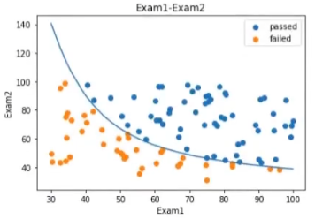
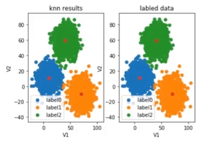

# Artificial Intelligence
## 1. 简介

* 符号学习

基于逻辑与规则的学习方法，其原理主要为物理符号系统(即符号操作系统)假设和有限合理性原理。即，**专家系统**

1. 根据既定的逻辑和顺序告诉机器接下来做什么
2. 遵循if...then...原则
3. 不能根据新场景动态地优化认知（升级模型）

* 机器学习

从数据中寻找规律、建立关系，根据建立的关系去解决问题的方法。

1. 从数据中学习并且实现自我优化与升级（数据驱动）
2. 机器学习包含深度学习
3. 机器学习是一种实现人工智能的方法，深度学习是一种实现机器学习的技术。

**机器学习的类别**

1. 监督学习（Supervised Learning）
   1. 训练数据包括正确的结果（标签 - label）
2. 无监督学习（Unsupervised Learning）
   1. 训练数据不包括正确的结果
3. 半监督学习（Semi-supervised Learning）
   1. 训练数据包括少量正确的结果
4. 强化学习（Reinforcement Learning）
   1. 根据每次结果收获的奖惩进行学习，实现优化

## 2. 监督学习

### 2.1 线性回归

回归分析 (Regression Analysis)

根据数据，确定两种或两种以上变量间相互依赖的定量关系

函数表达式：y = *f*(X1,X2⋯Xn)


**变量数**

- 一元回归：*y*=*f*(*x*)
- 多元回归：*y*=*f*(*x*1,*x*2⋯x<sup>n</sup>)

**函数关系**

- 线性回归：y = ax+b
- 非线性回归：y = ax<sup>2</sup>+bx+c


**梯度下降法**

定义代价函数 --> 选择起始点 --> (计算梯度 --> 按学习率前进)

cost function


**scikit-learn**

（简称 **sklearn**）是一个基于 Python 的开源机器学习库，专为数据挖掘、统计建模和预测分析设计。它建立在 **NumPy**、**SciPy** 和 **Matplotlib** 等科学计算库之上，提供了一套统一且易用的工具链，广泛应用于工业界和学术界

`pip install scikit-learn -i https://pypi.tuna.tsinghua.edu.cn/simple`

```python
''' 调用Sklearn 求解线性回归问题：y = 2x + 5 '''
from sklearn.linear_model import LinearRegression
lr_model = LinearRegression()

x = [[1], [2], [3], [4], [5], [6], [7], [8]]  # 特征矩阵（7×1）
y = [7, 9, 11, 13, 15, 17, 19, 21]            # 目标值（一维）

lr_model.fit(x, y)

a = lr_model.coef_            # [2.]
b = lr_model.intercept_       # 5.0
p = lr_model.predict([[11]])  # [27.]
```

### 2.2 逻辑回归

**分类**：根据已知样本的某些特征，判断一个新的样本属于哪种已知的样本类

逻辑回归：用于解决分类问题的一种模型。根据数据特征或属性，计算其归属于某一类别的概率 P(x)，根据概率数值判断其所属类别

主要应用场景：二分类问题。

y = 1 / ( 1 + e<sup>-x</sup>)

y = P(x) >= 0.5 = 1,

y = P(x) < 0.5 = 0

**决策边界 decision boundary**

x = g(x) = 0

g(x) = θ<sub>0</sub> + θ<sub>1</sub>x<sub>1</sub> + θ<sub>2</sub>x<sub>2</sub> + ···

```python
''' 逻辑回归预测考试通过 '''
'''
      Exam1     Exam2  Pass
0  34.62366  78.02469     0
1  30.28671  43.89500     0
2  35.84741  72.90220     0
3  60.18260  86.30855     1
4  79.03274  75.34438     1
5  45.08328  56.31637     0
6  61.10666  96.51143     1
7  75.02475  46.55401     1
8  76.09879  87.42057     1
'''
# 加载数据
import pandas as pd
data = pd.read_csv('examdata.csv')

# 可视化数据
mask = data.loc[:, 'Pass']==1 # mask: [False True False ...]
from matplotlib import pyplot as plt
fig1 = plt.figure()
passed = plt.scatter(data.loc[:, 'Exam1'][mask], data.loc[:, 'Exam2'][mask])   # 只展示通过成绩
failed = plt.scatter(data.loc[:, 'Exam1'][~mask], data.loc[:, 'Exam2'][~mask]) # 只展示未通过成绩
plt.title('Exam1-Exam2')
plt.xlabel('Exam1')
plt.ylabel('Exam2')
plt.legend((passed, failed), ('passed', 'failed')) # 加题注
# plt.show() 展示图形

# 把数据给X，y用来训练
X = data.drop(['Pass'], axis=1) # 去除最后一列
y = data.loc[:, 'Pass']         # 取最后一列
x1 = data.loc[:, 'Exam1']       # 取 Exam1列
x2 = data.loc[:, 'Exam2']       # 取 Exam2列

print(X.shape, y.shape) # 维度 (9, 2) (9,)

from sklearn.linear_model import LogisticRegression
LR = LogisticRegression()
LR.fit(X, y) # 训练

# 预测结果
y_predict = LR.predict(X) # 预测的结果
from sklearn.metrics import accuracy_score
accuracy = accuracy_score(y, y_predict)
print(accuracy) # 准确率：0.87

# 预测 70， 65能否通过测试
# y_test = LR.predict([[70, 65]]) 会有警告出现
y_test = pd.DataFrame([[70, 65]], columns=['Exam1', 'Exam2'])
y_test = LR.predict(y_test)
print(y_test) # [1],通过

# 边界曲线
theta0 = LR.intercept_
theta1 = LR.coef_[0][0]
#...
#计算出X, y
fig1 = plt.figure()
plt.plot(X1_new, X2_new_boundary)
plt.show()
```



## 3. 无监督学习

机器学习的一种方法，没有给定事先标记过的训练示例，自动对输入的数据进行分类或分群。

聚类分析：聚类分析又称为群分析，根据对象某些属性的相似度，将其自动化分为不同的类别。



🟦 **K均值聚类** (K-均值算法) (KMeans) VS KNN(监督学习)

以空间中k个点为中心进行聚类，对最靠近**他们**的对象归类，是聚类算法中最为基础但也最为重要的算法。

**算法流程：**

1. 选择聚类的个数 **【k=2】**
2. 确定聚类中心
3. 根据点到聚类中心聚类确定各个点所属类别
4. 根据各个类别数据更新聚类中心
5. 重复以上步骤直到 **收敛**（中心点不再变化）

**优点：**

1. **原理简单，实现容易，收敛速度快**
2. **参数少，方便使用**

**缺点：**

1. **必须设置簇的数量 【k】**
2. 随机选择初始聚类中心，结果可能 **缺乏一致性**

🟦 K近邻分类模型(KNN) (监督学习)

给定一个训练数据集，对新的输入实例，在训练数据集中找到与该实例最邻近的K个实例（也就是上面所说的K个邻居），这K个实例的多数属于某个类，就把该输入实例分类到这个类中。

🟦 均值漂移聚类 Mean-shift

均值漂移算法：一种基于密度梯度上升的聚类算法（沿着密度上升方向寻找聚类中心点）

自动计算带宽（区域半径）

## 4. 机器学习其他常用技术

### 1. 决策树 Decision Tree

一种对实例进行分类的树形结构，通过**多层判断**区分目标所属类别

本质：通过多层判断，从训练数据集中归纳出一组分类规则

缺点：

忽略了属性间的相关性，样本类别分布不均匀时，容易影响模型表现

高斯分布实现异常检测。

### 2. 异常检测 Anomaly Detection

主成分分析，PCA