# 数据结构与算法

## 1. 基本概念和术语

程序 = 数据结构 + 算法

* 数据 (data)：是能输入计算机且能被计算机处理的各种符号的集合。数值型，非数值型。
* 数据元素 (data element): 是数据的基本单位，在计算机程序中通常作为一个整体进行考虑和处理。例如一个员工的数据 (数据库中表的一行)。
  * 与数据的关系: 是集合的个体
* 数据项: 构成数据元素的不可分割的最小单位。 例如数据库中该员工的一列数据。
* 数据对象 (data object): 是性质相同的数据元素的集合，是数据的一个子集。例如整数数据对象的集合。
  * 与数据的关系是: 集合的子集
* 数据结构 (Data Structure): 数据元素不是孤立存在的，它们之间存在着某种关系，数据元素相互之间的关系称为结构。是指相互之间存在一种或多种特定关系的数据元素集合。或者说，数据结构是带结构的数据元素的集合。
  * 逻辑结构。
    * 描述数据元素之间的逻辑关系。
    * 与数据的存储无关，独立于计算机。
    * 是从具体问题抽象出来的数学模型。

  * 物理结构或数据的存储结构。（数据元素及其关系在计算机内存中的表示(又称为映像))
    * 数据元素及其关系在计算机存储器中的结构 (存储方式)
    * 是数据结构在计算机中的表示。
  * (逻辑结构与存储结构的关系：）
    * 存储结构是逻辑关系的映象与元素本身的映象。
    * 逻辑结构是数据结构的抽象，存储结构是数据结构的实现。
    * 两者综合起来建立了数据元素之间的结构关系。
  * 数据的运算和实现。

* 数据类型(Data Type)：高级语言中的数据类型明显地或隐含地规定了在程序执行期间变量和表达的所有可能的取值范围，以及在这些数值范围上所允许进行的操作。
* 抽象数据类型可用 (D，S，P) 三元组表示.。其中:
  * D 是数据对象;
  * S 是 D 上的关系集;
  * P 是对 D 的基本操作集。
* 抽象数据类型 (ADT)：
* 算法：对特定问题求解方法和步骤的一种描述，它是指令的有限序列。其中每个指令表示一个或多个操作。简而言之，算法就是解决问题的方法和步骤。
* 算法五个重要特性、
  * 有穷性。一个算法必须总是在执行有穷步之后结束，且每一步都在有穷时间内完成。
  * 确定性。算法中的每一条指令必须有确切的含义，没有二义性，在任何条件下，只有唯一的一条执行路径，即对于相同的输入只能得到相同的输出
  * 可行性。算法是可执行的，算法描述的操作可以通过已经实现的基本操作执行有限次来实现
  * 输入。一个算法有零个或多个输入
  * 输出。一个算法有一个或多个输出
* 算法设计的要求
  * 正确性(Correctness)
  * 可读性(Readability)
  * 健壮性(Robustness)
  * 高效性(Efficiency)

## 2. 线性结构

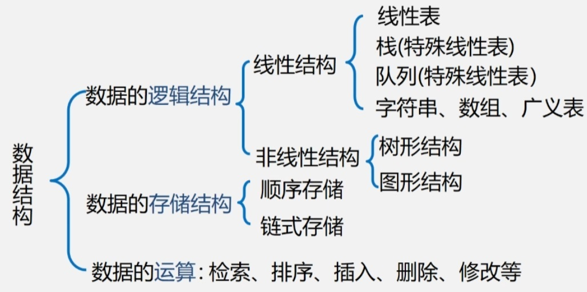

🟩 **线性表** 🟩

具有相同特性的数据元素的一个有限序列。存储结构分为

* 顺序存储结构：物理上连续的存储单元中，访问每个元素所花时间相等，任一元素均可随机存取。
* 链式存储结构：物理位置任意存储单元中。依次向后顺序扫描其余结点，顺序存取。
  * **Linked List：**
    1. 链表是以结点的方式来存储
    2. 每个结点包含 data域，next域 (指针域): 指向下一个节点
    3. 链表的各个节点不一定是连续存储.
    4. 带头结点或者不带
       1. 头指针: 是指向链表中第一个结点的指针
       2. 首元结点: 是指链表中存储第一个数据元素的结点
       3. 头结点: 是在链表的首元结点之前附设的一个结点;
  * **单向链表**
    1. 单向链表 **(Singly Linked List)** ，查找的方向只能是一个方向，而双向链表可以向前或者向后查找。
    2. 单向链表不能自我删除，需要靠辅助节点，而双向链表，则可以自我删除。(辅助节点通常是指向前一个节点)
    3. **单向环形链表** 约瑟夫问题 (Josephus problem)
  * **双向链表(Doubly Linked List)** ： 可以自我删除。

**头插法（单链表）**

```java
class ListNode {
    int val;
    ListNode next;

    public ListNode(int val) {
        this.val = val;
    }
}

public class Main {
    public static void main(String[] args) {
        // 创建一个空链表
        ListNode head = null;

        // 使用头插法向链表中插入新节点
        for (int i = 1; i <= 5; i++) {
            ListNode newNode = new ListNode(i);
            newNode.next = head; // 将新节点的下一个指针指向当前头节点
            head = newNode; // 更新链表的头节点
        }
    }
}
```

🟩 **栈** 🟩

操作受限的线性表。

stack : FILO-First In Last Out,  栈顶Top,  栈底Base

可以顺序存储，链式存储。

上溢(overflow): 栈已经满，又要压入元素。

下溢(underflow): 栈已经空，还要弹出元素。

🟩 **队列** 🟩

操作受限的线性表。

queue: FIFO-First In First Out

队列是一个有序列表，可以用数组或是链表来实现。

遵循先入先出的原则。

🟩 **字符串，数组，广义表** 🟩

串：内容受限线性表。

真子串：不包含自身的子串。（子串对应主串）

Brute-Force: BF算法。简单匹配算法，采用的是穷举的思路。优化：KMP算法。

二维数组可以认为是线性或者非线性结构。

数组可以是多维的，但是存储数据元素的内存单元地址是一维的

* 三角矩阵
* 对角矩阵（带状矩阵）

* **稀疏数组**（稀疏矩阵）

  * Sparse Array:  一般使用在一个二维数组存储着大量无效数据的场景中。（有效一般小于5%）

    - 三元组法：（缺点：不能随机存取）

      - 第一行记录二维数组的行数，列数，以及有效数据的个数

      - 其他行记录每个有效数据所在的行数，列数，以及值

    - 十字链表

      - 三元组 + right + down, 用于链接同一行中的下一个非零元素和用以链接同一列中的下一个非零元素。


广义表(又称列表 Lists)：元素为原子或者子广义表。

广义表可以看成是线性表的推广，线性表是广义表的特例。

通常记作：LS=(a1, a2, ..., an).

第一个元素表头，除表头外其他元素叫表尾。

## 3. 非线性结构

### 3.1 树

* 叶子节点(没有子节点的节点)
* 节点的权(节点值)
* 树的高度(最大层数)
* 结点的度(拥有的子树数)
* 有序树: 树中结点的各子树从左至右有次序(最左边的为第一个孩子)

**二叉树**：每个节点最多只能有两个子节点的一种形式称为二叉树。

**满二叉树**：二叉树的所有叶子节点都在最后一层，并且结点总数=2^k-1

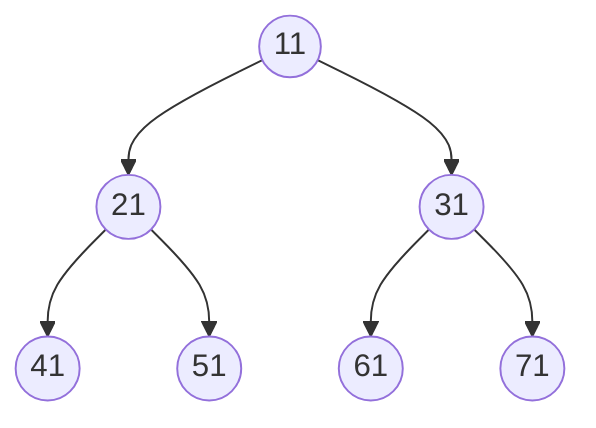


**完全二叉树**：如果该二叉树的所有叶子节点都在最后一层或者倒数第二层，而且最后一层的叶子节点在左边连续，倒数第二层的叶子节点在右边连续，我们称为完全二叉树。(每个编号数都可以跟满二叉树编号对应)

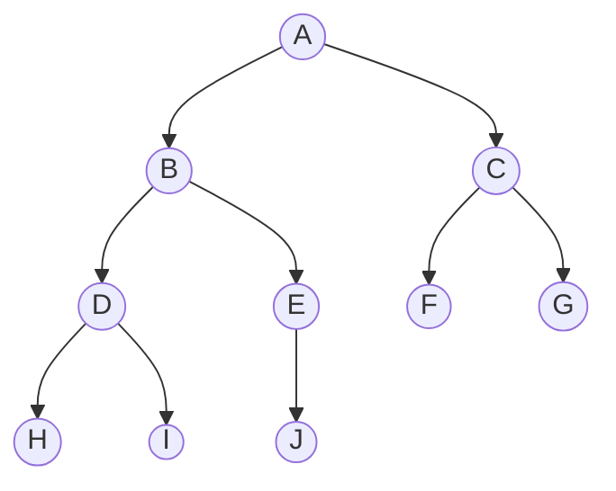
前序遍历:先输出父节点，再遍历左子树和右子树。  `A B D H I E J C F G`

中序遍历:先遍历左子树，再输出父节点，再遍历右子树。`H D I B J E A F C G`

后序遍历:先遍历左子树，再遍历右子树，最后输出父节点。`H I D J E B F G C A`

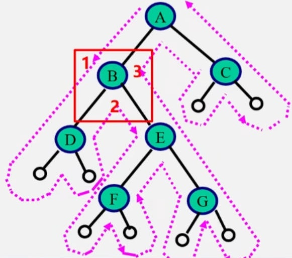

* 第1次经过时访问=先序遍历
* 第2次经过时访问=中序遍历
* 第3次经过时访问=后序遍历

```java
public class TreeNode{
    int val;
    TreeNode left;
    TreeNode right;
    TreeNode(int x){
        val = x;
    }
}

// 前序遍历
public void preOrder(TreeNode node){
    System.out.println(node.val);
    TreeNode leftTree = node.left;
    if(leftTree != null){
        preOrder(leftTree);
    }
    TreeNode rightTree = biTree.right;
    if(rightTree != null){
        preOrder(rightTree);
    }
}

// 中序遍历
public void inOrderTraversal(TreeNode node){
    if(node == null){
        return;
    }else{
        inOrderTraversal(node.leftChild);
        System.out.println(node.val);
        inOrderTRaversal(node.rightChild);
    }
}

// 后序遍历
public void postorder(TreeNode node) {
    if (node == null) {
        return;
    }
    postorder(node.left);
    postorder(node.right);
    System.out.println(node.val);
}
```

**二叉排序树(Binary SortTree)** ：左值小，右值大。插入，查找，删除都很块。

**线索化二叉树 (Threaded Binary Tree)**：利用二又链表中的空指针域（前驱和后继是按照遍历的顺序）

* 如果某个结点的左孩子为空，则将空的左孩子指针域改为指向其前驱，
* 如果某个结点的右孩子为空，则将空的右孩子指针域改为指向其后继

**树和森林：**

🟩 **哈夫曼树 (最优二叉树)** 🟩

路径: 从树中一个结点到另一个结点之间的分支构成这两个结点间的路径。

树的路径长度: 从树根到每一个结点的路径长度之和。记作:TL

* 结点数目相同的二叉树中，完全二叉树是路径长度最短的二叉树

权(weight): 将树中结点赋给一个有着某种含义的数值则这个数值称为该结点的权。

结点的带权路径长度: **weight * length** 从根结点到该结点之间的路径长度与该结点的权的乘积。

树的带权路径长度: 树中所有叶子结点的带权路径长度之和。

哈夫曼树:最优树，带权路径长度(WPL)最短的树

* 节点个数 2n-1

哈夫曼树算法：

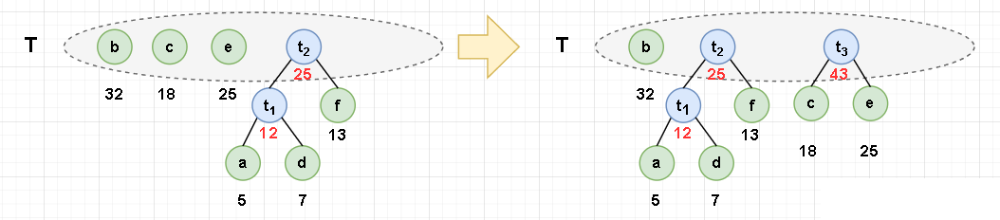

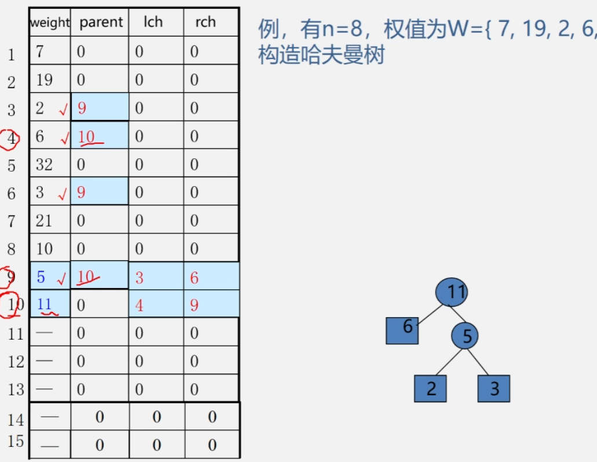

```c
void HuffmanTree(HNodeType HuffNode[],int n){
    int x1,x2;//x1.最小序号 x2.次小序号
    double m1,m2;//m1.最小权值 m2.次小权值
    for(int i = 0;i<n-1;i++){//n 个节点 n-1 次合并
        x1 = x2 = 0;
        m1 = m2 = MAXVALUE;
        for(int j = 0;j<n+i;j++){//找出没有双亲且最小权值的两个节点，合并成一棵二叉树（新生成的也要排，所以是 n+i）
            double k = HuffNode[j].weight;
            if(k<m1 && HuffNode[j].parent==-1){//次小最小替换
                x2 = x1;
                m2 = m1;
                x1 = j;
                m1 = k;
            }else if(k<m2 && HuffNode[j].parent==-1){//次小替换
                x2 = j;
                m2 = k;
            }
        }
        HuffNode[n+i].weight = m1 + m2;//新节点权值
        HuffNode[n+i].lchild = x1;//新节点左孩子.最小
        HuffNode[n+i].rchild = x2;//新节点右孩子.次小
        HuffNode[x1].parent = n+i;//追加双亲
        HuffNode[x2].parent = n+i;//追加双亲
    }
}
```

哈夫曼编码: 是一种可变字长编码（Variable Length Coding）的一种方法，通过根据不同字符出现的频率来构建一颗具有最小编码长度的二叉树。该树的构建和遍历规则使得出现频率高的字符获得较短的编码，而出现频率低的字符获得较长的编码，从而达到对数据进行高效压缩的目的。且保证是前缀编码。

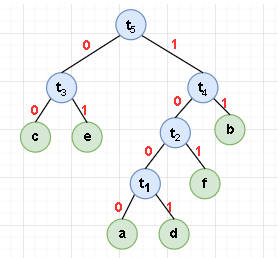

0010001001 --> cad

**平衡二叉树 (Balanced  Binary Tree)** 见《查找算法》

**B树 (B-tree)**

B: balanced

**23树 (B-tree)**，B星数，B+树，红黑树

### 3.2 图

多对多的关系，G=(V,E)，Graph=(Vertex, edge)

V:顶点(数据元素)的有穷非空集合;E: 边的有穷集合。

* 顶点或结点 (vertex)
* 边 (edge)
* 路径: 接续的边构成的顶点序列
* 无向图: 每条边都是无方向的
* 有向图: 每条边都是有方向的
* 权 (weight)
* 网: 边/弧带权的图
* 完全图: 任意两个点都有一条边相连 (有n *（n-1）/ 2 条边)
* 弧：有向图的边 （出度边，入度边）
* 稀疏图: 有很少边或弧的图(e<nlog<sup>n</sup>)
* 稠密图: 有较多边或弧的图。
* 邻接: 有边/弧相连的两个顶点之间的关系。
* 关联(依附) :边/弧与顶点之间的关系。
* 顶点的度: 与该顶点相关联的边的数目，记为TD(V)
  * 有向图中分入度ID(V)和出度OD(V)
* 路径长度: 路径上边或弧的数目/权值之和。
* 回路，简单路径，非简单路径
* 连通图 和 强连通图

图的表示方式有两种: 二维数组(邻接矩阵)，数组链表(邻接表)

1. 数组表示法（领接矩阵）

   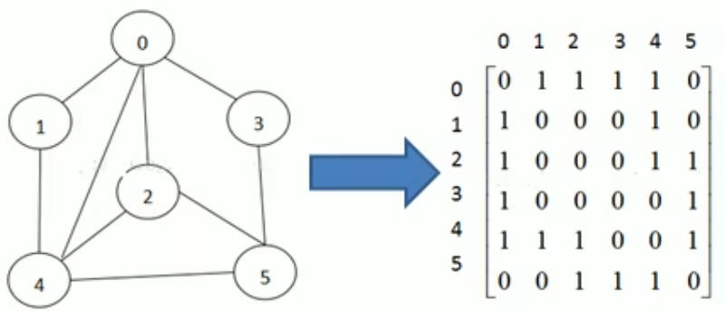

   1. 建立一个顶点表(记录各个顶点信息)和一个邻接矩阵(表示各个顶点之间关系)，对于无边(弧)用这个符号表示：∞

2. 链式

   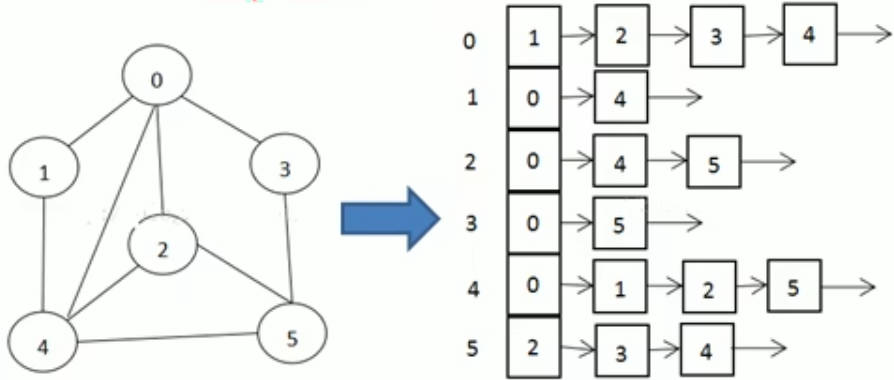

   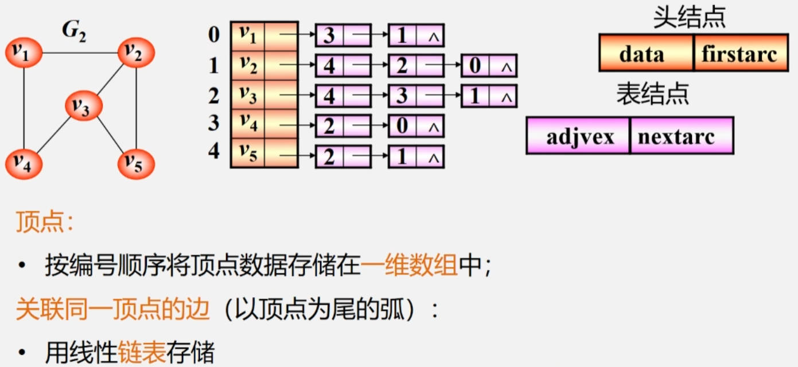

   1. 顶点: 按编号顺序将顶点数据存储在一维数组中;
   2. 关联同一顶点的边(以顶点为尾的弧) 用线性链表存储

3. 十字链表

4. 邻接多重表

**图的遍历：**从已给的连通图中某一顶点出发，沿着一些边访遍图中所有的顶点，且使每个顶点仅被访问一次，就叫做图的遍历。

DFS: Depth-First-Search

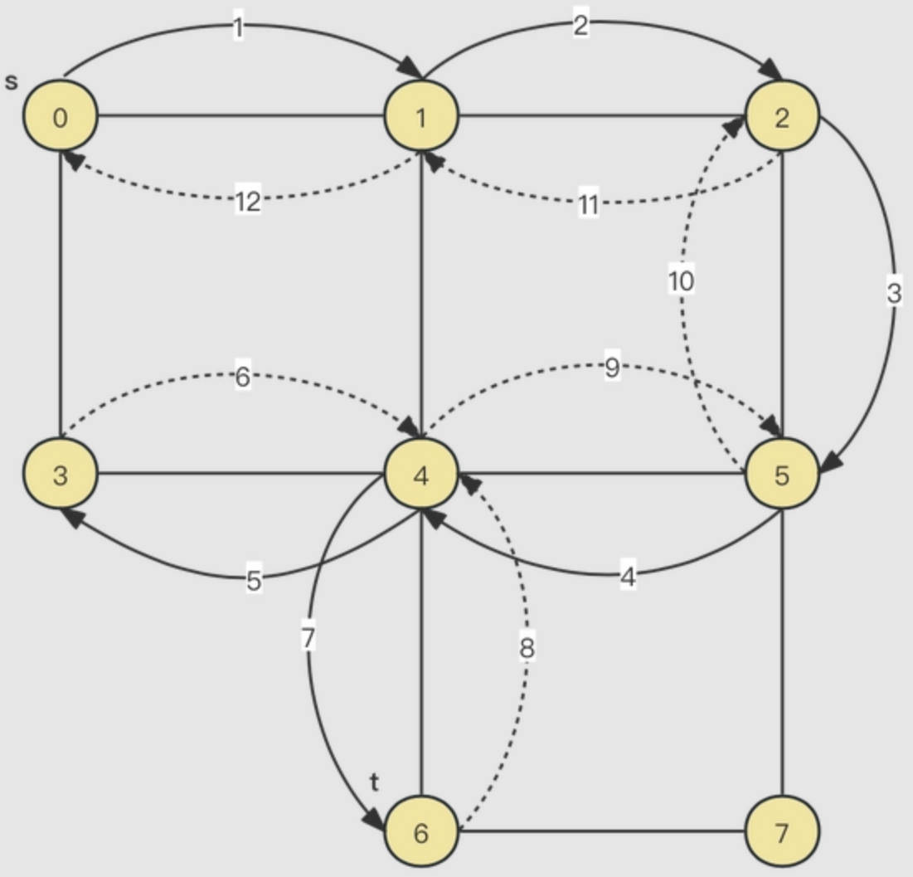

BFS: Breadth-First Search

**最小生成树Minimum Spanning Tree：** 给定一个无向网络在该网的所有生成树中，使得各边权值之和最小的那棵生成树称为该网的最小生成树，也叫最小代价生成树。

* 普里姆(Prim)算法: 把图中的点分成两部分，一部分是已经选择的, 另一部分是未选择的, 每次选择到两部分之间最短边。O(n<sup>2</sup>) n为顶点数。适合稠密图。

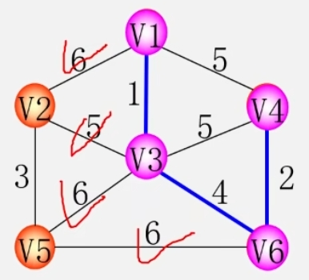

`V1-V3-V6-V4-V2-V5 `

* 克鲁斯卡尔(Kruskal) 算法：贪心算法选择边。每次选择最小边，不构成回路就选择。O(eloge) e为边数。适合稀疏图。

**单源最短路径 —— Dijkstra(迪杰斯特拉)算法** O(n^2) 算所有顶点间最短路径 O(n^3)

【1】不断运行广度优先算法找可见点，计算可见点到源点的距离长度

【2】从当前已知的路径中选择长度最短的将其顶点加入S作为确定找到的最短路径的顶点。

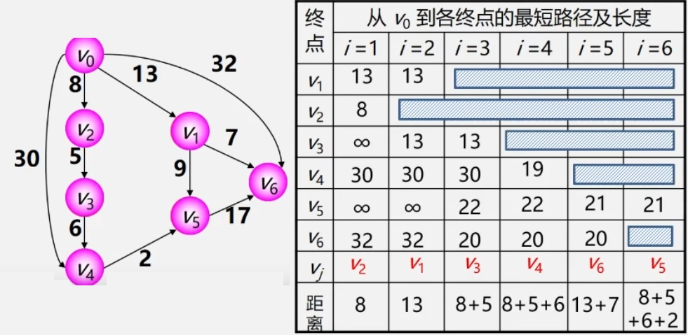

1. V2是最短路径
2. 查看从V0经过V2到各点的最短路径
3. 以此类推

**所有顶点间的最短路径 —— 用Floyd(弗洛伊德)算法** O(n^3)

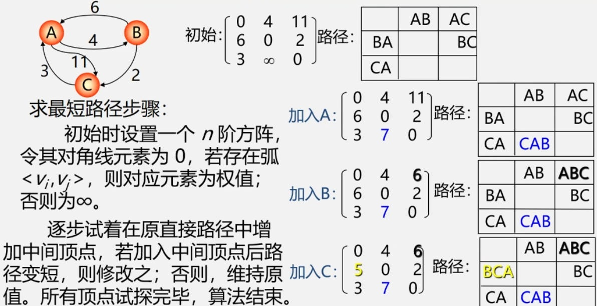

**拓扑排序**

可以用来检 AOV 网是否存在环方法

**关键路径**

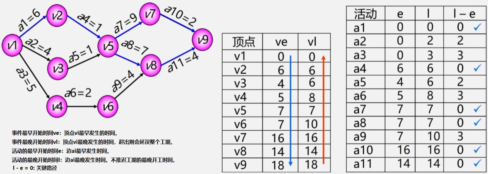

## 4. 复杂度

时间频度T(n): 一个算法花费的时间与算法中语句的执行次数成正比例，哪个算法中语句执行次数多，它花费时间就多。一个算法中的语句执行次数称为语句频度或时间频度。

时间复杂度O(n)：忽略T(n)的常数项。忽略低次项。忽略系数。


> O(1): 数组取值，算术运算。
>
> O(n) : 单链表的查找，插入和删除。

Master公式：略

## 4. 递归

定义：若一个对象部分地包含它自己，或用它自己给自己定义，则称这个对象是递归的;

分治法：对于一个较为复杂的问题，能够分解成几个相对简单的且解法相同或类似的子问题来求解。

递归的重要规则：

1. 重复相同的计算 （基本项）
2. 执行一个方法时，就创建一个新的受保护的独立空间(栈空间)
3. 递归必须向退出递归的条件逼近（归纳项）

回溯算法：八皇后问题，迷宫算法。

尾递归和单向递归可以转换成循环结构

## 5. 查找算法

查找算法的评价指标： 关键字的平均比较次数，也称平均查找长度ASL(Average Search Length)

线性表：顺序查找，二分查找，分块查找。

1. 二叉排序树 (Binary Sort Tree)

又称为二叉搜索树、二叉查找树。

左子树所有结点小于根节点，右子树所有结点大于等于根节点。

形态均衡和不均衡：O(log<sub>2</sub><sup>n</sup>)，O(n)

2. 平衡二叉树 (Balanced  Binary Tree) (AVL 是大学教授 G.M. Adelson-Velsky 和 E.M. Landis 名称的缩写)

   1. 左子树与右子树的高度之差的绝对值小于等于1 (平衡因子BF)

   2. 左子树和右子树也是平衡二叉排序树。

      插入数据二叉树失衡

      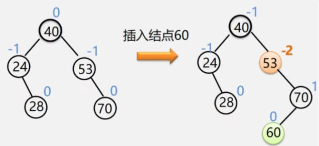

      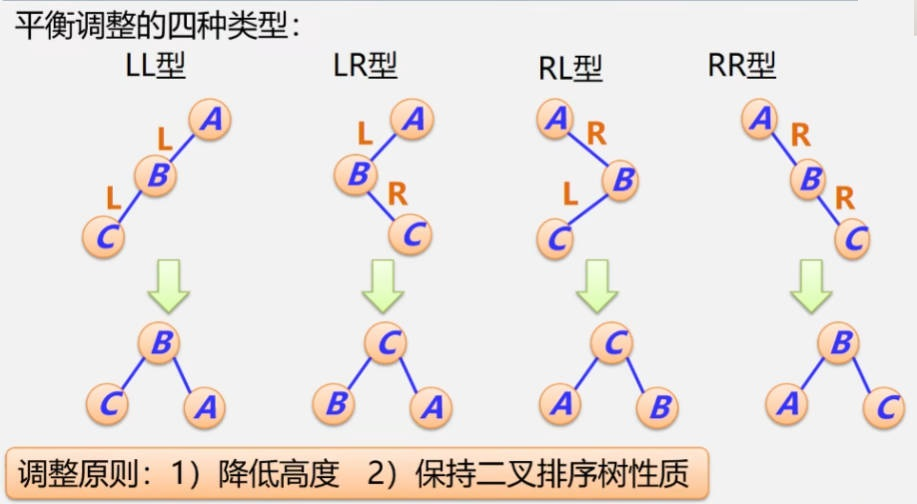

   散列表 (Hash table，也叫哈希表)

   解决哈希冲突：

   1. 开放定址法(开地址法)
      1. 线性探测 （寻找下一个空的散列地址）
      2. 二次探测法（d<sub>i</sub>为增量序列 1<sup>2</sup>，-1<sup>2</sup>，2<sup>2</sup>，-2<sup>2</sup>, …，q<sup>2</sup>）
   2. 链地址法(拉链法)

## 6. 排序算法

排序方法的分类

* 按数据存储介质：内部排序和外部排序
* 按化较器个数:  串行排序和并行排序
* 按主要操作: 比较排序和基数排序
* 按辅助空间：原地排序和非原地排序 （辅助空间O(1）
* 按稳定性: 稳定排序和非稳定排序
* 按自然性: 自然排序和非自然排序 (输入数据越有序是否排序的速度越快)


### 1. 冒泡排序 (Bubble Sort)


```java
/* 冒泡排序（标志优化） */
void bubbleSortWithFlag(int[] nums) {
    // 外循环：未排序区间为 [0, i]
    for (int i = nums.length - 1; i > 0; i--) {
        boolean flag = false; // 初始化标志位
        // 内循环：将未排序区间 [0, i] 中的最大元素交换至该区间的最右端
        for (int j = 0; j < i; j++) {
            if (nums[j] > nums[j + 1]) {
                // 交换 nums[j] 与 nums[j + 1]
                int tmp = nums[j];
                nums[j] = nums[j + 1];
                nums[j + 1] = tmp;
                flag = true; // 记录交换元素
            }
        }
        if (!flag)
            break; // 此轮冒泡未交换任何元素，直接跳出
    }
}
```

### 2. 快速排序 (Quick Sort)

是对冒泡排序的一种改进。找pivot（枢轴、中心点)，然后将数据划分为左右两个部分。


```java
/* 元素交换 */
void swap(int[] nums, int i, int j) {
    int tmp = nums[i];
    nums[i] = nums[j];
    nums[j] = tmp;
}

/* 哨兵划分 */
int partition(int[] nums, int left, int right) {
    // 以 nums[left] 作为基准数
    int i = left, j = right;
    while (i < j) {
        while (i < j && nums[j] >= nums[left])
            j--;          // 从右向左找首个小于基准数的元素
        while (i < j && nums[i] <= nums[left])
            i++;          // 从左向右找首个大于基准数的元素
        swap(nums, i, j); // 交换这两个元素
    }
    swap(nums, i, left);  // 将基准数交换至两子数组的分界线
    return i;             // 返回基准数的索引
}

/* 快速排序 */
void quickSort(int[] nums, int left, int right) {
    // 子数组长度为 1 时终止递归
    if (left >= right)
        return;
    // 哨兵划分
    int pivot = partition(nums, left, right);
    // 递归左子数组、右子数组
    quickSort(nums, left, pivot - 1);
    quickSort(nums, pivot + 1, right);
}

// 2.0 荷兰国旗算法
// 3.0 取随机值作为基准（pivot）
```

### 3. 插入排序 (Insertion Sort)


```java
/* 插入排序 */
void insertionSort(int[] nums) {
    // 外循环：已排序元素数量为 1, 2, ..., n
    for (int i = 1; i < nums.length; i++) {
        int base = nums[i];
        int j = i - 1;
        // 内循环：将 base 插入到已排序部分的正确位置
        while (j >= 0 && nums[j] > base) { // 可以使用哨兵去除 j>=0 的判断
            nums[j + 1] = nums[j]; // 将 nums[j] 向右移动一位
            j--;
        }
        nums[j + 1] = base;        // 将 base 赋值到正确位置
    }
}
```

**插入排序的使用频率显著高于冒泡排序和选择排序**，主要有以下原因。

- 冒泡排序基于元素交换实现，需要借助一个临时变量，共涉及 3 个单元操作；插入排序基于元素赋值实现，仅需 1 个单元操作。因此，**冒泡排序的计算开销通常比插入排序更高**。
- 选择排序在任何情况下的时间复杂度都为 \(O(n^2)\) 。**如果给定一组部分有序的数据，插入排序通常比选择排序效率更高**。
- 选择排序不稳定，无法应用于多级排序。

🟩 **改进：** 🟩

1. 使用哨兵

2. **「折半插入排序 binary insertion sort」**： 利用二分法查找需要插入的位置。

### 4. 希尔排序 (Shell Sort)

因为前面插入排序在”有序“的时候效率最高，因此，一开始就让整个序列基本有序


```java
void shellSort(arr) {
    int len = arr.length;
    int temp = 0;
    for (int gap = len / 2; gap > 0; gap /= 2) {
        for (int i = gap; i < len; i++) {
            // 1. 交换法
            for(int j = i - gap; j>=0; j-=gap){
                if(arr[j] > arr[j+gap]){
                    temp = arr[j];
                    arr[j] = arr[j + gap];
                    arr[j + gap] = temp;
                }
            }
            //2. 移位法
            var base = arr[i];
            var j = i - gap;
            while (j >= 0 && arr[j - gap] > base) {
                 arr[j] = arr[j - gap];
                 j -= gap;
            }
            arr[j] = base;
        }
    }
}
```

**总结 ：**

* 如何选择最佳d序列，目前尚未解决
* 最后一个增量值必须为1，无除了1之外的公因子
* 不宜在链式存储结构上实现

### 5. 选择排序 (Selection Sort)

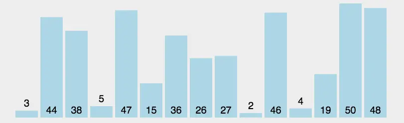

```java
/* 选择排序 */
void selectionSort(int[] nums) {
    int n = nums.length;
    // 外循环：未排序区间为 [i, n-1]
    for (int i = 0; i < n - 1; i++) {
        // 内循环：找到未排序区间内的最小元素
        int k = i;
        for (int j = i + 1; j < n; j++) {
            if (nums[j] < nums[k])
                k = j; // 记录最小元素的索引
        }
        // 将该最小元素与未排序区间的首个元素交换
        int temp = nums[i];
        nums[i] = nums[k];
        nums[k] = temp;
    }
}
```

- **非稳定排序**：元素 `nums[i]` 有可能被交换至与其相等的元素的右边，导致两者相对顺序发生改变。

### 6. 堆排序 (Heap Sort）

利用堆这种数据结构所设计的一种排序算法。堆积是一个近似完全二叉树的结构，并同时满足堆积的性质：即子结点的键值或索引总是小于（或者大于）它的父节点。

大根堆: 父节点总是大于或等于子节点。

1. 构建大顶堆。heap insert：父节点index=(当前插入数index-1)/2


### 7. 归并排序 (Merge Sort)

- 把长度为n的输入序列分成两个长度为n/2的子序列；
- 对这两个子序列分别采用归并排序；
- 将两个排序好的子序列合并成一个最终的排序序列。


```java
/* 合并左子数组和右子数组 */
// 左子数组区间 [left, mid]
// 右子数组区间 [mid + 1, right]
void merge(int[] nums, int left, int mid, int right) {
    // 初始化辅助数组
    int[] tmp = Arrays.copyOfRange(nums, left, right + 1);
    // 左子数组的起始索引和结束索引
    int leftStart = left, leftEnd = mid - left;
    // 右子数组的起始索引和结束索引
    int rightStart = mid + 1 - left, rightEnd = right - left;
    // i, j 分别指向左子数组、右子数组的首元素
    int i = leftStart, j = rightStart;
    // 通过覆盖原数组 nums 来合并左子数组和右子数组
    for (int k = left; k <= right; k++) {
        // 若“左子数组已全部合并完”，则选取右子数组元素，并且 j++
        if (i > leftEnd)
            nums[k] = tmp[j++];
        // 否则，若“右子数组已全部合并完”或“左子数组元素 <= 右子数组元素”，则选取左子数组元素，并且 i++
        else if (j > rightEnd || tmp[i] <= tmp[j])
            nums[k] = tmp[i++];
        // 否则，若“左右子数组都未全部合并完”且“左子数组元素 > 右子数组元素”，则选取右子数组元素，并且 j++
        else
            nums[k] = tmp[j++];
    }
}

/* 归并排序 */
void mergeSort(int[] nums, int left, int right) {
    // 终止条件
    if (left >= right)
        return;                      // 当子数组长度为 1 时终止递归
    // 划分阶段
    int mid = (left + right) / 2;    // 计算中点
    mergeSort(nums, left, mid);      // 递归左子数组
    mergeSort(nums, mid + 1, right); // 递归右子数组
    // 合并阶段
    merge(nums, left, mid, right);
}
```

### 8. 基数排序 (Radix Sort)

基数排序是按照低位先排序，然后收集；再按照高位排序，然后再收集；依次类推，直到最高位。


```java
/* 获取元素 num 的第 k 位，其中 exp = 10^(k-1) */
int digit(int num, int exp) {
    // 传入 exp 而非 k 可以避免在此重复执行昂贵的次方计算
    return (num / exp) % 10;
}

/* 计数排序（根据 nums 第 k 位排序） */
void countingSortDigit(int[] nums, int exp) {
    // 十进制的位范围为 0~9 ，因此需要长度为 10 的桶
    int[] counter = new int[10];
    int n = nums.length;
    // 统计 0~9 各数字的出现次数
    for (int i = 0; i < n; i++) {
        int d = digit(nums[i], exp); // 获取 nums[i] 第 k 位，记为 d
        counter[d]++;                // 统计数字 d 的出现次数
    }
    // 求前缀和，将“出现个数”转换为“数组索引”
    for (int i = 1; i < 10; i++) {
        counter[i] += counter[i - 1];
    }
    // 倒序遍历，根据桶内统计结果，将各元素填入 res
    int[] res = new int[n];
    for (int i = n - 1; i >= 0; i--) {
        int d = digit(nums[i], exp);
        int j = counter[d] - 1; // 获取 d 在数组中的索引 j
        res[j] = nums[i];       // 将当前元素填入索引 j
        counter[d]--;           // 将 d 的数量减 1
    }
    // 使用结果覆盖原数组 nums
    for (int i = 0; i < n; i++)
        nums[i] = res[i];
}

/* 基数排序 */
void radixSort(int[] nums) {
    // 获取数组的最大元素，用于判断最大位数
    int m = Integer.MIN_VALUE;
    for (int num : nums)
        if (num > m)
            m = num;
    // 按照从低位到高位的顺序遍历
    for (int exp = 1; exp <= m; exp *= 10)
        // 对数组元素的第 k 位执行计数排序
        // k = 1 -> exp = 1
        // k = 2 -> exp = 10
        // 即 exp = 10^(k-1)
        countingSortDigit(nums, exp);
}
```

## 8. 十种算法

### 1. 二分查找 (Binary Search)

```java
int mid = Begin + 1/2 * (End - Begin);
int mid = Begin + ((X - A[Begin] / (A[End] - A[Begin])) * (End - Begin));
```

### 2. 分治算法 (Divide and Conquer)

汉诺塔 Tower of Hanoi

如果我们有 n>=2情况，我们总是可以看做是两个盘：1.最下边的盘 2.上面的盘

1. 上面的盘 A->B
2. 最下边的盘 A->C
3. B塔的所有盘 B->C

```java
public class Hanoilmpl {

    public static void hanoi(int n, char A, char B, char C) {
        if (n == 1) {
            move(A, C);
        } else {
            hanoi(n - 1, A, C, B);//将n-1个盘子由A经过C移动到B
            move(A, C);             //执行最大盘子n移动
            hanoi(n - 1, B, A, C);//剩下的n-1盘子，由B经过A移动到C
        }
    }

    private static void move(char A, char C) {//执行最大盘子n的从A-C的移动
        System.out.println("move:" + A + "--->" + C);
    }

    public static void main(String[] args) {
        System.out.println("移动汉诺塔的步骤：");
        hanoi(3, 'a', 'b', 'c');
    }
}
```

### 3. 动态规划 (Dynamic Programming)

背包问题

01背包问题

`dp[i][j] = max(dp[i - 1][j], dp[i - 1][j - v[i]] + w[i])`，

i：表示物品数量，

j：表示背包容量，

v\[i]：表示第i个物品的体积，

w[i]：表示第i个物品的价值。

### 4. KMP 算法

Knuth Morris Pratt算法（三个人名）：解决寻找最大子串问题。

设计思想：

利用已经部分匹配的结果而加快模式串的滑动速度。

且主串S的指针i不必回溯！可提速到O(n+m)！

### 5. 贪心算法 (Greedy)

在每一步选择中都采取当前状态下的最优决策的算法。

### 6. 普利姆算法 (Prim)

见 **2.2 最小生成树Minimum Spanning Tree**

### 7. 克鲁斯卡尔算法 (Kruskal)

见 **2.2 最小生成树Minimum Spanning Tree**

### 8. 迪杰斯特拉算法 (Dijkstra)

见 **2.2 单源最短路径**

### 9.  弗洛伊德算法 (Floyd)

见 **2.2 所有顶点间的最短路径**

### 10. 骑士周游问题(A Knight's Journey)

DFS + 回溯 + 贪心算法优化(我们应该选择下一个的下一个可以走的位置较少的点开始走, 如果下一步的选择越少，意味着回溯时的步骤越少，相应的效率也会越高)

## 9. 其他

🟩 **对数器** 🟩

对数器的使用需要具备两种东西:

1. 对于解决这个问题的一个绝对正确的方法
2. 一个随机器来生成样本数据

🟩 **查找** 🟩

线性查找，二分查找，插值查找。

斐波那契查找法。

🟩 **哈希** 🟩

把任意长度的输入（又叫做预映射pre-image）通过散列算法变换成固定长度的输出，该输出就是散列值。

🟩 **其他** 🟩

```java
// 取出一个数从右位置出现的第一个1
int rightOne = eor & (~eor + 1)

// 求中点
mid = (L+R)/2 // 有可能整数溢出
mid = L + (R-L)/2
mid = L + (R-L) >> 1
```
