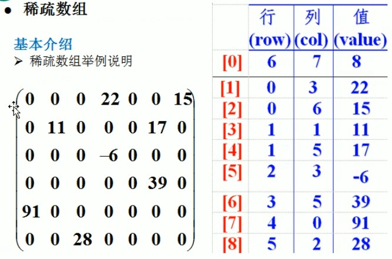
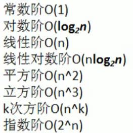
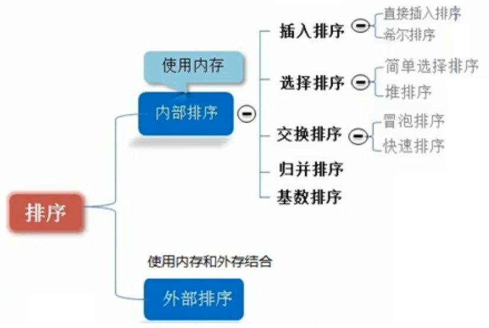
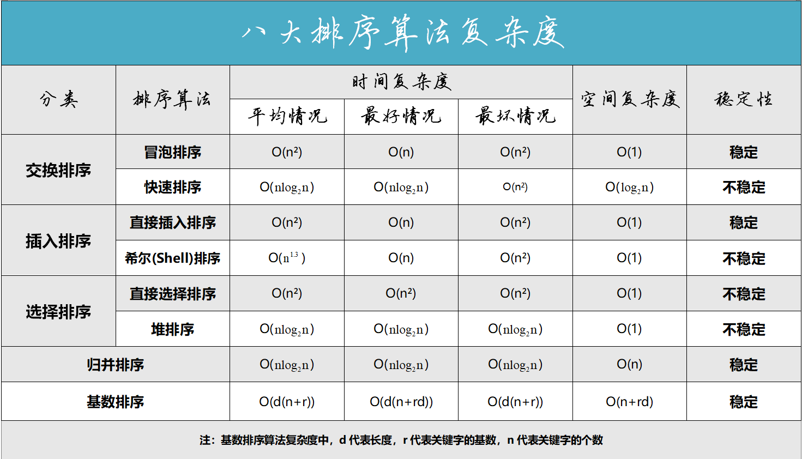

# 数据结构与算法

程序 = 数据结构 + 算法

## 1. 线性结构

顺序存储结构，链式存储结构。

<font color=green>**稀疏数组**</font>

Sparse Array:  一般使用在一个二维数组存储着大量无效数据的场景中。

- 第一行记录二维数组的行数，列数，以及有效数据的个数
- 其他行记录每个有效数据所在的行数，列数，以及值



<font color=green>**队列**</font>

队列是一个有序列表，可以用数组或是链表来实现。

遵循先入先出的原则。

<font color=green>**链表**</font>

**Linked List：**

1. 链表是以节点的方式来存储
2. 每个节点包含 data域，next域: 指向下一个节点
3. 链表的各个节点不一定是连续存储.
4. 带头节点或者不带

<font color=green>**单向链表**</font>

1. 单向链表 **(Singly Linked List)** ，查找的方向只能是一个方向，而双向链表可以向前或者向后查找。
2. 单向链表不能自我删除，需要靠辅助节点，而双向链表，则可以自我删除。(辅助节点通常是指向前一个节点)

**头插法：**

```java
class ListNode {
    int val;
    ListNode next;

    public ListNode(int val) {
        this.val = val;
    }
}

public class Main {
    public static void main(String[] args) {
        // 创建一个空链表
        ListNode head = null;

        // 使用头插法向链表中插入新节点
        for (int i = 1; i <= 5; i++) {
            ListNode newNode = new ListNode(i);
            newNode.next = head; // 将新节点的下一个指针指向当前头节点
            head = newNode; // 更新链表的头节点
        }
    }
}
```

<font color=blue>**单向环形链表**</font>

约瑟夫问题 (Josephus problem)

<font color=green>**双向链表**</font>

**(Doubly Linked List)** ： 可以自我删除。

<font color=green>**栈**</font>

stack : FILO-First In Last Out,  栈顶Top,  栈底Bottom

## 2. 非线性结构

## 3. 复杂度

时间频度T(n): 一个算法花费的时间与算法中语句的执行次数成正比例，哪个算法中语句执行次数多，它花费时间就多。一个算法中的语句执行次数称为语句频度或时间频度。

时间复杂度O(n)：忽略T(n)的常数项。忽略低次项。忽略系数。




## 4. 递归

递归的重要规则：

1. 重复相同的计算
2. 执行一个方法时，就创建一个新的受保护的独立空间(栈空间)
3. 递归必须向退出递归的条件逼近

回溯算法：八皇后问题，迷宫算法。

## 5. 排序算法





<font color=green>**1. 冒泡排序 (Bubble Sort)**</font>

```java
/* 冒泡排序（标志优化） */
void bubbleSortWithFlag(int[] nums) {
    // 外循环：未排序区间为 [0, i]
    for (int i = nums.length - 1; i > 0; i--) {
        boolean flag = false; // 初始化标志位
        // 内循环：将未排序区间 [0, i] 中的最大元素交换至该区间的最右端
        for (int j = 0; j < i; j++) {
            if (nums[j] > nums[j + 1]) {
                // 交换 nums[j] 与 nums[j + 1]
                int tmp = nums[j];
                nums[j] = nums[j + 1];
                nums[j + 1] = tmp;
                flag = true; // 记录交换元素
            }
        }
        if (!flag)
            break; // 此轮冒泡未交换任何元素，直接跳出
    }
}
```

<font color=green>**2. 选择排序 (Selection Sort)**</font>

```java
/* 选择排序 */
void selectionSort(int[] nums) {
    int n = nums.length;
    // 外循环：未排序区间为 [i, n-1]
    for (int i = 0; i < n - 1; i++) {
        // 内循环：找到未排序区间内的最小元素
        int k = i;
        for (int j = i + 1; j < n; j++) {
            if (nums[j] < nums[k])
                k = j; // 记录最小元素的索引
        }
        // 将该最小元素与未排序区间的首个元素交换
        int temp = nums[i];
        nums[i] = nums[k];
        nums[k] = temp;
    }
}
```

- **非稳定排序**：元素 `nums[i]` 有可能被交换至与其相等的元素的右边，导致两者相对顺序发生改变。

<font color=green>**3. 「插入排序 insertion sort」**</font>

```java
/* 插入排序 */
void insertionSort(int[] nums) {
    // 外循环：已排序元素数量为 1, 2, ..., n
    for (int i = 1; i < nums.length; i++) {
        int base = nums[i];
        int j = i - 1;
        // 内循环：将 base 插入到已排序部分的正确位置
        while (j >= 0 && nums[j] > base) {
            nums[j + 1] = nums[j]; // 将 nums[j] 向右移动一位
            j--;
        }
        nums[j + 1] = base;        // 将 base 赋值到正确位置
    }
}
```

**插入排序的使用频率显著高于冒泡排序和选择排序**，主要有以下原因。

- 冒泡排序基于元素交换实现，需要借助一个临时变量，共涉及 3 个单元操作；插入排序基于元素赋值实现，仅需 1 个单元操作。因此，**冒泡排序的计算开销通常比插入排序更高**。
- 选择排序在任何情况下的时间复杂度都为 \(O(n^2)\) 。**如果给定一组部分有序的数据，插入排序通常比选择排序效率更高**。
- 选择排序不稳定，无法应用于多级排序。

