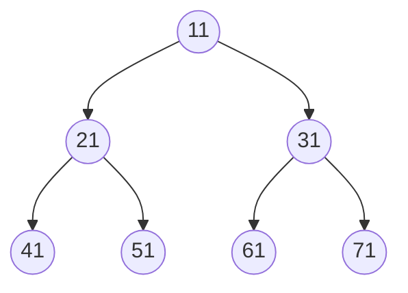
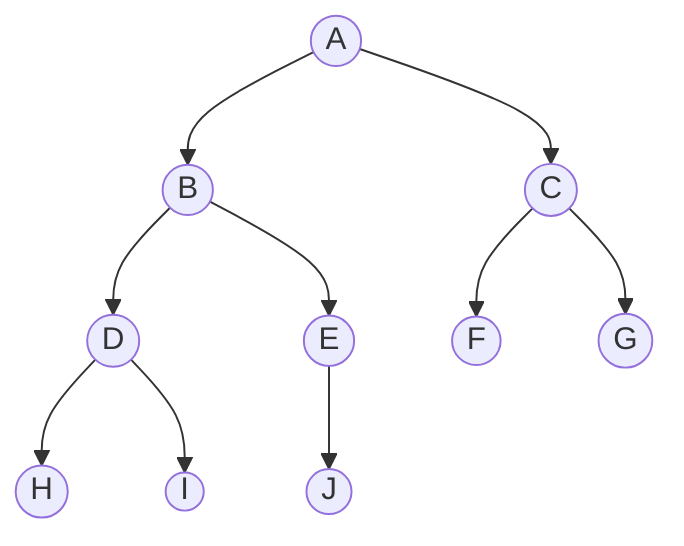

# 数据结构与算法

程序 = 数据结构 + 算法

## 1. 线性结构

顺序存储结构，链式存储结构。

🟩 **稀疏数组** 🟩

Sparse Array:  一般使用在一个二维数组存储着大量无效数据的场景中。

- 第一行记录二维数组的行数，列数，以及有效数据的个数
- 其他行记录每个有效数据所在的行数，列数，以及值


🟩 **队列** 🟩

队列是一个有序列表，可以用数组或是链表来实现。

遵循先入先出的原则。

🟩 **链表**🟩

**Linked List：**

1. 链表是以节点的方式来存储
2. 每个节点包含 data域，next域: 指向下一个节点
3. 链表的各个节点不一定是连续存储.
4. 带头节点或者不带

**单向链表**

1. 单向链表 **(Singly Linked List)** ，查找的方向只能是一个方向，而双向链表可以向前或者向后查找。
2. 单向链表不能自我删除，需要靠辅助节点，而双向链表，则可以自我删除。(辅助节点通常是指向前一个节点)

**头插法：**

```java
class ListNode {
    int val;
    ListNode next;

    public ListNode(int val) {
        this.val = val;
    }
}

public class Main {
    public static void main(String[] args) {
        // 创建一个空链表
        ListNode head = null;

        // 使用头插法向链表中插入新节点
        for (int i = 1; i <= 5; i++) {
            ListNode newNode = new ListNode(i);
            newNode.next = head; // 将新节点的下一个指针指向当前头节点
            head = newNode; // 更新链表的头节点
        }
    }
}
```

**单向环形链表**

约瑟夫问题 (Josephus problem)

**双向链表**

**(Doubly Linked List)** ： 可以自我删除。

🟩 **栈** 🟩

stack : FILO-First In Last Out,  栈顶Top,  栈底Bottom

## 2. 非线性结构

二叉树：每个节点最多只能有两个子节点的一种形式称为二叉树。

满二叉树：二叉树的所有叶子节点都在最后一层，并且结点总数=2^(n-1)




完全二叉树：如果该二叉树的所有叶子节点都在最后一层或者倒数第二层，而且最后一层的叶子节点在左边连续，倒数第二层的叶子节点在右边连续，我们称为完全二叉树。


前序遍历:先输出父节点，再遍历左子树和右子树。  `A B D H I E J C F G`

中序遍历:先遍历左子树，再输出父节点，再遍历右子树。`H D I B J E A F C G`

后序遍历:先遍历左子树，再遍历右子树，最后输出父节点。`H I D J E B F G C A`

```java
public class TreeNode{
    int val;
    TreeNode left;
    TreeNode right;
    TreeNode(int x){
        val = x;
    }
}

// 前序遍历
public void preOrder(TreeNode node){
    System.out.println(node.val);
    TreeNode leftTree = node.left;
    if(leftTree != null){
        preOrder(leftTree);
    }
    TreeNode rightTree = biTree.right;
    if(rightTree != null){
        preOrder(rightTree);
    }
}

// 中序遍历
public void inOrderTraversal(TreeNode node){
    if(node == null){
        return;
    }else{
        inOrderTraversal(node.leftChild);
        System.out.println(node.val);
        inOrderTRaversal(node.rightChild);
    }
}

// 后序遍历
public void postorder(TreeNode node) {
    if (node == null) {
        return;
    }
    postorder(node.left);
    postorder(node.right);
    System.out.println(node.val);
}
```

二叉排序树(Binary SortTree) ：插入，查找，删除都很块。
* 叶子节点(没有子节点的节点)
* 节点的权(节点值)
* 树的高度(最大层数)

线索化二叉树 (Threaded Binary Tree)：

## 3. 复杂度

时间频度T(n): 一个算法花费的时间与算法中语句的执行次数成正比例，哪个算法中语句执行次数多，它花费时间就多。一个算法中的语句执行次数称为语句频度或时间频度。

时间复杂度O(n)：忽略T(n)的常数项。忽略低次项。忽略系数。


## 4. 递归

递归的重要规则：

1. 重复相同的计算
2. 执行一个方法时，就创建一个新的受保护的独立空间(栈空间)
3. 递归必须向退出递归的条件逼近

回溯算法：八皇后问题，迷宫算法。

## 5. 排序算法


🟩 **1. 冒泡排序 (Bubble Sort)** 🟩


```java
/* 冒泡排序（标志优化） */
void bubbleSortWithFlag(int[] nums) {
    // 外循环：未排序区间为 [0, i]
    for (int i = nums.length - 1; i > 0; i--) {
        boolean flag = false; // 初始化标志位
        // 内循环：将未排序区间 [0, i] 中的最大元素交换至该区间的最右端
        for (int j = 0; j < i; j++) {
            if (nums[j] > nums[j + 1]) {
                // 交换 nums[j] 与 nums[j + 1]
                int tmp = nums[j];
                nums[j] = nums[j + 1];
                nums[j + 1] = tmp;
                flag = true; // 记录交换元素
            }
        }
        if (!flag)
            break; // 此轮冒泡未交换任何元素，直接跳出
    }
}
```

🟩 **2. 选择排序 (Selection Sort)** 🟩


```java
/* 选择排序 */
void selectionSort(int[] nums) {
    int n = nums.length;
    // 外循环：未排序区间为 [i, n-1]
    for (int i = 0; i < n - 1; i++) {
        // 内循环：找到未排序区间内的最小元素
        int k = i;
        for (int j = i + 1; j < n; j++) {
            if (nums[j] < nums[k])
                k = j; // 记录最小元素的索引
        }
        // 将该最小元素与未排序区间的首个元素交换
        int temp = nums[i];
        nums[i] = nums[k];
        nums[k] = temp;
    }
}
```

- **非稳定排序**：元素 `nums[i]` 有可能被交换至与其相等的元素的右边，导致两者相对顺序发生改变。

🟩 **3. 「插入排序 insertion sort」** 🟩

```java
/* 插入排序 */
void insertionSort(int[] nums) {
    // 外循环：已排序元素数量为 1, 2, ..., n
    for (int i = 1; i < nums.length; i++) {
        int base = nums[i];
        int j = i - 1;
        // 内循环：将 base 插入到已排序部分的正确位置
        while (j >= 0 && nums[j] > base) {
            nums[j + 1] = nums[j]; // 将 nums[j] 向右移动一位
            j--;
        }
        nums[j + 1] = base;        // 将 base 赋值到正确位置
    }
}
```

**插入排序的使用频率显著高于冒泡排序和选择排序**，主要有以下原因。

- 冒泡排序基于元素交换实现，需要借助一个临时变量，共涉及 3 个单元操作；插入排序基于元素赋值实现，仅需 1 个单元操作。因此，**冒泡排序的计算开销通常比插入排序更高**。
- 选择排序在任何情况下的时间复杂度都为 \(O(n^2)\) 。**如果给定一组部分有序的数据，插入排序通常比选择排序效率更高**。
- 选择排序不稳定，无法应用于多级排序。

🟩 **4. 「希尔排序 shell sort」**🟩


```java
void shellSort(arr) {
    int len = arr.length;
    int temp = 0;
    for (int gap = len / 2; gap > 0; gap /= 2) {
        for (int i = gap; i < len; i++) {
            // 1. 交换法
            for(int j = i - gap; j>=0; j-=gap){
                if(arr[j] > arr[j+gap]){
                    temp = arr[j];
                    arr[j] = arr[j + gap];
                    arr[j + gap] = temp;
                }
            }
            //2. 移位法
            var base = arr[i];
            var j = i - gap;
            while (j >= 0 && arr[j - gap] > base) {
                 arr[j] = arr[j - gap];
                 j -= gap;
            }
            arr[j] = base;
        }
    }
}
```

🟩 **5. 「快速排序 quick sort」** 🟩

是对冒泡排序的一种改进。

```java
/* 元素交换 */
void swap(int[] nums, int i, int j) {
    int tmp = nums[i];
    nums[i] = nums[j];
    nums[j] = tmp;
}

/* 哨兵划分 */
int partition(int[] nums, int left, int right) {
    // 以 nums[left] 作为基准数
    int i = left, j = right;
    while (i < j) {
        while (i < j && nums[j] >= nums[left])
            j--;          // 从右向左找首个小于基准数的元素
        while (i < j && nums[i] <= nums[left])
            i++;          // 从左向右找首个大于基准数的元素
        swap(nums, i, j); // 交换这两个元素
    }
    swap(nums, i, left);  // 将基准数交换至两子数组的分界线
    return i;             // 返回基准数的索引
}

/* 快速排序 */
void quickSort(int[] nums, int left, int right) {
    // 子数组长度为 1 时终止递归
    if (left >= right)
        return;
    // 哨兵划分
    int pivot = partition(nums, left, right);
    // 递归左子数组、右子数组
    quickSort(nums, left, pivot - 1);
    quickSort(nums, pivot + 1, right);
}
```

🟩 **6. 「归并排序 merge sort」**🟩

```java
/* 合并左子数组和右子数组 */
// 左子数组区间 [left, mid]
// 右子数组区间 [mid + 1, right]
void merge(int[] nums, int left, int mid, int right) {
    // 初始化辅助数组
    int[] tmp = Arrays.copyOfRange(nums, left, right + 1);
    // 左子数组的起始索引和结束索引
    int leftStart = left, leftEnd = mid - left;
    // 右子数组的起始索引和结束索引
    int rightStart = mid + 1 - left, rightEnd = right - left;
    // i, j 分别指向左子数组、右子数组的首元素
    int i = leftStart, j = rightStart;
    // 通过覆盖原数组 nums 来合并左子数组和右子数组
    for (int k = left; k <= right; k++) {
        // 若“左子数组已全部合并完”，则选取右子数组元素，并且 j++
        if (i > leftEnd)
            nums[k] = tmp[j++];
        // 否则，若“右子数组已全部合并完”或“左子数组元素 <= 右子数组元素”，则选取左子数组元素，并且 i++
        else if (j > rightEnd || tmp[i] <= tmp[j])
            nums[k] = tmp[i++];
        // 否则，若“左右子数组都未全部合并完”且“左子数组元素 > 右子数组元素”，则选取右子数组元素，并且 j++
        else
            nums[k] = tmp[j++];
    }
}

/* 归并排序 */
void mergeSort(int[] nums, int left, int right) {
    // 终止条件
    if (left >= right)
        return;                      // 当子数组长度为 1 时终止递归
    // 划分阶段
    int mid = (left + right) / 2;    // 计算中点
    mergeSort(nums, left, mid);      // 递归左子数组
    mergeSort(nums, mid + 1, right); // 递归右子数组
    // 合并阶段
    merge(nums, left, mid, right);
}
```

🟩 **7. 「基数排序 radix sort」** 🟩

```java
/* 获取元素 num 的第 k 位，其中 exp = 10^(k-1) */
int digit(int num, int exp) {
    // 传入 exp 而非 k 可以避免在此重复执行昂贵的次方计算
    return (num / exp) % 10;
}

/* 计数排序（根据 nums 第 k 位排序） */
void countingSortDigit(int[] nums, int exp) {
    // 十进制的位范围为 0~9 ，因此需要长度为 10 的桶
    int[] counter = new int[10];
    int n = nums.length;
    // 统计 0~9 各数字的出现次数
    for (int i = 0; i < n; i++) {
        int d = digit(nums[i], exp); // 获取 nums[i] 第 k 位，记为 d
        counter[d]++;                // 统计数字 d 的出现次数
    }
    // 求前缀和，将“出现个数”转换为“数组索引”
    for (int i = 1; i < 10; i++) {
        counter[i] += counter[i - 1];
    }
    // 倒序遍历，根据桶内统计结果，将各元素填入 res
    int[] res = new int[n];
    for (int i = n - 1; i >= 0; i--) {
        int d = digit(nums[i], exp);
        int j = counter[d] - 1; // 获取 d 在数组中的索引 j
        res[j] = nums[i];       // 将当前元素填入索引 j
        counter[d]--;           // 将 d 的数量减 1
    }
    // 使用结果覆盖原数组 nums
    for (int i = 0; i < n; i++)
        nums[i] = res[i];
}

/* 基数排序 */
void radixSort(int[] nums) {
    // 获取数组的最大元素，用于判断最大位数
    int m = Integer.MIN_VALUE;
    for (int num : nums)
        if (num > m)
            m = num;
    // 按照从低位到高位的顺序遍历
    for (int exp = 1; exp <= m; exp *= 10)
        // 对数组元素的第 k 位执行计数排序
        // k = 1 -> exp = 1
        // k = 2 -> exp = 10
        // 即 exp = 10^(k-1)
        countingSortDigit(nums, exp);
}
```

🟩 **8. 「堆排序 heap sort」**🟩

大顶堆: 父节点总是大于或等于子节点。

## 6. 其他

🟩 **查找** 🟩

线性查找，二分查找，插值查找。

```java
int mid = Begin + 1/2 * (End - Begin);
int mid = Begin + ((X - A[Begin] / (A[End] - A[Begin])) * (End - Begin));
```

斐波那契查找法。

🟩 **哈希** 🟩

把任意长度的输入（又叫做预映射pre-image）通过散列算法变换成固定长度的输出，该输出就是散列值。
