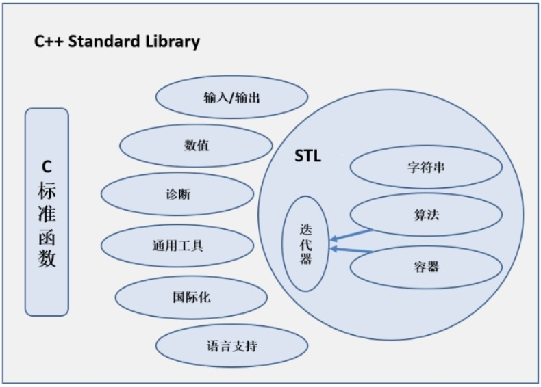
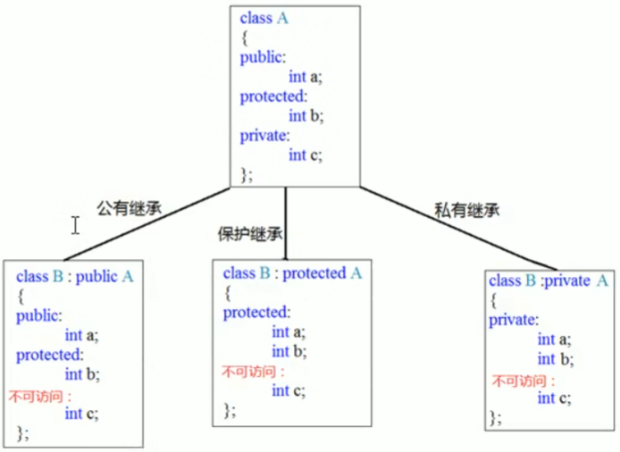
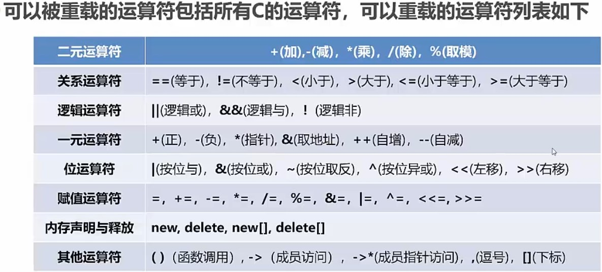
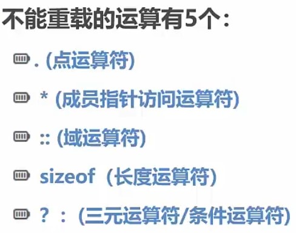

# C++

## 1. 简介

1979 - 1981: C with classes

从1982年开始，C++开始定位作为一个新的编程语言，使用编译技术重新实现了「带类的C」，对应的编译器为Cfront

1983年底，C++正式被命名。

```c++
#include <iostream> // a PREPROCESSOR directive, 该编译指令导致预处理器将iostream文件的内容添加到程序中。这是一种典型的预处理器操作:在源代码被编译之前，替换或添加文本。
using namespace std;
int main(void)
{
    cout << "Hello World" << endl;
    return 0;
}
```

C++ 融合了3种不同的编程方式： **过程性语言 + OOP + 泛型编程**

文件后缀: `cpp, cxx, cc`

编译：`g++ 1.cpp`, 运行：`./a.out` (通常,main()被启动代码调用,而启动代码是由编译器添加到程序中的,是程序和操作系统(UNIX、Windows7或其他操作系统)之间的桥梁。事实上，该函数头描述的是main()和操作系统之间的接口。) 存在一些例外情况。例如,在 Windows编程中,可以编写一个动态链接库(DLL)模块,这是其他 Windows程序可以使用的代码。由于 DLL 模块不是独立的程序，因此不需要 main()。用于专用环境的程序--单片机，只需要代码地址，也不需要main.

🟩 **与C** 🟩

单行注释：`//`      支持版本 C99, C++

多行注释：`/* */`     支持版本 C89, C99, C++

文档注释 : `/** 文档注释 */` （标准中没有提）

* 面向过程：就是分析出解决问题所需要的步骤，然后用函数把这些步骤一步一步实现，使用的时候再一个一个的依次调用就可以了。
* 面向对象：是把事务分解成为一个个对象，然后由对象之间分工与合作
  * 特点：封装，继承，多态

C++是C语言的超集，任何有效的C程序都是有效的C++程序。

C提供了低级硬件访问，OOP提供了高级抽象。

版本三年一个周期，主要版本: **C++98**，**C++11**，**C++17**,  **C++23**

 **头文件** 

转换后的C加上前缀C，没有扩展名，例如 `cstdio`, `cmath`，`ctype`等。

`#include <cstdio> ` : `cstdio` 源文件中还是 `#include <stdio.h> `

 **char** 

`\n ` 与 `endl` : 前者只换行，后者换行并 + `fflush(stdin)`(立即输出)

```c++
cout << "25"; // printf("%s\n", "25");
cout << 25; // printf("%d\n", 25);
```

`wchar_t` : 宽字符类型, 可以表示扩展字符集. C++11新增的类型:char16_t 和 char32_t

新的数据类型string。

## 2. 数据类型

### 2.1 基本类型

| 整型              | 长度                                                         |
| ----------------- | ------------------------------------------------------------ |
| char (另一种整型) | 1 byte                                                       |
| short             | short 至少 2 byte                                            |
| int               | int 至少与 short 一样长                                      |
| long              | long 至少 8 byte，且至少与 int 一样长                        |
| long long         | long long 至少 8 byte，且至少与 long 一样长。(**C++11新增**) |

| bool类型 | 长度   |
| -------- | ------ |
| bool     | 1 byte |

| 浮点类型    | 长度             |
| ----------- | ---------------- |
| float       | 至少 4 byte      |
| double      | 至少 6 byte      |
| long double | 至少和double一样 |

float定义: `1.0f`

这些都有 `unsigned, signed`

C++整数常量在不超出int类型范围的应用情况下，默认优先使用int类型

```c++
// 1. char
char a = 65; // 'A'
char a = 'A'; // 字面值65
int b = a;
cout << b; // 65

a = a + 1;
cout << a; // B
cout.put('a'); // 用来输出字符: a

// 2. bool
bool is_ready = true;
int ans = true;      // 1
int promise = false; // 0
bool start = -100;   // true
bool start = 0;      // false

// 3. 浮点数
12.34, 2.52e+8
// 控制显示的小数的位数 <iomanip>
cout << cout.setprecision(2);
cout.setf(); // 保留小数结尾0. cout默认会删除小数结尾的0, 默认6位小数

// 类型转换
long_num = short_num; // 小转大自动转换
int_num = float_num;  // 丢失
auks = 19.99 + 11.99; // 31
auto n = 100; // C++11, int

// 强制类型转换
(typeName)value
typeName(value)
static_cast<typeName>(value)

// 常量，首写字符大写
const int Months = 12;

int emus;    // 局部变量值不定义，这个值会是任意值。
int emus{7}; // 使用大括号初始化器。这种方式适合任意数据类型。
```

### 2.2 复合类型

🟦  **一、 数组**

同C语言。

**字符串**

同C语言部分。

拼接字符串常量：任何两个由空白(空格、制表符和换行符)分隔的字符串常量都将自动拼接成一个。

**string 类**

```c++
#include <cstring>
string str = "abc"; // 可以通过下标访问各元素
str.size();         // 3
charr2 = charr1;    // INVALID, no array assignment
str1 = str2;        // VALID, object assignment ok
// 可以字符串拼接
str3 = str1 + str2;
str1 += str2;

char charr[20];
string str;
strlen(charr); // 随机
str.size();    // 0

// 重载了比较运算符 ==, !=, <, <=, >, >=
// 用途：按字典序比较字符串内容（区分大小写）
if ("apple" < "banana") { /* true */ }
if (s1 == s2) { /* 判断内容是否相同 */ }
```

🟦  **二、 结构体**

```c++
// 1、先定义结构体类型，再定义结构体变量
struct inflatable
{
    std::string name;
    float volume;
    double price;
};
inflatable hat; // C语言： struct inflatable hat;
hat = { "abc", 3.12, 32.99 };
hat.name; // 获取
inflatable hat { "abc", 3.12, 32.99 }; // C++11

// 2、定义结构体类型的同时定义结构体变量
struct inflatable
{
    std::string name;
}abc, def;

// 3、直接定义结构体变量 (匿名结构体类型)
struct
{
    float volume;
}abc, def;

inflatable hat[100]; // 结构体数组。初始化: {{"abc"},{"def"}}
```

🟦  **三、 联合体**

```c++
union one4all
{
    int int_val;
    long long_val;
    double double_val;
};

// 可以使用 one4all 变量来存储int、long或 double，条件是在不同的时间进行:
one4all pail;
pail.int_val = 15;    //store an int
cout << pail.int_val;
pail.double_val=1.38; //store adouble,int value is lost
// 因此，pail 有时可以是 int 变量，而有时又可以是 double 变量。成员名称标识了变量的容量。由于共用体每次只能存储一个值，因此它必须有足够的空间来存储最大的成员，所以，共用体的长度为其最大成员的长度。
```

🟦  **四、 枚举**

同C语言。

### 2.3 指针

指针是一种数据类型（整数），这种类型定义出的变量叫指针变量（简称指针）。

```c++
int updates = 6;
int* p_updates; // C程序员习惯：int *p_updates;
p_updates = &updates; // 值：地址
*p_updates;           // 值：6
*p_updates = *p_updates + 1;
cout << updates;      // 7

int* p1, p2; // p1是int*类型, p2是int类型

long * fellow;
*fellow = 223323; // 野指针直接赋值，危险
pt = 0xB8000000;  // type mismatch, 不能给指针直接赋值int
```

🟦  **动态内存**

```c++
int * p = new int;
int * p = new int(6);  // 初始化 *pi set to 6
int * p = new int{6};  // 初始化 *pi set to 6
/*
 * 释放内存
 * 1. 重复释放报错
 * 2. delete空指针是安全的
 * 3. 不会删除指针，可以将p重新指向另一个新分配的内存块。
 */
delete p;

int *pi = &jugs;
delete pi;   // not allowed, memory not allocated by new

// 静态联编，数组的长度在编译时设置。
int arr[5];
// 动态联编，动态数组，程序运行时才会创建数组。
int * intArray = new int[10]; // 10可以是变量
delete [] intArray;

// 定位new，不能delete
#include <new>
```

`nullptr` : 空指针，0；

🟦  **引用**

```c++
/* 引用 reference
 * 1. 只能指向变量，必须立即初始化
 * 2. 只有空指针，没有空引用
 */
int int_value = 1024;
int& refValue = int_value; // int* const refValue = &int_value;
refValue = 10; // *refValue = 10;

const double& d = 12.3; // 常量引用
```

## 3. cin和cout流

```c++
// 1. cout
int chest = 42;    // cout: 42
int waist = 0x42;  // cout: 66
int inseam = 042;  // cout: 34
cout << hex;
cout << waist: // 打印出：42
cout << oct;
cout << inseam: // 打印出：42

// 强制以小数的方式显示
cout << fixed;

cout << hex; // 以16进制显示
cout << oct; // 八进制

// 设置打印宽度 <iomanip> 默认右对齐
int n = 10;
cout << left;
cout << setfill('_');
cout << setw(n) << 3.14; // _____3.14

// 可以打印出 'true' 'false'
cout << boolalpha;
bool flag = true;
cout << flag;	// 输出 "1"，使用了 boolalpha 则是 "true"
cout.setf(ios_base::boolalpha);

// 2.键盘录入
int num;
char ch1, ch2;
cin >> num; // 可以一次输入13ab，然后程序执行成功，分开读取
cin >> ch1;
cin >> ch2;

char ch3;
cin >> ch3; // 键入5就是字符‘5’

char ch4[20]; // 只能读19个
cin >> ch4; // cin 遇到空白字符结束，空白后面的字符串加入缓冲区作为下一个cin的输入值。
cin.get(ch4, 20);     // 每次读取一行。它通过换行符来确定行尾，换行符仍留在输入缓冲区中。
cin.getline(ch4, 20); // 每次读取一行。它通过换行符来确定行尾，自动移除换行符并丢弃。
getline(cin, str);    //

cin.fail();           // true 代表到末尾
cin.clear();          // 重置错误输入标记

// 3.初始化
int wrens(432); // wrens = 432
int abc {123}; // 🟥意在希望任意数据类型都可以使用{}🟥
int rheas = {123};
int abc {}; 	// abc = 0
int rheas = {}; // rheas = 0

int a = int(99.9);
int a = (int)99.9;
```

## 4. 变量

| 类型                                   | 定义                                           | 存储和周期                                                   | 作用域   | 链接性 |
| -------------------------------------- | ---------------------------------------------- | ------------------------------------------------------------ | -------- | ------ |
| 全局变量                               | 函数外面定义的。                               | 从程序启动开始，到程序结束销毁                               | 全局     | 外部   |
| 静态全局变量                           | const or static                                | 整个程序运行期                                               | 全局     | 内部   |
| 局部变量，自动变量(automatic variable) | 函数内部定义的常规变量                         | 自动存储：在所属的函数被调用时自动产生，在该函数结束时消亡。<br />局部变量内存自动分配和释放。 | 代码块中 | 无     |
| 静态变量                               | 使用关键字 static：`static double fee =56.50;` | 静态存储：整个程序执行期间都存在。初始化一次。               | 函数内部 | 内部   |
| 动态变量                               | new关键字                                      | 动态存储：一直存在直到使用delete或者程序结束。自由存储(freestore)或堆(heap)。该内存池同用于静态变量和自动变量的内存是分开的。 |          |        |
| 外部变量                               | extern                                         | // (头文件中)声明引用外部定义的变量                          | 全局     | 外部   |

```c++
::abc; // 全局变量中的abc
```

**volatile**

防止编译器优化，强制从内存读取最新值。

编译器默认会缓存频繁访问的变量到寄存器中以提高效率，但若变量可能被外部因素（如硬件、其他线程）修改，缓存会导致程序读取旧值。

**mutable**

即使结构(或类)变量为const,其某个成员也可以被修改

```c++
struct data {
    char name [30];
    mutable int accesses;
}

const data veep = ... // veep 中 accesses可以被修改
```

**左值和右值**

```c++
int a = 10;
int &c = a;        // 左值引用，因为a原本是左值。
int &c = 10;       // invalid，因为10是右值。
const int &c = 10; // 内存中创建了临时变量，临时变量是左值。

int &&x = 10;      // 右值引用 (C++11)
```

## 5. vector和array

🟦 <font color="green">**数组**</font>

`int arr[n]` : n可以是变量，但在C语言中n必须是常量。

`int days[]{1, 15}`, `int days[100]{}` ：C++11

🟦 <font color="green">**vector**</font>

```c++
#include <vector>
using namespece std;
vector<int> vec;                    // 使用无参的构造函数创建一个空的vector容器。
vector<int> vec = {1, 2, 3, 4, 5};  // 使用初始化列表初始化
vector<int> vec(5);                 // 元素为 {0, 0, 0, 0, 0}
vector<int> vec(5, 10);             // 元素为 {10, 10, 10, 10, 10}
vector<int> vec2(vec.begin(), vec.end()); // 初始化一个与vec具有相同元素的vector容器
vector<int> vec3(vec);              // 复制一个与vec相同的vector容器
vector<int> vec4(arr, arr+5);

clear(); // 移除容器中的所有数据
empty(); // 判断容器是否为空
erase(pos); // 删除pos位置处的数据
erase(beg, end); // 删除[beg,end)区间的数据
front(); // 返回第一个元素
insert(pos, elem); // 在pos位置处插入一个元素
pop_back(); // 删除最后一个元素
push_back(elem); // 在容器末尾插入一个元素
resize(num); // 重新设置容器大小
[index]、at(index) // 返回索引为index的元素
// 中括号表示法和成员函数at()的差别在于，使用at时，将在运行期间捕获非法索引，而程序中这种默认额外检查的代价是运行时间更长，这就是C++让允许您使用任何一种表示法的原因所在。
```

```c++
// 遍历
vector<int> vec = {1, 2, 3, 4, 5};
for (size_t i = 0; i < vec.size(); i++) {
    cout << vec[i] << " ";
}

vector<int> vec = {1, 2, 3, 4, 5};
for (auto it = vec.begin(); it != vec.end(); ++it) {
    cout << *it << " ";
}

// C++11
vector<int> vec = {1, 2, 3, 4, 5};
for (const auto& num : vec) {
    cout << num << " ";
}

// 使用C++11中的范围-for循环，可以使用auto关键字自动推导数据类型：
vector<int> vec = {1, 2, 3, 4, 5};
for (auto num : vec) {
    cout << num << " ";
}

#include <iterator>
#include <algorithm>
copy(vec.cbegin(), vec.cend(), ostream_iterator<int>(cout, "分割符"));

// 排序 使用algorithm 中的 sort()
```

🟦 **array (C++11)**

长度固定。

```c++
#include <array>
using namespace std;
array<int, 5> ai;              // create array object of 5 ints
array<double, 4> ad = {1.2, 2.1, 3.43, 4.3};
ai = ad; // copy
```

## 6. 流程控制

同C。

```c++
// C++11 新增了一种循环:基于范围(range-based)的 for 循环,
double prices[5] = {4.99, 10.99, 6.87, 7.99, 8.49};
for(double x : prices)
    cout << x << std::endl;
```

## 7. 函数

### 7.1 参数

```c++
// 无名参数
void foo(int);

// 如果实参与引用参数不匹配，C++将生成临时变量。当且仅当参数为const引用时，C++才允许这样做，但以前不是这样。

// 默认参数 (函数声明时)
void sample(int = 10);
void sample(int num)
{
    cout << num << endl;
}

int main()
{
    sample();    // 10
    sample(123); // 123
}
// 1. 默认值可以在函数原型域定义中给出，不能在这两个位置同时出现
// 2. 对于带参数列表的函数，必须从右向左添加默认值
void test1(int a, int b = 5, int c = 10);
test(1); // 如果存在void test1(int a);会调用这个方法
test(1, 2);

/*
函数参数使用const：

1. 使用 const 可以避免无意中修改数据的编程错误;
2. 使用 const 使函数能够处理它const和非const 实参，否则将只能接受非 const数据;
3. 使用 const 引用使函数能够正确生成并使用临时变量。
*/

// overloading
// 非引用类型和引用类型不能构成重载，报错。(重载决议 时不区分引用)
// const不构成重载

// 函数的结尾声明为const, 函数内部不允许修改对象本身。
```

🟦 **数组参数**

数组在作为参数传递时实际上是退化为指针的。也就是说，数组名作为函数参数时，传递的是指向数组首元素的指针。因此，如果数组作为参数以引用的方式传递，实际上是指针的引用，而不是数组的引用。

* 不可以返回数组类型。
* 不要返回局部变量的引用。
* 返回引用时，要求函数参数中包含被返回的引用对象。

```c++
// 函数可以不返回值，默认返回传入的引用对象本身
int& sum(int& num1, int& num2)
{
    num1++;
    num2++; // 返回修改后的num2, 即默认返回最后一个更新的引用函数
}
int& sum(int& num1, int& num2)
{
    num1++;
    num2++;
    return num1 + num2; // 返回修改后的num1
}

// 返回值加const避免左值修改
const int& sum(int& num){}
sum(num) = 55; // 报错
```

### 7.2 函数多态(函数重载)

函数名字相同参数不同

* 参数：类型引用和类型本身视为同一个特征标
* const 跟 非 const参数是不同特征标 , 但调用的时候非const可以作为实参调用const函数
* 参数：左值引用可以跟右值引用构成重载，但如果右值引用函数没有被定义，那就会调用const修饰的左值引用的参数的函数

```c++
class A {
    operator const int();
    operator int() const;
}
```

### 7.3 函数模板

Function Template

```c++
// 函数声明
template<typename T> // c++98之前：<class T>
void swap(T&, T&);

template<typename T> // 模板头
void swap(T &a, T &b)
{
    T temp = a;
    a = b;
    b = temp;
}

swap(1, 2);      // 自动类型推导：必须推测出一致类型的T
swap<int>(1, 2); // 显示指定类型

// 编译器最终还是生成多个独立的函数
--
```

**重载**

1. 普通函数可以跟函数模板构成重载
   1. 优先调用普通函数
   2. 可以通过空模板函数列表强制调用模板
   3. 函数模板之间可以构成重载
   4. 如果函数模板产生更好的匹配，优先调用函数模板

```c++
myPrint();       // 普通函数
myPrint<>();     // 模板函数
char a = 'a';
myPrint(a); // 函数模板：普通函数入参是int, 函数模板是T
```

**无法知道模板中形参类型**

```c++
// C++98
template<class T1,class T2>
void ft(T1 x, T2 Y)
{
	?type? xpy = x + Y; // 不知道type类型，例如X是int，Y是short
	// decltype(x + y) xpy = x + y; c++11
}
// c++ 11
// 1. 没有括号的表达式
int x;
decltype(x) y; // make y the same type as x
decltype(x + y) xpy;
xpy = x + y;

// 2. 是一个函数调用
long indeed(int);
decltype(indeed(3)) m; // m is type long
// 注意:并不会实际调用函数。编译器通过查看函数的原型来获悉返回类型，而无需实际调用函数

// 3. 有括号的
double xx = 4.4;
decltype((xx)) r2 = xx; // r2 is double &
decltype(xx) w = xx; // w is double (stage 1 match)


// 方法返回值无法推断类型, 因为声明时还没有使用形参
template<class T1, class T2>
?type? gt(T1 x, T2 y)
{
    ...
    return x + y;
}
// 使用c++11新增的语法可编写成这样: 后置返回类型
template<class T1, class T2>
auto gt(T1 x, T2 y) -> decltype(x + y)
{
    ...
    return x + y;
}
```

**显式具体化和显式实例化**

```c++
// 显式具体化模板函数
template <>
void Swap<Job>(job &j1, job &j2);

// 显式具体化，针对特殊类型特殊处理
template <> void Swap<int>(int &, int &);// explicit specialization
template <> void Swap(int &, int &);     // explicit specialization


// 一般模板：隐式实例化(implicit instantiation)
// 函数调用的时候才会生成一个函数实例（此前只是定义）

// 显式实例化(explicit instantiation)
// 无论函数是否调用都会生成一个函数实例
template void Swap<int>(int,int);       // explicit instantiation
```

例子：

```c++
template <class T>
void Swap(T &, T &);   // template prototype

template <> void Swap<job>(job &,job &); // explicit specialization for job

int main(void)
{
    template void Swap<char>(char &,char &); // explicit instantiation for char
    short a.b;
    Swap(a,b); // implicit template instantiation for short
    job n, m;
    Swap(n，m); // use explicit specialization for job
    char g,h;
    Swap(g,h); // use explicit template instantiation for char
}
```

**函数调用优先级**：非模板函数 > 模板函数 > 显式具体化模板函数

```c++
may('B');
void may(int);                        // #1
float may(float,float=3);             // #2
void may(char);                       // #3
char may(const char &);               // #4
template<class T> void ay(const T &); // #5
// 3>5>6>1>2

may<>(m);    // 自己选择，告诉编译器调用模板函数
may<int>(m); // 强制类型转化成int类型然后调用模板
```

### 7.4 内置函数

STL和Boost C++



```c++
#include <cmath>
int x = sqrt(6.25); // 平分根: 2.5
double pow(double, double); // 平方

#include <ctime>
clock_t start = clock();           // 当前时钟节拍
clock_t delay = secs * CLOCKS_PER_SEC;
while(clock() - start < delay); // 等待指定 secs 秒
```

## 8. 名称空间

### 8.1 using

```c++
// using 声明，相当于一个局部变量
namespace Jill {
    double bucket (double n){...}
    double fetch;
    struct Hill
}
char fetch;
int main(){
    using Jill::fetch; // put fetch into local namespace
    double fetch;      // Error! Already have a local fetch
    cin >> fetch;      // read a value into Jill::fetch
    cin >> ::fetch;    // read a value into global fetch
}

// using 编译
using namespace Jack;  // make all the names in Jack available
```

编译：不需要编译头文件。

头文件中常包含的内容：

> 函数原型。
>
> 使用#define或const定义的符号常量。
>
> 结构声明。
>
> 类声明。
>
> 模板声明。
>
> 内联函数。

### 8.2 友元

1. 友元函数：非成员函数可以访问私有数据。

## 9. 类和对象

封装，继承和多态。

继承分类：公共继承，保护继承和私有继承。所有属性都继承下来保留一份，私有成员是被编译器影藏了所以无法访问。



```c++
class Base {
public:
    int publicVar;
protected:
    int protectedVar;
private:
    int privateVar;
};

class Derived : virtual public Base1, Base2 {
    // publicVar 在此仍是 public
    // protectedVar 在此仍是 protected
    // privateVar 不可直接访问
};

Derived d;
d.publicVar;
d.Base::publicVar; // 调用跟父类同名属性或者方法，需要加上作用域
Derived::Base::publicVar; // 调用跟父类同名的静态属性或者方法

virtual // 虚继承解决菱形继承出现两份数据的问题。只有一份数据
```

### 9.1 成员

关键字class

* 默认成员是私有，(struct默认是共有)
* `::` : 作用域解析运算符。
* 成员名字一般以 `m_` 开头
* `static const int Months = 12`; 静态成员属性所有对象共享

hpp文件一般包含实现的内联函数,通常用于模板类这种声明与实现共存的情况。

建议: 只要不是纯模板，一律使用.h作为头文件后缀，使用.cpp文件作为函数的实现文件。

**静态成员变量**

- 所有对象共享同一份数据
- 在编译阶段分配内存
- 类内声明，类外初始化 (必须初始化，否则使用时报错 `int Stu::m_A = 100;`)初始化时使用作用域运算符来指出静态成员所属的类。但如果静态成员是整型或枚举型const，则可以在类声明中初始化。

**静态成员函数**

- 所有对象共享同一个函数
- 静态成员函数只能访问静态成员变量

<font color="green">**访问修饰符**</font>

> public : 修饰的成员在任意地方都可以访问
>
> private : 修饰的成员只能够在类中或者友元函数中可以访问
>
> protected : 修饰的成员可以在类中函数、子类函数及友元函数中访问

<font color="green">**对象创建**</font>

```c++
Person person(); // X, 这是一个函数声明
Person person; // 隐式调用默认构造
Person person = Person(); // 显式调用默认构造
Person *pPerson = new Person();
Person *pPerson = new Person;

Person person2("name2", 27);// 会创建临时对象
Person person = Person("name1", 26); // 显示调用。创建一个临时对象，然后将临时对象复制到person中
Person *pPerson3 = new Person("name3", 8);// 不会创建临时对象
Person person = 25; // 当构造方法形参只有一个可以用等号，编译器自动调用构造。叫转换构造。

// C++11，列表初始化。只要提供的大括号列表中的数据与某个构造函数的参数列表匹配就可以。
Person person{};// 与默认构造函数相匹配
Person person = Person{};
Person *pPerson = new Person{};
Person person4 = {};

Person person{"name5", 26};
Person person5 = Person{"name5", 26};// c++11，会创建临时对象
Person *pPerson6 = new Person{"name6", 26};// c++11，不会创建临时对象
Person person4 = {"name4", 26};// c++11，会创建临时对象

// 拷贝构造函数
Person person2(person); // 使用拷贝构造函数创建新对象

// 重载赋值运算符
Person person2 = person; // 使用重载等于号运算符赋值

Stock mystuff[4]; // 使用默认构造创建了4个对象
```

### 9.2 函数

C++自动提供了下面这些成员函数:

* 默认构造函数，如果没有定义构造函数;
* 默认析构函数，如果没有定义;
* 复制构造函数，如果没有定义;
* 赋值运算符，如果没有定义;
* 地址运算符，如果没有定义。

🟦 **内联函数**

其**定义**位于类**声明**中的函数都将自动成为内联函数。

类声明常将短小的成员函数作为内联函数。

🟦 **构造函数**

> 名字跟类名相同。
>
> 没有返回值类型。
>
> 自定义了构造函数，系统就不会再自动生成默认构造。

```c++
// 显式调用构造函数:
Stock food = Stock("World Cabbage", 250, 1.25);

// 隐式地调用构造函数:
Stock garment("Furry Mason", 50, 2.5);

// 默认构造函数: 当且仅当没有定义任何构造函数时
Stock cat;
```

<font color="green">**拷贝构造**</font>

```c++
class MyClass {
public:
    int x;
    // 拷贝构造函数
    MyClass(const MyClass& other) {
        x = other.x;
    }
};

int main() {
    MyClass obj1(42); // 普通构造函数
    MyClass obj2(obj1); // 拷贝构造函数
    return 0;
}
```

<font color="green">**转换构造**</font>

```c++
// 只有一个参数的构造叫转换构造
class MyClass {
public:
    MyClass(int x) {
        // 将 int 类型的值转换为 MyClass 类型的对象
    }
};

int main() {
    MyClass myObject = 10;  // 使用转换构造函数将 int 类型的值转换为 MyClass 类型的对象
    myObject = myObject +'A' + false; // 将char, bool都转换为MyClass类型再运算
    return 0;
}
```

🟦 **析构函数**

> 对象过期时自动调用的特殊成员函数 (包括手动调用delete时)
>
> 析构函数一般用来完成清理工作
>
> 析构函数的名称是在类名前加上~
>
> 析构函数没有参数，只能有一个
>
> 虚析构使用delete父类的时候才能调用子类析构

<font color="green">**类型转换函数**</font>


<font color="green">**初始化参数列表**</font>

```c++
class Example {
public:
    Example(int a, int b) : num1(a), num2(b)
    {
        // num1 = a;
        // num2 = b;
    }

private:
    int num1;
    int num2;
}
```

🟦 **this指针**

* 每个成员函数( 包括构造和析构 )都有一个this指针
* this指针指向调用对象，即可以通过this关键字访问当前对象的成员
* this指针的类型为类类型*const(const 类名\*), 为右值
* this指针是类成员函数的第一个默认隐含参数，编译器自动维护传递，类编写者不能显式传递
* 只有在类的非静态成员函数中才可以使用this指针，其它任何函数都不可以

```c++
// 返回对象的引用
class MyClass {
public:
    MyClass& getReference() {
        return *this;
    }
}
```

### 9.3 const

```c++
// 1. 修饰变量
const int x = 10;
x = 20;      // 编译错误，x是只读变量，不能修改其值
const Stock land = Stock("Kludgehorn Properties");
land.show(); // 编译错误，无法保证这个方法中 land 中的数据不被修改

// 2. 修饰函数参数
void func(const int x) {
    x = 20;  // 编译错误，x是只读参数，不能修改其值。
    // 如果参数是const引用，只能调用该引用对象的const成员和const方法。
}

// 3. 修饰函数返回值
const int func() {
    int x = 10;
    return x;
}

int main() {
    int value = func();
    value = 20;  // 可以修改value的值，但是不能修改func()返回的值
}

// 4. 修饰成员函数(常函数)
class MyClass {
public:
    int x;
    mutable int y;

    void func() {
        x = 10;
    }

    void constFunc() const {
        // x = 10;  // 编译错误，不能在const成员函数中修改成员变量
        y = 10; // 可以修改
    }
}

int main() {
    const MyClass obj;
    obj.func();  // 编译错误，不能在常量对象上调用非const成员函数
    obj.constFunc();  // 常量对象调用常函数
}
```

### 9.4 类型转换

```c++
// 自动类型转换
long count = 8;       // long
double time = 11;     // double
int side = 3.33;      // int
int * p = (int *) 10; // int *, 但没有意义

Stonewt blossem(132.5);   // 调用构造
Stonewt buttercup(10，2); // 调用构造
Stonewt bubbles;          // 调用构造

// 只有一个参数的才能自动转换
Stonewt myCat;      // create a Stonewt object
myCat = 19.6;       // Stonewt(double) to convert 19.6 to Stonewt

// explicit 关闭自动转换
explicit Stonewt(double lbs); // no implicit conversions allowed
mycat =(Stonewt)19.6;         // 可以，因为是强制类型转换
```

🟩 **转换函数**

`operator typeName();`

* 转换函数必须是类方法
* 转换函数不能指定返回类型
* 转换函数不能有参数

```c++
class ...
operator double();
...
Stonewt::operator double() const
{
    return pounds;
}

Stonewt poppins(9,2.8);
double pwt = poppins;      // implicit conversion
```

### 9.5 类模板

```c++
template <typename NameType, typename AgeType>
class Person
{
public:
    Person(NameType name, AgeType age)
    {

    }
}

Person<string, int> p1("sunwukong", 999);
```

## 10. 运算符重载

对于内置数据类型不能实现运算符重载。

**加号运算符+**

```c++
class MyClass {
public:
    int value;
    MyClass(int num) {
        value = num;
    }

    // 左侧的操作数是调用对象
    MyClass operator+(const MyClass& other) {
        MyClass result(value + other.value);
        return result;
    }

    friend MyClass operator+(int num, const MyClass& obj);
};

// 全局运算符重载实现
MyClass operator+(int num, const MyClass& obj) {
    return MyClass(num + obj.value);
}

int main() {
    MyClass obj1(10);
    MyClass obj2(20);

    // 等于替换上 obj1.operator+(obj2);
    MyClass result = obj1 + obj2; // 返回 result， value 成员变量为 30

    MyClass result = 10 + obj2; // operator+(10, obj2);
}
```

**左移运算符<<**

```c++
ostream& operator<<(ostream &cout, Object &other)
{
    cout << "data: " << obj.data;
    return cout;
}

class Object {
private:
    int data;
public:
    friend ostream& operator<<(ostream& out, const Object& obj);
};
```

**递增运算符++**

```c++
Object& operator++()
{
    //语句
    return
}
Object operator++(int) //后置递增，不要返回引用
{
    //语句
    return
}
```

**赋值运算符=**

```c++
new int(); // 返回的是 int *
Object& operator=(Object &other)
{
    if (this != &other) {
         name_ = other.name_;
         age_ = other.age_;
    }
    return *this;
}
```

**仿函数()**

```c++
void operation()(string test)
{

}
对象名("AAA"); // 调用
```






## 11. 文件操作

🟦 **文本文件**

文本以ASCII码的形式存储在计算机中。

```c++
#include <fstream> // 读写流
ofstream ofs;      // 写
ofs.open("文件路径", ios::out); // 创建或者重写文件
ofs << "内容1" << endl;
ofs << "内容2" << endl;
ofs.close();
```

```c++
#include <fstream>
ifstream ifs       // 读
ifs.open("文件路径", ios::in);
if(ifs.is_open()){
    char buf[1024] = {0};
    // 第一种
    while (ifs >> buf){
        cout << buf << endl;
    }
    // 第二种
    while (ifs.getline(buf, sizeof(buf))){
        cout << buf << endl;
    }
    // 第三种
    string buf;
    while (getline(ifs, buf)){ 
        cout << buf << endl;
    }
    // 第四种
    char c;
    while ((c = ifs.get()) != EOF){ 
        cout << c;
    }
}
ifs.close();
```

🟦 **二进制文件**

二进制存储，无法读懂。

同理：只需要使用 `ofs.open("文件路径", ios::out | ios::binary);`

## 12. 内存

**C++程序在执行时， 将内存大方向划分为4个区域**

程序运行前：

* **代码区**：存放函数体的二进制代码，由操作系统进行管理的。（只读）
* **全局区**：存放全局变量和静态变量以及常量

程序运行时：

* **栈区**：由编译器自动分配释放， 存放函数的参数值,局部变量等
* **堆区**：由程序员分配和释放,若程序员不释放,程序结束时由操作系统回收

==========
