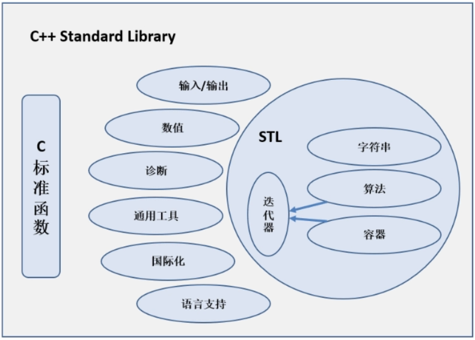

# C++

## 1. 简介

1979 - 1981: C with classes

从1982年开始，C++开始定位作为一个新的编程语言，使用编译技术重新实现了「带类的C」，对应的编译器为Cfront

1983年底，C++正式被命名。

```c++
#include <iostream>
using namespace std;
int main()
{
    cout << "Hello World" << endl;
    return 0;
}
```

转换后的C加上前缀C，没有扩展名，例如 `cstdio`, `cmath`，`ctype`等。

`#include <cstdio> ` : `cstdio` 源文件中还是 `#include <stdio.h> `

`\n ` 与 `endl` : 前者只换行，后者换行并 + `fflush(stdin)`(立即输出)

## 2. 与C

主存(main memory)也叫随机访问存储器RAM(Random Access Memory)

新的数据类型string。

```c++
// 1.强制以小数的方式显示
cout << fixed;
// 2.控制显示的小数的位数 <iomanip>
cout << cout.setprecision(2);
// 3.设置打印宽度 <iomanip> 默认右对齐
cout << left;
cout << setfill('_');
cout << setw(n) << 3.14;
// 可以打印出 'true' 'false'
cout << boolalpha;

int num;
char ch1, ch2;
cin >> num; // 可以一次输入13ab，然后程序执行成功，分开读取
cin >> ch1;
cin >> ch2;
```

文档注释 : `/** 文档注释 */`

## 3. vector

<font color="green">**数组**</font>

`int arr[n]` : n可以是变量，但在C语言中n必须是常量。

`int days[]{1, 15}`, `int days[100]{}` ：C++11

<font color="green">**vector**</font>

```c++
// 初始化
vector<int> vec; // 使用无参的构造函数创建一个空的vector容器。
vector<int> vec = {1, 2, 3, 4, 5}; // 使用初始化列表初始化
vector<int> vec(5); // 元素为 {0, 0, 0, 0, 0}
vector<int> vec(5, 10); // 元素为 {10, 10, 10, 10, 10}
vector<int> vec2(vec.begin(), vec.end()); // 初始化一个与vec具有相同元素的vector容器
vector<int> vec3(vec); // 复制一个与vec相同的vector容器

clear(); // 移除容器中的所有数据
empty(); // 判断容器是否为空
[index]、at(index) // 返回索引为index的元素
erase(pos); // 删除pos位置处的数据
erase(beg, end); // 删除[beg,end)区间的数据
front(); // 返回第一个元素
insert(pos, elem); // 在pos位置处插入一个元素
pop_back(); // 删除最后一个元素
push_back(elem); // 在容器末尾插入一个元素
resize(num); // 重新设置容器大小
```

```c++
// 遍历
vector<int> vec = {1, 2, 3, 4, 5};
for (size_t i = 0; i < vec.size(); i++) {
    cout << vec[i] << " ";
}

vector<int> vec = {1, 2, 3, 4, 5};
for (auto it = vec.begin(); it != vec.end(); ++it) {
    cout << *it << " ";
}

// C++11
vector<int> vec = {1, 2, 3, 4, 5};
for (const auto& num : vec) {
    cout << num << " ";
}

// 使用C++11中的范围-for循环，可以使用auto关键字自动推导数据类型：
vector<int> vec = {1, 2, 3, 4, 5};
for (auto num : vec) {
    cout << num << " ";
}

#include <iterator>
#include <algorithm>
copy(vec.cbegin(), vec.cend(), ostream_iterator<int>(cout, "分割符"));

// 排序 使用algorithm 中的 sort()
```

## 4. 指针

`nullptr` : 空指针，0；

```c++
// 引用 reference，只能指向变量，必须立即初始化
int int_value = 1024;
int& refValue = int_value; // int* const refValue = &int_value;
refValue = 10; // *refValue = 10;

const double& d = 12.3; // 常量引用
```

## 5. 动态内存

```c++
int * p = new int;
delete p; // 释放内存，重复释放报错，delete 空指针是安全的

int * intArray = new int[10];
delete [] intArray;
```

## 6. 函数

### 6.1 内置函数

STL和Boost C++



### 6.2 引用

数组在作为参数传递时实际上是退化为指针的。也就是说，数组名作为函数参数时，传递的是指向数组首元素的指针。因此，如果数组作为参数以引用的方式传递，实际上是指针的引用，而不是数组的引用。

* 不可以返回数组类型。
* 不要返回局部变量的引用。
* 返回引用时，要求函数参数中包含被返回的引用对象。

```c++
// 函数可以不返回值，默认返回传入的引用对象本身
int& sum(int& num1, int& num2)
{
    num1++;
    num2++; // 返回修改后的num2, 即默认返回最后一个更新的引用函数
}
int& sum(int& num1, int& num2)
{
    num1++;
    num2++;
    return num1 + num2; // 返回修改后的num1
}

// 返回值加const避免左值修改
const int& sum(int& num){}
sum(num) = 55; // 报错
```

### 6.3 参数

```c++
// 无名参数
void foo(int);

// 默认参数
void sample(int = 10);
void sample(int num)
{
    cout << num << endl;
}

int main()
{
    sample();
    sample(123);
}
// 1. 默认值可以在函数原型域定义中给出，不能在这两个位置同时出现
// 2. 对干带参数列表的函数，必须从右向左添加默认值
void test1(int a, int b = 5, int c = 10);
test(1);
test(1, 2);

// overloading
// 非引用类型和引用类型不能构成重载，报错。(重载决议 时不区分引用)
// const不构成重载
```

### 6.4 函数模板

Function Template

```c++
// 函数声明
template<typename T> void Swap(T&, T&);
template<typename T> // 模板头
void Swap(T &a, T &b)
{
    T temp = a;
    a = b;
    b = temp;
}
```

## 7. 对象

关键字class

* 默认成员是私有，(struct默认是共有)
* `::` : 作用域解析运算符。

hpp文件一般包含实现的内联函数,通常用于模板类这种声明与实现共存的情况。

建议: 只要不是纯模板，一律使用.h作为头文件后缀，使用.cpp文件作为函数的实现文件。

<font color="green">**访问修饰符**</font>

> public : 修饰的成员在任意地方都可以访问
>
> private : 修饰的成员只能够在类中或者友元函数中可以访问
>
> protected : 修饰的成员可以在类中函数、子类函数及友元函数中访问

<font color="green">**构造函数**</font>

> 名字跟类名相同。
>
> 没有返回值类型。
>
> 自定义了构造函数，系统就不会再自动生成默认构造。

<font color="green">**析构函数**</font>

> 对象过期时自动调用的特殊成员函数
>
> 析构函数一般用来完成清理工作
>
> 析构函数的名称是在类名前加上~
>
> 析构函数没有参数，只能有一个

<font color="green">**对象创建**</font>

```c++
Person person(); // X, 这是一个函数声明
Person person; // 隐式调用默认构造
Person person = Person(); // 显式调用默认构造
Person *pPerson = new Person();
Person *pPerson = new Person;

Person person2("name2", 27);// 会创建临时对象
Person person = Person("name1", 26); // 显示调用。创建一个临时对象，然后将临时对象复制到person中
Person *pPerson3 = new Person("name3", 8);// 不会创建临时对象
Person person = 25; // 当构造方法形参只有一个可以用等号，编译器自动调用构造

// C++11，列表初始化。只要提供的大括号列表中的数据与某个构造函数的参数列表匹配就可以。
Person person{};// 与默认构造函数相匹配
Person person = Person{};
Person *pPerson = new Person{};
Person person4 = {};

Person person{"name5", 26};
Person person5 = Person{"name5", 26};// c++11，会创建临时对象
Person *pPerson6 = new Person{"name6", 26};// c++11，不会创建临时对象
Person person4 = {"name4", 26};// c++11，会创建临时对象

// 拷贝构造函数
Person a;// 默认构造函数
Person b = a;// 拷贝构造函数
// 重载赋值运算符
```

<font color="green">**初始化参数列表**</font>

```c++

```

## 1. 运算符重载

对于内置数据类型不能实现运算符重载。

**加号运算符+**

```c++
Object operator+(Object &o)
{
    //语句
    return
}
```

**左移运算符<<**

```c++
ostream& operator<<(ostream &cout, Object &o)
{
    cout << "" << "";
    return cout;
}
```

**递增运算符++**

```c++
Object& operator++()
{
    //语句
    return
}
Object operator++(int) //后置递增，不要返回引用
{
    //语句
    return
}
```

**赋值运算符=**

```c++
new int(); // 返回的是 int *
Object& operator=(Object &o)
{
    //语句
    return *this;
}
```

**仿函数()**

```c++
void operation()(string test)
{

}
对象名("AAA"); // 调用
```

## 2. 文件操作

### 2.1 文本文件格式

文本以ASCII码的形式存储在计算机中。

```c++
#include <fstream> // 读写流
ofstream ofs;
ofs.open("文件路径", ios::out); // 写文件
ofs << "内容1" << endl;
ofs << "内容2" << endl;
ofs.close();
```

```c++
#include <fstream>
ifstream ifs
ifs.open("文件路径", ios::in);
if(ifs.is_open()){
    char buf[1024] = {0};
    // 第一种
    while (ifs >> buf){
        cout << buf << endl;
    }
    // 第二种
    while (ifs.getline(buf, sizeof(buf))){
        cout << buf << endl;
    }
    // 第三种
    string buf;
    while (getline(ifs, buf)){ 
        cout << buf << endl;
    }
    // 第四种
    char c;
    while ((c = ifs.get()) != EOF){ 
        cout << c;
    }
}
ifs.close();
```

### 2.2 二进制文件

二进制存储，无法读懂。

同理：只需要使用 `ofs.open("文件路径", ios::out | ios::binary);`

==========
