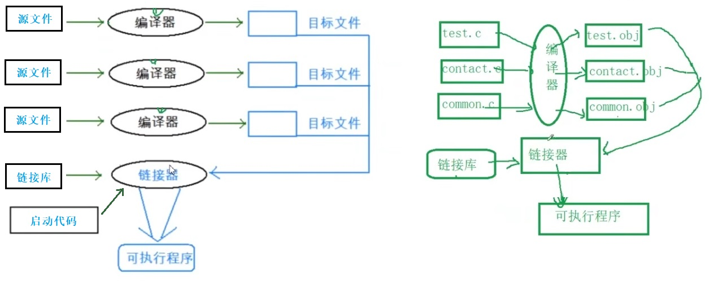

# C 语言

## 1. 简介

助记符，汇编语言。

计算机语言：人和计算机交流的语言。

1972年上线，面向过程，由B语言发展而来，贝尔实验室。

国际标准：C89/C90, C99, C11, C17

广泛应用于底层软件开发(OS, 驱动)。

```c
#include <stdio.h>
int main()
{
	printf("Hello World\n");
	return 0;
}
```

## 2. 数据类型

**基本类型，构造类型，指针类型，空类型。**

### 2.1 基本类型

| 内置类型	|长度(Byte)      |
| --------- | ---- |
| char       | 1，'\0' 空字符，ASCII 码为0 |
| short | 2 |
| int  | 4 |
| long      | 4 (C语言标准：sizeof(long)>=sizeof(int) 就可以了) |
| long long (C99) | 8 |
| float     | 4, 定义: `1.0f`，1位用于表示符号位（正负号），8位用于表示指数部分，剩余的23位用于表示尾数部分。6~7位有效数字。 |
| double    | 8, 11位表示指数，2的52次方，16位有效数字。 |
| long double | 8 |
| _Complex (C99) | 复数数据类型。表示具有实部和虚部的复数数值 |
| _Bool (C99) | 1, C99中需要引入<stdbool.h>, C11是关键字 |

正整数：原码，反码，补码相同。

负整数：

>原码：最高位是1.
>
>反码：原码符号位不变，其他位取反。
>
>补码：反码+1. (内存中存放的是补码)

小端字节序:

把数据的低位字节序的内容存放在低地址处，高位字节序的内容存放在高地址处。

大端字节序:

把数据的低位字节序的内容存放在高地址处，高位字节序的内容存放在低地址处。

| 开头   |          |
| ------ | -------- |
| 0b或0B | 二进制   |
| 0      | 八进制   |
| 0x或0X | 十六进制 |

### 2.2 构造类型

#### 2.2.1 数组

`int arr[5]`: 创建。

`int arr[] = {1, 2, 3, 4, 5}`: 完全初始化。五个元素。

`int arr[10] = {1, 2, 3, 4, 5}`: 不完全初始化，剩余默认为0.

数组名是数组首元素的地址，可以认为是指针。`&arr` 是数组的地址。 `&arr[index]` 取数组中元素的地址。

二维数组数组名是数组首行的地址，作为参数需要数组指针接收，数组大小等于列。

> 例外：
>
> sizeof(数组名) ：数组名表示整个数组。
>
> &数组名 ： 数组名表示整个数组。所以，(arr + 1) = 下一个元素地址; (&arr + 1) = 增加sizeof(数组名) 。

数组 arr 做传参仅仅传递数组首元素地址(数组长度可写可不写),  所以数组做形参不代表数组。

`int sz = sizeof(arr)/sizeof(arr[0]);`： 求数组大小。(arr不能是形参)

`int arr[3][4] = {1,2,3,4,5,6,7,8,9,10,11,12};` : 自动三行四列。

`int arr[][4] = {{1,2},{3,4},{4,5}};` : 不完全初始化。// 行(3)可以省略，列(4)不行。

```c
// 可能程序死循环 
#include <stdio.h>
int main()
{
	int i=0;
    int arr[] = {1,2,3,4,5,6,7,8,9,10};
    for(i=0;i<12;i++)
    {
    	arr[i] = 0; // arr[11] 地址 = i地址
        printf("Hello World\n");   
    }
	return 0;    
}
```

#### 2.2.2 结构体

<font color=blue>**== 定义结构体变量三种方式 ==**</font>

```c
// 1、先定义结构体类型，再定义结构体变量
struct Stu
{
    char name[20];
    int age;
    struct Stu * next; // 结构体自引用
}
struct Stu s = { "zs" , 20}; // 定义并初始化
s.name;
struct Stu * sp = &s;
sp -> name;

// 2、定义结构体类型的同时定义结构体变量
struct Stu
{
    char name[20];
    int age;
}stu1,stu2; // 全局变量

// 3、直接定义结构体变量 (匿名结构体类型)
struct
{
    char name[20];
    int age;
}stu1,stu2;
```

<font color=blue>**== 结构体内存对齐 ==**</font>

1. 第一个成员在与结构体变量偏移量为0的地址处
2. 其他成员变量要对齐到某个数字 (**该成员自身对齐数**) 的整数倍的地址处
3. **对齐数** = 编译器默认的一个对齐数 与 该成员大小的较小值
4. VS中默认的值为8 (Linux - 没有默认对齐数的概念)
5. 结构体总大小为最大对齐数 (每个成员变量都有一个对齐数) 的整数倍
6. 如果嵌套了结构体的情况，嵌套的结构体对齐到自己的最大对齐数的整数倍处，结构体的整体大小就是所有最大对齐数(含嵌套结构体的对齐数)的整数倍

````C
struct S
{
    char c1; // 对齐数 1 (成员大小 1, VS默认对齐数8，所以是1) (偏移量 0)
    int i;	 // 对齐数 4 (成员大小 4, VS默认对齐数8，所以是4) (偏移量 4)
    char c2; // 对齐数 1 (成员大小 1, VS默认对齐数8，所以是1) (偏移量 8)
} // 结构体大小：4 * 3 = 12
````

 **NOTE:** 为什么存在内存对齐?

1. 平台原因(移植原因):不是所有的硬件平台都能访问任意地址上的任意数据的，某些硬件平台只能在某些地址处取某些特定类型的数据，否则抛出硬件异常。
2. 性能原因:数据结构(尤其是栈)应该尽可能地在自然边界上对齐。原因在于，为了访问未对齐的内存，处理器需要作两次内存访问;而对齐的内存访问仅需要一次访问。
3. 总体来说：结构体的内存对齐是拿空间来换取时间的做法。

```c
#pragma pack(2) // 修改默认对齐数为2
#include <seddef> // offsetof() 计算偏移量

```

#### 2.2.3 联合体

联合也是一种特殊的自定义类型。

这种类型定义的变量也包含一系列的成员，特征是这些成员公用同一块空间 (所以联合也叫共用体)。

```c
union Un
{
    char c; // 1 字节
    int i; // 4 字节
};
union Un u; //  依旧 4 字节
```

联合的大小至少是最大成员的大小。

当最大成员大小不是最大对齐数的整数倍的时候，就要对齐到最大对齐数的整数倍。

####  2.2.4 枚举

```c
enum Sex					enum Sex
{							{
	MALE,		or				MALE = 3,
    FEMALE						FEMALE
}							}
// 每个值默认从0开始, 一次递增1
enum Sex s = MALE;
```

### 2.3 指针

编号 == 地址 == 指针

指针是一个值为内存地址的变量。

大小：

1. 所有类型指针大小相同。32位是4字节，64位8字节。
2. 不同类型指针决定了：解引用的权限有多大。
3. 不同类型指针决定了：指针+1跳过的字节数量 (步长)。

>void * : 就是指向任何类型的指针，在编译的时候不会确定其指向的类型，是在程序中进行指向的
>
>void*仅仅包含地址信息。int *不仅仅包含地址信息，还包含类型信息。但，void\* 的值和int\*的值相等。
>
>由于`void*`没有具体的类型信息，所以无法直接对其解引用。为了对 void\* 指针进行解引用，你需要将其转换为具体的指针类型。例如，如果你有一个 void\* 指针指向一个整数，你可以将其转换为整型指针，并通过解引用操作符*来获取该整数的值。`int* p = (int*)malloc(10*sizeof(int));`

野指针：

1. 指针没有初始化。
2. 指针越界。
3. 指针指向的空间已经被释放。

`int * const p;` ： 指针常量，不能修改地址。

`const int *p;` ： 常量指针，不能修改值。

```c
#define INT_PTR int*
typedef int* int_ptr;
INT_PTR a,b; // int*p1,p2;int *p1, *p2; 只有b不是指针类型。
int_ptr c,d;
```

<font color=blue>**== 指针运算 ==**</font>

指针类型决定了指针的运算。

`指针-指针 = 指针之间的元素个数` ：前提是在同一片内存中。

p[2] == *(p+2)

**NOTE:** 允许指向数组元素的指针与指向数组最后一个元素后面的那个内存位置的指针比较，但是不允许与指向第一个元素之前的那个内存位置的指针进行比较。

<font color=blue>**== 指针类型 ==**</font>

**指针数组：**存放指针的数组

`int * parr[5];` ：存放五个指针。

**数组指针：** 指向数组的指针

`int (*parr)[10] = &arr;` : 指针`parr`指向有十个元素的数组，数组元素类型是int.

`int (*parr[10])[5];` ：有十个元素的数组, 每个元素类型是`int (*)[5]` （数组指针数组）

**函数指针：** 

`void (*p)(int,int) = &方法名/方法名`  : 调用的时候可以 (*p)(3, 5);或者p(3, 5);

```java
//代码1
(*(void (*)())0)(); // void (*)() - 函数指针类型
//代码2
void (*signal(int, void(*)(int)))(int);
//1. signal 和()先结合，说明signal是函数名
//2. signal函数的第一个参数的类型是int，第二个参数的类型是函数指针，该函数指针，指向一个参数为int，返回类型是void的函数
//3. siqnal函数的返回类型也是一个函数指针，该函数指针，指向一个参数为int，返回类型是void的函数
// signal是一个函数的声明 
//4. 等于 void(*) (int) signal(int, void(*) (int))，但该写法语法不支持。
//typedef - 对类型进行重定义
typedef void(*pfun_t) (int); //对void(*) (int)的函数指针类型重命名为pfun_t
typedef unsigned int uint;
pfun_t signal(int, pfun t);
```

**函数指针数组：** 存放函数指针的数组

`void (*p[2])(int,int) = {方法名1, 方法名2}`  : 去掉`p[2]` 就是数组中元素类型。

```c
// 应用：这样的功能的语句称为转移表
int (*pfArr[5]) (int, int) = { NULL, Add, Sub, Mul, Div };
int x = 0;
int y = 0;
int ret = 0;
printf("请选择:>");
scanf("%d", &input); 
printf("请输入2个操作数>:");
scanf("%d %d", &x, &y);
ret = (pfArr[input])(x, y); 
printf("ret = %d\n", ret);
```

**函数指针数组的指针：**

`void (* (*p)[2])(int, int)`:`(*p)` 代表是个指针，指向`[2]`数组，数组中每个元素`void (*)(int, int)`

**Note** : 数组去掉名字就是数据类型。

### 2.4 空类型

void

## 3. 变量与常量

### 3.1 变量

只能数字字母下划线，不能数字开头。不能是保留字/关键字。

命令方式：单词之间下划线或者驼峰命名法。

|          | 局部变量         | 全局变量                                                   |
| -------- | ---------------- | ---------------------------------------------------------- |
| 位置     | 在大括号内部     | 在大括号外部                                               |
| 作用域   | 变量所在局部范围 | 整个工程 （使用时需要声明外部文件定义的extern int g_val;） |
| 生命周期 | 作用域内         | 作用域内（程序的生命周期）                                 |
| 未初始化 | 随机值           | 默认值                                                     |
| 内存     | 栈中先高地址后低 |                                                            |

### 3.2 常量

| 分类       |                                                              |
| ---------- | ------------------------------------------------------------ |
| 字面常量   | 3.14，10 ，‘a’， ”hello“                                     |
| 常变量     | const 修饰的                                                 |
| 标识符常量 | define是一个预处理指令 <br />#define MAX 1000. 定义了一个常量<br />#define ADD(X,Y) X+Y .定义了宏 (宏就是替换) 4\*ADD(2, 3) = 4\*2 + 3 |
| 枚举常量   |                                                              |

`const`： 使用const定义的常量在编译时就确定了其值，不会被修改，因此编译器可以将常量存储在只读内存区域，避免了在运行时分配内存。 从而 --》节省了内存空间，提高了访问效率，增强了代码可读性。

## 4. 字符串

### 4.1 定义

双引号。

> 隐式最后一个字符是`\0`, 这是字符串的结束标志。
>
> 是常量字符串，不能被修改。
>
> > `char arr[] = “hello”;` : 可以修改元素字符。
> >
> > `char * arr = “hello” ` :不可以修改元素字符。
>
> 存放在静态区，只会被存储一次。

```c
char arr[] = “hello”;
char arr[] = {'a', 'b' ,'c', '\0'};
char arr[5] = { 0 }; // 0 跟 '\0'在大多数情况下是等价的，均表示ASCII字符编码中的空字符。
```

`??)` : 三字母词，等于 ]

`\a` : 响铃

`\123` : 跟一至三个八进制数字

`\x12`: 跟两个十六进制数字

### 4.2 库函数

```c
#include <string.h>

char arr1[] = "bit";
char arr2[] = {'b', 'i', 't'};

// size_t strlen(const char * str); 遇到\0才停止。
int len = strlen("abc"); 	// 3。
int len = strlen(arr1); 	// 3。
int len = strlen(arr2); 	// 随机值
int size = sizeof("abc"); 	// 4。
int size = sizeof(arr1); 	// 4。
int size = sizeof(arr2); 	// 3。

char * strcpy(char * destination, const char * source);

// 追加，返回目标空间起始地址。
char * strcat(char * destination, const char * source);

// 按位比较字符ASCII码值, 返回 <0,0,>0
int strcmp(const char * str1, const char * str2);

// 指定copy字符个数。source不够的字符都用'\0'复制过去。
char * strncpy(char * destination, const char * source, size_t num);

// 追加，返回目标空间起始地址。source不够的按最大数量追加过去。
char * strncat(char * destination, const char * source, size_t num);

// 比较前n位字符ASCII码值, 返回 <0,0,>0
int strncmp(const char * str1, const char * str2, size_t num);

// str1是否包含str2
char * strstr(const char * str1, const char * str2);

// 返回错误码所对应的错误信息。
char * strerror( int errnum );
#include <errno.h>
printf("%s\n", strerror(errno)); // 有错误发生放在全局错误码中
#include <cstdio.h>
void perror(const char * str); // str + : + strerror(errno)
perror("fopen"); // fopen: No such file or directory

/*
 * sep参数是个字符串，定义了用作分隔符的字符集合
 * 会修改原str，建议重新copy一份操作
 *
 * 找到str中的下一个标记，并将其用\0 结尾，返回一个指向这个标记的指针。
 * 第一个参数不为NULL，函数将找到str中第一个标记，strtok函数将保存它在字符串中的位置
 * 第一个参数为 NULL，函数将在同一个字符串中被保存的位置开始，查找下一个标记。
 * 如果字符串中不存在更多的标记，则返回 NULL 指针。
 */
char * strtok(char * str, const char * sep);
```

## 5. 常见关键字

| 关键字            |                                                              |
| ----------------- | ------------------------------------------------------------ |
| auto              | 局部变量默认都是用auto修饰的. 自动创建自动销毁。C11中，被重新定义为用于自动类型推断的关键字，而不再是用于指定变量的存储类别。 |
| extern            | 用来声明外部符号的。                                         |
| register          | 建议将该值存放到寄存器中。                                   |
| typedef 原名 新名 | 类型重定义                                                   |
| static            | 修饰局部变量，只初始化一次，方法结束不销毁。<br />修饰全局变量，只能在自己所在源文件使用，切断外部链接。<br />修饰函数，只能在自己所在源文件使用，切断外部链接。 |
| const             |                                                              |

```c
typedef struct Person{
    int age;
    char name[20];
} Per;
Per p;
```


## 6. 位段

位段的声明和结构是类似的，有两个不同:

1.位段的成员必须是int、unsigned int 或signed int (char 因为也是整型家族)。

2.位段的成员名后边有一个冒号和一个数字。

3.位段是不跨平台的，不建议使用。(有没有符号不确定, 最大位数目不确定，内存从左到右还是从右到左不确定，两个位段内存冲突时如何舍弃不确定。

```c
struct A
{
    // 一次开辟四个字节 - 32bit
    int _a:2; //_a 成员占2个bit位
    int _b:5;
    int _c:10;
    // 再开辟四个字节 - 32bit
    int _d:30;
}
```

## 7. 流程控制

1. if 语句

```c
if (condition1) {
    // 条件1满足时执行的语句块
} else if (condition2) {
    // 条件1不满足，条件2满足时执行的语句块
} else {
    // 所有条件都不满足时执行的语句块
}
```

2. switch （整型或者字符）

   ```c
   int input = 0;
   switch (input) {
   case 1:
       break; // 没有break会"case穿透"
   case 2:
       break;
   default: // 可以不需要，可以变换顺序
   	break;        
   }
   ```

3. 循环 （可以用break，continue结束循环）

   1. while
   2. do while
   3. for 

4. goto: 别用。不能跨函数跳转。

```c
while (条件) {
    // 循环体，满足条件时要执行的语句
}

do {
    // 循环体语句
} while (条件);

// for
int i;
for (i = 0; i < 10; i++) {
    printf("%d ", i);
}

flag:
	goto flag;

int main()
{
    int ch = 0;
    // windows下，在输入的空行位置，按ctrl+z可产生EOF。Linux下，按ctrl+d可产生EOF
    while((ch = getchar()) != EOF) 
        putchar(ch); // 在终端输出
    retrun 0;
}
```

## 8. 柔性数组

柔性数组 (flexible array) , C99 中，结构中的最后一个元素允许是未知大小的数组，这就叫做[柔性数组]成员。

```c
struct S
{
    int n;
    int arr[0]; //大小是未知
}
//期望arr的大小是10个整型
struct S *ps = (struct S*)malloc(sizeof(struct S)+10*sizeof(int));
```

* 结构中的柔性数组成员前面必须至少一个其他成员。
* sizeof 返回的这种结构大小不包括柔性数组的内存。
* 包含柔性数组成员的结构用malloc()函数进行内存的动态分配，并且分配的内存应该大于结构的大小，以适应柔性数组的预期大小。

## 9. 函数

### 9.1 函数分类

<font color="#4169E1">**==库函数==**</font>

网站：www.cplusplus.com/reference, http://en.cppreference.com

SDK: MSDN

<font color="#4169E1">**==自定义函数==**</font>

不写返回值类型默认为int。

可以在方法里函数声明。

数组名作为参数传递的时候传递的是地址。二维数组传参可以省略行不能省略列。

### 9.2 库函数

#### 9.2.1 qsort()

```c
struct Stu
{
	char name[20];
	int age;
}
int sort_by_age(const void* e1, const void* e2)
{
    // 升序
    return ((struct Stu*)e1)->age - ((struct Stu*)e2)->age;
}
void test2()
{
    struct Stu s[3] = { {"zhangsan", 30}, {"lisi"，34), {"wangwu", 20) } };
    int sz = sizeof(s) / sizeof(s[0]);
    //按照年龄来排序
    qsort(s, sz, sizeof(s[0]), sort_by_age);
}
```

#### 9.2.2 printf()

```c
#include <stdio.h>
int printf(const char *format [, argument]...);
printf("Hello World");
printf("%d\n", sizeof(a));
%d 		// 十进制整数
%x		// 十六进制
%2d 	// 不够左边用空格填充
%-2d	// 不够右边用空格填充
%f		// float
%.2f 	// 输出一个精确到小数点后两位的浮点数。
%lf		// double
%c		// 字符
%s		// 字符串
%p		// 地址
%u		// 无符号整型。

int sprintf(char *buffer, const char *format [, argument] ...);
// 把一个格式化的数据，转换成字符串
struct S s = {"hello", 20, 5.5f };
char buf[100] = { 0 };
sprintf(buf, "%s %d %f", s.arr, s.age, s.f);
printf("%s\n", buf);
```

#### 9.2.3 scanf()

```c
int scanf(const char *format [,argument]..);
scanf(“%d %d”, &a, &b); //  输入函数，scanf_s是VS自带的。不能读空格。
int sscanf(const char *buffer, const char *format [, argument ] ...);
// 从buf字符串中还原出一个结构体数据
struct S tmp = { 0 };
sscanf(buf, "%s %d %f", tmp.arr, &(tmp.age), &(tmp.f));
printf("%s %d %f\n", tmp.arr, tmp.age, tmp.f);

scanf 针对标准输入的格式化的输入语句 - stdin
fscanf 针对所有输入流的格式化的输入语句-stdin/文件
sscanf 从一个字符串中读取一个格式化的数据
printf 针对标准输出的格式化输出语句 - stdout
fprintf 针对所有输出流的格式化输出语句- stdout/文件
sprintf 把一个格式化的数据，转换成字符串
```

#### 9.2.4 其他

```c
#include <math.h>
double pow(double x, double y); // x是底数，y是指数

//////
#include <stdlib.h>
#include <time.h>
// 使用系统时间作为种子
srand(time(NULL));
for(int i = 0; i < 5; i++) {
    printf("%d\n", rand());
}

//////
#include <ctype.h>
int isdigit(int c); // 如果是数字字符返回非0的值，如果不是数字字符，返回0
int tolower(int c);
int toupper(int c);
```

### 9.3 内联函数

内联函数是一种对编译器的请求，用于将函数内容直接插入到调用点处，而不是通过函数调用的方式执行. (C99)

```c
inline int max(int a, int b)
{
}
```

## 10. 内存

https://www.stackoverflow.com 

```c
// num： 字节个数 (copy数组)
void * memcpy (void * destination, const void * source, size_t num);

/* copy和被copy是同一数组重叠部分的时候，可以做到不被覆盖 */
void * memmove (void * destination, const void * source, size_t num);

/* 返回 <0 >0 =0 */
int memcmp (const void * arr1, const void * arr2, size_t num);

/*
 * 以字节为单位设置内存
 * Sets the first num bytes of the block of memory pointed by ptr to the specified value 
 */
void * memset (void * ptr, int value, size_t num)
```

### 10.1 动态内存分配

```c
#include <stdlib.h>
int arr[10]; // 栈区
void *malloc(size_t size); // size：总字节数
int* p = (int*)malloc(10*sizeof(int)); // 强制类型转换一下。
free(p); // 回收空间。未释放，内存泄漏。
p = NULL; // NUll 存在于<stdio.h>
```

* 这个函数向内存申请一块连续可用的空间，并返回指向这块空间的指针。
  * 如果开辟成功，则返回一个指向开辟好空间的指针。
  * 如果开辟失败，则返回一个NULL指针，因此malloc的返回值一定要做检查
  * 返回值的类型是 void*，所以malloc函数并不知道开辟空间的类型，具体在使用的时候使用者自己来决定。
  * 如果参数size为0，malloc的行为是标准是未定义的，取决于编译器

```c
int a=10;
int *p = &a;
free(p); // error
```

* free函数用来释放动态开辟的内存。
  * 如果参数 ptr 指向的空间不是动态开辟的，那free函数的行为是未定义的
  * 如果参数 ptr 是NULL指针，则函数什么事都不做。
  * 重复free：error

```c
void * calloc (size_t num, size_t size);// num：个数， size：字节数
// 会初始化分配后的内存中的默认值。

void * realloc (void * memblock, size_t size);// memblock：原先开辟的内存， size：新总字节数
// 这个函数调整原内存空间大小的基础上，还会将原来内存中的数据移动到新的空间
// memblock 可以为空，类似malloc
```

### 10.2 内存分布


1. 栈区(stack): 在执行函数时，函数内局部变量的存储单元都可以在栈上创建，函数执行结束时这些存储单元自动被释放。栈内存分配运算内置于处理器的指令集中，效率很高，但是分配的内存容量有限。 栈区主要存放运行函数而分配的局部变量、函数参数、返回数据、返回地址等。
2. 堆区 (heap): 一般由程序员分配释放，若程序员不释放，程序结束时可能由OS回收。分配方式类似于链表。
3. 数据段 (静态区)(static)存放全局变量、静态数据。程序结束后由系统释放
4. 代码段:存放函数体(类成员函数和全局函数)的二进制代码。

| 栈区                                                         | 堆区           | 静态区                         |
| ------------------------------------------------------------ | -------------- | ------------------------------ |
| 局部变量，函数形参，返回值                                   | 动态内存分配的 | 全局变量，静态变量, 字符串常量 |
| 每次调用方法开辟栈帧空间                                     |                |                                |
| 局部变量在栈中大端存储。<br />数组地址是随index由低到高变化。 |                |                                |
| 方法结束局部变量内存收回。                                   |                |                                |

## 11. 操作符

<font color=blue>**1. 算术操作符**</font>

`+ - * / %`

<font color=blue>**2. 移位操作符**</font>

`<< >>` 内存中存放的是补码。

左移：左边丢弃，右边补0.

右移：右边丢弃，左边补原符号位.

不会改变原变量值。

<font color=blue>**3. 位操作符**</font>

`&` : 二进制每一对应位都1为1。

`|` : 二进制每一对应位有1为1。

`^` : 二进制每一对应位不同为1。

只能是两个整数进行运算。

<font color=blue>**4. 赋值操作符**</font>

复合赋值符: `+= >>==`

<font color=blue>**5. 单目操作符**</font>

`!` : 逻辑反。

`-` : 负值。`+` : 正值 。

`sizeof` : 可以 `sizeof(a), sizeof(int), sizeof a` , 返回int类型，单位是字节。`sizeof(中的表达式不参与运算)`

`&` : 取地址。 

`~` : 对一个数的补码的二进制位取反。 

`--` : 前置或后置。

`++` : 前置或后置。

`*` : 间接访问操作符。

`(类型)` : 强制类型转换。

<font color=blue>**6. 关系操作符**</font>

`>=, <=, !=, ==`

`-1 > sizeof(int)` : 先将-1转成无符号整型(超级大)。

<font color=blue>**7. 逻辑操作符**</font>

`&&, ||`

<font color=blue>**8. 条件操作符**</font>

也叫三目操作符。`b = a > 5 ? 1: -1`

<font color=blue>**逗号表达式**</font>

`, ` : 逗号操作符，从左向右依次执行，赋值时会使用最后一个表达式的值。

<font color=blue>**9. 下标引用操作符**</font>

`[]` : 数组访问元素时使用。可以arr[2], 也可以2[arr]。

<font color=blue>**10. 函数调用操作符**</font>

`()` : 

<font color=blue>**11. 结构成员访问操作符**</font>

`.` : 

`->` : 

## 12. sizeof 详解

```c
// sizeof 详解
int a[] = { 1,2,3,4 };
printf("%d\n", sizeof(a));				// 16
printf("%d\n", sizeof(a + 0));			// 4 or 8
printf("%d\n", sizeof(*a));				// 4
printf("%d\n", sizeof(a + 1));			// 4 or 8
printf("%d\n", sizeof(a[1]));			// 4

printf("%d\n", sizeof(&a));				// 4 or 8
printf("%d\n", sizeof(*&a));			// 16 [*& 抵消了]
printf("%d\n", sizeof(&a + 1));			// 4 or 8
printf("%d\n", sizeof(&a[0]));			// 4 or 8
printf("%d n", sizeof(&a[0] + 1));		// 4 or 8

char arr[] = {'a','b','c','d','e','f'};
printf("%d\n", sizeof(arr)); 			// 6
printf("%d\n", sizeof(arr + 0));		// 4 or 8
printf("%d\n", sizeof(*arr));			// 1
printf("%d\n", sizeof(arr[1]));			// 1
printf("%d\n", sizeof(&arr));			// 4 or 8
printf("%d\n", sizeof(&arr + 1));		// 4 or 8
printf("%d\n", sizeof(&arr[0] + 1));	// 4 or 8

printf("%d\n", strlen(arr)); 			// 随机值
printf("%d\n", strlen(arr + 0));		// 随机值
printf("%d\n", strlen(*arr));			// error
printf("%d\n", strlen(arr[1]));			// error
printf("%d\n", strlen(&arr));			// 随机值
printf("%d\n", strlen(&arr + 1));		// 随机值 - 6
printf("%d\n", strlen(&arr[0] + 1));	// 随机值 - 1

char arr[] = "abcdef";					// 0 就是 \0
printf("%d\n", sizeof(arr)); 			// 7
printf("%d\n", sizeof(arr + 0));		// 4 or 8
printf("%d\n", sizeof(*arr));			// 1
printf("%d\n", sizeof(arr[1]));			// 1
printf("%d\n", sizeof(&arr));			// 4 or 8 char(*)[7]
printf("%d\n", sizeof(&arr + 1));		// 4 or 8
printf("%d\n", sizeof(&arr[0] + 1));	// 4 or 8

printf("%d\n", strlen(arr)); 			// 6
printf("%d\n", strlen(arr + 0));		// 6
printf("%d\n", strlen(*arr));			// error
printf("%d\n", strlen(arr[1]));			// error
printf("%d\n", strlen(&arr));			// 6
printf("%d\n", strlen(&arr + 1));		// 随机值 
printf("%d\n", strlen(&arr[0] + 1));	// 5

char* p = "abcdef";
printf("%d\n", sizeof(p));				// 4 or 8
printf("%d\n", sizeof(p + 1));			// 4 or 8
printf("%d\n", sizeof(*p));				// 1
printf("%d\n", sizeof(p[0]));			// 1 == *(p+0)
printf("%d\n", sizeof(&p));				// 4 or 8
printf("%d\n", sizeof(&p + 1));			// 4 or 8
printf("%d\n", sizeof(&p[0] + 1));		// 4 or 8

printf("%d\n", strlen(p));				// 6
printf("%d\n", strlen(p + 1));			// 5
printf("%d\n", strlen(*p));				// error
printf("%d\n", strlen(p[0]));			// error
printf("%d\n", strlen(&p));				// 随机值
printf("%d\n", strlen(&p + 1));			// 随机值
printf("%d\n", strlen(&p[0] + 1));		// 5

// 二维数组
int a[3][4] ={ 0 };
printf("%d\n", sizeof(a));				// 48
printf("%d\n", sizeof(a[0][0]));		// 4
printf("%d\n", sizeof(a[0]));			// 16
printf("%d\n", sizeof(a[0] + 1));		// 4 第一行第二个元素地址
printf("%d\n", sizeof(*(a[0] + 1)));	// 4
printf("%d\n", sizeof(a + 1));			// 4 第二行地址
printf("%d\n", sizeof(*(a + 1)));		// 16
printf("%d\n", sizeof(&a[0] + 1));		// 4 第二行地址
printf("%d\n", sizeof(*(&a[0] + 1)));	// 16
printf("%d\n", sizeof(*a));				// 16 第一行地址 *(a+0) -> a[0]
printf("%d\n", sizeof(a[3]));			// 16
```

## 13. 文件

### 13.1 读写

字符一律以ASCII形式存储，数值型数据既可以用ASCII形式存储，也可以使用二进制形式存储。

**程序文件**

* 包括源程序文件 (后缀为.c)
* 目标文件 (windows环境后缀为.obi),
* 可执行程序 (windows环境后缀为.exe)。

**数据文件**

```c
#include <stdio.h>
FILE * pf;	//文件指针变量
/**
 * 打开文件
 *
 * @param filename
 * @param mode
 * @return 打开文件失败返回NULL, perror("fopen");
 */
FILE * fopen(const char * filename, const char * mode);

//关闭文件
int fclose(FILE * stream)

//写文件
fputc(int c, FILE * stream)
fputc('b', pf);
fputc('b', stdout); // 往dos写。

fputs(const char *string, FILE * stream)
fputs("abcdef\n", pf);

int fprintf(FILE *stream,const char *format [, argument ]...);
struct S s = {"abcdef", 10, 5.5f };
fprintf(pf, "%s %d %f", s.arr, s.num, s.sc);

// 二进制 写
size_t fwrite(const void *buffer, size_t size, size_t count, FILE *stream);
fwrite(&s, sizeof(struct S), 1, pf);

//读文件
int fgetc(FILE * stream) // 失败或者文件结束返回EOF
int ret = fgetc(pf); // EOF == -1
char arr[10] = { 0 };

char *fgets(char *string, int n, FILE *stream); // n包括末尾的\0
char buffer[4];
fgets(buffer, 4, pf);
printf("%s\n", arr);
while (fgets(buffer, 4, pf) != NULL) { // 读取到文件末尾返回的 NULL
    printf("%s", buffer);
}

int fscanf(FILE *stream, const char *format [, argument ]...);
fscanf(pf, "%s %d %f", s.arr, &(s.num), &(s.sc));

// 二进制 读
size_t fread(void *buffer, size_t size, size_t count, FILE *stream);
struct S s = {0};
fread(&s, sizeof(struct s), 1, pf); // 返回实际读到的个数。
printf("%s %d %f\n", s.arr, s.num, s.sc);

while (fread(&s, sizeof(S), 1, pf)) // 读取多个的时候
{

}
```

| 文件使用方式 | 含义                                     | 如果指定文件不存在 |
| ------------ | ---------------------------------------- | ------------------ |
| “r”(只读)| 为了输入数据，打开一个已经存在的文本文件 | 出错               |
| “w”(只写) | 为了输出数据，打开一个文本文件(不操作原内容也消失) | 建立一个新的文件   |
| “a”(追加)    | 向文本文件尾添加数据                     | 建立一个新的文件   |
| “rb”“wb”“ab" | 二进制读写         |                |
| “r+”(读写)   | 为了读和写，打开一个文本文件             | 出错               |
| “w+”(读写)   | 为了读和写，建立一个新的文件             | 建立一个新的文件   |
| “a+”(读写)   | 打开一个文件，在文件尾进行读写           | 建立一个新的文件   |
| “rb+”“wb+”“ab+” | 二进制读写        |                |

| 功能           | 函数名                      | 返回值                   | 适用于     |
| -------------- | --------------------------- | ---------- | ---------- |
| 字符输入函数   | fgetc | 字符的ASCII码值，结束时EOF | 所有输入流 |
| 字符输出函数| fputc | 存放字符串的空间起始地址，结束时NULL | 所有输出流 |
| 文本行输入函数 | fgets | 读取到文件末尾返回的 NULL | 所有输入流 |
| 文本行输出函数 | fputs | ==EOF表示写入失败 | 所有输出流 |
| 格式化输入函数 | fscanf                      |                       | 所有输入流 |
| 格式化输出函数 | fprintf                     |                      | 所有输出流 |
| 二进制输入     | fread                       | 如果发现读取到的完整的元素的个数小于指定的元素个数，这就是最后一次读取了. | 文件       |
| 二进制输出     | fwrite                      |                       | 文件       |

**流**

```c
stdin - 标准输入流 - 键盘
stdout - 标准输出流 - 屏幕
stderr - 标准输出流 - 屏幕
```

### 13.2 随机读写

```c
int fseek(FILE *stream, long offset, int origin);
fseek(pf, -1, SEEK_CUR); // 从当前位置开始。SEEK_END, SEEK_SET:开始位置

long int ftell (FILE * stream); // 返回文件偏移量

void rewind(FILE * stream); // 让文件指针的位置回到文件的起始位置
```

**Sample Code**

```c
#include <stdio.h>
#include <stdlib.h>
int main(void)
{
    int c; // 注意: int，非char，要求处理EOF
    FILE* fp = fopen("test.txt","r");
    if(!fp) {
        perror("File opening failed");
        return EXIT_FAILURE; // 是一个约定俗成的常量，表示失败的退出状态码
    }
	// fgetc 当读取失败的时候或者遇到文件结束的时候，都会返回EOF
    while ((c = fgetc(fp)) != EOF) // 标准C I/0读取文件循环
    {
        putchar(c);
    }
    // 判断是什么原因结束的
    if (ferror(fp))
        puts("I/o error when reading"); // puts方法只能用于打印字符串
    else if (feof(fp))
        puts("End of file reached successfully") ;
    fclose(fp);
}

enum { SIZE = 5 };
int main(void)
{
    double a[SIZE] = {1.,2.,3.,4.,5.};
    FILE *fp = fopen("test.bin",，"wb"); // 必须用二进制模式
    fwrite(a, sizeof *a,SIZE,fp); // 写 double 的数组
    fclose(fp);
    
    double b[SIZE];
    fp = fopen("test.bin" ,"rb");
    size_t ret_code = fread(b,sizeof *b,SIZE,fp); // 读 double 的数组
    if(ret_code == sIZE) {
        puts("Array read successfu11y,  contents: ");
        for(int n = 0; n < SIZE; ++n)
            printf("%f", b[n]);
        putchar('\n');
    } else { // error handling
        if (feof(fp))
            printf("Error reading test.bin: unexpected end of file\n");
        else if (ferror(fp))
            perror("Error reading test.bin");
	}
    fclose(fp);
}
```

**缓冲区**

ASCII 标准采用“缓冲文件系统”处理的数据文件的，所谓缓冲文件系统是指系统自动地在内存中为程序中每一个正在使用的文件开辟一块“文件缓冲区”。从内存向磁盘输出数据会先送到内存中的缓冲区，装满缓冲区后才一起送到磁盘上。如果从磁盘向计算机读入数据，则从磁盘文件中读取数据输入到内存缓冲区(充满缓冲区)，然后再从缓冲区逐个地将数据送到程序数据区(程序变量等)。缓冲区的大小根据C编译系统决定的。

`fflush(pf);`

## 14. 程序环境

在ANSI C的任何一种实现中，存在两个不同的环境。

* 第1种是翻译环境，在这个环境中源代码被转换为可执行的机器指令 (生成解决方案)
* 第2种是执行环境，它用于实际执行代码




Linux下： `gcc test.c` 默认生成一个a.out - 可执行程序

> Linux: 		gcc hello.c -o hello
>
> Windows: gcc hello.c -o hello.exe

```shell
# 预处理 完之后停下来, 预处理之后产生的结果放在test.i文件中
gcc -E test.c
# 都是处理一些文件操作
# 1. 头文件的包含 (从include的原文本复制了一份)
# 2. #define定义的符号和宏的替换
# 3. 注释删除

# 编译 完之后停下来，结果保存在test.s中
gcc -S test.i
# 把C语言代码转化成汇编代码
# 1. 语法分析
# 2. 词法分析
# 3. 语义分析
# 4. 符号汇总

# 汇编 完之后停下来，结果保存在test.o中(elf格式) (windows叫test.obj)
gcc -c test.s
# 把汇编代码转换成了机器指令(二进制指令)
# 1. 生成符号表。
# 2. 生成二进制指令--> test.o,sum.0

# 链接
gcc test.o test
```

链接： 1. 合并段表。2. 符号表的合并和重定位。

**运行环境**

程序执行的过程:

1. 程序必须载入内存中。在有操作系统的环境中: 一般这个由操作系统完成。在独立的环境中，程序的载入必须由手工安排，也可能是通过可执行代码置入只读内存来完成
2. 程序的执行便开始。接着便调用main函数
3. 开始执行程序代码。这个时候程序将使用一个运行时的堆栈(Stack)，存储函数的局部变量和返回地址。程序同时也可以使用静态 (static) 内存，存储于静态内存中的变量在程序的整个执行过程一直保留他们的值。
4. 终止程序。正常终止main函数;也有可能是意外终止。

### 14.1 预定义符号

语言内置符号。

```	c
__FILE__ //进行编译的源文件
__LINE__ //文件当前的行号
__DATE__ //文件被编译的日期
__TIME__ //文件被编译的时间
__STDC__ //如果编译器遵循ANSI C，其值为1，否则未定义
__FUNCTION__ // 当前方法名
    
printf("file:%s line:%d\n", __FILE__, __LINE__);
```

#define: 定义标识符。

```c
#define M 1000
#define reg register // 为 register这个关键字，创建一个简短的名字
#define do_forever for(;;) // 用更形象的符号来替换一种实现
#define CASE break;case // 在写case语句的时候自动把break写上。

// 如果定义的 stuff过长，可以分成几行写，除了最后一行外，每行的后面都加一个反斜杠(续行符).
#define DEBUG_PRINT printf("file:%s\tline:%d\t \
		date:%s\ttime:%s\n" ,\
		__FILE__, __LINE__ , \
		__DATE__, __TIME__)

```

### 14.2 宏

#define: 定义宏。#define 机制包括了一个规定，允许把参数替换到**文本**中，这种实现通常称为宏 (macro) 或定
义宏 (define macro) 。

* 宏名全部大写。
* `undef NAME` : 取消宏。
* `gcc -test.c -D M=10` : 命令行指定宏。

```c
#define name( parament-list ) stuff
// 其中的 parament-list 是一个由逗号隔开的符号表，它们可能出现在stuff中

#define SQUARE(X) X*X

#define M 100
int main(){
    int a = M;
undef M;
    return 0;
}
```

在程序中扩展#define定义符号和宏时，需要涉及几个步骤。

1. 在调用宏时，首先对参数进行检查，看看是否包含任何由#define定义的符号。如果是，它们首先被替换。
2. 替换文本随后被插入到程序中原来文本的位置。对于宏，参数名被他们的值替换。
3. 最后，再次对结果文件进行扫描，看看它是否包含任何由#define定义的符号。如果是，就重复上述处理过程。
4. 宏参数和#define 定义中可以出现其他#define定义的常量。但是对于宏，不能出现递归。
5. 当预处理器搜索#define定义的符号的时候，字符串常量的内容并不被搜索。（字符串中不被替换）

```c
printf("hello world\n");
printf("hello " "world\n"); // 可以这样写，效果一样

// 一个符号"#", 换成字符
#define PRINT(X) printf("the value of "#x” is d", X);
int main()
{
    int a = 10;
    PRINT(a);
    //the value of a is 10
    
    int b = 20; // the value of b is 20
    PRINT(b);
    printf("the value of ""b""is %d\n"，b);
    
    int c = 30;
    //the value of c is 30
    return 0;
}

// 两个符号"##", 连接
#define CAT(X,Y) X##Y
int main()
{
    int class101 = 100;
    printf("%d\n", CAT(class, 101));// printf("%d\n", class101)); 结果100
    return 0;
}
```

<font color=blue>**副作用**</font>

1. 每次使用宏的时候，一份宏定义的代码将插入到程序中。除非宏比较短，否则可能大幅度增加程序的长度。
2. 宏是没法调试的
3. 宏由于类型无关，也就不够严谨
4. 宏可能会带来运算符优先级的问题，导致程容易出现错

```c
#define MALLOC(num, type) (type*)malloc(num*sizeof(type))
int main()
{
    // malloc(10*sizeof(int));
    // malloc(10，int);
    int*p = MALLOC(10, int); // (int*)malloc(10 * sizeof(int));
    return 0;
}
```

### 14.3 条件编译

```c
#define RRINT
int main()
{
#ifdef PRINT
    printf("hehe\n");
#endif
    return 0;
}

1.
#if 常量表达式
    //... 可以嵌套#if
#elif 常量表达式
    //...
#else 常量表达式
    //...
#endif

// 由常量表达式预处理器求值。如:
#define __DEBUG__ 1
#if __DEBUG__
    //...
#endif

2.
#ifdef TEST && TEST2
    //...
#endif
#ifndef TEST // 未定义
    //...
#endif
#if defined(TEST)
    //...
#endif
#if !defined(TEST) // 未定义
    //...
#endif
```

### 14.4 文件包含

```c
// 库文件包含，<>
#include <stdio.h>
// 本地文件包含，""
#include "add.h"
// "" 1.先在自己代码所在的目录下查找，如果找不到则在库函数的头文件目录下查找
// <> 直接去库函数头文件所在的目录下查找 (安装包的头文件目录)

// 防止头文件重复包含
1.
#pragma once

2.
#ifndef __TEST_H__
#define __TEST_H__
int Add( int x, int y);
#endif
```


## NOTE:

### 1. 库函数

利用C语言语法实现的函数。

| name                                      |                                                    |
| ----------------------------------------- | -------------------------------------------------- |
| getchar();                                | 获取缓冲区                                         |
| Sleep(n);                                 | <windows.h>                                        |
| system("cls");                            | 清屏                                               |
| sqrt()                                    | 开平方。                                           |
| system()<br />system("shutdown -s -t 60") | 执行系统命令<br />60s后关机, shutdown -a取消关机。 |
| memset()                                  | 设置内存，可以用来修改数组。                       |
| strcap(desArray, srcArray);               | 复制字符串。<string.h>                             |
| size_t strlen(const char *str)            | <string.h> 返回字符串长度。                        |
| assert()                                  | 断言                                               |
| char * gets(char * str)                   | 接收有空格字符串。                                 |
| perror(char *)                            | <stdlib.h>, `perror ("main");// main: xxxxxxxx`    |
### 2. 标准库类型

| name   |              |
| ------ | ------------ |
| size_t | unsigned int |
|        |              |
|        |              |

### 3. 库文件

| 文件    |                          |
| ------- | ------------------------ |
| float.h | 定义浮点数最大最小值。   |
| limis.h | 定义整数类型最大最小值。 |
|         |                          |

# THE END
