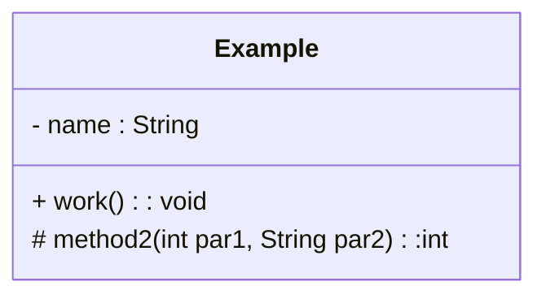
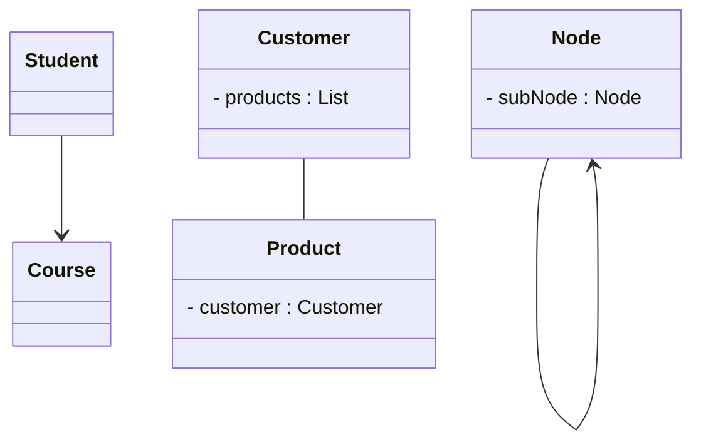
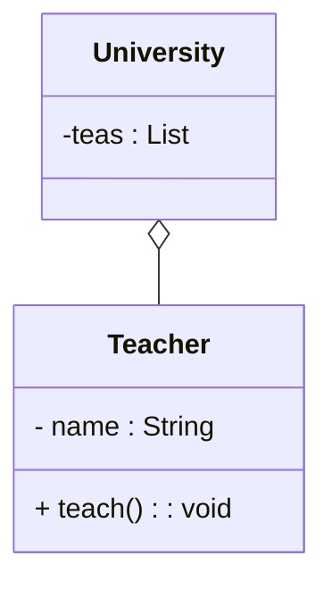
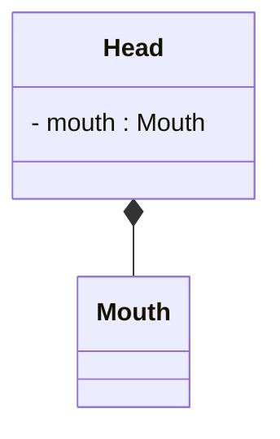
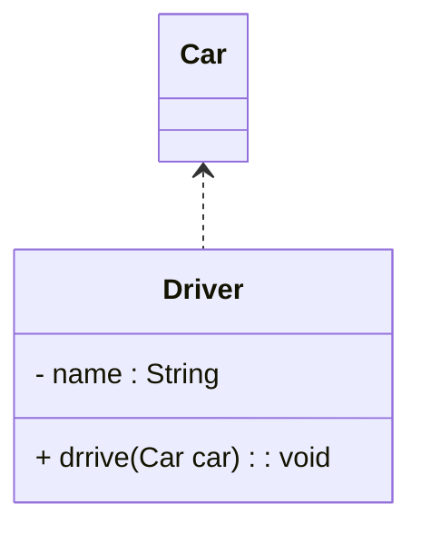
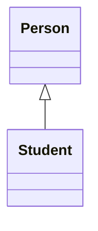
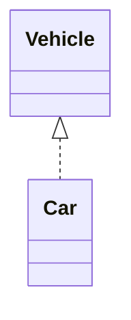

# 设计模式

## 1. 概述

1990年软件工程界开始研讨设计模式的话题，后来召开了多次关于设计模式的研讨会。直到1995 年，艾瑞克·伽马(Erich Gamma)理查德海尔姆(Richard Helm)、拉尔夫约翰森(Ralph Johnson)、约威利斯迪斯(John Vlissides)等 4 位作者合出版了《设计模式:可复用面向对象软件的基础》一书，在此书中吸录了 23 个设计模式，这是设计模式领域里程碑的事件，导致了软件设计模式的突破。这 4 位作者在软件开发领域里也以他们的“四人组”(Gang of Four，GoF)著称。

### 1.1 UML

统一建模语言 (Unified Modeling Language), UML 从目标系统的不同角度出发，定义了用例图、类图、对象图、状态图、活动图、时序图、协作图、构件图、部署图等 9 种图。

<font color=blue>**== 类图 ==**</font>

* `+` : 表示public
* `-` : 表示private
* `#` : 表示protected

属性的完整表示方式是:  可见性  名称 : 类型\[ = 缺省值]

方法的完整表示方式是:  可见性  名称(参数列表)[ : 返回类型]


### 1.2 类之间关系

<font color=blue>**== 关联关系(Association) ==**</font>

表示类之间的引用关系

箭头指向：

* 单向关联用一个带箭头的实线表示，箭头从使用类指向被关联的类；
* 双向关联用没有箭头的实线来表示;
* 自关联



上图中在Customer类中维护一个List\<Product>，表示一个顾客可以购买多个商品;在Product类中维护一个Customer类型的成员变量表示这个产品被哪个顾客所购买。

<font color=blue>**== 聚合关系(Aggregation) ==**</font>

聚合关系是关联关系的一种，是强关联关系，是整体和部分之间的关系。



<font color=blue>**== 组合关系(Composition) ==**</font>

组合表示类之间的整体与部分的关系，但它是一种更强烈的聚合关系。


<font color=blue>**== 依赖关系(Dependency) ==**</font>

依赖关系是一种使用关系，它是对象之间耦合度最弱的一种关联方式，是临时性的关联。



<font color=blue>**== 泛化关系(Generalization) ==**</font>

泛化是学术名称，通俗来讲，泛化指的是类与类之间的继承关系和类与接口之间的实现关系。

<font color=blue>**== 继承关系(Inheritance) ==**</font>

继承关系是对象之间耦合度最大的一种关系。


<font color=blue>**== 实现关系(Realization) ==**</font>



### 1.3 软件设计原则

1. **单一职责原则 (Single Responsibility Principle，SRP)：** 一个类应该只有一个责任。换句话说，一个类应该只有一个引起它的变化原因。
2. **开闭原则 (Open Closed Principle，OCP):** 对扩展开放，对修改关闭。
3. **里氏代换原则 (Liskov Substitution Principle，LSP):** 任何基类可以出现的地方，子类一定可以出现。通俗理解: 子类可以扩展父类的功能，但不能改变父类原有的功能。换句话说，子类继承父类时，除添加新的方法完成新增功能外，尽量不要重写父类的方法。
4. **接口隔离原则 (Interface Segregation Principle，ISP) : **客户端不应该被迫依赖于它不使用的方法，一个类对另一个类的依赖应该建立在最小的接口上。
5. **依赖倒转原则 (Dependency Inversion Principle，DIP)** : 高层模块不应该依赖低层模块，两者都应该依赖其抽象。抽象不应该依赖细节，细节应该依赖抽象。简单的说就是要求对抽象进行编程，不要对实现进行编程，这样就降低了客户与实现模块间的耦合。
5. **迪米特法则 (Law of Demeter，LoD)** : 迪米特法则又叫最少知道原则 (Least Knowledge Principle)。只和你的直接朋友交谈，不跟"陌生人"说话 (Talk only to your immediate friends and not to strangers)。其含义是:如果两个软件实体无须直接通信，那么就不应当发生直接的相互调用，可以通过第三方转发该调用。其目的是降低类之间的精合度，提高模块的相对独立性.
   迪米特法则中的“朋友”是指: 当前对象本身、当前对象的成员对象、当前对象所创建的对象、当前对象的方法参数等，这些对象同当前对象存在关联、聚合或组合关系，可以直接访问这些对象的方法。
6. **合成复用原则 (Composite/Aggregate Reuse Principle，CARP)** : 尽量先使用组合或者聚合等关联关系来实现，其次才考虑使用继承关系来实现。通常类的复用分为继承复用和合成复用两种。
   1. 继承复用虽然有简单和易实现的优点，但它也存在以下缺点
      1. 继承复用破坏了类的封装性，因为继承会将父类的实现细节暴露给子类，父类对子类是透明的，所以这种复用又称为“白箱”复用。
      2. 子类与父类的糟合度高。父类的实现的任何改变都会导致子类的实现发生变化，这不利于类的扩展与维护
      3. 它限制了复用的灵活性。从父类继承而来的实现是静态的，在编译时已经定义，所以在运行时不可能发生变化.
   2. 采用组合或聚合复用时，可以将已有对象纳入新对象中，使之成为新对象的一部分，新对象可以调用已有对象的功能，它有以下优点:
      1. 它维持了类的封装性。因为成分对象的内部细节是新对象看不见的，所以这种复用又称为“黑箱”复用。
      2. 对象间的耦合度低。可以在类的成员位置声明抽象
      3. 复用的灵活性高。这种复用可以在运行时动态进行，新对象可以动态地引用与成分对象类型相同的对象。


## 2. 创建者模式

### 2.1 单例模式

#### 2.1.1 创建

**Singleton Pattern**

单例设计模式分类两种

饿汉式: 类加载就会导致该单实例对象被创建

懒汉式: 类加载不会导致该单实例对象被创建，而是首次使用该对象时才会创建。

```java
/**
 * 饿汉式-1: 静态成员变量
 */
public class Singleton {
	//1. 私有构造方法
    private singleton() {}
    //2. 在本类中创建本类对象
    private static Singleton instance = new Singleton();
    //3. 提供一个公共的访问方式，让外界获取该对象
    public static Singleton getInstance() {
        return instance;
    }
}

/**
 * 饿汉式-2: 静态代码块
 */
public class Singleton {
	//1. 私有构造方法
    private singleton() {}
    //2. 在本类中创建本类对象
    private static Singleton instance; // null
    static {
		instance = new Singleton();
    }
    //3. 提供一个公共的访问方式，让外界获取该对象
    public static Singleton getInstance() {
        return instance;
    }
}

/**
 * 懒汉式-1:
 */
public synchronized static Singleton getInstance() {
    if(instance == null){
        instance = new Singleton();
    }
    return instance;
}

/**
 * 懒汉式-2: 双重检查锁
 */
// 2. 防止指令重排
private static volatile Singleton instance; // null
public static Singleton getInstance() {
    if(instance == null) {
        synchronized (Singleton.class) {
            if(instance == null) {
                instance = new Singleton();
            }
        }
    }
    return instance;
}

/**
 * 静态内部类方式
 *
 * JVM 在加载外部类的过程中，是不会加载静态内部类的，只有内部类的属性/方法被调用时才会被加载，并初始化其静态属性。静态属性由于被 static 修饰，保证只被实例化一次，并且严格保证实例化顺序。
	静态内部类单例模式是一种优秀的单例模式，是开源项目中比较常用的一种单例模式。在没有加任何锁的情况下，保证了多线程下的安全，并且没有任何性能影响和空间的浪费。
 */
public class Singleton {
	//私有构造方法
	private Singleton() {}
    private static class SingletonHolder {
        private static final Singleton INSTANCE = new Singleton();
    }
	//对外提供静态方法获取该对象
	public static Singleton getInstance() {
        return SingletonHolder.INSTANCE;
    }
}

/**
 * 枚举
 */
public enum Singleton {
	INSTANCE;
}
```

#### 2.1.2 被破坏解决方案

**序列化、反序列方式破坏单例模式的解决方法**

在Singleton类中添加 readResolve() 方法，在反序列化时被反射调用，如果定义了这个方法，就返回这个方法的值，如果没有定义，则返回新new出来的对象。

**反射方式破解单例的解决方法**

```java
private static boolean flag = false;
// 私有构造方法
private Singleton() {
	synchronized (Singleton.class){
        if (flag) {
            throw new RuntimeException("不能创建多个对象");
        }
		flag = true;
	}
}
```

### 2.2 工厂方法模式

**简单工厂** 不是一种设计模式，及而比较像是一种编程习惯。

简单工厂包含如下角色:

1. 抽象产品 : 定义了产品的规范，描述了产品的主要特性和功能.
2. 具体产品 : 实现或者继承抽象产品的子类
3. 具体工厂 : 提供了创建产品的方法，调用者通过该方法来创建产品。

**工厂方法模式 Factory Method Pattern**

定义一个用于创建对象的接口，让子类决定实例化哪个产品类对象。工厂方法使一个产品类的实例化延迟到其工厂的子类。

工厂方法模式的主要角色:

1. 抽象工厂(Abstract Factory): 提供了创建产品的接口，调用者通过它访问具体工厂的工厂方法来创建产品。
2. 具体工厂(Concrete Factory) : 主要是实现抽象工厂中的抽象方法，完成具体产品的创建。
3. 抽象产品 (Product) : 定义了产品的规范，描述了产品的主要特性和功能。
4. 具体产品(Concrete Product): 实现了抽象产品角色所定义的接口，由具体工厂来创建，它同具体工厂之间一一对应.

**优点:**

* 用户只需要知道具体工厂的名称就可得到所要的产品，无须知道产品的具体创建过程;.
* 在系统增加新的产品时只需要添加具体产品类和对应的具体工厂类，无须对原工厂进行任何修改，满足开闭原.

**缺点:**

* 每增加一个产品就要增加一个具体产品类和一个对应的具体工厂类，这增加了系统的复杂度.

### 2.3 抽象工厂模式

**Abstract Factory Pattern**

是一种为访问类提供一个创建一组相关或相互依赖对象的接口，且访问类无须指定所要产品的具体类就能得到同族的不同等级的产品的模式结构。

抽象工厂模式是工厂方法模式的升级版本，工厂方法模式只生产一个等级的产品，而抽象工厂模式可生产多个等级的产品.

抽象工厂模式的主要角色如下:

1. 抽象工厂(Abstract Factory): 提供了创建产品的接口，**它包含多个创建产品的方法**，可以创建多个不同等级的产品。
2. 具体工厂(Concrete Factory) : 主要是实现抽象工厂中的多个抽象方法，完成具体产品的创建。
3. 抽象产品(Product): 定义了产品的规范，描述了产品的主要特性和功能，抽象工厂模式有多个抽象产品。
4. 具体产品(Concrete Product): 实现了抽象产品角色所定义的接口，由具体工厂来创建，**它同具体工厂之间是多对一**的关系.

优点:

* 当一个产品族中的多个对象被设计成一起工作时，它能保证客户端始终只使用同一个产品族中的对象。

缺点:

* 当产品族中需要增加一个新的产品时，所有的工厂类都需要进行修改

**模式扩展**

简单工厂+配置文件解除耦合

可以通过工厂模式+配置文件的方式解除工厂对象和产品对象的耦合。在工厂类中加载配置文件中的全类名，并创建对象进行存储，客户端如果需要对象，直接进行获取即可。(存储全类名 + 反射)

### 2.4 原型模式

原型模式 **(Prototype Pattern)** 的克隆分为浅克隆和深克隆.

> 浅克隆: 创建一个新对象，对于非基本类型属 性，仍指向原有属性所指向的对象的内存地址。
>
> 深克隆: 创建一个新对象，属性中引用的其他对象也会被克隆，不再指向原有对象地址。

```java
class A implements Cloneable {

    @Override
	public A clone() throws CloneNotSupportedException {
        // 浅克隆
        return (A) super.clone();
        // 深克隆
        // 每层对象都要 implements Cloneable
    }
}

// 深克隆 -- 对象流
// 每层对象都要 implements Serializable
//创建对象输出流对象
Objectoutputstream oos = new objectoutputStream(new FileoutputStream( "d:/a.txt"));
oos.writeObject(a1); // 写对象
oos.close(); // 释放资源
// 创建对象输入流对象
ObjectInputStream ois = new objectInputStream(new FileInputStream( name: "d:a.txt"));
Citation a2 = (A) ois.readobject(); // 读取对象
ois.close(); // 释放资源
```

### 2.5 建造者模式

建造者  **(Builder)**  模式角色:

* 抽象建造者类(Builder):
* 具体建造者类(ConcreteBuilder): 实现 Builder 接口，完成复杂产品的 **各个部件** 的具体创建方法。
* 产品类 (Product) : 要创建的复杂对象。
* 指挥者类(Director): 只负责保证对象 **各部分** 完整创建或按某种顺序创建。

```java
public class Bike {
	private String frame;//车架
	private String seat;//车座
	public String getFrame() {return frame;}
	public void setFrame(String frame) {this.frame = frame;}
	public string getSeat() {return seat;}
	public void setSeat(String seat) {this.seat = seat;}
}
public abstract class Builder {
    protected Bike bike = new Bike();
	public abstract void buildFrame();
	public abstract void buildSeat();
    public abstract Bike createBike();
}
public class MobileBuilder extends Builder {}
public classDirector {
	public Director(Builder builder) {this.builder = builder;}
	public Bike construct() {
        builder.buildFrame();
        builder.buildSeat();
        return builder.createBike();
    }
}
```

**NOTE:**

1. 指挥者可以跟抽象建造者结合, 抽象建造者决定构建顺序。
2. 扩展通过增加具体建造者，其他结构不变。

```java
// 扩展
pubic class Phone {
	private string cpu;
	private string screen;
	private string memory;
	private string mainboard;
    
    //私有构造方法
	private Phone(Builder builder){
        this.cpu = builder.cpu;
        this.screen = builder.screen;
        this.memory = builder.memory;
        this.mainboard = builder.mainboard;
    }
    
    public static final class Builder {
		private String cpu;
		private String screen;
		private String memory;
		private String mainboard;
		public Builder cpu(string cpu) {
            this.cpu = cpu;
            return this;
        }
        public Phone build() {
            return new Phone(this);
        }
    }
}
// 链式编程
Phone phone = new Phone.Builder()
.cpu("intel")
.screen("三星屏幕")
.memory("金士顿内存条")
.mainboard("华硕")
.build();
```

## 3. 结构型模式

### 3.1 代理模式

**Proxy Pattern**

1. 静态代理: 代理类在编译期就生成。
2. 动态代理 (JDK 代理，必须依赖接口)
3. CGLib代理

> JDK代理和CGLib代理
>
> 使用CGLib实现动态代理，CGLib底层采用ASM字节码生成框架，使用字节码技术生成代理类，在JDK1.6之前比使用Java反射效率要高。唯一需要注意的是，CGLib不能对声明为final的类或者方法进行代理，因为CGLib原理是动态生成被代理类的子类
>
> 在JDK1.6、JDK 1.7、JDK 1.8逐步对JDK动态代理优化之后，在调用次数较少的情况下，JDK代理效率高于CGLib代理效率，只有当进行大量调用的时候，JDK1.6和JDK 1.7比CGLib代理效率低一点，但是到JDK 1.8的时候，JDK代理效率高于CGLib代理。所以如果有接口使用JDK动态代理，如果没有接口使用CGLIB代理。

> 动态代理和静态代理
>
> 动态代理与静态代理相比较，最大的好处是接口中声明的所有方法都被转移到调用处理器一个集中的方法中处理(InvocationHandler.invoke)。这样，在接口方法数量比较多的时候，我们可以进行灵活处理，而不需要像静态代理那样每一个方法进行中转。
>
> 如果接口增加一个方法，静态代理模式除了所有实现类需要实现这个方法外，所有代理类也需要实现此方法。增加了代码维护的复杂度。而动态代理不会出现该问题。

```java
// JDK 代理
// 被代理类
public class Renter implements Person{
	@Override
	public void rentHouse() {
		System.out.println("租客租房成功！");
	}
}

public class RenterInvocationHandler<T> implements InvocationHandler{
	//被代理类的对象
	private T target;
	public RenterInvocationHandler(T target){
		this.target = target;
	}
	/**
     * proxy: 动态代理对象。和renterProxy对象是同一个对象，在invoke方法中基本不用
     * method：正在执行的方法
     * args：调用目标方法时传入的实参
     * 返回值： method的返回值。
     */
	@Override
	public Object invoke(Object proxy, Method method, Object[] args) throws Throwable {
		//代理过程中插入其他操作
		System.out.println("租客和中介交流");
		Object result = method.invoke(target, args);
		return result;
	}
}

public class ProxyTest {
	public static void main(String[] args) {
		//创建被代理的实例对象
		Person renter = new Renter();
		//创建InvocationHandler对象
		InvocationHandler renterHandler = new RenterInvocationHandler<Person>(renter);
		
        /*
        CLassLoader Loader : 类加载器，用于加载代理类。
        Class<?>[] interfaces: 代理类实现的接口的字节码对象。
        InvocationHandler h :代理对象的调用处理程序。
        */
        //创建代理对象,代理对象的每个执行方法都会替换执行Invocation中的invoke方法
		Person renterProxy = (Person) Proxy.newProxyInstance(
            Person.class.getClassLoader(), new Class<?>[]{Person.class}, renterHandler);
		renterProxy.rentHouse();
		
		//也可以使用下面的方式创建代理类对象，Proxy.newProxyInstance其实就是对下面代码的封装
		/*try {
			//使用Proxy类的getProxyClass静态方法生成一个动态代理类renterProxy 
			Class<?> renterProxyClass = Proxy.getProxyClass(Person.class.getClassLoader(), new Class<?>[]{Person.class});
			//获取代理类renterProxy的构造器，参数为InvocationHandler
			Constructor<?> constructor = renterProxyClass.getConstructor(InvocationHandler.class);
			//使用构造器创建一个代理类实例对象
			Person renterProxy = (Person)constructor.newInstance(renterHandler);
			renterProxy.rentHouse();
		} catch (Exception e) {
			// TODO Auto-generated catch block
			e.printStackTrace();
		}*/
	}
}
```

```java
// CGlib代理
// 被代理类
public class Renter {
	public void rentHouse() {
		System.out.println("租客租房成功！");
	}
}

public class MyInterceptor implements MethodInterceptor {
    private Object target;
    public MyInterceptor(Object target) {
        this.target = target;
    }
    /**
     * @param o 代理对象
     * @param method 被代理对象的方法
     * @param objects 方法入参
     * @param methodProxy 代理方法
     * @return
     * @throws Throwable
     */
    @Override
    public Object intercept(Object o, Method method, Object[] objects, MethodProxy methodProxy) throws Throwable {
        System.out.println("cglib before");
        // 调用代理类FastClass对象
        Object result =  methodProxy.invokeSuper(o, objects);
//        Object result = methodProxy.invoke(target, objects);
        System.out.println("cglib after");
        return result;
    }
}

// 通过CGLIB动态代理获取代理对象的过程
Enhancer enhancer = new Enhancer();
// 设置enhancer对象的父类
enhancer.setSuperclass(Renter.class);
// 设置enhancer的回调对象
enhancer.setCallback(new MyInterceptor(target));
// 创建代理对象
Renter renter = (Renter)enhancer.create();
// 通过代理对象调用目标方法
renter.rentHouse();
```

### 3.2 适配器模式

**Adapter Pattern**

类适配器：继承适配器。

对象适配器：聚合适配器。

接口适配器：当不希望实现一个接口中所有的方法时，可以创建一个抽象类Adapter ，实现所有方
法。而此时我们只需要继承该抽象类即可。

```java
// 类适配器
// 目标接口
interface Target {
    void request();
}

// 被适配类
class Adaptee {
    public void specificRequest() {
        System.out.println("Adaptee: specificRequest");
    }
}

// 适配器类
class Adapter implements Target {
    private Adaptee adaptee;

    public Adapter(Adaptee adaptee) {
        this.adaptee = adaptee;
    }

    public void request() {
        adaptee.specificRequest();
    }
}

public class Main {
    public static void main(String[] args) {
        // 创建被适配类的实例
        Adaptee adaptee = new Adaptee();

        // 创建适配器并传入被适配类的实例
        Target adapter = new Adapter(adaptee);

        // 使用适配器调用目标接口的方法
        adapter.request();
    }
}
```

```java
// 接口适配器
// 目标接口
interface Target {
    void method1();
    void method2();
    void method3();
}

// 抽象适配器类
abstract class Adapter implements Target {
    public void method1() { }
    public void method2() { }
    public void method3() { }
}

// 具体适配器类
class ConcreteAdapter extends Adapter {
    public void method1() {
        System.out.println("ConcreteAdapter: method1");
    }
}

public class Main {
    public static void main(String[] args) {
        // 创建具体适配器类的实例
        Target adapter = new ConcreteAdapter();

        // 调用目标接口的方法
        adapter.method1(); // ConcreteAdapter: method1
        adapter.method2(); // 空
        adapter.method3(); // 空
    }
}
```

### 3.3 装饰者模式

装饰 **(Decorator)** 模式中的角色

* 抽象构件 (component)角色 : 定义一个抽象接口以规范准备接收附加责任的对象。
* 具体构件 (Concrete component)角色 : 实现抽象构件，通过装饰角色为其添加一些职责
* 抽象装饰 (Decorator) 角色 :  <font color=green> **继承或实现抽象构件，并包含具体构件的实例** </font>
* 具体装饰(Concrete Decorator)角色: 实现抽象装饰的相关方法，并给具体构件对象添加附加的责任。

**优点:**

饰者模式可以带来比继承更加灵活性的扩展功能，使用更加方便，可以通过 <font color=green>**组合不同的装饰者对象** </font>来获取具有不同行为状态的多样化的结果。装饰者模式比继承更具良好的扩展性，完美的遵循开闭原则，继承是静态的附加责任，装饰者则是动态的附加责任。

装饰类和被装饰类可以独立发展，不会相互耦合，装饰模式是继承的一个替代模式，装饰模式可以动态扩展一个实现类的功能。

<font color=green> **静态代理和装饰者模式的区别 : ** </font>

相同点:

1. 都要实现与目标类相同的业务接口
2. 在两个类中都要声明目标对家
3. 都可以在不修改目标类的前提下增强目标方法

不同点:

1. 目的不同: 装饰者是为了增强目标对象, 静态代理是为了保护和隐藏目标对象
2. 获取目标对象构建的地方不同: 装饰者是由外界传递进来，可以通过构造方法传递静态代理是在代理类内部创建，以此来隐藏目标对象

### 3.4 桥接模式

**Bridge Pattern**

```java
// 实现部分的接口
interface Color {
    void applyColor();
}

// 实现部分的具体实现类
class Red implements Color {
    @Override
    public void applyColor() {
        System.out.println("Applying red color");
    }
}

class Blue implements Color {
    @Override
    public void applyColor() {
        System.out.println("Applying blue color");
    }
}

// 抽象部分的抽象类
abstract class Shape {
    protected Color color;

    public Shape(Color color) {
        this.color = color;
    }

    public abstract void draw();
}

// 抽象部分的具体实现类
class Circle extends Shape {
    public Circle(Color color) {
        super(color);
    }

    @Override
    public void draw() {
        System.out.print("Drawing circle. ");
        color.applyColor();
    }
}

class Rectangle extends Shape {
    public Rectangle(Color color) {
        super(color);
    }

    @Override
    public void draw() {
        System.out.print("Drawing rectangle. ");
        color.applyColor();
    }
}

public class Main {
    public static void main(String[] args) {
        Color red = new Red();
        Color blue = new Blue();

        Shape redCircle = new Circle(red);
        Shape blueRectangle = new Rectangle(blue);

        redCircle.draw();       // 输出：Drawing circle. Applying red color
        blueRectangle.draw();   // 输出：Drawing rectangle. Applying blue color
    }
}
```

<font color=green> **优点 : ** </font> 在两个变化维度中任意扩展一个维度，互不影响，都不需要修改原有系统。

### 3.5 外观模式

外观 **(Facade)** 模式是“迪米特法则”的典型应用。

```java
// 子系统类
class CPU {
    public void start() {
        System.out.println("CPU is starting");
    }

    public void shutdown() {
        System.out.println("CPU is shutting down");
    }
}

class Memory {
    public void load() {
        System.out.println("Memory is loading data");
    }

    public void unload() {
        System.out.println("Memory is unloading data");
    }
}

class HardDrive {
    public void read() {
        System.out.println("Hard Drive is reading data");
    }

    public void write() {
        System.out.println("Hard Drive is writing data");
    }
}

// 外观类
class Computer {
    private CPU cpu;
    private Memory memory;
    private HardDrive hardDrive;

    public Computer() {
        cpu = new CPU();
        memory = new Memory();
        hardDrive = new HardDrive();
    }

    public void startComputer() {
        cpu.start();
        memory.load();
        hardDrive.read();
        System.out.println("Computer started successfully");
    }
    
    public void shutdownComputer() {
        cpu.shutdown();
        memory.unload();
        hardDrive.write();
        System.out.println("Computer shutdown successfully");
    }
}

// 客户端代码
public class Main {
    public static void main(String[] args) {
        Computer computer = new Computer();

        // 客户端通过调用外观类的方法来使用子系统的功能
        computer.startComputer();
        System.out.println();
        computer.shutdownComputer();
    }
}
```

**缺点：** 不符合开闭原则。

### 3.6 组合模式

**Composite Pattern**

```java
// 组件接口
interface Component {
    void operation();
}

// 叶子类
class Leaf implements Component {
    @Override
    public void operation() {
        System.out.println("Leaf operation");
    }
}

// 组合类
class Composite implements Component {
    private List<Component> children = new ArrayList<>();

    public void add(Component component) {
        children.add(component);
    }

    public void remove(Component component) {
        children.remove(component);
    }

    @Override
    public void operation() {
        System.out.println("Composite operation");
        for (Component component : children) {
            component.operation();
        }
    }
}

// 客户端代码
public class Main {
    public static void main(String[] args) {
        Component leaf1 = new Leaf();
        Component leaf2 = new Leaf();
        Component leaf3 = new Leaf();

        Composite composite1 = new Composite();
        composite1.add(leaf1);
        composite1.add(leaf2);
        
        Composite composite2 = new Composite();
        composite2.add(leaf3);
        composite2.add(composite1);

        composite2.operation();
    }
}
```

* 安全组合模式
* 透明组合模式（Transparent Composite Pattern）是组合模式的一种变体。在透明组合模式中，组合对象和叶子对象具有相同的接口，这意味着客户端可以以相同的方式处理组合对象和叶子对象，无需进行类型检查。透明组合模式的关键在于组件接口的设计。组件接口应该包含所有可能操作的方法，无论是组合对象还是叶子对象都要实现这些方法。然而，由于叶子对象没有子组件，因此在叶子对象中实现这些方法时可以抛出一个适当的异常或者直接不进行任何操作。

```java
// 组件接口
interface Component {
    void operation();
    void add(Component component);
    void remove(Component component);
}

// 叶子类
class Leaf implements Component {
    @Override
    public void operation() {
        System.out.println("Leaf operation");
    }

    @Override
    public void add(Component component) {
        throw new UnsupportedOperationException("Cannot add component to a leaf");
    }

    @Override
    public void remove(Component component) {
        throw new UnsupportedOperationException("Cannot remove component from a leaf");
    }
}

// 组合类
class Composite implements Component {
    private List<Component> children = new ArrayList<>();

    @Override
    public void operation() {
        System.out.println("Composite operation");
        for (Component component : children) {
            component.operation();
        }
    }

    @Override
    public void add(Component component) {
        children.add(component);
    }

    @Override
    public void remove(Component component) {
        children.remove(component);
    }
}

// 客户端代码
public class Main {
    public static void main(String[] args) {
        Component leaf1 = new Leaf();
        Component leaf2 = new Leaf();
        Component leaf3 = new Leaf();

        Component composite1 = new Composite();
        composite1.add(leaf1);
        composite1.add(leaf2);

        Component composite2 = new Composite();
        composite2.add(leaf3);
        composite2.add(composite1);

        composite2.operation();
    }
}
```

### 3.7 享元模式

**Flyweight Pattern**

通过共享对象来减少内存使用和提高性能。

**缺点:** 为了使对象可以共享，需要将享元对象的部分状态外部化，分离内部状态和外部状态，使程序逻辑复杂。

```java
// 享元接口
interface Flyweight {
    void operation(String extrinsicState);
}

// 具体享元类
class ConcreteFlyweight implements Flyweight {
    @Override
    public void operation(String extrinsicState) {
        System.out.println("具体享元对象操作，外部状态为: " + extrinsicState);
    }
}

// 享元工厂类
class FlyweightFactory {
    private Map<String, Flyweight> flyweights = new HashMap<>();

    public Flyweight getFlyweight(String key) {
        Flyweight flyweight = flyweights.get(key);
        if (flyweight == null) {
            flyweight = new ConcreteFlyweight();
            flyweights.put(key, flyweight);
        }
        return flyweight;
    }
}

// 客户端使用享元对象
public class Client {
    public static void main(String[] args) {
        FlyweightFactory factory = new FlyweightFactory();

        // 获取享元对象并进行操作
        Flyweight flyweight1 = factory.getFlyweight("key1");
        flyweight1.operation("state1");

        Flyweight flyweight2 = factory.getFlyweight("key2");
        flyweight2.operation("state2");

        Flyweight flyweight3 = factory.getFlyweight("key1");
        flyweight3.operation("state3");
    }
}
```

## 4. 行为型模式

### 4.1 模板方法模式

**Template Method Pattern**

```java
// 抽象类
abstract class AbstractClass {
    // 模板方法
    public void templateMethod() {
        // 调用抽象方法或具体方法
        step1();
        step2();
        step3();
    }

    // 抽象方法
    public abstract void step1();
    public abstract void step2();

    // 具体方法
    public void step3() {
        System.out.println("AbstractClass: step3");
    }
}

// 具体类
class ConcreteClass extends AbstractClass {
    // 实现抽象方法
    public void step1() {
        System.out.println("ConcreteClass: step1");
    }

    public void step2() {
        System.out.println("ConcreteClass: step2");
    }
}

public class Main {
    public static void main(String[] args) {
        AbstractClass template = new ConcreteClass();
        template.templateMethod();
    }
}
```

### 4.2 命令模式

**Command Pattern**

```java
// 命令接口
public interface Command {
    void execute();
}

// 具体命令类
public class ConcreteCommand implements Command {
    private Receiver receiver;
    
    public ConcreteCommand(Receiver receiver) {
        this.receiver = receiver;
    }
    
    public void execute() {
        receiver.action();
    }
}

// 接收者类
public class Receiver {
    public void action() {
        System.out.println("接收者执行具体操作");
    }
}

// 调用者类
public class Invoker {
    private Command command;
    
    public void setCommand(Command command) {
        this.command = command;
    }
    
    public void executeCommand() {
        command.execute();
    }
}

// 客户端类
public class Client {
    public static void main(String[] args) {
        // 创建接收者对象
        Receiver receiver = new Receiver();
        
        // 创建具体命令对象，传入接收者对象
        Command command = new ConcreteCommand(receiver);
        
        // 创建调用者对象，并设置具体命令
        Invoker invoker = new Invoker();
        invoker.setCommand(command);
        
        // 执行命令
        invoker.executeCommand();
    }
}
```

命令模式的优点包括：

1. 解耦调用者和接收者，使得系统更加灵活。
2. 可以轻松实现命令的撤销、重做等功能。
3. 可以将多个命令组合成复合命令，进行批处理。

### 4.3 迭代器模式

**Iterator Pattern**

### 4.4 观察者模式

**Observer Pattern**

### 4.5 状态模式

**State Pattern**

### 4.6 策略模式

**Strategy Pattern**

```java
// 策略接口
interface Strategy {
    void executeStrategy();
}

// 具体策略类1
class ConcreteStrategyA implements Strategy {
    @Override
    public void executeStrategy() {
        System.out.println("Executing strategy A");
    }
}

// 具体策略类2
class ConcreteStrategyB implements Strategy {
    @Override
    public void executeStrategy() {
        System.out.println("Executing strategy B");
    }
}

// 环境类
class Context {
    private Strategy strategy;

    public void setStrategy(Strategy strategy) {
        this.strategy = strategy;
    }

    public void execute() {
        if (strategy != null) {
            strategy.executeStrategy();
        }
    }
}

public class Main {
    public static void main(String[] args) {
        Context context = new Context();

        // 使用策略A执行
        context.setStrategy(new ConcreteStrategyA());
        context.execute();

        // 使用策略B执行
        context.setStrategy(new ConcreteStrategyB());
        context.execute();
    }
}
```

### 4.7 责任链模式

**Chain of Responsibility Pattern**

```java
// 抽象处理者
public abstract class Handler {
    protected Handler nextHandler;
    
    public void setNextHandler(Handler nextHandler) {
        this.nextHandler = nextHandler;
    }
    
    public abstract void handleRequest(Request request);
}

// 具体处理者1
public class ConcreteHandler1 extends Handler {
    public void handleRequest(Request request) {
        if (request.getType().equals("Type1")) {
            System.out.println("ConcreteHandler1 处理了请求：" + request.getName());
        } else {
            if (nextHandler != null) {
                nextHandler.handleRequest(request);
            }
        }
    }
}

// 具体处理者2
public class ConcreteHandler2 extends Handler {
    public void handleRequest(Request request) {
        if (request.getType().equals("Type2")) {
            System.out.println("ConcreteHandler2 处理了请求：" + request.getName());
        } else {
            if (nextHandler != null) {
                nextHandler.handleRequest(request);
            }
        }
    }
}

// 请求类
public class Request {
    private String type;
    private String name;
    
    public Request(String type, String name) {
        this.type = type;
        this.name = name;
    }
    
    public String getType() {
        return type;
    }
    
    public String getName() {
        return name;
    }
}

// 客户端
public class Client {
    public static void main(String[] args) {
        // 创建处理者对象
        Handler handler1 = new ConcreteHandler1();
        Handler handler2 = new ConcreteHandler2();
        
        // 设置处理者的下一个处理者
        handler1.setNextHandler(handler2);
        
        // 创建请求对象
        Request request1 = new Request("Type1", "Request1");
        Request request2 = new Request("Type2", "Request2");
        
        // 发送请求
        handler1.handleRequest(request1);
        handler1.handleRequest(request2);
    }
}
```

### 4.8 中介者模式

**Mediator Pattern**

### 4.9 备忘录模式

**Memento Pattern**

### 4.10 访问者模式

**Visitor Pattern**

### 4.11 解释器模式

**Interpreter Pattern**


