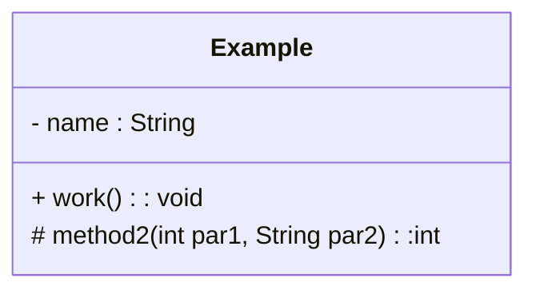
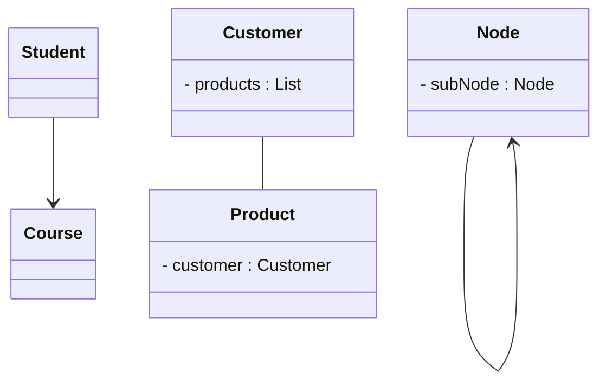
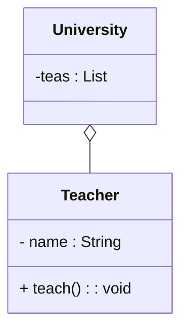
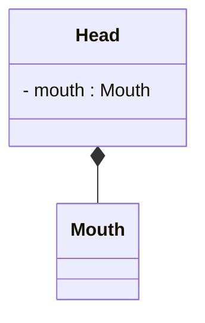
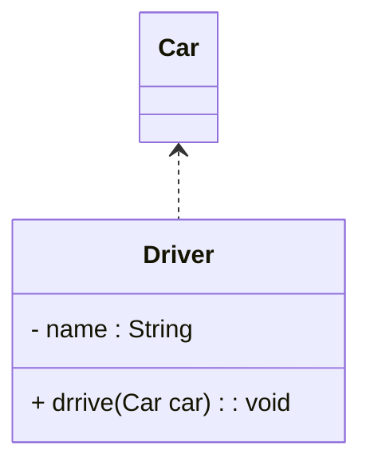
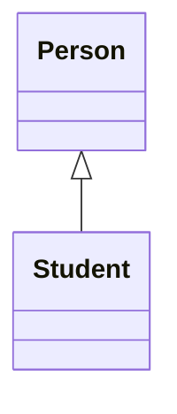
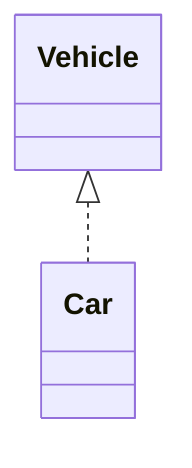

# 设计模式

## 1. 概述

1990年软件工程界开始研讨设计模式的话题，后来召开了多次关于设计模式的研讨会。直到1995 年，艾瑞克·伽马(Erich Gamma)理查德海尔姆(Richard Helm)、拉尔夫约翰森(Ralph Johnson)、约威利斯迪斯(John Vlissides)等 4 位作者合出版了《设计模式:可复用面向对象软件的基础》一书，在此书中吸录了 23 个设计模式，这是设计模式领域里程碑的事件，导致了软件设计模式的突破。这 4 位作者在软件开发领域里也以他们的“四人组”(Gang of Four，GoF)著称。

### 1.1 UML

统一建模语言 (Unified Modeling Language), UML 从目标系统的不同角度出发，定义了用例图、类图、对象图、状态图、活动图、时序图、协作图、构件图、部署图等 9 种图。

<font color=blue>**== 类图 ==**</font>

* `+` : 表示public
* `-` : 表示private
* `#` : 表示protected

属性的完整表示方式是:  可见性  名称 : 类型\[ = 缺省值]

方法的完整表示方式是:  可见性  名称(参数列表)[ : 返回类型]


### 1.2 类之间关系

<font color=blue>**== 关联关系(Association) ==**</font>

表示类之间的引用关系

箭头指向：

* 单向关联用一个带箭头的实线表示，箭头从使用类指向被关联的类；
* 双向关联用没有箭头的实线来表示;
* 自关联



上图中在Customer类中维护一个List\<Product>，表示一个顾客可以购买多个商品;在Product类中维护一个Customer类型的成员变量表示这个产品被哪个顾客所购买。

<font color=blue>**== 聚合关系(Aggregation) ==**</font>

聚合关系是关联关系的一种，是强关联关系，是整体和部分之间的关系。



<font color=blue>**== 组合关系(Composition) ==**</font>

组合表示类之间的整体与部分的关系，但它是一种更强烈的聚合关系。


<font color=blue>**== 依赖关系(Dependency) ==**</font>

依赖关系是一种使用关系，它是对象之间耦合度最弱的一种关联方式，是临时性的关联。



<font color=blue>**== 泛化关系(Generalization) ==**</font>

泛化是学术名称，通俗来讲，泛化指的是类与类之间的继承关系和类与接口之间的实现关系。

<font color=blue>**== 继承关系(Inheritance) ==**</font>

继承关系是对象之间耦合度最大的一种关系。


<font color=blue>**== 实现关系(Realization) ==**</font>



### 1.3 软件设计原则

## 2. 创建者模式

### 2.1

### 2.2

### 2.3

### 2.4

## 3. 结构型模式

## 4. 行为型模式

### 动态代理

1. 静态代理
2. 动态代理 (JDK 代理)
3. Cglib代理

```java
// 被代理类
public class Renter implements Person{
	@Override
	public void rentHouse() {
		System.out.println("租客租房成功！");
	}
}

public class RenterInvocationHandler<T> implements InvocationHandler{
	//被代理类的对象
	private T target;
	public RenterInvocationHandler(T target){
		this.target = target;
	}
	/**
     * proxy: 动态代理对象
     * method：正在执行的方法
     * args：调用目标方法时传入的实参
     */
	@Override
	public Object invoke(Object proxy, Method method, Object[] args) throws Throwable {
		//代理过程中插入其他操作
		System.out.println("租客和中介交流");
		Object result = method.invoke(target, args);
		return result;
	}
}

public class ProxyTest {
	public static void main(String[] args) {
		//创建被代理的实例对象
		Person renter = new Renter();
		//创建InvocationHandler对象
		InvocationHandler renterHandler = new RenterInvocationHandler<Person>(renter);
		//创建代理对象,代理对象的每个执行方法都会替换执行Invocation中的invoke方法
		Person renterProxy = (Person) Proxy.newProxyInstance(
            Person.class.getClassLoader(), new Class<?>[]{Person.class}, renterHandler);
		renterProxy.rentHouse();
		
		//也可以使用下面的方式创建代理类对象，Proxy.newProxyInstance其实就是对下面代码的封装
		/*try {
			//使用Proxy类的getProxyClass静态方法生成一个动态代理类renterProxy 
			Class<?> renterProxyClass = Proxy.getProxyClass(Person.class.getClassLoader(), new Class<?>[]{Person.class});
			//获取代理类renterProxy的构造器，参数为InvocationHandler
			Constructor<?> constructor = renterProxyClass.getConstructor(InvocationHandler.class);
			//使用构造器创建一个代理类实例对象
			Person renterProxy = (Person)constructor.newInstance(renterHandler);
			renterProxy.rentHouse();
		} catch (Exception e) {
			// TODO Auto-generated catch block
			e.printStackTrace();
		}*/
	}

}

```

