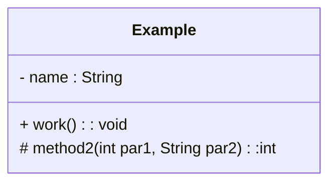
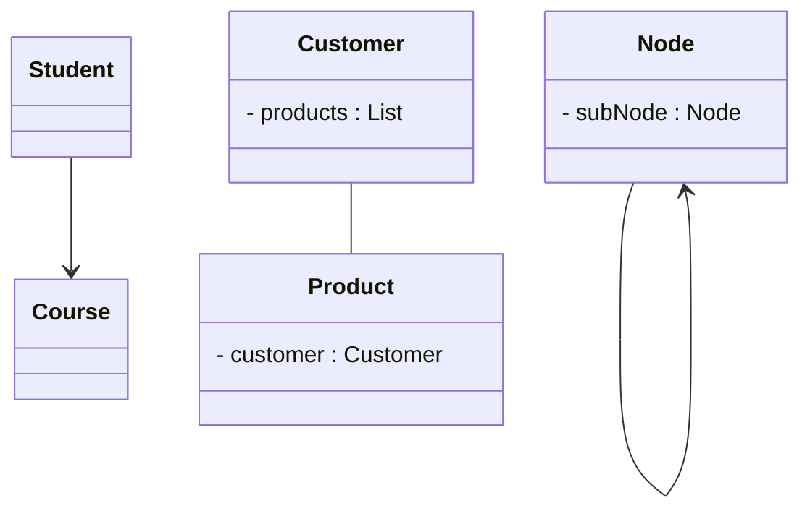
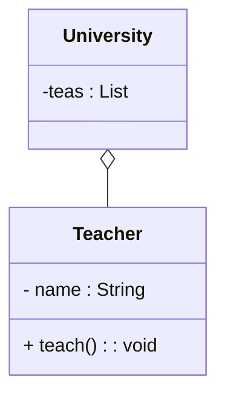
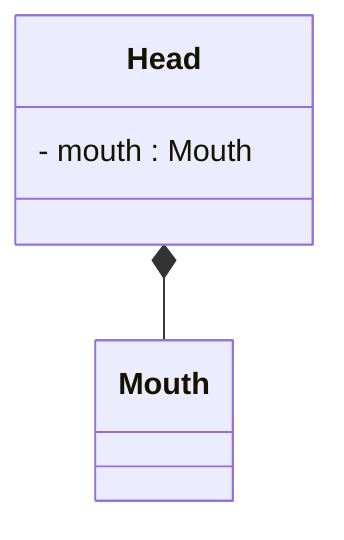
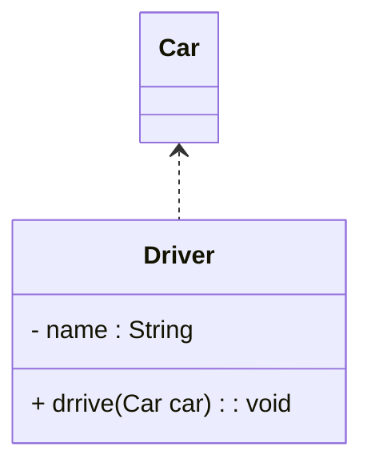
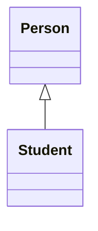
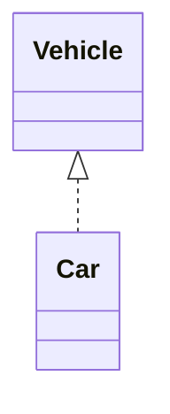

# 设计模式

## 1. 概述

1990年软件工程界开始研讨设计模式的话题，后来召开了多次关于设计模式的研讨会。直到1995 年，艾瑞克·伽马(Erich Gamma)理查德海尔姆(Richard Helm)、拉尔夫约翰森(Ralph Johnson)、约威利斯迪斯(John Vlissides)等 4 位作者合出版了《设计模式:可复用面向对象软件的基础》一书，在此书中吸录了 23 个设计模式，这是设计模式领域里程碑的事件，导致了软件设计模式的突破。这 4 位作者在软件开发领域里也以他们的“四人组”(Gang of Four，GoF)著称。

### 1.1 UML

统一建模语言 (Unified Modeling Language), UML 从目标系统的不同角度出发，定义了用例图、类图、对象图、状态图、活动图、时序图、协作图、构件图、部署图等 9 种图。

<font color=blue>**== 类图 ==**</font>

* `+` : 表示public
* `-` : 表示private
* `#` : 表示protected

属性的完整表示方式是:  可见性  名称 : 类型\[ = 缺省值]

方法的完整表示方式是:  可见性  名称(参数列表)[ : 返回类型]


### 1.2 类之间关系

<font color=blue>**== 关联关系(Association) ==**</font>

表示类之间的引用关系

箭头指向：

* 单向关联用一个带箭头的实线表示，箭头从使用类指向被关联的类；
* 双向关联用没有箭头的实线来表示;
* 自关联



上图中在Customer类中维护一个List\<Product>，表示一个顾客可以购买多个商品;在Product类中维护一个Customer类型的成员变量表示这个产品被哪个顾客所购买。

<font color=blue>**== 聚合关系(Aggregation) ==**</font>

聚合关系是关联关系的一种，是强关联关系，是整体和部分之间的关系。



<font color=blue>**== 组合关系(Composition) ==**</font>

组合表示类之间的整体与部分的关系，但它是一种更强烈的聚合关系。


<font color=blue>**== 依赖关系(Dependency) ==**</font>

依赖关系是一种使用关系，它是对象之间耦合度最弱的一种关联方式，是临时性的关联。



<font color=blue>**== 泛化关系(Generalization) ==**</font>

泛化是学术名称，通俗来讲，泛化指的是类与类之间的继承关系和类与接口之间的实现关系。

<font color=blue>**== 继承关系(Inheritance) ==**</font>

继承关系是对象之间耦合度最大的一种关系。


<font color=blue>**== 实现关系(Realization) ==**</font>



### 1.3 软件设计原则

1. **开闭原则:** 对扩展开放，对修改关闭。
2. **里氏代换原则:** 任何基类可以出现的地方，子类一定可以出现。通俗理解: 子类可以扩展父类的功能，但不能改变父类原有的功能。换句话说，子类继承父类时，除添加新的方法完成新增功能外，尽量不要重写父类的方法。
3. **依赖倒转原则** : 高层模块不应该依赖低层模块，两者都应该依赖其抽象。抽象不应该依赖细节，细节应该依赖抽象。简单的说就是要求对抽象进行编程，不要对实现进行编程，这样就降低了客户与实现模块间的耦合。
4. **接口隔离原则** : 客户端不应该被迫依赖于它不使用的方法，一个类对另一个类的依赖应该建立在最小的接口上。
5. **迪米特法则** : 迪米特法则又叫最少知道原则。只和你的直接朋友交谈，不跟"陌生人"说话 (Talk only to your immediate friends and not to strangers)。其含义是:如果两个软件实体无须直接通信，那么就不应当发生直接的相互调用，可以通过第三方转发该调用。其目的是降低类之间的精合度，提高模块的相对独立性.
   迪米特法则中的“朋友”是指: 当前对象本身、当前对象的成员对象、当前对象所创建的对象、当前对象的方法参数等，这些对象同当前对象存在关联、聚合或组合关系，可以直接访问这些对象的方法。
6. **合成复用原则** : 尽量先使用组合或者聚合等关联关系来实现，其次才考虑使用继承关系来实现。通常类的复用分为继承复用和合成复用两种。
   1. 继承复用虽然有简单和易实现的优点，但它也存在以下缺点
      1. 继承复用破坏了类的封装性，因为继承会将父类的实现细节暴露给子类，父类对子类是透明的，所以这种复用又称为“白箱”复用。
      2. 子类与父类的糟合度高。父类的实现的任何改变都会导致子类的实现发生变化，这不利于类的扩展与维护
      3. 它限制了复用的灵活性。从父类继承而来的实现是静态的，在编译时已经定义，所以在运行时不可能发生变化.
   2. 采用组合或聚合复用时，可以将已有对象纳入新对象中，使之成为新对象的一部分，新对象可以调用已有对象的功能，它有以下优点:
      1. 它维持了类的封装性。因为成分对象的内部细节是新对象看不见的，所以这种复用又称为“黑箱”复用。
      2. 对象间的耦合度低。可以在类的成员位置声明抽象
      3. 复用的灵活性高。这种复用可以在运行时动态进行，新对象可以动态地引用与成分对象类型相同的对象。


## 2. 创建者模式

### 2.1 单例模式

#### 2.1.1 创建

单例设计模式分类两种

饿汉式: 类加载就会导致该单实例对象被创建

懒汉式: 类加载不会导致该单实例对象被创建，而是首次使用该对象时才会创建。

```java
/**
 * 饿汉式-1: 静态成员变量
 */
public class Singleton {
	//1. 私有构造方法
    private singleton() {}
    //2. 在本类中创建本类对象
    private static Singleton instance = new Singleton();
    //3. 提供一个公共的访问方式，让外界获取该对象
    public static Singleton getInstance() {
        return instance;
    }
}

/**
 * 饿汉式-2: 静态代码块
 */
public class Singleton {
	//1. 私有构造方法
    private singleton() {}
    //2. 在本类中创建本类对象
    private static Singleton instance; // null
    static {
		instance = new Singleton();
    }
    //3. 提供一个公共的访问方式，让外界获取该对象
    public static Singleton getInstance() {
        return instance;
    }
}

/**
 * 懒汉式-1:
 */
public synchronized static Singleton getInstance() {
    if(instance == null){
        instance = new Singleton();
    }
    return instance;
}

/**
 * 懒汉式-2: 双重检查锁
 */
// 2. 防止指令重排
private static volatile Singleton instance; // null
public static Singleton getInstance() {
    if(instance == null) {
        synchronized (Singleton.class) {
            if(instance == null) {
                instance = new Singleton();
            }
        }
    }
    return instance;
}

/**
 * 静态内部类方式
 *
 * JVM 在加载外部类的过程中，是不会加载静态内部类的，只有内部类的属性/方法被调用时才会被加载，并初始化其静态属性。静态属性由于被 static 修饰，保证只被实例化一次，并且严格保证实例化顺序。
	静态内部类单例模式是一种优秀的单例模式，是开源项目中比较常用的一种单例模式。在没有加任何锁的情况下，保证了多线程下的安全，并且没有任何性能影响和空间的浪费。
 */
public class Singleton {
	//私有构造方法
	private Singleton() {}
    private static class SingletonHolder {
        private static final Singleton INSTANCE = new Singleton();
    }
	//对外提供静态方法获取该对象
	public static Singleton getInstance() {
        return SingletonHolder.INSTANCE;
    }
}

/**
 * 枚举
 */
public enum Singleton {
	INSTANCE;
}
```

#### 2.1.2 被破坏解决方案

**序列化、反序列方式破坏单例模式的解决方法**

在Singleton类中添加 readResolve() 方法，在反序列化时被反射调用，如果定义了这个方法，就返回这个方法的值，如果没有定义，则返回新new出来的对象。

**反射方式破解单例的解决方法**

```java
private static boolean flag = false;
// 私有构造方法
private Singleton() {
	synchronized (Singleton.class){
        if (flag) {
            throw new RuntimeException("不能创建多个对象");
        }
		flag = true;
	}
}
```

### 2.2 工厂方法模式

**简单工厂** 不是一种设计模式，及而比较像是一种编程习惯。

简单工厂包含如下角色:

1. 抽象产品 : 定义了产品的规范，描述了产品的主要特性和功能.
2. 具体产品 : 实现或者继承抽象产品的子类
3. 具体工厂 : 提供了创建产品的方法，调用者通过该方法来创建产品。

**工厂方法模式**

定义一个用于创建对象的接口，让子类决定实例化哪个产品类对象。工厂方法使一个产品类的实例化延迟到其工厂的子类。

工厂方法模式的主要角色:

1. 抽象工厂(Abstract Factory): 提供了创建产品的接口，调用者通过它访问具体工厂的工厂方法来创建产品。
2. 具体工厂(Concrete Factory) : 主要是实现抽象工厂中的抽象方法，完成具体产品的创建。
3. 抽象产品 (Product) : 定义了产品的规范，描述了产品的主要特性和功能。
4. 具体产品(Concrete Product): 实现了抽象产品角色所定义的接口，由具体工厂来创建，它同具体工厂之间一一对应.

**优点:**

* 用户只需要知道具体工厂的名称就可得到所要的产品，无须知道产品的具体创建过程;.
* 在系统增加新的产品时只需要添加具体产品类和对应的具体工厂类，无须对原工厂进行任何修改，满足开闭原.

**缺点:**

* 每增加一个产品就要增加一个具体产品类和一个对应的具体工厂类，这增加了系统的复杂度.

### 2.3 抽象工厂模式

是一种为访问类提供一个创建一组相关或相互依赖对象的接口，且访问类无须指定所要产品的具体类就能得到同族的不同等级的产品的模式结构。

抽象工厂模式是工厂方法模式的升级版本，工厂方法模式只生产一个等级的产品，而抽象工厂模式可生产多个等级的产品.

抽象工厂模式的主要角色如下:

1. 抽象工厂(Abstract Factory): 提供了创建产品的接口，**它包含多个创建产品的方法**，可以创建多个不同等级的产品。
2. 具体工厂(Concrete Factory) : 主要是实现抽象工厂中的多个抽象方法，完成具体产品的创建。
3. 抽象产品(Product): 定义了产品的规范，描述了产品的主要特性和功能，抽象工厂模式有多个抽象产品。
4. 具体产品(Concrete Product): 实现了抽象产品角色所定义的接口，由具体工厂来创建，**它同具体工厂之间是多对一**的关系.

优点:

* 当一个产品族中的多个对象被设计成一起工作时，它能保证客户端始终只使用同一个产品族中的对象。

缺点:

* 当产品族中需要增加一个新的产品时，所有的工厂类都需要进行修改

**模式扩展**

简单工厂+配置文件解除耦合

可以通过工厂模式+配置文件的方式解除工厂对象和产品对象的耦合。在工厂类中加载配置文件中的全类名，并创建对象进行存储，客户端如果需要对象，直接进行获取即可。(存储全类名 + 反射)

### 2.4 原型模式

原型模式的克隆分为浅克隆和深克隆.

> 浅克隆: 创建一个新对象，对于非基本类型属 性，仍指向原有属性所指向的对象的内存地址。
>
> 深克隆: 创建一个新对象，属性中引用的其他对象也会被克隆，不再指向原有对象地址。

```java
class A implements Cloneable {

    @Override
	public A clone() throws CloneNotSupportedException {
        // 浅克隆
        return (A) super.clone();
        // 深克隆
        // 每层对象都要 implements Cloneable
    }
}

// 深克隆 -- 对象流
// 每层对象都要 implements Serializable
//创建对象输出流对象
Objectoutputstream oos = new objectoutputStream(new FileoutputStream( "d:/a.txt"));
// 写对象
oos.writeObject(a1);
// 释放资源
oos.close();
// 创建对象输入流对象
ObjectInputStream ois = new objectInputStream(new FileInputStream( name: "d:a.txt"));
// 读取对象
Citation a2 = (A) ois.readobject();
// 释放资源
ois.close();
```


### 2.5 建造者模式

## 3. 结构型模式

## 4. 行为型模式

### 动态代理

1. 静态代理
2. 动态代理 (JDK 代理)
3. Cglib代理

```java
// 被代理类
public class Renter implements Person{
	@Override
	public void rentHouse() {
		System.out.println("租客租房成功！");
	}
}

public class RenterInvocationHandler<T> implements InvocationHandler{
	//被代理类的对象
	private T target;
	public RenterInvocationHandler(T target){
		this.target = target;
	}
	/**
     * proxy: 动态代理对象
     * method：正在执行的方法
     * args：调用目标方法时传入的实参
     */
	@Override
	public Object invoke(Object proxy, Method method, Object[] args) throws Throwable {
		//代理过程中插入其他操作
		System.out.println("租客和中介交流");
		Object result = method.invoke(target, args);
		return result;
	}
}

public class ProxyTest {
	public static void main(String[] args) {
		//创建被代理的实例对象
		Person renter = new Renter();
		//创建InvocationHandler对象
		InvocationHandler renterHandler = new RenterInvocationHandler<Person>(renter);
		//创建代理对象,代理对象的每个执行方法都会替换执行Invocation中的invoke方法
		Person renterProxy = (Person) Proxy.newProxyInstance(
            Person.class.getClassLoader(), new Class<?>[]{Person.class}, renterHandler);
		renterProxy.rentHouse();
		
		//也可以使用下面的方式创建代理类对象，Proxy.newProxyInstance其实就是对下面代码的封装
		/*try {
			//使用Proxy类的getProxyClass静态方法生成一个动态代理类renterProxy 
			Class<?> renterProxyClass = Proxy.getProxyClass(Person.class.getClassLoader(), new Class<?>[]{Person.class});
			//获取代理类renterProxy的构造器，参数为InvocationHandler
			Constructor<?> constructor = renterProxyClass.getConstructor(InvocationHandler.class);
			//使用构造器创建一个代理类实例对象
			Person renterProxy = (Person)constructor.newInstance(renterHandler);
			renterProxy.rentHouse();
		} catch (Exception e) {
			// TODO Auto-generated catch block
			e.printStackTrace();
		}*/
	}

}

```

