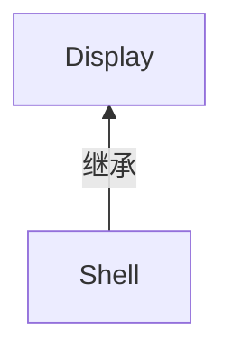

# EclipseSDK

# 《Eclipse 插件开发学习笔记》

## 1. Eclipse

Eclipse中其实内嵌了Java编译器，其编译器的作用等同于jdk中的javac，所以eclipse其实只需要jre就可以编译java文件（在eclipse中当你保存一个java类时，它就会自动编译这个java类，相当于在命令行中用了javac这个命令）。但如果你在eclipse中用了maven这样的工具，可能就无法编译了。因为maven默认使用javac来编译项目的，也就是需要jdk，而如果你的eclipse中某maven项目只指定了jre，就会出现无法编译的情况。就像是启动Tomcat只需要jre，原因是Tomcat中已经包括了源代码编译器，不需要jdk中的javac来编译。

A. Window->preferences->Java->Installed JREs

B.给不同的项目选择不同的jre, 右击项目名称->build path->configure build path,选择libraries选项卡，选中jre.

## 2. SWT

### 1. 简介

SWT(Standard Widget Toolkit，标准图形工具箱)，结合AWT和Swing。

AWT：所有控件都可以在本地图形系统中找到，对用户操作的反应速度快，其缺点就是支持的控件太少，使得页面单调难看。

Swing：将所有的控件都“画”了出来。这使得Swing可以完全控制界面的“长相”，Swing完全脱离操作系统控件的支持，意味着它不能使用操作系统的消息处理机制而必须自己管理这些消息。

SWT使用了JNI技术。JNI(Java Native Interface)是Sun公司为Java语言设计的用来与C/C++程序交互的技术。JNI封装在SWT内部。

### 2. SWT结构

第一层：SWT外部API

第二层：JNI。这一层的代码只在SWT内部可见。

第三层：使用C语言编写的操作系统本地动态链接库文件。在Windows平台上编译成DLL文件，在Linux so文件。

### 3. 组件

组件分为控件(Control)和项目(Item)两大部分。

<font color=blue>**== Display和Shell ==**</font>

```java
// 没有Display，SWT程序就无法和操作系统交互。只允许一个display，否则抛出SWT异常。
Display display = Display.getDefault(); 
Shell shell = new Shell(display);// 表示一个窗口。子 Shell s2 = new Shell(shell);
shell.setSize(100，100);
shell.open();
shell.layout();
while (!shell.isDisposed()){ // 进入事件循环
	if (!display.readAndDispatch()) // 1. 首先从系统事件队列中读取消息，如果在程序的事件队列中读到事件，就将它发送到窗口去处理；2. 如果在线程交互的事件队列中有需要执行的事件，就去执行它。
        display.sleep(); // 当前线程(UI线程)休眠。当事件队列中有新的事件传来时，UI线程会被唤醒并恢复事件循环过程。
}
display.dispose();
```




### 4. 布局 Layout

### 5. 事件 Event

| 监听器             | 事件名         | 描述                                             |
| ------------------ | -------------- | ------------------------------------------------ |
| MouseListener      | MouseEvent     | 监听鼠标按钮按下的事件                           |
| MouseMoveListener  | MouseEvent     | 监听鼠标移动事件                                 |
| MouseTrackListener | MouseEvent     | 监听鼠标进入、离开事件源的事件                   |
| KeyListener        | KeyEvent       | 监听按键事件                                     |
| ControlListener    | ControlEvent   | 监听控件尺寸或位置改变的事件                     |
| DisposeListener    | DisposeEvent   | 监听控件被销毁(Dispose)的事件                    |
| FocusListener      | FocusEvent     | 监听控件得到焦点的事件                           |
| SelectionListener  | SelectionEvent | 监听控件被选中(按钮被单击，复选框被勾选等)的事件 |

### 6. 图形类与系统资源管理

SWT使用单线程模式。

需要手动释放创建的资源，释放父资源时，所有子资源会被一起释放 (Disposing the parent disposes the children)。

## 3. JFACE

JFace完全使用SWT API进行开发。

### 3.1 查看器 Viewer

查看器()是使用MVC模式对一些复杂控件做的封装，以方便开发人员使用这些控件。目前的查看器包括列表查看器 (ListViewer)、表格查看器(TableViewer)、树查看器(TreeViewer)等。

### 3.2 资源注册表

Face在JFaceResources类中为这些注册表提供了采用Singleton模式的实现。有效地避免因为忘记释放资源而导致的系统资源泄漏问题。

### 3.3 字段帮助

### 3.4 操作和贡献

### 3.5 对话框、向导页和偏好设置

### 3.6 数据绑定

# 《Eclipse 插件开发》

# 《GEF 红皮书》

# THE END