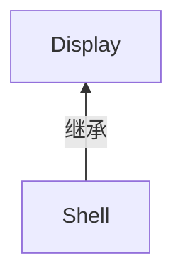
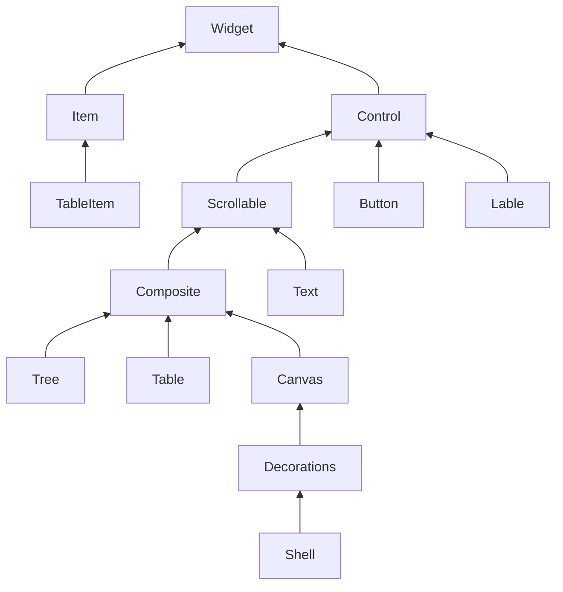

# EclipseSDK

# 《Eclipse 插件开发学习笔记》

## 1. Eclipse

Eclipse中其实内嵌了Java编译器，其编译器的作用等同于jdk中的javac，所以eclipse其实只需要jre就可以编译java文件（在eclipse中当你保存一个java类时，它就会自动编译这个java类，相当于在命令行中用了javac这个命令）。但如果你在eclipse中用了maven这样的工具，可能就无法编译了。因为maven默认使用javac来编译项目的，也就是需要jdk，而如果你的eclipse中某maven项目只指定了jre，就会出现无法编译的情况。就像是启动Tomcat只需要jre，原因是Tomcat中已经包括了源代码编译器，不需要jdk中的javac来编译。

A. Window->preferences->Java->Installed JREs

B.给不同的项目选择不同的jre, 右击项目名称->build path->configure build path,选择libraries选项卡，选中jre.

## 2. SWT

### 1. 简介

SWT(Standard Widget Toolkit，标准图形工具箱)，结合AWT和Swing。

AWT：所有控件都可以在本地图形系统中找到，对用户操作的反应速度快，其缺点就是支持的控件太少，使得页面单调难看。

Swing：将所有的控件都“画”了出来。这使得Swing可以完全控制界面的“长相”，Swing完全脱离操作系统控件的支持，意味着它不能使用操作系统的消息处理机制而必须自己管理这些消息。

SWT使用了JNI技术。JNI(Java Native Interface)是Sun公司为Java语言设计的用来与C/C++程序交互的技术。JNI封装在SWT内部。

**NOTE：**SWT提供了一个org.eclipseswtawt.SWT_AWT类，SWT_AWT桥。实现在SWT中使用Swing。

### 2. SWT结构

第一层：SWT外部API

第二层：JNI。这一层的代码只在SWT内部可见。

第三层：使用C语言编写的操作系统本地动态链接库文件。在Windows平台上编译成DLL文件，在Linux so文件。

### 3. 组件

组件分为控件(Control)和项目(Item)两大部分。

<font color=blue>**== Display和Shell ==**</font>

```java
// 没有Display，SWT程序就无法和操作系统交互。只允许一个display，否则抛出SWT异常。
Display display = Display.getDefault();
Shell shell = new Shell(display);// 表示一个窗口。子 Shell s2 = new Shell(shell);
shell.setSize(100，100);
shell.open();
shell.layout();
while (!shell.isDisposed()){ // 进入事件循环
	if (!display.readAndDispatch()) // 1. 首先从系统事件队列中读取消息，如果在程序的事件队列中读到事件，就将它发送到窗口去处理；2. 如果在线程交互的事件队列中有需要执行的事件，就去执行它。
        display.sleep(); // 当前线程(UI线程)休眠。当事件队列中有新的事件传来时，UI线程会被唤醒并恢复事件循环过程。
}
display.dispose();
```



<font color=blue>**== 监视器 ==**</font>

```java
Monitor monitor = display.getPrimaryMonitor(); // getMonitors(); 多个监视器
monitor.getClientArea(); 	//  整个桌面大小
monitor.getBounds();		//	可以显示窗口的区域(除去任务栏)
```

#### 3.1 控件




<font color=blue>**== 控件样式 ==**</font>

```java
Button button = new Button(shell, SWT.BORDER | SWT.PUSH);
button.setImage(image);
button.setText("Push Button");
button.setBounds(20, 10, 150, 25);
button.getSelection(); // 返回boolean
// Button Styles:
ARROW, CHECK, PUSH, RADIO, TOGGLE, FLAT
UP, DOWN, LEFT, RIGHT, CENTER
// Control Styles:
BORDER
LEFT_TO_RIGHT, RIGHT_TO_LEFT // 图片显示在文字左边，图片显示在文字右边

final Label label = new Label(shell, SWT.BORDER);
label.setImage(image);
label.setBounds(10, 10, 120, 50);
label.setText(""); // text 和 image 只会显示一个。
// 对Label使用样式SWT.SEPARATOR 可以使控件显示成一根水平或竖直的分隔线 
// SWT.HORIZONTAL or SWT.VERTICAL
Label horLine = new Label(shell, SWT.SEPARATOR | SWT.HORIZONTAL | SWT.BORDER);
horLine.setBounds(10, 10, 100, 20);

Text text = new Text(shell, SWT.BORDER);
// SWT.READONLY 样式，这时文本框的背景色将由默认的白色变为灰色，当鼠标单击文字时仍然可以显示编辑光标，也可以拖动鼠标来选择一片文字，对只读的文本框，仍然可以使用setText来改变它的内容。
// SWT.PASSWORD 样式，这个样式会使文本框将输入的所有文字都显示成密码字符, 可以用Text.setEchoChar方法来改变默认的密码字符.
```

<font color=blue>**== 控件继承检查 ==**</font>

<font color=blue>**== 控件的用户数据 ==**</font>

```java
Text text = new Text(shell, SWT.NONE);
text.setText("Article Content");
text.setData("Version", "1.2"); // 不会影响文本框的显示内容
```

<font color=blue>**== 控件的释放 ==**</font>

因此手动释放控件会导致一系列的问题，如果不是万不得已，最好不要手动释放一个控件，而应该交由SWT系统自动释放它们。

#### 3.2 图形资源

```java
// Color
Color color = new Color(Display.getDefault(), 255, 0, 0);
color.dispose(); // 需要手动释放

Display display = Display.getDefault();
Color cyanColor = display.getSystemColor(SWT.COLOR_CYAN); // 不能手动释放

// image 1
Image image = new Image(Display.getDefault(), "c:\lgraphic.bmp");

// image 2
PaletteData palette = new PaletteData(0xFF, OxFF00, 0xFF0000);
//设置了RGB三种颜色的掩码
ImageData imageData = new ImageData(48, 48, 24, palette);
for(int x = 0; x < 48; x++)
	for(int y = 0; y < 48; y++)
		imageData.setPixel(x, y, 0xFF);
		//将48*48的图像全部设置成红色
// 或者
ImageData imageData = new ImageData("D:\\test.bmp");
Image image = new Image(Display.getDefault(), imageData);
image.dispose();

// image 3
Display display = Display.getDefault();
Image image = display.getSystemImage(SWT.ICON_ERROR);
button.setImage(image);

// image 4
Image image = new Image(display, UsingImage.class.getResourceAsStream("img.bmp"));

// Font
Font sysFont = display.getSystemFont();
Font createdTahoma = new Font(display, "Tahoma", 10, SWT.BOLD);
```

<font color=blue>**== Item ==**</font>

```java
// 系统托盘
Tray systemTray = display.getSystemTray();  	// 不需要释放
TrayItem newItem = new TrayItem(systemTray, SWT.NONE); // 需要释放
newItem.setImage(display.getSystemImage(SWT.ICON ERROR));
newItem.setToolTipText("Test Tray!");

final Menu menu = new Menu(shell, SWT.POP UP);
MenuItem item1 = new MenuItem(menu, SWT.PUSH);
item1.setText("Menu Item 1");
MenuItem item2 = new MenuItem(menu, SWT.PUSH);
item2.setText("Menu Item 2");
// Region
Display display = Display.getDefault();
final Shell shell = new Shell(display, SWT.NO_TRIM);
Region region = new Region(display);
region.add(new Rectangle(10,10, 10, 100));
region.add(new Rectangle(10, 100, 100, 10));
region.add(new Rectangle(10, 10, 100, 10));
region.add(new Rectangle(100, 10, 10, 100));
shell.setRegion(region);
Color color = new Color(null, 255, 0, 0);
shell.setBackground(color);
shell.open();
// 使用SWT.NO_TRIM指明了需要创建的是一个没有边框，没有标题栏的窗口。只有这样的窗口才能用setRegion来指定它的形状。
```


### 4. 布局 Layout

### 5. 事件 Event

| 监听器             | 事件名         | 描述                                             |
| ------------------ | -------------- | ------------------------------------------------ |
| MouseListener      | MouseEvent     | 监听鼠标按钮按下的事件                           |
| MouseMoveListener  | MouseEvent     | 监听鼠标移动事件                                 |
| MouseTrackListener | MouseEvent     | 监听鼠标进入、离开事件源的事件                   |
| KeyListener        | KeyEvent       | 监听按键事件                                     |
| ControlListener    | ControlEvent   | 监听控件尺寸或位置改变的事件                     |
| DisposeListener    | DisposeEvent   | 监听控件被销毁(Dispose)的事件                    |
| FocusListener      | FocusEvent     | 监听控件得到焦点的事件                           |
| SelectionListener  | SelectionEvent | 监听控件被选中(按钮被单击，复选框被勾选等)的事件 |

### 6. 图形类与系统资源管理

SWT使用单线程模式。

需要手动释放创建的资源，释放父资源时，所有子资源会被一起释放 (Disposing the parent disposes the children)。

### 7. 多线程

只有UI 线程可以操作Display, 否则异常。

Display维护了一个自定义的事件队列，这个队列就是用来供后台线程和UI线程同步的。后台线程用Runnable对象将绘图操作包装起来，然后将对象插入事件队列中，这样Display执行消息循环时就会执行这些操作了。

> Display.syncExec(Runnable runnable)
>
> > 同步调用。调用这个方法会通知UI线程在下一次事件循环时执行runnable参数的run方法。调用这个方法的线程将被阻塞到runnable执行完成为止。如果参数是null，调用这个函数会唤醒休眠中的UI线程。
>
> Display.asyncExec(Runnable runnable)
>
> > 异步调用。调用这个方法会通知UI线程在下一次事件循环时执行runnable参数的run方法。调用这个方法的线程不会被阻塞，而且在runnable执行完成后不会得到通知。如果参数是nul1，调用这个函数会唤醒休眠中的UI线程。

```java
button.addSelectionListener(new SelectionAdapter() {
	public void widgetSelected(final SelectionEvent e){
        Thread thread = new Thread() {
            public void run(){
                try{
					Thread.sleep(10000);
                } catch (InterruptedException el) {
                    el.printStackTrace();
                }
                display.syncExec(new Runnable() {
					public void run(){
						button.setText("Execution Done");
                    }
                }
            }
        }
        thread.start();
    }
}
// 执行这段代码可以发现，单击按钮后，界面不再出现停止响应的状况，而且10秒钟后按钮的文字同样变化了。
```


## 3. JFACE

JFace完全使用SWT API进行开发。

### 3.1 查看器 Viewer

查看器()是使用MVC模式对一些复杂控件做的封装，以方便开发人员使用这些控件。目前的查看器包括列表查看器 (ListViewer)、表格查看器(TableViewer)、树查看器(TreeViewer)等。

### 3.2 资源注册表

Face在JFaceResources类中为这些注册表提供了采用Singleton模式的实现。有效地避免因为忘记释放资源而导致的系统资源泄漏问题。

### 3.3 字段帮助

### 3.4 操作和贡献

### 3.5 对话框、向导页和偏好设置

### 3.6 数据绑定

# 《Eclipse 插件开发》

# 《GEF 红皮书》

# THE END