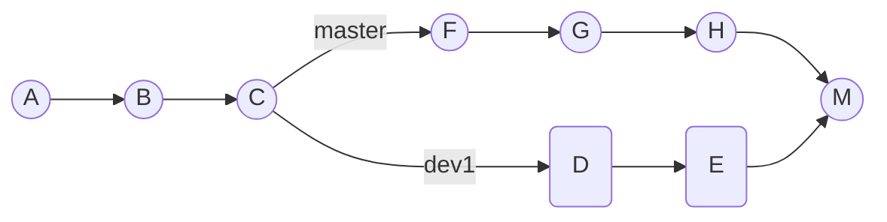
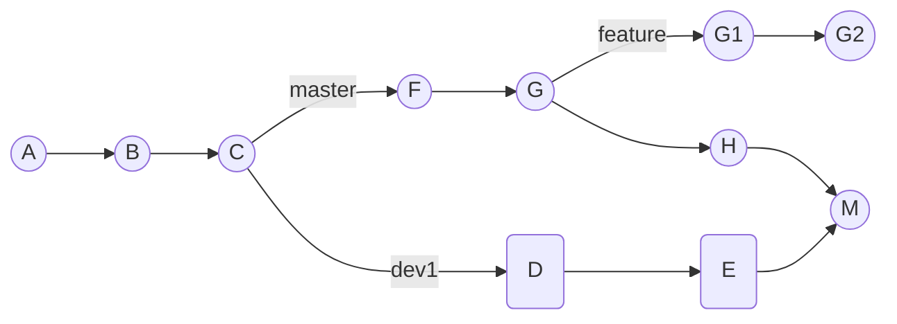
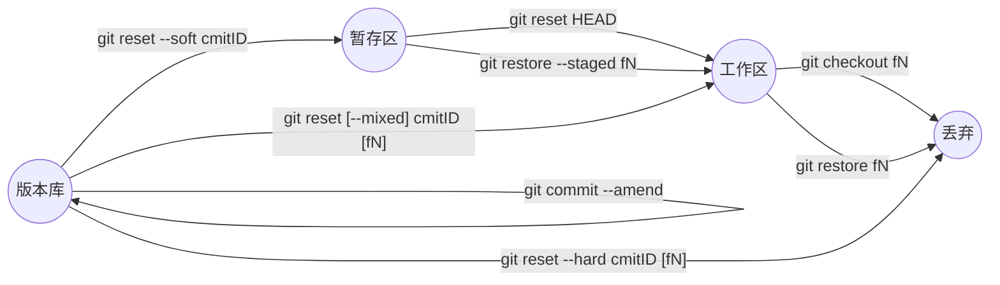

# Git

## 1. 简介
创始人：Linux创始人，Linus Torvalds。

2005年，BitKeeper 不再免费。

拥有难以置信的非线性分支管理系统。

集中式版本控制系统（DVCS), 分布式版本控制系统（DVCS）。

### 1.1 GIT, GitHub 与 GitLab

* Git是一个版本控制软件

* GitHub与GitLab都是用于管理版本的服务端软件

* GitHub提供免费服务(代码需公开)及付费服务(代码为私有)

* GitLab用于在企业内部管理Git版本库,功能上类似于GitHub

### 1.2 为何？

  本地建立版本库。会有一个全量变化而不是增量(SVN)的变化。

  SVN只有一个版本库(commit ID 可以自增)(本地只有代码), Git有多个版本库 （commit ID是一个摘要值，这个值通过sha1计算出出来的）。

### 1.3 安装

地址： https://git-scm.com/downloads

`git --version` ：查看安装的Git版本

`git config --list` : 查看config信息。

## 2. 创建Git本地库

  which git：git在什么地方。

1. 新建一个文件夹。
2. git init: 创建了当前文件夹的git仓库。
   1. **.get目录下：管理了git。**
   2. git init --bare 创建一个裸库，原 .git 目录下的文件在当前目录下

3. git clone 地址 [自定义名字]：新建了一个文件夹的git仓库。

## 3. .git目录

| .git 中的目录or文件 |                                                           |
| ------------------- | --------------------------------------------------------- |
| /hooks              |                                                           |
| /info               | 包含全局性排除文件                                        |
| /logs               | 日志                                                      |
| /objects            | Git 数据库。<br />树对象，总是覆盖。<br />提交对象，      |
| /refs               | 表示一系列的引用，保存包含`heads`、`remote`、`tags`等目录 |
| /refs/heads         | 保存了分支以及其对应的提交对象(对象文件值存hash值)。      |
| config              | 保存了本地仓库的配置信息                                  |
| description         | 仓库信息                                                  |
| HEAD                | 指向当前正在工作的分支, 例如ref: refs/heads/test          |
| index               | 存储的是暂存区内容                                        |

## 4. Git 常用命令

### 4.1 配置

   user.name与user.email的设置。

1. /etc/gitconfig （电脑）, git config --system
2. ~/.gitconfig (用户) , git config --global
3. .git/config  (特定项目) , git config --local

| 命令                                                         |                                                 |
| ------------------------------------------------------------ | ----------------------------------------------- |
| git config                                                   | 打开使用方式说明                                |
| git config [--system] -l <br/>git config user.name           | 看config所有信息<br />看config中的user.name的值 |
| git config --local user.name '李四'<br />git config --local unset user.name | 配置<br />取消                                  |

### 4.2 工作区域

| 命令                                                    |                                                              |
| :------------------------------------------------------ | ------------------------------------------------------------ |
| git init                                                | 初始化一个空的git库在当前目录。（如果.git被删除，就不是一个GIT管理的仓库）<br />工作区域：工作区。<br />状态：untracked or modified |
| git add<br/>git add \* : 提交所有，越过gitignore        | 库中生成git对象 --> 进入staged : <br />工作区域：暂存区。<br />状态：staged |
| git commit <br />or<br />git commit -a (跳过暂存区操作) | 进入版本库：<br />工作区域：Git 版本库<br />状态：committed  |
| git rm <br />rm<br/>git rm --cached                     | 删除文件，在暂存区<br />删除文件，在工作区<br />变为untracked file. |
| git mv 原文件名 新文件名 / mv                           |                                                              |
| git log -n                                              | 看最近n条提交                                                |
| git log --pretty=oneline<br />git log --oneline         | 每个commit显示到一行                                         |
| git log --pretty=format ....                            | 自定义格式                                                   |

| diff命令                                                     |                            |
| ------------------------------------------------------------ | -------------------------- |
| git diff                                                     | 工作区和暂存区             |
| git diff HEAD                                                | 工作区和版本库             |
| git diff --cached [commit_ID]<br />git diff --staged （1.6.1以上） | 暂存区和版本库             |
| git blame 文件名                                           | 快速查看文件是被谁修改的。 |

## 5. .gitignore

自己新建一个.gitignore  --> 提交这个文件进库

```shell
# 注释以井号开头
# 不追踪这个文件了
setting.properties 

# 星号“*” ：匹配多个字符。忽略所有.b结尾的
*.b 

# a.b 除外
!a.b

# 问号“?”：匹配除 ‘/’外的任意一个字符；

# 问号“?”：匹配除 ‘/’外的任意一个字符。test.i文件、test.o文件被忽略
*.[io]

# 只忽略根目录下TODO文件
/TODO 
/**/ab # 一个星表示一层目录，两个星表示所有层的目录
```

## 6. 分支

SVN分支是重量级，git分支只是创建了指针。

分支：指向最新提交对象的一个指针，一个commit对象链。每个commit有个parent commit。

分支本质：其实就是一个提交对象, 所有分支都有可能被HEAD所引用。

HEAD: 是一个指针。 默认指向master分支，切换分支时其实就是让HEAD指向不同的分支，每次有新的提交时HEAD都会带着当前指向的分支一起往前移动。

master：指向的是提交。

| 命令                                                        |                                                              |
| ----------------------------------------------------------- | ------------------------------------------------------------ |
| git branch                                                  | 查看本地所有分支。                                           |
| git branch brname [commitID]                                | 创建分支。只是更新指针的指向，轻量级。                       |
| git branch brname commitID                                  | 新建分支。                                                   |
| git checkout brname                                         | 切换分支。HEAD指向当前分支。也可以git checkout -,  回刚刚的分支。切换分支会改变工作目录中的文件为当前分支的，之前untracked文件会保留， 没有add的文件会无法切换。 |
| git checkout -b brname                                      | 创建并且切换。                                               |
| git branch -d brname                                        | 删除分支。只能删除另一个分支。没有merge无法删除。<br/>-D：强制删除。 |
| git merge 另一个分支                                        | 把另一个分支的内容合并过来。自动merge时，fast-forward, 删除分支时会丢掉分支信息。 |
| git branch --merged                                         | 已经合并的分支。git branch --no-merged: 还没有被合并的。     |
| git branch -v                                               | 显示最近一条commit。                                         |
| git branch -vv                                              | 查看本地分支对应的远程分支。                                 |
| git branch -r                                               | 查看远程分支。                                               |
| git branch -a                                               | 显示所有分支包括远程分支。                                   |
| git status --graph                                          | 。                                                           |
| git reset HEAD^<br/>git reset HEAD~1<br/>git reset commitID | ^代表回退版本个数。<br/>1: 代表第一个提交<br/>git checkout commitID: 可以创建一个游离的分支。 |
| git reflog                                                  | git的操作日志。                                              |
| git remote [-v]                                             | 查看远程仓库. -v 详细                                        |

## 7. 标签

标签本身就是一个ID，并且指向一个commit ID。

`git show tagName` : 查看标签。

`git tag [-a] v1.0.1 [-m '内容']` ：新建标签。-a：会强制要求-m，通过-m添加是附注标签。

`git push origin 标签名 ` ：推送到远程。`git push origin --tags` :推送所有标签。

`git tag [-l 正则]` : 查看标签。标签本质特定标记，指向一个commitID. github中release统计标签

`git tag -d v1.0.1` ：删除标签。

`git push origin --delete tag v1.0.1` ：删除远程标签。

`git push origin :refs/tags/标签名 ` ：删除远程标签。

## 8. GitHub

1. 在GitHub创建仓库。

2. `git remote add origin 仓库地址` : origin是默认名字，代表后面紧接着的地址。（关联远程库）

3. `git push -u origin master`: 加了参数-u后，以后即可直接用git push代替git push origin master。（生成远程跟踪分支）

`git remote show` : 显示当前库关联的所有远程仓库。

`git remote show 别名` : 显示详情。

`git branch -u 地址/分支`： 本地分支跟踪远程分支。

或者用SSH通过秘钥链接。

## 9.进阶命令

| 命令                                                         |                                  |
| ------------------------------------------------------------ | -------------------------------- |
| git gui                                                      | 打开图形化界面                   |
| git config --global alias.名字 原名字<br />git config --global alias.名字 '!命令'<br />vi ~/.gitconfig | git 别名                         |
| git push --set-upstream origin develop （跟8.3相同，但是推荐这个） | 将本地分支变为远程               |
| git checkout -b develop origin/develop 或者<br />git checkout --track origin/develop | 创建一个本地分支跟远程的分支对应 |
| git push origin --delete 名字                                | 删除远程分支                     |
| git push origin 本地名：远端名                               | git push 完整写法                |
| git gc                                                       |                                  |
| git remove --cache                                           | 从暂存区删除，本地保留。         |

| git 存储                      |                          |
| ----------------------------- | ------------------------ |
| git stash list                | 查看存储。               |
| git stash show [stash@{2}]    | 查看哪些修改。           |
| git stash show [stash@{2}] -p | 查看修改内容。           |
| git stash [save '注释']       | 不会存储 untracked files |
| git stash apply [stash@{2}]   | 默认栈顶。               |
| git stash drop [stash@{2}]    | 丢弃。                   |
| git stash clear               |                          |
| git stash pop [stash@{1}]     |                          |

## 10. submodule

`git submodule add 另一个库远程地址 新目录`  : 自动生成 .gitmodules文件和新目录存放另一库代码

<u>git pull：</u>

> cd到submodule 中 git pull更新代码，或者，git submodule foreach git pull
> 在本库git add commit push

<u>git clone:</u> 

> git clone 地址 [自定义文件夹]
> git submodule init
> git submodul update --recursive
>
> or
>
> git clone 地址 [自定义文件夹]  --recursive

## 11. subtree

在主分支：

`git remote add subtree-origin 地址`  ：引入子仓库

`git subtree add --prefix=subtree subtree-origin master` : 关联分支。--squash: 只将本次操作在主仓库生成一条commit记录，子仓库的历史记录并不会合并进来。（三方合并存在问题）

`git subtree` : 查看subtree所有命令。

## 12. Cherry-pick

`git cherry-pick (commitidA..commitidB]` :  不包含A 

`git cherry-pick A^..B` ：包含A

**<u>拉出dev1分支随后合并分支：</u>**



<u>**拉出feature分支：**</u>



此时发现需要把分支dev1的改动(D和E)合并进来,  此时使用使用`git cherry-pick -m 1 <hash M>`就会把commit D和E的内容复制到分支feature上面来。1：原始分支号dev1，2: 变动来源分支master。


## 13. Git rebase

**<u>合并分支：</u>**

```bash
git rebase -i commitID # 合并这个commit之后的提交(该节点不参与合并)。 -i: --interactive let the user edit the list of commits to rebase.

pick cmidff1 第一个提交
pick cmidff2 第二个提交
s cmidff3 第三个提交
s cmidff4 第四个提交

p，pick：使用该次提交
r，reword：使用该次提交，但重新编辑提交信息
e，edit：使用该次提交，但停止到该次提交
s，squash：将该commit和前一个commit合并
f，fixup：将该commit和前一个commit合并，但不保留该提交的注释信息
x，exec：执行shell命令
d，drop：丢弃该commit
```

## 14. Git Objects

Git的核心部分是一个简单的键值对数据库。

可以向数据库插入任何类型的内容，返回一个键值，通过键值可以再次检索该内容。

### 14.1 Git 对象 （文件版本）

Git对象，用来存储文件内容，**一个文件生成一个git对象**。Git对象，存储键值对对象。

`git hash-object -w 文件名` ：生成git对象，存的全量不是增量,  <font color="#ff0000">**放到/objects中**</font>，返回key : value对应的hash值, value: blob类型, 文件内容作为值。

`git cat-file -p 文件夹+文件名` : 查看object内容。

`git cat-file -t 文件夹+文件名` : 查看object类型。

### 14.2 树对象 （项目版本）

树对象，解决文件名保存问题。存储git对象hash, 对象文件名和子树对象。

`git update-index --add --cacheinfo 100644 hash值 文件名` ：<font color="#ff0000">**往暂存区(.git/index)添加一个对象。**</font>

> 100644，表明这是一个普通文件。
>
> --add: 加入暂存区, 第一次添加需要。
>
> --cacheinfo: 要将添加的文件位于Git数据库中。

git write-tree : 将暂存区的tree写入/objects

`git ls-files -s` ： 查看暂存区。

`git read-tree --prefix=bak 树对象hash` ：树对象链接树对象。

`git write-tree` : 把树对象读入暂存区。

### 14.3 提交对象 

`echo 'first commit' | git commit-tree treeid [-P ]` ：<font color="#ff0000">  **创建提交对象, 存到.git/objects** </font>

<font color="#cc9900"> **git add = git hash-object -w 文件名 + git udate-index ...**</font>

<font color="#cc9900"> **git commit = git write-tree + git commit-tree**</font>

## 15. 撤回
​				**fN: fileName**



## 16. pull request


## NOTE: 

ORIG_HEAD: 远程的HEAD.
FETCH_HEAD: 从远程拉取的HEAD.

# THE END
