# Git

## 1. 简介

创始人：Linux创始人，Linus Torvalds。

2005年，BitKeeper 不再免费。

拥有难以置信的非线性分支管理系统。

集中式版本控制系统（Centralized Version Control Systems), 分布式版本控制系统（Distributed Version Control Systems）。

## 2. 安装与配置

地址： https://git-scm.com/downloads

`git --version` : 查看安装的Git版本

1. /etc/gitconfig (系统）, git config --system
2. ~/.gitconfig (用户) , git config --global
3. .git/config (仓库) , git config --local

user.name与user.email的设置。

```shell
git config --global user.name "John Doe"
git config --global user.email johndoe@example.com
git config --local --unset user.name             # 取消配置
```

```shell
git config --list [--show-origin]    # 查看config信息。配置所在文件。
git config [--system] user.name     # 检查某一项配置

git help <verb>
git <verb> --help
man git-<verb>
git add -h:                 # -h：只显示可用选项
```

## 3. 仓库

**生成本地库**

1. 新建一个文件夹。
2. git init: 创建了当前文件夹的git仓库, 生成 `.git` 目录。
   1. **.get目录下：管理了git。**（如果.git被删除，就不是一个GIT管理的仓库）
   2. git init --bare 创建一个裸库，原 .git 目录下的文件在当前目录下
3. git clone 地址 [自定义名字]：新建了一个文件夹的git仓库

| .git目录    |                                                                        |
| ----------- | ---------------------------------------------------------------------- |
| hooks/      | 客户端或服务端的钩子脚本                                               |
| info/       | 包含全局性排除文件, 放置那些不希望被记录在 .gitignore 文件中的忽略模式 |
| logs/       | 日志                                                                   |
| objects/    | Git 数据库。<br />树对象，总是覆盖。<br />提交对象，                   |
| refs/       | 表示一系列的引用，保存包含 `heads`、`remote`、`tags`等目录       |
| refs/heads/ | 保存了分支以及其对应的提交对象(对象文件值存hash值)。                   |
| config      | 保存了本地仓库的配置信息                                               |
| description | 仅供 GitWeb 程序使用，我们无需关心。                                   |
| HEAD        | 它是一个指针，指向当前所在的本地分支, 例如ref: refs/heads/test         |
| index       | 存储的是暂存区内容                                                     |

**远程库**

| git仓库                       |                                                                   |
| ----------------------------- | ----------------------------------------------------------------- |
| git remote                    | 列出所有指定的远程仓库的简写。例：origin。“origin” 并无特殊含义 |
| git remote -v                 | 显示需要读写远程仓库使用的 Git 保存的简写与其对应的 URL           |
| git remote add repoName url   | 添加一个新的远程 Git 仓库。                                       |
| git fetch\<repoName>          | 从远程仓库中获得数据.同步远程仓库数据                             |
| git push repoName branch     | 推送到远程仓库。                                                  |
| git remote show repoName      | 查看远程仓库信息。                                                |
| git remote rename name1 name2 |                                                                   |
| git remote remove repoName    | 移除仓库。                                                        |

## 4. 文件状态周期

### 4.1 工作区域

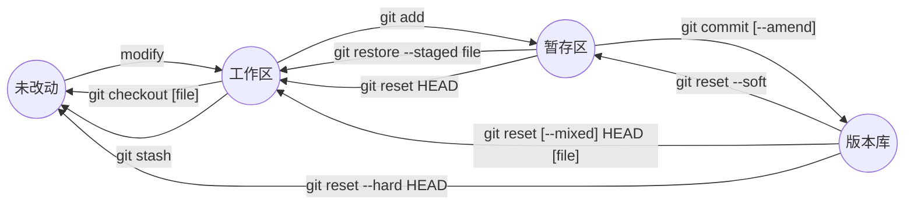

工作区：状态：untracked or modified

暂存区：状态：staged

版本库：状态：committed

`git reset`:

* --hard：重置位置的同时，直接将 working Tree工作目录、 index 暂存区及 repository 都重置成目标Reset节点的內容,所以效果看起来等同于清空暂存区和工作区。
* --soft：重置位置的同时，保留working Tree工作目录和index暂存区的内容，只让repository中的内容和 reset 目标节点保持一致，因此原节点和reset节点之间的【差异变更集】会放入index暂存区中(Staged files)。所以效果看起来就是工作目录的内容不变，暂存区原有的内容也不变，只是原节点和Reset节点之间的所有差异都会放到暂存区中。
* --mixed（默认）：重置位置的同时，只保留Working Tree工作目录的內容，但会将 Index暂存区 和 Repository 中的內容更改和reset目标节点一致，因此原节点和Reset节点之间的【差异变更集】会放入Working Tree工作目录中。所以效果看起来就是原节点和Reset节点之间的所有差异都会放到工作目录中。

对于git restore `<file>`命令，会撤销文件的修改，使文件恢复到暂存区或本地代码库(取决于文件在修改前的状态)；

| add               | 工作区 --> 暂存区       |
| ----------------- | ----------------------- |
| git add file_name |                         |
| git add .         | 提交所有改动            |
| git add\*         | 提交所有，越过gitignore |
| git add -i        | 交互式暂存              |

```shell
$ git add -i
          staged     unstaged path
  1:    unchanged        +0/-1 TODO
  2:    unchanged        +1/-1 index.html
  3:    unchanged        +5/-1 lib/simplegit.rb
*** Commands ***
  1: [s]tatus     2: [u]pdate      3: [r]evert     4: [a]dd untracked
  5: [p]atch      6: [d]iff        7: [q]uit       8: [h]elp
1: 状态
2：输入要暂存的，例如 1,2
3：输入要取消暂存的，例如 1
4：暂存untracked
5：暂存部分
6：查看已暂存内容

git reset --patch 部分重置文件。
git checkout --patch 部分检出文件。
git stash save --patch 部分暂存文件。
```

| commit                          | 暂存区 --> 版本库                  |
| ------------------------------- | ---------------------------------- |
| git commit                      | (每一次提交，都是对项目作一次快照) |
| git commit -v                   | 额外diff 输出呈现在编辑器中。      |
| git commit -a                   | 跳过暂存区操作。                   |
| git commit --amend [--no-edit]  | 覆盖提交，不仅仅是提交的message    |
| git config --global core.editor | 自定义编辑器。                     |

**Note:** 退出编辑器时，Git 会丢弃注释行。

| remove                   |                            |
| ------------------------ | -------------------------- |
| rm                       | 从工作区删除文件。         |
| git rm                   | 从暂存区和工作区删除文件。 |
| git rm --cached          | 从暂存区删除，本地保留。   |
| git mv file_from file_to | rename文件                 |

```shell
git rm log/\*.log
# 注意到星号 * 之前的反斜杠 \， 因为 Git 有它自己的文件模式扩展匹配方式，所以我们不用 shell 来帮忙展开
git rm \*~
# 该命令会删除所有名字以 ~ 结尾的文件。
```

### 4.2 查看历史

`git status [-s] 或 [--short]`

```shell
$ git status -s
M   README
MM     Rakefile
A      lib/git.rb
M      lib/simplegit.rb
??     LICENSE.txt

# 左边暂存区，右边工作区
# 新添加到暂存区中的文件前面有 `A `标记，修改过的文件前面有 M 标记。
# `??`： 新添加的未跟踪文件
```

| log                                             |                                    |
| :---------------------------------------------- | ---------------------------------- |
| git log -n                                      | 看最近n条提交                      |
| git log  -p 或 --patch                          | 显示提交的内容差异                 |
| git log --stat [--shortstat]                    | 列出移除或添加行的数量             |
| git log --pretty=oneline<br />git log --oneline | 每个commit显示到一行               |
| git log --pretty=format:"%h - %an, %ar : %s"    | 自定义格式                         |
| git log --graph                                 | 展示分支、合并历史                 |
| git log --relative-date                         | 显示相对时间                       |
| git log --since=2.weeks                         | 显示匹配时间的提交                 |
| git log --author=name                           | 显示匹配作者的提交                 |
| git log --grep=str                              | 显示匹配comments的提交             |
| git log -S str                                  | 显示添加或删除内容匹配字符串的提交 |
| git log file_path                               | 文件修改历史                       |
| git log --no-merges                             | 不显示merged提交                   |

**NOTE:**

```shell
git log --pretty=format:"%h %s" --graph
git log --since="2008-01-15"
git log -S function_name
```

### 4.3 查看改动

| diff命令                                                           |                              |
| ------------------------------------------------------------------ | ---------------------------- |
| git diff                                                           | 工作区和暂存区               |
| git diff HEAD                                                      | 工作区和版本库               |
| git diff --cached [commit_ID]<br />git diff --staged （1.6.1以上） | 暂存区和版本库               |
| git diff --check                                                   | 空白错误校验                 |
| git difftool [--tool-help]                                         | 系统支持哪些 Git Diff 插件。 |
| git blame 文件名                                                   | 快速查看文件是被谁修改的。   |
| git show --raw [HEAD]                                              | 每个提交的完整 SHA-1校验     |
| git show --stat [HEAD]                                             | 每个文件的修改行。           |
| git show [HEAD]                                                    | 查看修改的文件内容。         |
| git status -v                                                      | 查看详细修改内容             |

```shell
--raw
:100644 100644 61ecb53 def01c4 M      file.txt

--stat
 file1.txt |  2 +-
 file2.txt | 10 +++++-----
 2 files changed, 6 insertions(+), 6 deletions(-)
```

### 4.4 grep

| git grep + 参数               |                                                                        |
| ----------------------------- | ---------------------------------------------------------------------- |
| -n “字符串”                 | 或者 `--line-number`，显示行号                                       |
| -c “字符串”                 | 或者 `--count`，显示在每个文件中匹配数                               |
| -p 字符串 文件                | 或者 `--show-function`，字符串所在的方法或函数                       |
| --break                       | 选项会将搜索结果以文件为单位进行分隔，并在每个文件的结果之间添加空行。 |
| --heading                     | 选项会在每个文件的搜索结果之前打印文件名及文件路径的标题。             |
| -e pattern1 -e pattern2       | 搜索结果需要满足任何一个模式才能被返回                                 |
| --and pattern1 pattern2       | 搜索结果需要满足所有条件才能被返回                                     |
| -L\:git_deflate_bound\:zlib.c | 展示代码中一行或者一个函数的历史                                       |

`git log -L '/unsigned long git_deflate_bound/',/^}/:zlib.c` 这个命令的含义如下：

* `git log` 是 Git 的一个命令，用于查看版本历史记录。
* `-L` 是一个选项，用于告诉 Git 启用对代码行的跟踪。
* `'/unsigned long git_deflate_bound/'` 和 `/^}/` 是两个正则表达式，用于指定要跟踪的代码行的范围。这里的意思是，从包含 `unsigned long git_deflate_bound` 的行开始，到以 `}` 结束的行结束。
* `:zlib.c` 是文件名，即要查看的代码文件。

### 4.5 stash

可以应用到不同的branch

| git 存储                       |                          |
| ------------------------------ | ------------------------ |
| git stash                      | 贮藏                     |
| git stash --keep-index         | 同时保留在索引中。       |
| git stash -u                   | 也会贮藏未跟踪文件       |
| git stash list                 | 查看存储。               |
| git stash show [stash@{2}]     | 查看哪些修改。           |
| git stash show [stash@{2}] -p  | 查看修改内容。           |
| git stash [save '注释']        | 不会存储 untracked files |
| git stash apply [stash@{2}]    | 贮藏但不丢弃。           |
| git stash apply --index        | 暂存区的会回到暂存区     |
| git stash drop [stash@{2}]     | 丢弃。                   |
| git stash clear                |                          |
| git stash pop [stash@{1}]      | 应用并丢弃。             |
| git stash branch newBranchName | 从贮藏创建branch         |
| git stash --patch              | 分批贮藏                 |

**patch**

```bash
git format-patch <commit-range> #生成补丁
git am [-3] name.patch # 应用补丁 -3:三方合并
```

## 5. .gitignore

自己新建一个.gitignore  --> 提交这个文件进库

1. 可以使用标准的 glob 模式匹配，它会递归地应用在整个工作区中。

   * 所谓的 glob 模式是指 shell 所使用的简化了的正则表达式。
   * 星号（`*`）匹配零个或多个任意字符；
   * `[abc]` 匹配任何一个列在方括号中的字符 （这个例子要么匹配一个 a，要么匹配一个 b，要么匹配一个 c）；
   * 问号（`?`）只匹配一个任意字符；
   * 如果在方括号中使用短划线分隔两个字符， 表示所有在这两个字符范围内的都可以匹配（比如 `[0-9]` 表示匹配所有 0 到 9 的数字）。
   * 使用两个星号（`**`）表示匹配任意中间目录，比如 `a/**/z` 可以匹配 `a/z` 、 `a/b/z` 或 `a/b/c/z` 等。
2. 匹配模式可以以（`/`）开头防止递归。
3. 匹配模式可以以（`/`）结尾指定目录。

```shell
# 注释以井号开头
# 不追踪这个文件了
setting.properties 

# 忽略所有.b结尾的
*.b 

# 跟踪所有a.b，即便你在前面忽略了 .b 文件
!a.b

# 只忽略当前目录下的 TODO 文件，而不忽略 subdir/TODO
/TODO

# 忽略任何目录下名为 build 的文件夹
build/

# 问号“?”：匹配除 ‘/’外的任意一个字符。t.i文件、t.o文件被忽略
*.[io]

# 忽略 doc/notes.txt，但不忽略 doc/server/arch.txt
doc/*.txt

# 忽略 doc/ 目录及其所有子目录下的 .pdf 文件
doc/**/*.pdf
```

一个项目可以有多个gitignore 文件，例如子目录下可以有额外的 .gitignore。

**Note:** GitHub 有一个十分详细的针对数十种项目及语言的 .gitignore 文件列表: https://github.com/github/gitignore

`<font color="green">`**git clean** `</font>`

* `-n`, `--dry-run`: 显示将要移除的文件和目录，而不实际执行移除操作。
* `-f`, `--force`: 强制执行移除操作，即使有些文件被其他文件或目录所追踪。
* `-d`, `--dir`: 移除所有未追踪的目录，而不仅仅是文件。
* `-x`, `--exclude-standard`: 仅移除标准的忽略文件和目录（如 `.gitignore`文件中定义的）。

## 6. 分支

### 6.1 本地分支

SVN分支是重量级，git分支只是创建了指针。

分支本质：本质上仅仅是指向提交对象的可变指针。

创建分支：创建了一个可以移动的新的指针。

HEAD: 是一个指针。 默认指向master分支，切换分支时其实就是让HEAD指向不同的分支，每次有新的提交时HEAD都会带着当前指向的分支一起往前移动。

master：指向的是提交。master 分支并不是一个特殊分支，是因为 git init 命令默认创建它。


| 命令                                                               |                                                                                                                                                                  |
| ------------------------------------------------------------------ | ---------------------------------------------------------------------------------------------------------------------------------------------------------------- |
| git branch                                                         | 查看本地所有分支。                                                                                                                                               |
| git branch brname [commitID]                                       | 创建分支。只是更新指针的指向，轻量级。                                                                                                                           |
| git checkout brname                                                | 切换分支。HEAD指向当前分支。也可以git checkout -,  回刚刚的分支。切换分支会改变工作目录中的文件为当前分支的，之前untracked文件会保留， 没有add的文件会无法切换。 |
| git checkout -b newbranchname [origin/master]                      | 或者git checkout --track origin/develop<br />创建并且切换。[ 将本地分支与远程分支设置为不同的名字 ]                                                              |
| git branch -d brname                                              | 删除分支。只能删除另一个分支。没有merge无法删除。-D：强制删除。                                                                                                  |
| git branch -v                                                      | 显示每个分支最后一次commit。                                                                                                                                     |
| git branch -vv                                                     | 查看本地分支对应的跟踪分支。                                                                                                                                     |
| git branch -r                                                      | 查看远程跟踪分支。                                                                                                                                               |
| git branch -a                                                      | 显示所有分支包括远程跟踪分支。                                                                                                                                   |
| git reset commitID                                                 | 可以创建一个游离的分支。                                                                                                                                         |
| git reflog                                                         | git的操作日志。                                                                                                                                                  |
| git push origin --delete 分支名                                    | 删除分支。                                                                                                                                                       |
| git push origin 本地名 [: 远端名]                                  | git push 完整写法                                                                                                                                                |
| git gui                                                            | 打开图形化界面                                                                                                                                                   |
| git push --set-upstream origin develop （跟8.3相同，但是推荐这个） | 将本地分支变为远程                                                                                                                                               |
| git gc                                                             |                                                                                                                                                                  |

### 6.2 分支合并

```shell
git merge hotfix # 把另一个分支的内容合并过来。删除分支时会丢掉分支信息。三方合并时会创建一个新的commit。
git mergetool # 可视化工具。
git branch --merged # 已经合并到当前分支的分支。--no-merged: 还没有被合并的。

# 所有被 refA 或 refB 包含的但是不被 refC 包含的提交
git log refA refB --not refC

# 在 experiment 分支中而不在 master 分支中的提交
git log master..experiment
# master 或者 experiment 中包含的但不是两者共有的提交
git log master...experiment

# --left-right，它会显示每个提交到底处于哪一侧的分支
git log --left-right master...experiment

# 查看即将推送到远端的内容
git log origin/master..HEAD
```

**分支合并：** 合并了 idea 和 v2 分支之后的提交历史。当你新建和合并分支的时候，所有这一切都只发生在你本地的 Git 版本库中 —— 没有与服务器发生交互。

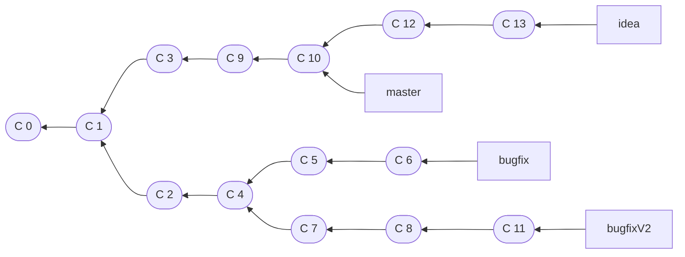

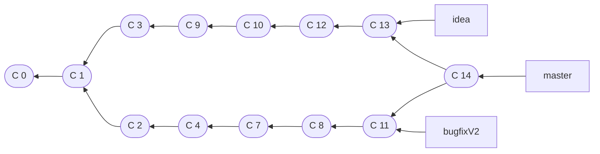

**Note:** 当你试图合并两个分支时， 如果顺着一个分支走下去能够到达另一个分支，那么 Git 在合并两者的时候， 只会简单的将指针向前推进（指针右移），因为这种情况下的合并操作没有需要解决的分歧——这就叫做 “快进（fast-forward）”。

### 6.2 远程跟踪分支

1. 远程跟踪分支是远程分支状态的引用。它们是你无法移动的本地引用。一旦你进行了网络通信， Git 就会为你移动它们以精确反映远程仓库的状态。请将它们看做书签， 这样可以提醒你该分支在远程仓库中的位置就是你最后一次连接到它们的位置。例如， `origin/master` 。
2. 当克隆一个仓库时，它通常会自动地创建一个跟踪 `origin/master` 的 `master` 分支。
3. `git fetch origin` :  从origin中抓取本地没有的数据，并且更新本地数据库，移动 `origin/master` 指针到更新之后的位置。
4. 当抓取到新的远程跟踪分支时，本地不会自动生成一份可编辑的副本（拷贝）。 这种情况下，不会有一个新的本地分支——只有一个不可以修改的 `origin/master` 指针。
5. 可以运行 `git merge origin/master` 将这些工作合并到当前所在的分支。 如果想要在自己的 `master` 分支上工作，可以将其建立在远程跟踪分支之上：`git checkout -b master origin/master`,这会给你一个用于工作的本地分支 `master`
6. 从一个远程跟踪分支检出一个本地分支会自动创建所谓的“跟踪分支”（它跟踪的分支叫做“上游分支”）。 跟踪分支是与远程分支有直接关系的本地分支, 如果在一个跟踪分支上输入 `git pull`，Git 能自动地识别去哪个服务器上抓取、合并到哪个分支。
7. 修改正在跟踪的上游分支: `-u` 或 `--set-upstream-to` 选项运行 `git branch` 来显式地设置。

```console
$ git branch -u origin/master
```

### 6.3 HEAD

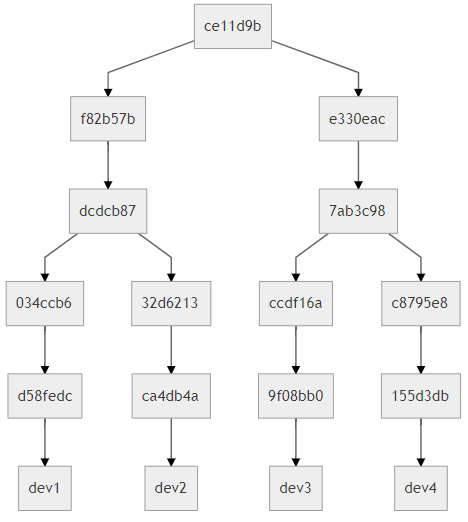

```shell
$ git rev-parse --short HEAD~
f82b57b

$ git rev-parse --short HEAD^
f82b57b

$ git rev-parse --short HEAD~1
f82b57b

$ git rev-parse --short HEAD^1
f82b57b

$ git rev-parse --short HEAD~~
dcdcb87

$ git rev-parse --short HEAD^^
dcdcb87

$ git rev-parse --short HEAD~2
dcdcb87

$ git rev-parse --short HEAD^2
e330eac
```

HEAD~~ 实际上是 HEAD~1~1的简写，而~ 后的数字就是指的后退的步数，所以 HEAD~~ 等价于 HEAD~2，属于一种合并计算。

HEAD^^ 是 HEAD^1^1 的简写，而 ^ 后面的数字表示后退一步到第几个父提交上，因为数字是1，所以 HEAD^^ 表示退一步到第一个父提交上，再退一步到第一个父提交上，这时与 HEAD~~ 的作用是相同的。

HEAD^2 就有些不同了，它表示后退一步到第二个父提交上，所以对照树形图是第二排的第二个节点。

## 7. 标签与别名

标签本身就是一个ID，并且指向一个commit ID。

`git tag [-l]` : 列出已有标签。 `git tag -l "v1.8.5*"` : 匹配模式必须要加 -l

`git tag [-a] v1.0.1 [-m '内容']` ：新建标签。-a：会强制要求-m，通过-m添加是附注标签。

`git tag tagName 9fceb02` : 补上标签

`git show tagName` : 查看标签。

`git push origin 标签名 ` ：推送到远程。`git push origin --tags` :推送所有标签。

`git tag -d v1.0.1` : 删除标签。

`git push origin --delete tag v1.0.1` ：删除远程标签。

`git push origin :refs/tags/标签名 ` ：删除远程标签。

```shell
# 轻量标签（lightweight)
$ git tag v1.0
$ git show v1.0
commit ca82a6dff817ec66f44342007202690a93763949
Author: Scott Chacon <schacon@gee-mail.com>
Date:   Mon Mar 17 21:52:11 2008 -0700

    changed the version number

# 附注标签（annotated)
$ git tag -a v1.0 -m "my version 1.0"
$ git show v1.0
tag v1.0
Tagger: Ben Straub <ben@straub.cc>
Date:   Sat May 3 20:19:12 2014 -0700

my version 1.0

commit ca82a6dff817ec66f44342007202690a93763949
Author: Scott Chacon <schacon@gee-mail.com>
Date:   Mon Mar 17 21:52:11 2008 -0700

    changed the version number
```

**别名**

vi ~/.gitconfig  git 别名

设置别名：`git config --global alias.co checkout`

取消别名：`git config --global --unset alias.co`

如果执行的是外部命令，而不是一个 Git 子命令，可以在命令前面加入 ! 符号。

`git config --global alias.名字 '!命令'`

## 9. git协议

### 9.1 四种协议

1. 本地协议（Local protocol）： 其中的远程版本库就是同一主机上的另一个目录。
2. HTTP 协议：

> `git clone https://example.com/gitproject.git`
>
> 可以使用用户名／密码授权是一个很大的优势。
>
> 在一些服务器上，架设 HTTPS 协议的服务端会比 SSH 协议的棘手一些。

3. SSH 协议

> 大多数环境下服务器已经支持通过 SSH 访问。
>
> `git clone ssh://[user@]server/project.git`
>
> 或者使用一个简短的 scp 式的写法：`git clone [user@]server:project.git` 如果不指定可选的用户名，那么 Git 会使用当前登录的用的名字。
>
> SSH 协议的缺点在于它不支持匿名访问 Git 仓库。
>
> SSH 密钥存储在其 `~/.ssh` 目录下
>
> ssh-keygen -o ，然后它会要求你输入两次密钥口令。 如果你不想在使用密钥时输入口令，将其留空即可。
>
> id_rsa.pub

4. Git 协议:

> Git 协议是 Git 使用的网络传输协议里最快的。
>
> Git 协议缺点是缺乏授权机制。

### 9.2 GitHub

SVN只有一个版本库(commit ID 可以自增)(本地只有代码), Git有多个版本库 （commit ID是一个摘要值，这个值通过sha1计算出出来的）。

本地建立版本库，会有一个全量变化而不是增量(SVN)的变化。

**GIT, GitHub 与 GitLab**

* Git是一个版本控制软件
* GitHub与GitLab都是用于管理版本的服务端软件
* GitHub提供免费服务(代码需公开)及付费服务(代码为私有)
* GitLab用于在企业内部管理Git版本库,功能上类似于GitHub

1. 在GitHub创建仓库。
2. `git remote add origin 仓库地址` : origin是默认名字，代表后面紧接着的地址。（关联远程库）
3. `git push -u origin master`: 加了参数-u后，以后即可直接用git push代替git push origin master。设置成默认跟踪分支。

`git remote set-url <url>` : 修改关联的远程仓库地址。

`git remote show` : 显示当前库关联的所有远程仓库。

`git remote show 别名` : 显示详情。

`git branch -u 地址/分支`： 本地分支跟踪远程分支。

或者用SSH通过秘钥链接。

🟦 **fork** 🟦


1. Fork仓库：在 GitHub 上找到你要 Fork 的仓库，点击仓库页面右上角的 “Fork” 按钮。这将创建一个你自己的远程仓库副本（也就是 Fork 仓库）。
2. 克隆仓库：在你的计算机上克隆 Fork 仓库。

   ```bash
   git clone <forked_repository_url>
   ```

3-4-5-6 add, commit, push，github上PR

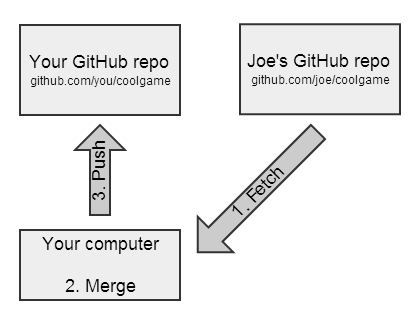

```bash
   git remote add upstream <原始仓库的 URL>
   git pull upstream
   git push
```

`<font color=green>`**使用token提交** `</font>`

1. 获取token令牌: 右上角头像 -->  Settings -->  Developer settings --> token
2. generate token，复制token值。(token 需要的access：Commit statuses 和 Contents)
3. git remote add origin https://[TOKEN]@github.com[USER]/[REPO]
4. git push -u origin master : 不需要进行用户名登录，直接使用token值推送。

## 10. submodule

`git submodule add 另一个库远程地址 新目录`  : 自动生成 .gitmodules文件和新目录存放另一库代码

`<u>`git pull：`</u>`

> cd到submodule 中 git pull更新代码，或者，git submodule foreach git pull
> 在本库git add commit push

`<u>`git clone:`</u>`

> git clone 地址 [自定义文件夹]
> git submodule init
> git submodul update --recursive
>
> or
>
> git clone 地址 [自定义文件夹]  --recursive

## 11. subtree

在主分支：

`git remote add subtree-origin 地址`  ：引入子仓库

`git subtree add --prefix=subtree subtree-origin master` : 关联分支。--squash: 只将本次操作在主仓库生成一条commit记录，子仓库的历史记录并不会合并进来。（三方合并存在问题）

`git subtree` : 查看subtree所有命令。

## 12. Cherry-pick

`git cherry-pick (commitidA..commitidB]` :  不包含A

`git cherry-pick A^..B` ：包含A

**`<u>`拉出dev1分支随后合并分支：`</u>`**

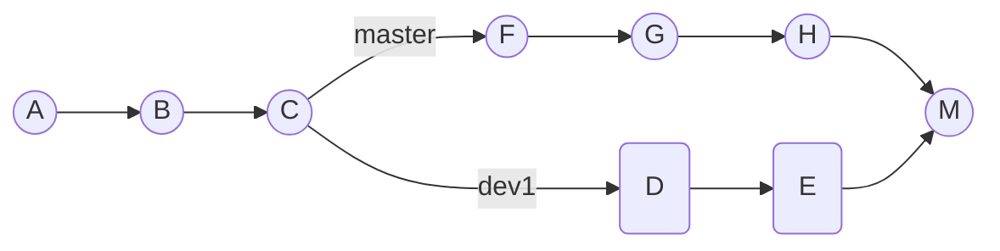

`<u>`**拉出feature分支：**`</u>`

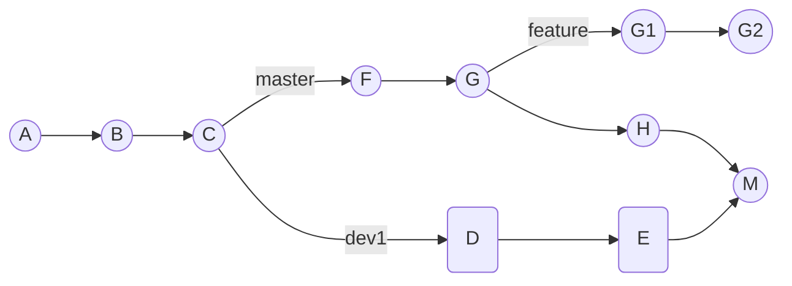

此时发现需要把分支dev1的改动(D和E)合并进来,  此时使用使用 `git cherry-pick -m 1 <hash M>`就会把commit D和E的内容复制到分支feature上面来。1：原始分支号dev1，2: 变动来源分支master。


## 13. Git rebase

`<font color=blue>`**merge** `</font>`

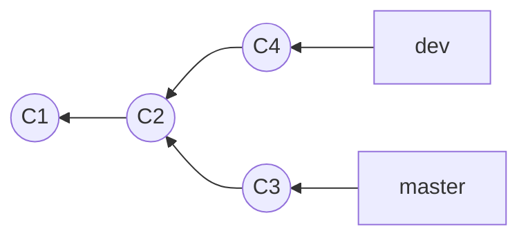

`git merge dev`

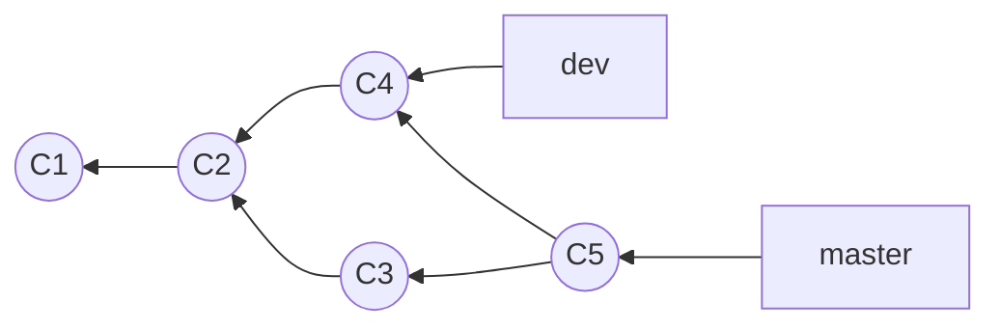

`<font color=blue>`**rebase** `</font>`

提取在 C4 中引入的补丁和修改，然后在 C3 的基础上应用一次。

`git checkout dev`

`git rebase master`

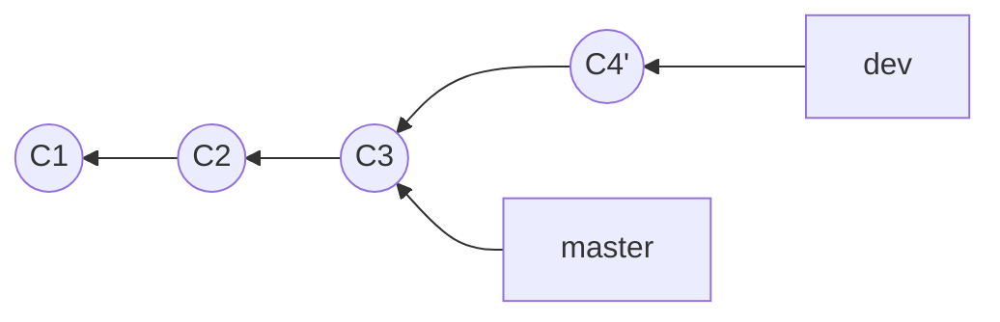

进行一次快进合并。

`git checkout master`

`git merge dev`

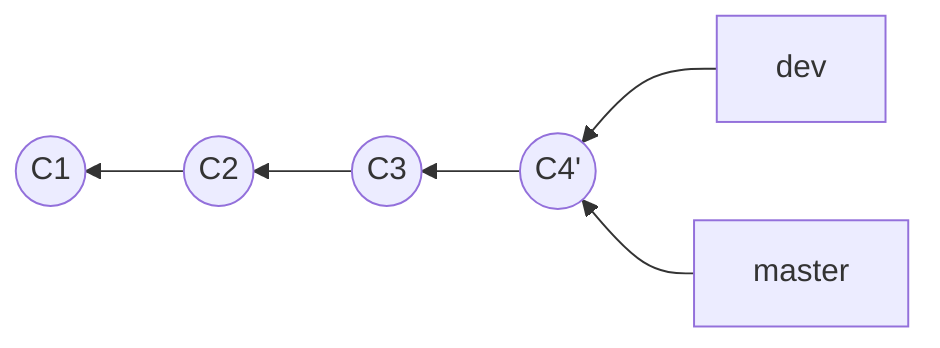

 C4' 和C5一模一样，区别是提交历史更加整洁。

或者：在master上 `git rebase <basebranch> <topicbranch>`

`git rebase --onto master server client` : 取出 `client` 分支，找出它从 `server` 分支分歧之后的补丁， 然后把这些补丁在 `master` 分支上重放一遍，让 `client` 看起来像直接基于 `master` 修改一样。

**NOTE :** 如果将已经提交至某个仓库的，并且其他人也已经从该仓库拉取到的提交进行变基并再次推送，会有问题发生。

**`<u>`合并提交：`</u>`**

```bash
git rebase -i commitID # 合并这个commit之后的提交(该节点不参与合并)。 -i: --interactive let the user edit the list of commits to rebase.

pick cmidff1 第一个提交
pick cmidff2 第二个提交
s cmidff3 第三个提交
s cmidff4 第四个提交

p，pick：使用该次提交
r，reword：使用该次提交，但重新编辑提交信息
e，edit：使用该次提交，但停止到该次提交
s，squash：将该commit和前一个commit合并
f，fixup：将该commit和前一个commit合并，但不保留该提交的注释信息
x，exec：执行shell命令
d，drop：丢弃该commit
```

## 14. 内部原理

Git 是一个内容寻址文件系统，Git的核心部分是一个简单的键值对数据库。

可以向数据库插入任何类型的内容，返回一个键值，通过键值可以再次检索该内容。

**Git 对象 （文件版本）**

Git对象，用来存储文件内容，**一个文件生成一个git对象**。Git对象，存储键值对对象。

`git hash-object -w 文件名` ：生成git对象，存的全量不是增量,  `<font color="#ff0000">`**放到/objects中** `</font>`，返回key : value对应的hash值, value: blob类型, 文件内容作为值。

`git cat-file -p 文件夹+文件名` : 查看object内容。

`git cat-file -t 文件夹+文件名` : 查看object类型。

**树对象 （项目版本）**

树对象，解决文件名保存问题。存储git对象hash, 对象文件名和子树对象。

`git update-index --add --cacheinfo 100644 hash值 文件名` ：`<font color="#ff0000">`**往暂存区(.git/index)添加一个对象。**`</font>`

> 100644，表明这是一个普通文件。
>
> --add: 加入暂存区, 第一次添加需要。
>
> --cacheinfo: 要将添加的文件位于Git数据库中。

git write-tree : 将暂存区的tree写入/objects

`git ls-files -s` ： 查看暂存区。

`git read-tree --prefix=bak 树对象hash` ：树对象链接树对象。

`git write-tree` : 把树对象读入暂存区。

**提交对象**

`echo 'first commit' | git commit-tree treeid [-P ]` ：`<font color="#ff0000">`  **创建提交对象, 存到.git/objects** `</font>`

`<font color="#cc9900">` **git add = git hash-object -w 文件名 + git udate-index ...**`</font>`

`<font color="#cc9900">` **git commit = git write-tree + git commit-tree** `</font>`

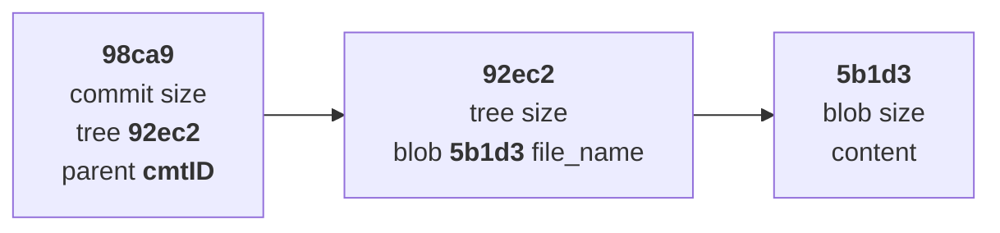

## NOTE:

ORIG_HEAD: 远程的HEAD.
FETCH_HEAD: 从远程拉取的HEAD.

# THE END