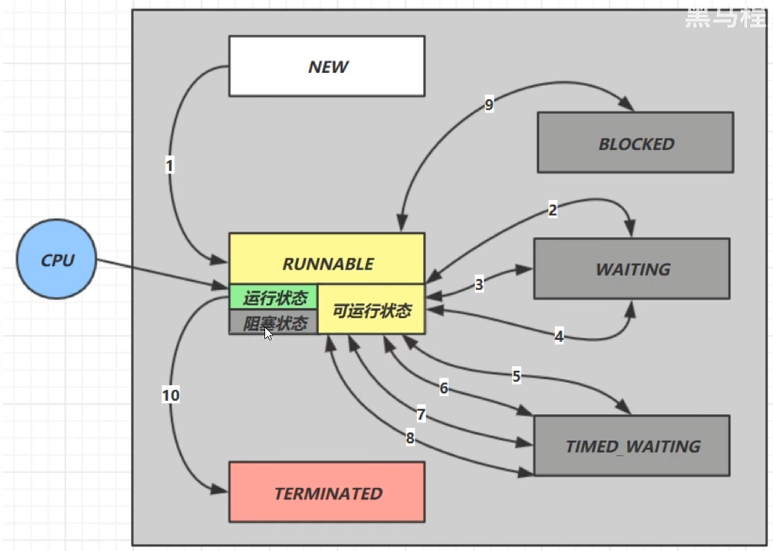
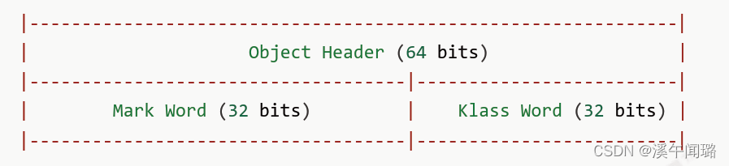
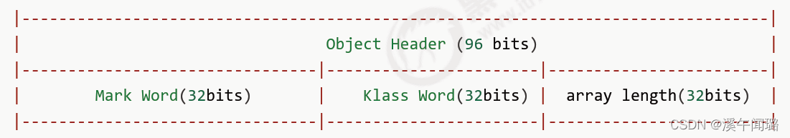
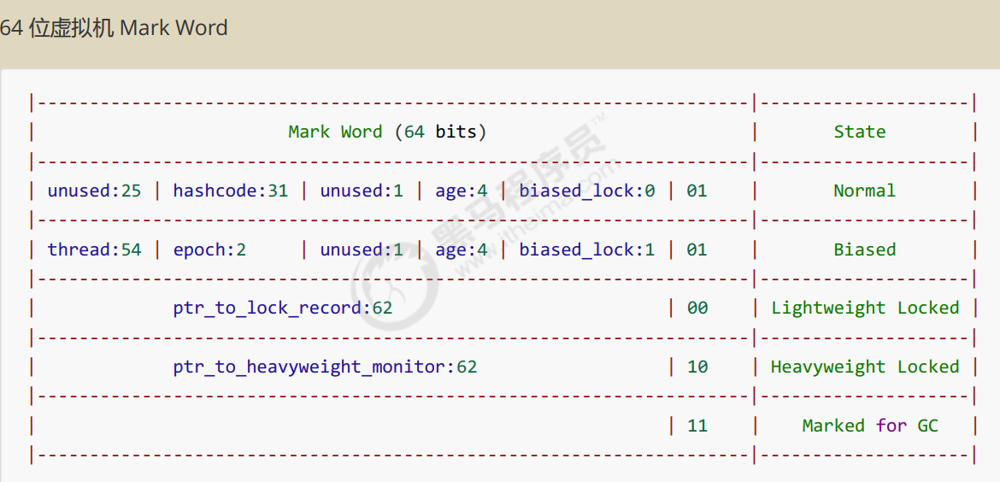
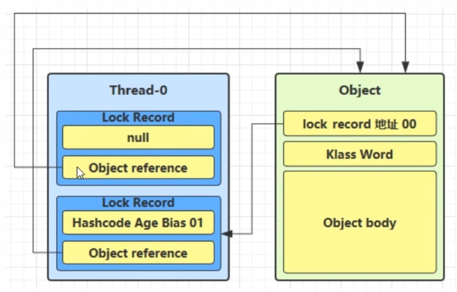
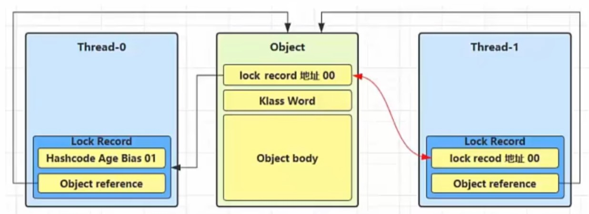
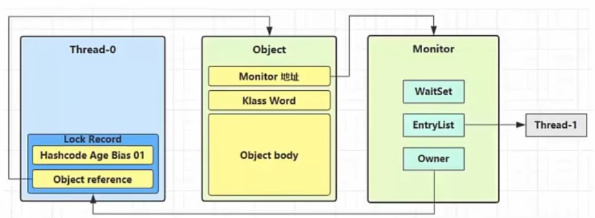
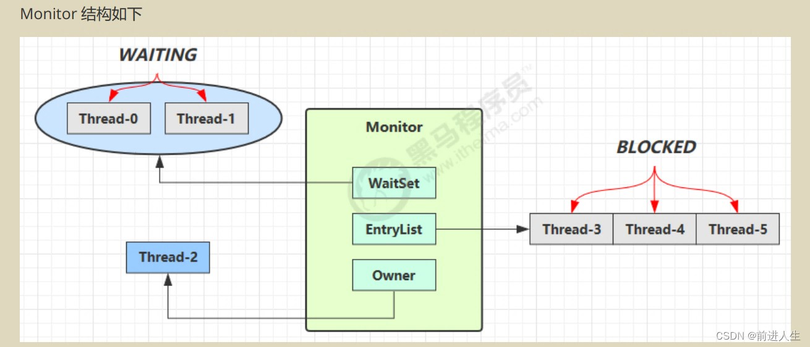
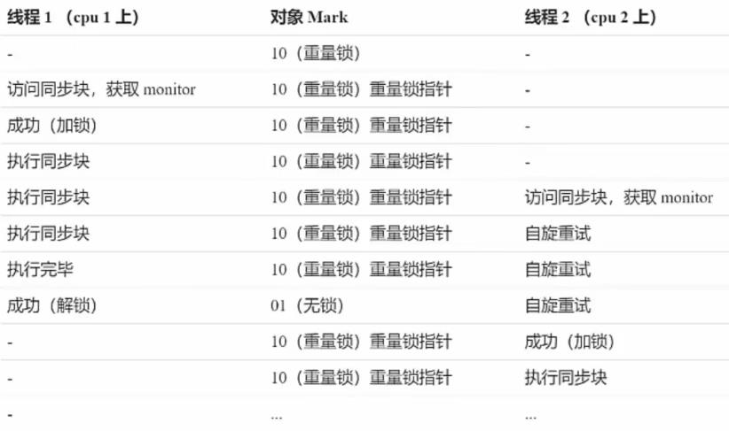

# Java Util Concurrent

## 1. 进程与线程

**程序：** program。为完成特定任务，用某种语言编写的一组指令的集合。即指一段静态的代码，静态对象。

程序由指令和数据组成，但这些指令要运行，数据要读写，就必须将指令加载至 CPU，数据加载至内存。在指令运行过程中还需要用到磁盘、网络等设备。进程就是用来加载指令、管理内存、管理 IO 的。

**进程：** process。**进程就可以视为程序的一个实例**。是程序的一次执行过程，或是正在运行的一个程序。是一个动态过程：生命周期。当一个程序被运行，从磁盘加载这个程序的代码至内存，这时就开启了一个进程。

**线程：** thread。是一个程序内部的一条执行路径。

> 作为调度和执行的单位，每个线程拥有独立的运行栈和程序计数器(pc)。
>
> 一个进程中的多个线程共享相同的内存单元。

Java 中，线程作为最小调度单位，进程作为资源分配的最小单位。在 windows 中进程是不活动的，只是
作为线程的容器。

**二者对比**

* 进程基本上相互独立的，而线程存在于进程内，是进程的一个子集
* 进程拥有共享的资源，如内存空间等，供其内部的线程共享
* 进程间通信较为复杂
  * 同一台计算机的进程通信称为IPC(Inter-process communication)
  * 不同计算机之间的进程通信，需要通过网络，并遵守共同的协议，例如HTTP
* 线程通信相对简单，因为它们共享进程内的内存，一个例子是多个线程可以访问同一个共享变量
* 线程更轻量，线程上下文切换成本一般上要比进程上下文切换低

同步: 需要等待结果返回，才能继续运行。

异步: 不需要等待结果返回，就能继续运行。

 🟦 **创建和运行**  🟦

```java
// 方法一，直接使用Thread
Thread t = new Thread("线程名"){
	public void run(){
       // 要执行的任务
    }
}
// 启动线程
t.start();

extends Thread{
    @Override
	run(){
        // 重写run方法，然后 start()调用
        // 一个线程只能start()一次。
        Thread.currentThread().getName();
    }
}

// 方法二，使用Runnable
Runnable runnable = new Runnable() {
    public void run(){
        // 要执行的任务
    }
}
Thread t = new Thread( runnable ); // this.target = runnable
// 启动线程
t.start();

implements Runnable{
    @Override
	run(){
        // 重写run方法，然后new Thread(this).start()调用
    }
}

// Thread 源码
@Override
public void run() {
    if (target != null) {
        target.run();
    }
}

// 方法三，FutureTask 配合Thread。FutureTask能够接收Callable 类型的参数，用来处理有返回结果的情况。
// 本身继承了Runnable接口
FutureTask<Integer> task = new FutureTask<>(new Callable<Integer>(){
	@Override
	public Integer call() throws Exception{
        Thread.sleep(2000);
		return 100;
    }
}
Thread t1 = new Thread(task, "t1");
t1.start();
Integer result = task.get(); // 等待线程结果的返回。
```

 🟦 **查看进程与线程** 🟦

**windows：**

`tasklist | findstr java` ，`taskkill /F /PID 123456`

**Linux:**

`ps -ef | grep java `

`top -H -p pid`: 查看进程中的线程。

`jconsole` : 查看进程中的线程 (图形化)。

JDK命令：

`jps` ：查看所有Java进程

`jstack pid` : 查看进程中的线程。

 🟦 **运行原理**  🟦

<font color=blue>**== 栈与栈帧 ==**</font>

Java Virtual Machine Stacks (Java 虚拟机栈)

* 每个线程启动后，虚拟机就会为其分配一块栈内存。例如：**main 线程栈**
* 每个栈由多个栈帧(Frame)组成，对应着每次方法调用时所占用的内存。例如：**main 栈帧**
* 每个线程只能有一个活动栈帧，对应着当前正在执行的那个方法。

例如：

> main 线程栈：
>
> > **程序计数器** (Program Counter Register)：作用是记住下一条jvm指令的执行地址，是线程私有的。例如： `method1(10)`
> >
> > main栈帧：
> >
> > > 局部变量表
> > >
> > > 返回值地址
> >
> > method 1 栈帧：
> >
> > > 局部变量表
> > >
> > > 返回值地址
>

<font color=blue>**== 线程上下文切换(Thread Context Switch) ==**</font>

CPU不再执行当前的线程，转而执行另一个线程的代码。原因:

1. 线程的CPU时间片用完
2. 垃圾回收
3. 有更高优先级的线程需要运行
4. 线程自己调用了 sleep、yield、wait、join、park、synchronized、lock 等方法

当Context Switch 发生时，需要由操作系统保存当前线程的状态，并恢复另一个线程的状态。

* 状态包括程序计数器、虚拟机栈中每个栈顿的信息，如局部变量、操作数栈、返回地址等
* Context Switch 频繁发生会影响性能

## 2. 常见方法

```java
/**
 * 1. 启动一个新线程，在新的线程运行run方法中的代码。
 * 2. start 方法只是让线程进入就绪，里面代码不一定立刻运行(CPU的时间片还没分给它)。
 * 3. 每个线程对象的start方法只 能调用一次，如果调用了多次会出现IllegalThreadStateException.
 */
start();

/**
 * 新线程启动后会调用的方法。
 * 如果在构造Thread 对象时传递了 Runnable 参数，则线程启动后会调用Runnable中的run方法。
 */
run();

/**
 * 1. 让当前线程从Running 进入Timed_Waiting状态。
 * 2. 其它线程可以使用 interrupt 方法打断正在睡眠的线程，这时sleep 方法会抛出InterruptedException.
 * 3. 睡眠结束后的线程未必会立刻得到执行。
 * 4. 建议用TimeUnit的sleep 代替Thread的sleep 来获得更好的可读性。
 */
Thread.sleep(ms); // while 循环中必须sleep防止cpu占用100%。只需要1ms.

/**
 * 1. 调用yield会让当前线程从Running进入Runnable 就绪状态，然后调度执行其它线程
 * 2. 具体的实现依赖于操作系统的任务调度器 (可能没让出去)。
 */
yield();

join(); 			// 等待join进来的线程运行结束。实现原理：保护性暂停模式。
join(long n); 		// 等待join进来的线程运行结束，最多等待n毫秒
getId();			// 获取线程长整型的id
getName(); 			// 获取线程名
setName(String);
getPriority();
/**
 * 优先级是1~10的整数，较大的优先级能提高该线程被CPU调度的机率。
 * MAX_PRIORITY: 10
 * MIN_PRIORITY: 1
 * NORM_PRIORITY: 5
 */
setPriority(int);
getState(); 		// 获取线程状态. NEW, RUNNABLE, BLOCKED, WAITING, TIMED_WAITING, TERMINATED

/**
 * 1. 如果线程处于被阻塞状态，线程将立即退出并抛出一个InterruptedException。
 * 2. 如果线程处于正常活动状态，那么会将该线程的中断标志设置为true，但该线程仍将继续正常运行。
 */
interrupt();
boolean isInterrupted();   // 正常打断为true，打断阻塞线程为false。不会清除打断标记
static boolean interrupted(); // 会清除打断标记
```

🟦 **终止线程** 🟦

在一个线程 t1 中如何“优雅”终止线程 t2 ？

>错误思路
>
>1. 使用线程对象的 stop()方法停止线程
>
>   stop 方法会真正杀死线程，如果这时线程锁住了共享资源，那么当它被杀死后就再也没有机会释放锁，其它线程将永远无法获取锁
>
>2. 使用System.exit(int)方法停止线程
>
>   目的仅是停止一个线程，但这种做法会让整个程序都停止

**两阶段终止模式 Two Phase Termination**

```java
class TwoPhaseTermination{
    private Thread monitor;
	//启动监控线程
	public void start() {
        monitor = new Thread(() -> {
			while(true) {
				Thread current = Thread.currentThread();
                if(current.isInterrupted()) {
                    log.debug("料理后事");
					break;
                }
				try {
					Thread.sleep(1000); // 情况1
                    log.debug(”执行监控记录”); // 情况2
                } catch (InterruptedException e) {
					e.printStackTrace();
                    // 重新设置打断标记
                    current.interrupt();
                }
            }
        });
        monitor.start();
    }
	// 停止监控线程
	public void stop() {monitor.interrupt();}
}
```

`LockSupport.park();` 可以用interrupt()打断，打断标记, 然后线程继续执行。再次`LockSupport.park();`无效, 需要使用 `interrupted()` 重置打断标记才能再次打断。

不推荐使用的过时方法：stop(), suspend(), resume()

**守护线程：** 默认情况下，Java 进程需要等待所有线程都运行结束，才会结束。有一种特殊的线程叫做守护线程，只要其它非守护线程运行结束了，即使守护线程的代码没有执行完，也会强制结束。`t1.setDaemon(true);` 设置t1线程为当前线程守护线程。

## 3. 线程状态

从 **操作系统** 层面：**五种** 状态

> [初始状态] 仅是在语言层面创建了线程对象，还未与操作系统线程关联
>
> [可运行状态] 该线程已经被创建 (与操作系统线程关联)，可以由CPU 调度执行
>
> [运行状态] 指获取了 CPU 时间片运行中的状态
>
> >  当CPU 时间片用完，会从[运行状态] 转换至[可运行状态]，会导致线程的上下文切换
>
> [阻塞状态]
>
> > 如果调用了阻塞API，如 BIO 读写文件，这时该线程实际不会用到 CPU，会导致线程上下文切换，进入[阻塞状态]
> >
> > 等 BIO 操作完毕，会由操作系统唤醒阻塞的线程，转换至[可运行状态]
> >
> > 与[可运行状态]的区别是，对[阻塞状态]的线程来说只要它们一直不唤醒，调度器就一直不会考
> > 虑调度它们
>
> [终止状态] 表示线程已经执行完毕，生命周期已经结束，不会再转换为其它状态

从 **Java API** 层面：根据 `Thread.State` 枚举，分为 **六种** 状态

1. **NEW** : 线程刚被创建，但是还没有调用 `start()` 方法
2. **RUNNABLE** : 当调用了 start()方法之后，Java API层面的 **RUNNABLE** 状态涵盖了操作系统层面的 [可运行状态]、[运行状态] 和 [阻塞状态] (由于 BIO 导致的线程阻塞，在Java 里无法区分，仍然认为是可运行)
3. **TERMINATED** : 当线程代码运行结束
4. **BLOCKED ：**线程处于阻塞状态是由于某些原因导致线程暂时停止执行，等待某个条件的达成。例如，线程可能被某个锁对象的 `synchronized` 关键字所阻塞，或者等待某个输入/输出操作完成。一旦条件达到，线程将从阻塞状态转为可运行状态。
4. **WAITING：**线程调用 `wait()` 、`join()`  方法后。
4. **TIMED_WAITING：** 线程调用 `sleep()` 或 `wait(timeout)` 方法后。

456都是Java API层面对 [阻塞状态] 的细分



## 4. 多线程

Critical Section: 一段代码块内如果存在对共享资源的多线程读写操作，称这段代码块为临界区。

🟦 **synchronized**

```java
synchronized(对象) // 线程1， 线程2(blocked)
{
	临界区
}

synchronized 在方法上 锁对象是 this (同一对象不同方法互斥)
synchronized 在静态方法上 锁对象是 Test.class
```

🟦 **常见线程安全类**

`String` : 不可变类线程安全

`Integer` : 不可变类线程安全

`StringBuffer, Random, Vector, Hashtable, java.util.concurrent包下的类`

## 10. Java对象头

Java对象头：







运行时元数据（Mark Word）:

1. 哈希值（Hash Code）: 可以看作是堆中对象的地址
   1. 对象调用 `hashcode()` 方法，这个对象的偏向锁会被禁用。

2. GC分代年龄（年龄计数器） (用于新生代from/to区晋升老年代的标准, 阈值为15)
3. 锁状态标志 (用于JDK1.6对synchronized的优化 -> 轻量级锁)
4. 线程持有的锁
5. 偏向线程ID (用于JDK1.6对synchronized的优化 -> 偏向锁)
   1. 如果开启了偏向锁(默认开启)，那么对象创建后，markword 值为 0x05 即最后3位为 101，这时它的thread、epoch、age 都为 0
   2. 偏向锁是默认是延迟的，不会在程序启动时立即生效，如果想避免延迟，可以加 VM 参数`XX:BiasedLockingStartupDelay=0` 来禁用延迟。（`-XX:-UseBiasedLocking` 禁用偏向锁）
   3. 如果没有开启偏向锁，那么对象创建后，markword值为0x01即最后3位为001，这时它的 hashcode、age都为0，第一次用到 hashcode 时才会赋值。

6. 偏向时间戳

## 11. 轻量级锁

如果一个对象虽然有多线程访问，但多线程访问的时间是错开的(也就是没有竞争)，那么可以使用轻量级锁来优化。

轻量级锁对使用者是透明的，即语法仍然是synchronized。

```java
static final Object obj = new Object();
public static void method1() {
    synchronized( obj ) {// Lock Record +1, Lock Record 中的 reference 指向 obj
		method2();
    }
}
public static void method2() {
    synchronized( obj ) { // 锁重入 创建新的锁记录 Lock Record
    }
}
```

主要是将锁对象的Mark Word更新为指向Lock Record的指针，也就是锁记录。



1. 线程在自己的栈桢中创建锁记录 LockRecord，每个线程都的栈都会包含一个锁记录的结构。
2. LockRecord 中的 object reference ：让锁记录中 Object reference 指向锁对象，
3. LockRecord 中的 lock record 地址 00 ：并尝试用cas 换 Object 的 Mark Word，将 Mark Word 的值存入锁记录
4. 如果cas 替换成功，对象头中存储了锁记录地址和状态  00，表示由该线程给对象加锁
5. 如果加锁失败了 (对象头中存储了状态  00)，会重入 (创建新的锁记录 LockRecord，cas失败，lock record为null)，或者进入重量级锁 (锁膨胀)。



解锁：

1. 当退出 synchronized代码块(解锁时)如果有取值为 null的锁记录，表示有重入，这时重置锁记录，表示重入计数减一
2. 当退出 synchronized 代码块(解锁时)锁记录的值不为 ull，这时使用cas 将 Mark Word 的值恢复给对象头
   1. 成功，则解锁成功。
   2. 失败，说明轻量级锁进行了锁膨胀或已经升级为重量级锁，进入重量级锁解锁流程。

## 12. 锁膨胀

这时 Thread-1加轻量级锁失败，进入锁膨胀流程，即为 Object 对象申请Monitor 锁，让Object 指向重量级锁地址，然后自己进入Monitor的EntryList BLOCKED



解锁：

当Thread-0 退出同步块解锁时，使用 cas 将 Mak Word 的值恢复给对象头，失败。这时会进入重量级解锁流程，即按照Monitor 地址找到Monitor 对象，设置Owner 为 null，唤醒 EntryList 中 BLOCKED 线程

## 13. 重量级锁

加synchronized的对象关联监视器



Monitor (监视器): 由操作系统提供

1. 首先会将synchronized中的锁对象中对象头的MarkWord去尝试指向操作系统提供的Monitor对象，让锁对象中的MarkWord和Monitor对象相关联. 如果关联成功, 将obj对象头中的MarkWord的对象状态从01改为10。
2. 因为该Monitor没有和其他的obj的MarkWord相关联，所以Thread 2就成为了该Monitor的Owner(所有者)。
3. 然后，又来了一个Thread1执行synchronized(obj)代码，它首先会检查是否能执行临界区代码，即检查obj是否关联了Monitor，此时已经有关联了, 它就会去看看该Monitor有没有所有者(Owner), 发现有所有者了(Thread 2)；Thread 1也会和该Monitor关联, 该线程就会进入到它的EntryList(阻塞队列)，EntryList是一个列表，若此时Thread 3也执行到synchronized(obj)代码，也会进入阻塞队列。
4. 当Thread 2执行完临界区代码后, Monitor的Owner(所有者)就空出来了. 此时就会通知Monitor中的EntryList阻塞队列中的线程, 这些线程通过竞争, 成为新的所有者。
5. Wait Set 中的 Thread-0，Thread-1 是之前获得过锁，但条件不满足进入，调用wait 方法，即可进入Wait Set 变为 WAITING状态
6. BLOCKED和WAITING的线程都处于阻塞状态，不占用CPU时间片
7. BLOCKED线程会在Owner 线程释放锁时唤醒
8. WAITING线程会在 0wner 线程调用 notify 或 notifyAll 时唤醒，但唤醒后并不意味者立刻获得锁，仍需进入EntryList重新竞争

### 13.1 wait notify

1. `obj.wait()` 让进入object 监视器的线程到 Wait Set 等待
   1. `obj.wait(1OOO)` 顶多等待`1000ms`
2. `obj.notify()` 在object 上正在 Wait Set 等待的线程中随机挑一个唤醒
3. `obj.notifyAll()` 让object 上正在Wait Set 等待的线程全部唤醒

* sleep 是 Thread方法，而wait 是 Object 的方法
* sleep不需要强制和 synchronized 配合使用，但wait 需要和 synchronized 一起用
* sleep 在睡眠的同时，不会释放对象锁的，但 wait 在等待的时候会释放对象锁。
* 状态都是TIMED_WAITING

### 13.2 保护性暂停

即Guarded Suspension，用在一个线程等待另一个线程的执行结果。

```java
class GuardedObject {
	// 结果
	private Object response;
	// 获取结果
	public Object get() {
        synchronized (this){
            // 没有结果
            while(response == nul1) {
                try {
                    this.wait();
				} catch (InterruptedException e) {
                    e.printStackTrace();
                }
            }
			return response;
		}
    }
    
    // 产生结果
	public void complete(Object response) {
        synchronized (this) {
            // 给结果成员变量值
			this.response = response;
			this.notifyAll();
        }
    }
}

public static void main(String[] args) {
    GuardedObject guardedObject = new GuardedObject();
    new Thread(() -> {
        // 等待结果
        Object list = guardedObject.get();
    }, "t1").start();
    
    new Thread(()->{
        List<String> list = Downloader.download();
        guardedObject.complete(list);
    }, "t2").start();
}
```

## 14. 自旋优化

重量级锁竞争的时候，还可以使用自旋来进行优化，如果当前线程自旋成功(即这时候持锁线程已经退出了
同步块，释放了锁)，这时当前线程就可以避免阻塞。



* 在Java 6 之后自旋锁是自适应的，比如对象刚刚的一次自旋操作成功过，那么认为这次自旋成功的可能性会高，就多自旋几次;反之，就少自旋甚至不自旋，总之，比较智能。
* 自旋会占用CPU时间，单核CPU自旋就是浪费，多核CPU自旋才能发挥优势.。
* Java7之后不能控制是否开启自旋功能。

## 15. 偏向锁

轻量级锁在没有竞争时(就自己这个线程)，每次重入仍然需要执行 CAS操作。

Java 6中引入了偏向锁来做进一步优化: 只有第一次使用CAS 将线程ID设置到对象的 Mark Word头，之后发现这个线程ID是自己的，就表示没有竞争，不用重新 CAS。以后只要不发生竞争，这个对象就归该线程所有。

**批量重偏向**

如果对象虽然被多个线程访问，但没有竞争，这时偏向了线程 T1 的对象仍有机会重新偏向 T2，重偏向会重置对象的Thread ID.

当撤销偏向锁闻值超过 20次后，jvm 会这样觉得，我是不是偏向错了呢，于是会在给这些对象加锁时重新偏向至加锁线程

**批量撤销**

当撤销偏向锁闻值超过 40次后，ivm 会这样觉得，自己确实偏向错了，根本就不该偏向。于是整个类的所有对象都会变为不可偏向的，新建的对象也是不可偏向的。

## 16. 锁消除

JIT 即时编译器进行了优化。默认打开锁消除。


# NOTE

1. windows下CPU时间片约为 15 ms.