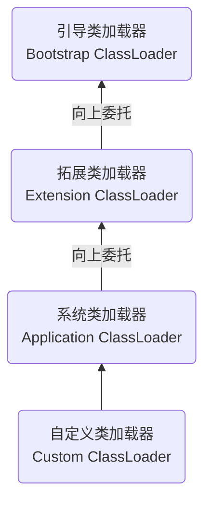

# Java Virtual Machine

## 1. 概述

JVM运行字节码文件, 二进制字节码的运行环境。

编译成字节码文件的语言：Kotlin, Clojure, Groovy, Scala, Jython, JRuby, JavaScript

虚拟机可以分为 **系统虚拟机** 和 **程序虚拟机** 。

> ​	大名鼎鼎的Visual Box，VMware就属于系统虚拟机，它们完全是对物理计算机的仿真，提供了一个可运行完整操作系统的软件平台。
>
> ​	程序虚拟机的典型代表就是Java虚拟机，它专门为执行单个计算机程序而设计，在Java虚拟机中执行的指令我们称为Java字节码指令。

### 1.1 历史

**Sun Classic VM**

早在1996年Javal.0版本的时候，Sun公司发布了一款名为Sun classicVM的Java虚拟机，它同时也是世界上第一款商用Java虚拟机，JDK1.4时完全被淘汰。

这款虚拟机内部只提供解释器。

如果使用JIT编译器，就需要进行外挂。但是一旦使用了JIT编译器，JIT就会接管虚拟机的执行系统。解释器就不再工作。解释器和编译器不能配合工作。

现在hotspot内置了此虚拟机。

**Exact VM**

为了解决上一个虚拟机问题，idk1.2时，sun提供了此虚拟机。

Exact Memory Management:准确式内存管理

> 也可以叫Non-Conservative/Accurate Memory Management
>
> 虚拟机可以知道内存中某个位置的数据具体是什么类型

具备现代高性能虚拟机的雏形

> 热点探测
>
> 编译器与解释器混合工作模式

只在Solaris平台短暂使用，其他平台上还是classic vm

> 英雄气短，终被Hotspot虚拟机替换

**SUN公司的 HotSpot VM**

HotSpot历史

> 最初由一家名为“Longview Technologies”的小公司设计
>
> 1997年，此公司被sun收购;
>
> 2009年，sun公司被甲骨文收购
>
> JDK1.3时，HotSpot VM成为默认虚拟机

目前Hotspot占有绝对的市场地位，称霸武林。

> 不管是现在仍在广泛使用的JDK6，还是使用比例较多的JDK8中，默认的虚拟机都是HotSpot
>
> Sun/oracle JDK 和 OpenJDK的默认虚拟机
>
> 因此本课程中默认介绍的虚拟机都是HotSpot，相关机制也主要是指HotSpot的GC机制。(比如其他两个商用虚拟机都没有方法区的概念)

从服务器、桌面到移动端、嵌入式都有应用。

名称中的Hotspot指的就是它的热点代码探测技术。

> 通过计数器找到最具编译价值代码，触发即时编译或栈上替换
>
> 通过编译器与解释器协同工作，在最优化的程序响应时间与最佳执行性能中取得平衡

**BEA 的 JRockit**

专注于服务器端应用

>它可以不太关注程序启动速度，因此JRockit内部不包含解析器实现，全部代码都靠即时编译器编译后执行。

大量的行业基准测试显示，JRockit JVM是世界上最快的JVM。

> 使用JRockit产品，客户已经体验到了显著的性能提高(一些超过了70% )和硬件成本的减少(达50%)

优势:全面的Java运行时解决方案组合

> JRockit面向延迟敏感型应用的解决方案JRockit Real Time提供以毫秒或微秒级的JVM响应时间，适合财务、军事指挥、电信网络的需要
>
> MissionControl服务套件，它是一组以极低的开销来监控、管理和分析生产环境中的应用程序的工具。

2008年，BEA被Oracle收购。

oracle表达了整合两大优秀虚拟机的工作，大致在JDK 8中完成。整合的方式是在HotSpot的基础上，移植JRockit的优秀特性。

高斯林:目前就职于谷歌，研究人工智能和水下机器人

**IBM的J9**

全称: IBM Technology for Java Virtual Machine，简称IT4J，内部代号: J9

市场定位与HotSpot接近，服务器端、桌面应用、嵌入式等多用途VM

广泛用于IBM的各种Java产品。

目前，有影响力的三大商用虚拟机之一，也号称是世界上最快的Java虚拟机。

2017年左右，IBM发布了开源J9 VM，命名为OpenJ9，交给Eclipse基金会管理，也称为 Eclipse openJ9

**以及：KVM和CDC/CLDC Hotspot，Azul VM，Liquid VM，Apache Harmony，Microsoft JVM，TaobaoJVM, Dalvik VM, Graal VM**

### 1.2 指令集

Java编译器输入的指令流基本上是一种基于栈的指令集架构。

> 基于栈式架构的特点
>
> 1. 设计和实现更简单，适用于<font color=black>**资源受限的系统**</font>
> 2. 避开了寄存器的分配难题: 使用零地址指令方式分配。
> 3. 指令流中的指令大部分是零地址指令，其执行过程依赖于操作栈。<font color=black> **指令集更小**</font>, 编译器容易实现。
> 4. 不需要硬件支持，可移植性更好，<font color=black> **更好实现跨平台** </font>
>
> 基于寄存器架构的特点
>
> 1. 典型的应用是x86的二进制指令集:比如传统的PC以及Android的Davlik虚拟机。
> 2. 指令集架构则完全依赖硬件，可移植性差。
> 3. <font color=black> **性能优秀和执行更高效** </font>
> 4. 花费<font color=black> **更少的指令** </font>去完成一项操作。
> 5. 在大部分情况下，基于寄存器架构的指令集往往都以一地址指令、二地址指令和三地址指令为主，而基于栈式架构的指令集却是以零地址指令为主。

### 1.3 生命周期

**虚拟机的启动**

Java虚拟机的启动是通过引导类加载器(bootstrap class loader)创建个初始类(initial class)来完成的，这个类是由虚拟机的具体实现指定的。

**虚拟机的执行**

一个运行中的Java虚拟机有着一个清晰的任务: 执行Java程序。

程序开始执行时他才运行，程序结束时他就停止。

执行一个所谓的Java程序的时候，真真正正在执行的是一个叫做Java虚拟机的进程。

**虚拟机的退出**

* 程序正常执行结束

* 程序在执行过程中遇到了异常或错误而异常终止
* 由于操作系统出现错误而导致Java虚拟机进程终止
* 某线程调用Runtime类或System类的exit方法，或 Runtime类的halt方法，并且Java安全管理器也允许这次exit或halt操作。
* 除此之外，JNI (Java Native Interface)规范描述了用JNIInvocation API来加载或卸载 Java虚拟机时，Java虚拟机的退出情况

## 2. 字节码与类加载

### 2.1 类加载器子系统

Jclasslib 插件查看字节码文件。

#### 2.1.1 类加载过程

1. 加载 (Loading)

> 1. 通过一个类的全限定名获取定义此类的二进制字节流
> 2. 将这个字节流所代表的静态存储结构转化为方法区的运行时数据结构
> 3. 在内存中生成一个代表这个类的java.lang.class对象，作为方法区这个类的各种数据的访问入口

2. 链接 (Linking)

   验证 (Verification)

> 目的在于确保class文件的字节流中包含信息符合当前虚拟机要求，保证被加载类的正确性，不会危害虚拟机自身安全。
>
> 主要包括四种验证，文件格式验证，元数据验证，字节码验证，符号引用验证。 

​      准备 (Preparation)

> 为类变量分配内存并且设置该 <font color=black>**类变量的默认初始值，即零值**</font>。
>
> 这里不包含用 <font color=black>**final修饰的static**</font>，因为final在编译的时候就会分配了，准备阶段会显式初始化;
>
> 这里不会为实例变量分配初始化，类变量会分配在方法区中，而实例变量是会随着对象一起分配到Java堆中。

​      解析 (Resolution)

> 将常量池内的符号引用转换为直接引用的过程。
>
> 事实上，解析操作往往会伴随着JVM在执行完初始化之后再执行。
>
> 符号引用就是一组符号来描述所引用的目标。符号引用的字面量形式明确定义在《iava虚拟机规范》的class文件格式中。直接引用就是直接指向目标的指针、相对偏移量或一个间接定位到目标的句柄。
>
> 解析动作主要针对类或接口、字段、类方法、接口方法、方法类型等。对应常量池中的CONSTANT_Class_info、CONSTANT_Fieldref_info、CONSTANT_Methodref_info等。

3. 初始化 (Initialization)

> 初始化阶段就是执行类构造器方法\<clinit>()的过程。
>
> 此方法不需定义，是javac编译器自动收集 <font color=black>**类中的所有类变量的赋值动作和静态代码块中的语句合并**</font> 而来。
>
> 如果没有静态属性和代码块，则没有此方法。
>
> 构造器方法中指令按语句在源文件中出现的顺序执行。
>
> \<clinit>()不同于类的构造器。(关联: 构造器是虚拟机视角下的\<init>() )
>
> 若该类具有父类，JVM会保证子类的\<clinit>() 执行前，父类的\<clinit>()已经执行完毕。
>
> 虚拟机必须保证一个类的\<clinit>() 方法在多线程下被同步加锁。

#### 2.1.2 类加载器

JVM支持两种类型的类加载器，分别为引导类加载器 (Bootstrap ClassLoader) 和自定义类加载器 (User-Defined ClassLoader)。所有派生于抽象类ClassLoader的类加载器都划分为自定义类加载器。

// 对于用户自定义类来说: 默认使用系统类加载器进行加载

// Java核心类库使用引导类加载器进行加载的。

**启动类加载器 (引导类加载器，Bootstrap ClassLoader)**

> 这个类加载使用C/C++语言实现的，嵌套在JVM内部。
>
> 它用来加载Java的核心库 (JAVA_HOME/Jre/ib/rt.jar、resources.jar或sun.boot.class.path路径下的内容)，用于提供JVM自身需要的类。
>
> 并不继承自java.lang.ClassLoader，没有父加载器。
>
> 加载扩展类和应用程序类加载器，并指定为他们的父类加载器。
>
> 出于安全考虑，Bootstrap启动类加载器只加载包名为java、javax、sun等开头的类。

**扩展类加载器 (Extension ClassLoader)**

> Java语言编写，由sun.misc.Launcher$ExtClassLoader实现
>
> 派生于ClassLoader类
>
> 父类加载器为启动类加载器
>
> 从java.ext.dirs系统属性所指定的目录中加载类库，或从JDK的安装目录的jjre/lib/ext子目录 (扩展目录)下加载类库。<font color=black>**如果用户创建的JAR放在此目录下，也会自动由扩展类加载器加载。**</font>

**应用程序类加载器 (系统类加载器，AppclassLoader)**

> java语言编写，由sun.misc.Launcher$AppClassLoader实现
>
> 派生于ClassLoader类
>
> 父类加载器为扩展类加载器
>
> 它负责加载环境变量classpath或系统属性 java.class.path 指定路径下的类库
>
> 该类加载是程序中默认的类加载器，一般来说，Java应用的类都是由它来完成加载
>
> 通过classLoader#getSystemClassLoader()方法可以获取到该类加载器

**NOTE : ** ClassLoader classLoader = Provider.class.getClassLoader(); 如果是null, 说明是引导类加载器。

**自定义类加载器**

> 隔离加载类
>
> 修改类加载的方式
>
> 扩展加载源
>
> 防止源码泄漏

>用户自定义类加载器实现步骤:
>
>1. 继承抽象类java.lang.classLoader类
>2. 在JDK1.2之前，继承classLoader类并重写loadclass()方法，在JDK1.2之后在findclass()方法中
>3. 如果没有特殊需求，直接继承URIClassLoader类，这样就可以避免自己去编写findclass()方法及其获取字节码流的方式，使自定义类加载器编写更加简洁。

```java
public class CustomClassLoader extends Classloader {
	@Override
	protected Class<?> findClass(String name) throws ClassNotFoundException {
		try {
			byte[] result = getClassFromCustomPath(name);
			if(result == null){
				throw new FileNotFoundException();
            } else {
				return defineClass(name,result, 0, result.length);
            }
        } catch (FileNotFoundException e) {
            e.printStackTrace();
        }
        throw new ClassNotFoundException(name);
    }
    private byte[] getClassFromCustomPath(String name){
		// 从自定义路径中加载指定类: 细节略
		// 如果指定路径的字节码文件进行了加密，则需要在此方法中进行解密操作.
        return null;
    }
}
```

#### 2.1.3 ClassLoader

| 方法名称                                             | 描述                                                         |
| ---------------------------------------------------- | ------------------------------------------------------------ |
| getParent()                                          | 返回该类加载器的超类加载器                                   |
| loadClass(String name)                               | 加载名称为name的类，返回结果为java.lang.Class类的实例        |
| findClass(String name)                               | 查找名称为 name 的类，返回结果为 java.lang.Class 类的实例    |
| findLoadedClass(String name)                         | 查找名称为name的已经被加载过的类，返回结果为java.lang.Class类的实例 |
| defineClass(String name, byte[] b, int off, int len) | 把字节数组b中的内容转换为一个Java类，返回结果为java.lang.Class类的实例 |
| resolveClass(Class<?>c）                             | 连接指定的一个Java类                                         |

**NOTE:** sun.misc.Launcher 它是一个java虚拟机的入口应用

```java
// 方式一:获取当前类的classLoader
clazz.getClassLoader();
// 方式二:获取当前线程上下文的classLoader
Thread.currentThread().getContextClassLoader();
// 方式三:获取系统的classLoader
ClassLoader.getSystemClassLoader();
// 方式四:获取调用者classLoader
DriverManager.getCallerClassLoader();
```

#### 2.1.4 双亲委派机制



> 避免类的重复加载。
>
> 保护程序安全，防止核心API被随意篡改。
>
> > 自定义类: java.lang.String ,  java.lang.ShkStart

**NOTE:** 沙箱安全机制

自定义string类，但是在加载自定义string类的时候会率先使用引导类加载器加载，而引导类加载器在加载的过程中会先加载idk自带的文件(rt.jar包中java\lang\string.class)，报错信息说没有main方法就是因为加载的是rt.jar包中的string类。这样可以保证对java杨心源代码的保护，这就是沙箱安全机制。

在JVM中表示两个class对象是否为同一个类存在两个必要条件:

1. 类的完整类名必须一致，包括包名。
2. 加载这个类的ClassLoader (指ClassLoader实例对象) 必须相同。

#### 2.1.5 类初始化

Java程序对类的使用方式分为: 主动使用和被动使用。

主动使用，又分为七种情况:

1. 创建类的实例
2. 访问某个类或接口的静态变量(常量除外)，或者对该静态变量赋值
3. 调用类的静态方法
4. 反射(比如: Class.forName(“com.at.Test"))
5. 初始化一个类的子类
6. Java虚拟机启动时被标明为启动类的类
7. JDK 7 开始提供的动态语言支持: java.lang.invoke.MethodHandle实例的解析结果REF getStatic、REF putStatic、REF invokeStatic句柄对应的类没有初始化，则初始化

除了以上七种情况，其他使用Java类的方式都被看作是对类的被动使用都不会导致类的初始化。

1. 通过子类引用父类的静态字段，子类不会被初始化
2. 通过数组定义来引用类 `Child[] c = new Child[10]`
3. 调用类的常量 `public static final int a = 20;`

### 2.2 运行时数据区

**Runtime Data Area**

每个线程: 独立包括程序计数器、栈、本地栈

线程间共享: 堆、堆外内存(永久代或元空间、代码缓存)

#### 2.2.1 线程

* JVM允许一个应用有多个线程并行的执行。
* 在Hotspot JVM里，每个我程都与操作系统的本地线程直接映射。当一个Java线程准备好执行以后，此时一个操作系统的本地线程也同时创建。Java线程执行终止后，本地线程也会回收。
* 操作系统负责所有线程的安排调度到任何一个可用的CPU上。一旦本地线程初始化成功，它就会调用Java线程中的run() 方法。

1. JVM 系统线程 (无法调试)

   > 虚拟机线程: 这种线程的操作是需要JVM达到安全点才会出现。这些操作必须在不同的线程中发生的原因是他们都需要JVM达到安全点，这样堆才不会变化。这种线程的执行类型包括”stop-the-world”的垃圾收集，线程栈收集，线程挂起以及偏向锁撤销。
   >
   > 周期任务线程: 这种线程是时间周期事件的体现(比如中断)，他们一般用于周期性操作的调度执行。
   >
   > GC线程: 这种线程对在JVM里不同种类的垃圾收集行为提供了支持。
   >
   > 编译线程: 这种线程在运行时会将字节码编译成到本地代码。
   >
   > 信号调度线程: 这种线程接收信号并发送给JVM，在它内部通过调用适当的方法进行处理。

#### 2.2.2 PC寄存器

program counter register

1. 每个线程一个PC寄存器。
2. 内存大小很小，忽略不计。
3. 任何时间一个线程都只有一个方法在执行，也就是所谓的当前方法。程序计数器会存储当前线程正在执行的Java方法的JVM指令地址;或者，如果是在执行native方法，则是未指定值(undefned)
4. 它是程序控制流的指示器，分支、循环、跳转、异常处理、线程恢复等基础功能都需要依赖这个计数器来完成。
5. 字节码解释器工作时就是通过改变这个计数器的值来选取下一条需要执行的字节码指令。
6. 它是唯一一个在Java 虚拟机规范中没有规定任何outofMemoryError情况的区域。
7. PC寄存器用来存储指向下一条指令的地址也即将要执行的指令代码。由执行引擎读取下一条指令。

#### 2.2.3 虚拟机栈

1. Java虚拟机栈(Java Virtual Machine Stack)，早期也叫Java栈。每个线程在创建时都会创建一个虚拟机栈，其内部保存一个个的栈帧对应着一次次的Java方法调用。是线程私有的。
2. 生命周期和线程一致。
3. 主管Java程序的运行，它保存方法的局部变量、部分结果，并参与方法的调用和返回。

<font color=green>**优点 : **</font>

1. 栈是一种快速有效的分配存储方式，访问速度仅次于程序计数器。
2. JVM直接对Java栈的操作只有两个: 每个方法执行，伴随着进栈(入栈、压栈), 执行结束后的出栈工作。
3. 对于栈来说不存在垃圾回收问题。

**栈的存储单位：Stack Frame**

1. 每个线程都有自己的栈，栈中的数据都是以栈帧 (Stack Erame) 的格式存在
2. 在这个线程上正在执行的每个方法都各自对应一个栈帧(Stack Erame)
3. 栈帧是一个内存区块，是一个数据集，维系着方法执行过程中的各种数据信息。

在一条活动线程中，一个时间点上，只会有一个活动的栈帧。即只有当前正在执行的方法的栈帧(栈顶栈帧) 是有效的，这个栈被称为当前栈帧(Current Frame)，与当前栈相对应的方法就是当前方法 (Current Method)，定义这个方法的类就是当前类 (Current Class)

**每个栈帧中存储着:**

1. 局部变量表 (Local Variables)
   1. 定义为一个数字数组，主要用于存储方法参数和定义在方法体内的局部变量，这些数据类型包括各类基本数据类型、对象引用 (reference)，以及returnAddress类型。
   2. 由于局部变量表是建立在线程的栈上，是线程的私有数据，因此不存在数据安全问题
   3. 局部变量表所需的容量大小是在编译期确定下来的，并保存在方法的Code属性的maximum local variables数据项中。在方法运行期间是不会改变局部变量表的大小的。
2. 操作数栈 (Operand stack) (或表达式栈)
3. 动态链接(Dynamic Linking)  (或指向运行时常量池的方法引用)
4. 方法返回地址 (Return Address) (或方法正常退出或者异常退出的定义)
5. 一些附加信息

**<font color=green> 局部变量表:</font>**

最基本的存储单元是slot (变量槽) （index表示，this是第一个）

局部变量表中存放编译期可知的各种基本数据类型(8种)，引用类型(reference)，returnAddress类型的变量。

在局部变量表里，32位以内的类型只占用一个slot (包括returnAddress类型)，64位的类型 (lonq和double) 占用两个slot。

byte、short、char 在存储前被转换为int，boolean 也被转换为int, 0表示false，非0表示true.

slot可以重复利用。

**<font color=green> 操作数栈:</font>**

操作数栈，在方法执行过程中，根据字节码指令，往栈中写入数据或提取数据，即入栈(push) /出栈 (pop)

每一个操作数栈都会拥有一个明确的栈深度用于存储数值，其所需的最大深度在编译期就定义好了，保存在方法的Code属性中，为max stack的值。

如果被调用的方法带有返回值的话，其返回值将会被压入当前栈帧的操作数栈中，并更新PC寄存器中下一条需要执行的字节码指令。

**<font color=green> 动态链接: Dynamic Linking</font>**

每一个栈帧内部都包含一个指向运行时常量池中该栈顿所属方法的引用, 包含这个引用的目的就是为了支持当前方法的代码能够实现动态链接(Dynamic Linking)。比如: invokedynamic指令

在Java源文件被编译到字节码文件中时，所有的变量和方法引用都作为符号引用 (Symbolic Reference) 保存在class文件的常量池里。比如:描述一个方法调用了另外的其他方法时，就是通过常量池中指向方法的符号引用来表示的，那么动态链接的作用就是为了将这些符号引用转换为调用方法的直接引用。

**<font color=green> 方法返回地址:</font>**

**<font color=green> 一些附加信息:</font>**

#### 2.2.4 堆

#### 2.2.5 ToS

ToS，Top-of-Stack Cashing

由于操作数是存储在内存中的，因此频繁地执行内存读/写操作必然会影响执行速度。为了解决这个问题，HotSpot JVM的设计者们提出了栈顶缓存(ToS)技术，将栈顶元素全部缓存在物理CPU的寄存器中，以此降低对内存的读/写次数，提升执行引擎的执行效率。

### 2.3 执行引擎


## 3. 内存与垃圾回收

## 4. 性能监控与调优

## 5. 大厂面试

# NOTE

## 1. JNI描述符

| Java类型     | 类型描述符   |
| ------------ | ------------ |
| int          | I            |
| long         | J            |
| byte         | B            |
| short        | S            |
| char         | C            |
| float        | F            |
| double       | D            |
| boolean      | Z            |
| void         | V            |
| 其他引用类型 | L+类全名+;   |
| 数组         | [            |
| 方法         | (参数)返回值 |

```java
Java 类型：java.lang.String
JNI 描述符：Ljava/lang/String;
Java 类型：String[]
JNI 描述符：[Ljava/lang/String;
Java 类型：int[][]
JNI 描述符：[[I
Java 方法：long f(int n, String s, int[] arr);
JNI 描述符：(ILjava/lang/String;[I)J
Java 方法：void f();
JNI 描述符：()V
```