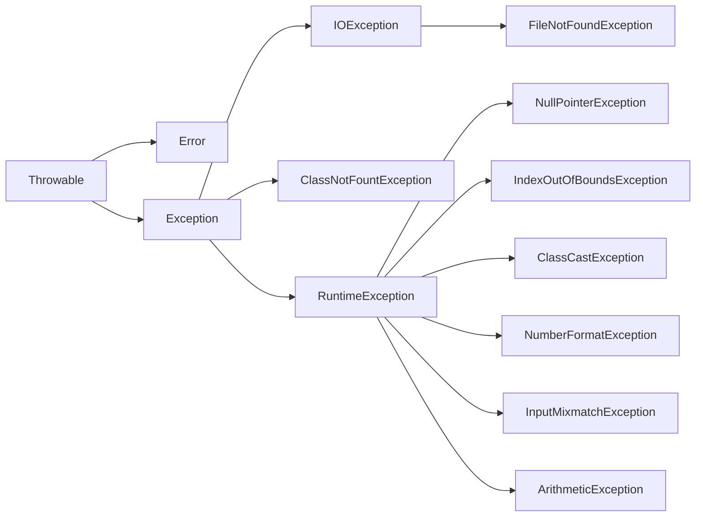
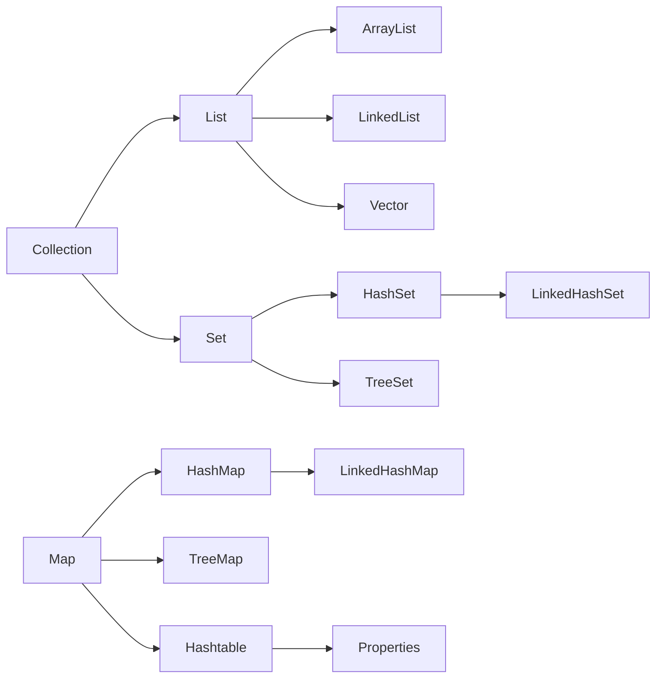
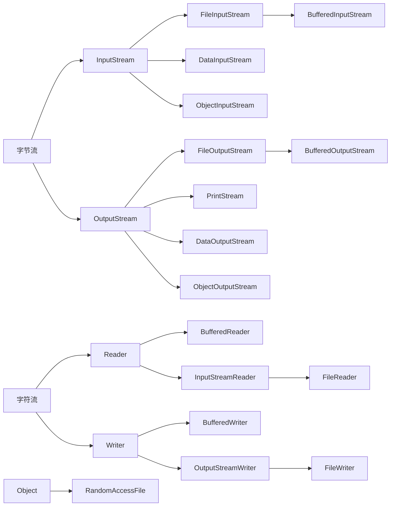
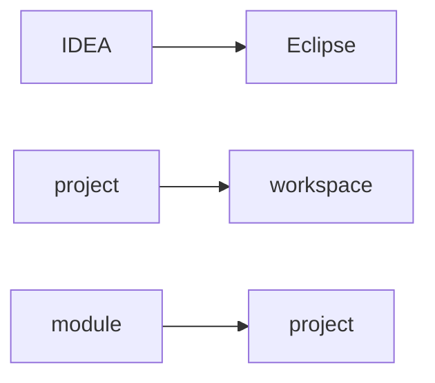

# Java

## 1. 简介

**基础知识**

冯诺依曼体系结构：输入，输出，存储，运算和控制 (Central Processing Unit)。

摩尔定律，安第-比尔定律，反摩尔定律。

TB PB EB ZB YB

URI： 统一资源标识符（Uniform Resource Identifier）

URL: URL是URI的一个子集，统一资源定位符，uniform resource locator。URL是URI概念的一种实现方式。只要能唯一表示资源的就是URI，在URI的基础上给出其资源的访问方式的就是URL。

http: 超文本传输协议（Hyper Text Transfer Protocol)。

软件：数据和指令的集合。

GUI: Graphical  User Interface

CLI: Command Line Interface

**常见DOS命令**


| 命令     |                        |
| ---------- | ------------------------ |
| md       | 创建目录               |
| rd       | 删除目录               |
| del      | 删除文件               |
| del 目录 | 提示是否删除目录下文件 |

**历史**

机器语言，汇编语言，高级语言。

SUN (Stanford University Network)

>1990年，在 Sun计算机公司中，由 Patrick Naughton、MikeSheridan 及James Gosling领导的小组Green Team，开发出的新的程序语言，命名为Oak.
>
>1994年，开发组意识到Oak 非常适合于互联网。
>
>1995年，Oak被重新命名为“Java”，Sun正式发布Java和HotJava产品，在SunWorld上Java首次公开亮相。
>
>1996年1月23日Sun Microsystems发布了JDK 1.0，约8.3万个网页应用Java技术来制作。
>
>1997年，发布JDK 1.1，JavaOne会议召开，创当时全球同类会议规模之最。
>
>1998年，JDK 1.2版本发布。同时，Sun发布了 JsP/Servlet、EJB规范，以及将Java分成了 J2EE、J2SE和J2ME。 这表明了 Java开始向企业、桌而应用和移动设备应用3大领域挺进。
>
>1999年，Java分成J2SE、J2EE和J2ME，JSP/Servlet技术诞生。
>
>2000年，JDK 1.3发布，Java HotSpot Virtual Machine正式发布，成为Java的默认虚拟机。
>
>2002年，JDK 1.4发布，古老的classic虚拟机退出历史舞台。
>
>2003年年底，Java平台的scala正式发布，同年Groovy也加入了 Java阵营。
>
>2004年，发布里程碑式版本: JDK 1.5，为突出此版本的重要性，更名为JDK 5.0。
>
>2005年，J2SE -> JavaSE，J2EE -> JavaEE，J2ME -> JavaME
>
>2006年，JDK 6发布。同年，Java开源并建立了 OpenJDK。顺理成章，Hotspot虚拟机也成为了 openJDK中的默认虚拟机。
>
>2007年，Java平台迎来了新伙伴Clojure。
>
>2008 年，Oracle 收购了 BEA,得到了 JRockit 虚拟机。
>
>2009年，Twitter宣布把后台大部分程序从Ruby迁移到scala，这是Java平台的又一次大规模应用。
>
>2010年，Oracle公司收购SUN，交易价格74亿美元，获得Java商标和最具价值的HotSpot虚拟机。此时，oracle拥有市场占用率最高的两款虚拟机HotSpot和JRockit，并计划在未来对它们进行I整合: **HotRockit**
>
>2011年，发布JDK。在JDK 1.7u4中，正式启用了新的垃圾回收器G1。
>
>2014年，发布JDK 8.0，是继JDK 5.0以来变化最大的版本
>
>2017年，发布JDK 9.0，最大限度实现模块化。将G1设置为默认GC，替代CMS。同年，IBM的J9开源，形成了现在的open J9社区。
>
>2018年3月，发布JDK 10.0，版本号也称为18.3。发布革命性的ZGC，调整JDK授权许可。
>
>同年，Android的Java侵权案判决，Google赔偿oracle计88亿美元
>
>同年，Oracle宣告JavaEE成为历史名词，JDBC、JMS、Servlet赠予Eclipse基金会
>
>2018年9月，发布JDK 11.0，版本号也称为18.9
>
>2019年，JDK12发布，加入RedHat领导开发的shenandoah GC。

<font color="#cc9900">**舍弃了C的：指针，运算符重载，多重继承（接口代替）**</font>

"Write once, Run Anywhere"

JDK = JRE + 开发工具集 (例如 Javac 编译工具等 );

JRE = JVM + Java SE 标准类库;

一个文件中多个类会生成多个字节码文件。

true, false, null不是关键字。保留字： goto, const.

标识符: 可以取名字的地方。

强类型语言。

🟦 **安装目录** 🟦

* bin：存放一些可执行程序，如javac.exe（Java编译器）、java.exe（Java运行工具）、jar.exe（打包工具）和javadoc.exe（文档生成工具）等。
* include：由于JDK是通过C和C++实现的，因此在启动时需要引入一些C语言的头文件，该目录就是用于存放这些头文件的。
* jre：Java运行时环境的根目录，它包含Java虚拟机，运行时的类包、Java应用启动器以及一个bin目录（windows下包含dll文件等），但不包含开发环境中的开发工具。也有一个lib目录，包含一些jar包(rt.jar等)。
* legal目录：通常包含了一些法律相关的文档和许可证文件。它主要用于提供有关JDK 8的许可和使用条款的信息。
* lib目录：lib是library的缩写，意为Java类库或库文件，是开发工具使用的归档包文件。
* javafx-src.zip：该压缩文件内存放的是Java FX（Java图形用户界面工具）所有核心类库的源代码。
* src.zip：src.zip为src文件夹的压缩文件，src中放置的是JDK核心类的源代码，通过该文件可以查看Java基础类的源代码。
* LICENSE和release：版权、许可文件。
* README等说明性文档。

## 2. 数据类型

Java方法的参数传递机制只有一种，就是值(地址值)传递。

🟦 **基本数据类型** 🟦


|         | 大小                                                                                                                                                                         |
| --------- | ------------------------------------------------------------------------------------------------------------------------------------------------------------------------------ |
| byte    | byte b = 128;// 编译不通过                                                                                                                                                   |
| short   | 2 byte                                                                                                                                                                       |
| int     | 4 byte                                                                                                                                                                       |
| long    | 8 byte                                                                                                                                                                       |
| float   | 4 byte 表示范围比long要大                                                                                                                                                    |
| double  | 8 byte 。10.0 == 10 ？true.                                                                                                                                                  |
| char    | 2 byte  '\u0043' Unicode值是一个字符，CodeChars.pdf所有字符集。有且一个字符。a:97， A:65。默认值是0或者‘\u0000’。 (A == 65)? 是 true.                                      |
| boolean | Java规范中，没有明确指出boolean的大小。在《Java虚拟机规范》给出了4个字节，和boolean数组1个字节的定义，具体还要看虚拟机实现是否按照规范来，所以1个字节、4个字节都是有可能的。 |

🟦 **数组** 🟦

`int [] arr = {1, 2, 3, 4, 5}`: 可以省略等号右边的 new int []

二维数组动态初始化：

new int \[2\]\[3\]，一维元素默认是地址值。

new int \[2\]\[\]，一维元素默认是null。

🟦 **进制** 🟦

二进制 （binary）, 0b或者0B开头。

十进制 （decimal）。

八进制 （octal）, 0开头。

十六进制 （hex）, 0x或者0X开头。

🟦 **运算符** 🟦

`>>>` : 无符号右移，没有 `<<<`

```java
num1 = num1 ^ num2; // 只适用于数值类型变量值交换
num2 = num1 ^ num2;
num1 = num1 ^ num2;
```

优先级：

switch 表达式类型：byte，short，char, int, 枚举(1.5)，String(1.7)

`=` :

```java
String username, address, phone, tel;    // 声明多个变量
int num1 = 12, num2 = 23, result = 35;   // 声明并初始化多个变量
```

## 3. 面向对象

### 3.1 可变个数形参

JDK 5.0新增。参数可以是0至多个

```java
void method(String str){
  
} 
void method(String ... strs){
  
} 
void method(String [] strs){
  
} 
// 1和4优先调用1
// 4和7不能构成重载
```

### 3.2 访问权限修饰符


| 修饰符    | 类内部 | 同一个包 | 不同包的子类 | 同一个工程 |
| ----------- | -------- | ---------- | -------------- | ------------ |
| private   | √     |          |              |            |
| default   | √     | √       |              |            |
| protected | √     | √       | √           |            |
| public    | √     | √       | √           | √         |

### 3.3 JavaBean

满足的条件：

1. 类是公共的。
2. 有一个无参的公共构造器。
3. 有属性和对应的get, set方法。

### 3.4 继承与多态

1. 子类继承父类所有属性和方法，由于封装性不能调用父类private结构而已。
2. 直接父类和间接父类。子类能够获取到直接父类和间接父类所有属性和方法。
   1. this 和 super 调用属性和方法时，都会从指定类开始不断向父类寻找。
3. 子类权限修饰符要 >= 父类，返回值类型 <= 父类, 异常 <= 父类。
4. 创建子类对象时，只创建了一个对象但是调用了所有父类构造。
5. 编译看左边，运行看右边  (动态绑定)。多态性只适用于方法，属性都是看左边。

instanceof  操作数为null则返回false。

父类方法没有throws，子类方法也不能有throws。

<font color="#4169E1">**加载顺序：**</font> 由父及子，静态先行。静态代码块，随着类的加载而加载。非静态代码块，创建一个对象就执行一次。

父静态 --> 子静态 --> 父代码块 --> 父构造 --> 子代码块 --> 子构造。

默认初始化 --> 显示初始化/代码块中赋值 --> 构造器中初始化。

```java
// Note：Java子类访问父类私有变量的思考

// 父类Parent，包含私有变量name和age；
public class Parent {
    private String name;
	private int age;
	public Parent() {

	}
	public User(String name, int age) {
		this.name = name;
		this.age = age;
	}
	public String getName() {
		return name;
	}
	public int getage() {
		return age;
	}
}

// 子类C
public class Child extends Parent {
	public Child() {

	}
	public Manager(String name, int age) {
		super(name, age);
	}

	private String name;
	private int age;

	public void show(){
		System.out.println("我是"+this.name+",我有"+this.age+"岁");
		System.out.println("我是"+this.getName()+",我有"+this.getage()+"岁");
		System.out.println("我是"+super.getName()+",我有"+super.getage()+"岁");
	}
}

public class Test {

	public static void main(String[] args) {
		Child c = new Child("c",1);
		c.show();
	}
}

// 结果如下:
我是null,我有0岁---1
我是c,我有1岁------2
我是c,我有1岁------3

// Summary: 新建子类时，会先在堆中新建一个父类，父类的变量和方法，以及子类独有的变量和方法，二者共同组成了子类空间。
// 所以，新建子类后，父类中的private变量虽然不能被子类继承，但却是真实存在的，只是不可被直接访问，只能间接使用。

// 不过，如果在子类中重写getter方法，结果2就发生了改变。
@Override
public String getName() {
	return name;
}

@Override
public int getage() {
	return age;
}

/*****************************************************************/

我是null,我有0岁------1
我是null,我有0岁------2
我是c,我有1岁---------3

// 因为现在本类Manager中已经有了getter()方法，所以方法内直接调用本类的两个name,age变量，因此结果2返回的是两个初始值。
```

### 3.5 枚举

```java
class Season {
    private final String seasonName;
    private final String seasonDesc;
    
    private Season(String seasonName, String seasonDesc){
        this.seasonName = seasonName;
        this.seasonDesc = seasonDesc;
    }
    
    public String getSeasonDeac() {
        return seasonDeac;
    }

    public String getSeasonName() {
        return seasonName;
    }
    
    public static final Season SPRING = new Season("春", "");
}

enum Season { // JDK1.5 继承 java.lang.Enum
    private final String seasonName;
    private final String seasonDesc;
    
    SPRING("春", "");
}

name(); //返回此枚举常量的名称，与其枚举声明中声明的完全相同。
Season.values(); // 返回枚举类型的对象数组。该方法可以很方便地遍历所有的枚举值。
valueof("名字"); // 字符串必须是枚举类对象的“名字”。如不是，运行时异常: IllegalArgumentException。

// 可以实现接口让每个实例重写接口方法。
interface info {
	void show();
}
enum Season implements info{
    SPRING ("春天","春意暖暖"),
    SUMMER ("夏天","夏意"),
    AUTUMN ("秋天","秋意"),
    WINTER ("冬天","冬意");

    private final String seasonName;
    private final String seasonDesc;

    private Season(String seasonName,String seasonDesc){
    	this.seasonDesc = seasonDesc;
    	this.seasonName = seasonName;
    }

    @Override
    public void show() {
        System.out.println("这是一个季节");
    }
}

// 让枚举类的对象分别去实现接口中的抽象方法
enum Season implements info{
    SPRING ("春天","春意暖暖"){
        @Override
        public void show() {
            System.out.println("这是第一个季节");
        }
    },
    SUMMER ("夏天","夏意"){
        @Override
        public void show() {
            System.out.println("这是第二个季节");
        }
    },
    AUTUMN ("秋天","秋意"){
        @Override
        public void show() {
            System.out.println("这是第三个季节");
        }
    },
    WINTER ("冬天","冬意"){
        @Override
        public void show() {
            System.out.println("这是第四个季节");
        }
    };
}
```

### 3.6 单元测试

main方法可以作为一个普通静态方法。

@Test 快速fix：Current project --> build path --> add libraries --> JUnit --> JUnit4 （org.junit.Test）

1. Dummy 对象被四处传递，但是从不被真正使用。通常他们只是用来填充参数列表。 
2. Fake 有实际可工作的实现，但是通常有一些缺点导致不适合用于产品(基于内存的数据库就是一个好例子)。 
3. Stub 在测试过程中产生的调用提供预备好的应答，通常不应答计划之外的任何事。stubs可能记录关于调用的信息，比如 邮件网关的stub 会记录它发送的消息，或者可能仅仅是发送了多少信息。 
4. Mock 预先计划好的对象，带有各种期待，他们组成了一个关于他们期待接受的调用的详细说明。

### 3.7 内部类

成员内部类：

> 创建：
>
> 静态：Outer.Inner i = new Outer.Inner();
>
> 非静态： Outer.Inner i = new Outer().Inner();
>
> 参数区分： this.name，Outer.this.name;

局部内部类：

局部内部类的方法中如果调用该方法的局部变量，此局部变量需要是final。

### 3.8 异常

Error: JVM都无法解决的问题，不编写代码进行处理。 OOM, StackOverflowError.

Exception: 需要进行异常处理 (运行时异常一般开发中也不作try catch处理)。e的两个方法，getMessage()，printStackTrace().

自定义exception需要serialVersionUID。



### 3.9 Annotation

编译时会检查。

**==自定义注解==**

```java
public @interface MyAnnotation {
    String value(); // 属性
    String value2() default "hello"; // 属性
}
@MyAnnotation(value = "hello")
```

**==元注解==**

`@Retention` : 指定生命周期。

`@Target` : 指定可以被修饰的元素。

`@Documented` : javadoc时保留注解。 

`@Inherited` : 具有继承性。

`@Repeatable` 可重复注解， JDK1.8。

类型注解： JDK1.8。


## 4. 常见类

### 4.1 包装类

```java
Object o1 = true ? new Integer(1) : new Double(2.0);
System.out.println(o1);	// 1.0

Object o2;
if(true)
    o2 = new Integer(1); 
else
    o2 = new Double(2.0);
System.out.println(o2);	// 1

// 自动装箱
Integer a = 127;
Integer b = 127;
System.out.println(a == b);	// true
Integer a1 = 128;
Integer b1 = 128;
System.out.println(a1 == b1); // false
```

### 4.2 String

```java
String a = "abc"; // 字面量。内存中会用同一个(方法区中字符串常量池)。
String b = "a" + "bc"; // 字面量。
String c = a + "bc"; // 变量参与，堆中new对象。 a += "bc” 同理。
String d = a.intern() // 使用常量池中。
  
byte[] bytes = a.getBytes();
String e = Arrays.toString(bytes);

StringBuilder // 线程不安全 append(null), "null"
    
// 支持正则语法
public String replaceAll(String regex, String replacement);
public boolean matches(String regex);
public String[] split(String regex);
```

### 4.3 Date

```java
System.currentTimeMillis(); // 时间戳
Date date = new Date(); // JDK1.0
date.getTime(); // 等于System.currentTimeMillis();

SimpleDateFormat sdf = new SimpleDateFormat(); // 有参构造: yyyy-MM-dd hh:mm:ss
String str = sdf.format(date);
date = sdf.parse(str);

Calendar c = Calendar.getInstance(); // JDK1.1
c.get(Calendar.n); // 返回当前时间对应的想要的信息。 一月是0，周日是1。
c.getTime(); // 返回Date

LocalDate ld = LocalDate.now(); // 日期 JDK1.8
LocalTime ld = LocalTime.now(); // 时间
LocalDateTime ld = LocalDateTime.now(); 
LocalDateTime.of(2020,10,1); // 指定时间(没有偏移量)
ld.getDayOfMonth();

Instant i = Instant.now();
i.toEpochMilli();

DateTimeFormatter isoDate = DateTimeFormatter.ISO_DATE;
```

### 4.4 Compare

```java
implements Comparable { // 自然排序
    @Override
	compareTo(String anotherString){
        // 默认从小到大排序，大于返回正数。
    } 
}

new Comparator(){ // 定制排序
	@Override
	public int compare(Object o1, Object o2) {
		// TODO
	}
}
```

### 4.5 Math

`System` 类 获取环境参数信息。

`Math` 类 数学计算。

`BigInteger`  与`BigDecimal`

```java
Random r = new Random();
int number = r.nextInt(10);// [0-10)
```

### 4.6 Object

`==` 左右类型不一致，编译错误。

`x.equals(null)` : 永远false。

`x.equals(和x不同类型)` : 永远false。

### 4.7 Collections

| 方法                               |                      |
| ---------------------------------- | -------------------- |
| reverse(List)·                     | 反转                 |
| shuffle();                         | 重排                 |
| int frequency(Collection, Object); | 指定元素出现次数     |
| copy(List, List);                  | 必须是size相等       |
| synchronizedList(List)             | 返回SynchronizedList |

### 4.8 Runtime

```java
Runtime runtime = Runtime.getRuntime();
Process process = runtime.exec(command:"ipconfig");
//调用process对象的获取输入流的方法
InputStream is = process.getInputstream();
byte[] arr = new byte[124 * 1024 * 100];
int len = is.read(arr);
//将字节数组转换为字符串输出到控制台
System.out.printIn(new String(arr, 0, len, "GBK"));
```

## 5. 集合



### 5.1 Collection

for each： 本质是应用iterator。

ArrayList：线程不安全。底层存储Object[] elementData;

Vector：线程安全。底层存储Object[] elementData;

LinkedList：双向链表。

HashSet: 可以存储null值。数组中的链表，JDK7头插法，JDK8尾插法。

TreeSet: 按照指定属性进行排序。只能存储相同类型对象。必须实现任意一种排序，返回0认为是相同数据，去重。

### 5.2 Map

Hashtable：JDK1.0

HashMap: 可以存储null键，null值。 数组 + 链表 + 红黑树（JDK1.8）

LinkedHashMap：遍历效率高于HashMap。

TreeMap：红黑树。

Properties： key和value都是String. 常用来处理配置文件。

```java
public class HashMap {
    Node<K,V>[] table; // 数组
    static class Node<K,V> implements Map.Entry<K,V> {
        final int hash;
        final K key;
        V value;
        Node<K,V> next; // 链表。数组长度 > 64且链表长度 > 8 时, 采用红黑树TreeNode.
    }
}

// LinkedHashMap
static class Entry<K,V> extends HashMap.Node<K,V> {
    Entry<K,V> before, after;
    Entry(int hash, K key, V value, Node<K,V> next) {
    	super(hash, key, value, next);
    }
}

Properties prop = new Properties();
prop.load(new FileInputStream("path"));
String name = prop.getProperty("name");

Iterator<Map.Entry<Integer, Integer>> it = map.entrySet().iterator();
while (it.hasNext ()) {
    Map.Entry<Integer, Integer> entry = it.next();
    // entry.getKey() + entry.getValue();
}
```

### 5.3 泛型

**==泛型类==**

不同泛型的对象不能互相赋值。

异常类不能是泛型。catch中也不能是泛型。

```java
public class Order<T>{ 
    T t;
}
public class Sub extends Order{ 
	// 默认泛型，Object
}
public class Sub extends Order<Integer>{ 
	// 指明泛型，不再是泛型类
}
public class Sub<T> extends Order<T>{ 
	// 泛型类
}
T[] arr = (T[]) new Object[10];
// <?>：通配符。
List<?> list = null; // 不能添加任何数据。可以用来接收其他list和读取其内容。
List<? extends A> list = null; // 不能写。
List<? super A> list = null; // 写A及其子类。
```

**==泛型方法==**

```java
public <E> List<E> method(E e){
    
}
```

## 6. IO流

字节流(8 bit) : InputStream，OutputStream

字符流(16bit): Reader，Writer



```java
FileReader fr = null;
File file = new File("path"); // 相对路径是当前 project or module
try {
	fr = new FileReader(file);
	char[] data = new char[5]; //byte [] data = new byte [5]; 字节流 
	int len;
	while ((len = fr.read(data)) != -1) {
		for (int i = 0; i < len; i++) {
			System.out.print(data[i]);
		}
	}
	fr.close();
} catch (FileNotFoundException e) {
} catch (IOException e) {
} finally {
	if (fr != null) {
		try {
			fr.close();
		} catch (IOException e) {
		}
	}
}
////
FileWriter fw = null;                
File file = new File("he");          
try {                                
	fw = new FileWriter(file, false);
	fw.write("content"); // write(char cbuf[], 0, len)      
} catch (FileNotFoundException e) {  
} catch (IOException e) {            
} finally {                          
	if (fw != null) {                
		try {                        
			fw.close();              
		} catch (IOException e) {    
		}                            
	}                                
}                                    
```

<font color=blue>**== 字符集 ==**</font> 

ASCII: 美国标准信息交换码。用一个字节的7位表示。

ISO8859-1: 拉丁码表。欧洲码表。用一个字节的8位表示。

GB2312: 中文表码表。最多两个字节。

GBK: GB2312的升级。最多两个字节。

Unicode: 国际标准码。融合人类所有字符。所有文字都用两个字节表示。

UTF-8，UTF-16: 变长的编码方式。1-4位字节。

<font color=blue>**== NIO. 2 ==**</font> 

`java.nio.file` : Paths, Files.

<font color=blue>**== 网络编程 ==**</font> 

TCP, UDA, URL，Socket

## 7. 反射

特征：动态性。

java.lang.Class类  任何运行时类都可以作为Class的一个实例。

```java
// 4种方式都是同一个运行时类。只要数组类型和维度一样，就是同一个Class
Class clazz = Person.class;
Class clazz = p.getClass();
Class clazz = Class.forName("java.lang.Person");
ClassLoader cl = Test.class.getClassLoader();
Class clazz = cl.loadClass("java.lang.Person");

clazz.getResourceAsStream(String path); 
cl.getResource(fileName); 

// 新建对象
Person p = clazz.newInstance(); // 本质使用构造器。

// 属性
Field [] fs = clazz.getFields(); // 当前类和父类public的
Field [] fs = clazz.getDeclaredFields(); // 当前类所有声明的属性
int mod = f.getModifiers(); // 权限修饰符。可以Modifier.toString(int mod)查看。
Class type = f.getType(); // 数据类型。
String name = f.getName(); // 变量名。

Field  f = clazz.getField("属性名字");
f.setAccessible(true);
f.set(p, 123);

// 方法
Method [] ms = clazz.getMethods(); // 当前类和父类public的
Method [] ms = clazz.getDeclaredMethods(); // 当前类所有声明的方法
Annotation[] as = m.getAnnotations(); 
int mod = m.getModifiers(); // 权限修饰符。可以Modifier.toString(int mod)查看。
m.getReturnType().getName();
m.getName();
Parameter [] ps = m.getParameters();
Classs [] pts = m.getParameterTypes();
m.getExceptionTypes();

Method m = clazz.getDeclaredMethod(String name, Class<?>... parameterTypes);
m.setAccessible(true);
m.invoke(p, "参数"); // 返回值就是方法返回值。

// 构造器
Constructor[] cs = clazz.getConstructors();
Constructor<T> c = clazz.getConstructor(Class<?>... parameterTypes);
c.setAccessible(true);
("强转")c.newInstance("参数");

// 父类
Class<? super T> c = clazz.getSuperclass();
Type t = clazz.getGenericSuperclass(); // 泛型父类
Class<?>[] c = clazz.getInterfaces(); // 获取接口
```

## 8. 正则

Java正则转义字符两个斜杠 `\\`。

### 8.1 基本语法

<font color=blue>**== 元字符-字符匹配符 ==**</font> 

| 符号  | 示例            | 解释                          |
| ----- | --------------- | ----------------------------- |
| []    | [efgh]          | 匹配括号中的任意一个字符      |
| [^]   | [^abc]          | 除a、b、c之外的任意1个字符    |
| -     | [A-Z]           | 任意单个大写字母              |
| .     |                 | 匹配除\n以外的任何字符        |
| \\\\d |                 | 匹配单个数字字符，相当于[0-9] |
| \\\\D |                 | 单个非数字字符，相当于\[^0-9] |
| \\\w  |                 | 相当于[0-9a-zA-Z]             |
| \\\W  |                 | 相当于\[^0-9a-zA-Z]           |
| \\\s  |                 | 匹配空白字符(空格,制表符等)   |
| \\\S  |                 | 匹配非空白                    |
|       | [\u0391-\uffe5] | 汉字区间                      |

```java
String regStr ="(?i)abc"; // 匹配 abc 字符串[不区分大小写]
/*
 *(?i)abc 	表示abc都不区分大小写
 *a(?i)bc 	表示bc不区分大小写
 *a((?i)b)c 表示只有b不区分大小写
 *Pattern pat = Pattern.compile(regEx, Pattern.CASE INSENSITIVE)
 */
```

**note: ** `[?./]` 中的符号代表符号本身，没有特殊含义。

<font color=blue>**== 元字符-选择匹配符 ==**</font>

| 符号 | 示例        | 解释         |
| ---- | ----------- | ------------ |
| \|   | han\|韩\|寒 | 匹配其中一个 |

 <font color=blue>**== 元字符-限定符 ==**</font>

| 符号  | 示例   | 解释                  |
| ----- | ------ | --------------------- |
| *     | (abc)* | 0次或多次             |
| +     | [abc]+ | 1次或多次             |
| ？    |        | 0次或1次              |
| {n}   |        | n次。(字符不重复匹配) |
| {n,}  |        | 大于等于3             |
| {n,m} |        | n到m (贪婪匹配)       |

**note:** `?`: 当此字符紧随任何其他限定符 (*、+、?、{n}、{n,m})之后时，匹配模式是"非贪心的”。"非贪心的”模式匹配搜索到的、尽可能短的字符串，而默认的"贪心的”模式匹配搜索到的、尽可能长的字符串。例如，在字符串"oooo"中，"o+?"只匹配单个"o"，而”o+"匹配所有"o"。 

<font color=blue>**== 元字符-定位符 ==**</font>

| 符号  | 示例    | 解释                               |
| ----- | ------- | ---------------------------------- |
| ^     | ^[0-9]  | 整个字符串必须符合指定开头         |
| $     | [a-z]$  | 指定结束字符                       |
| \\\\b | han\\\b | 匹配在边界的字符串(空格和结束之前) |
| \\\\B | han\\\B | 非边界的                           |

 <font color=blue>**== 分组 ==**</font>

| 符号        | 示例                       | 解释                                                         |
| ----------- | -------------------------- | ------------------------------------------------------------ |
| (pattern)   | (\\\d\\\d)(\\\d\\\d)       | 非命令分组。<br />matcher.group(0)：全部<br />matcher.group(1)：第一组<br />matcher.group(2)：第二组 |
| (?\<name>)  | (?\<g1>\\\d\\\d)(\\\d\\\d) | matcher.group("g1")                                          |
| (?:pattern) | industr(?:y\|ies)          | 非捕获分组。无法用group()获取。                              |
| (?=pattern) |                            | 非捕获匹配。                                                 |
| (?!pattern) |                            | 非捕获匹配。                                                 |

**note:** 

1. 匹配 pattern 但不捕获该匹配的子表达式，即它是一个非捕获匹配，不存储供以后使用的匹配。这对于用”or”字符(|)组合模式部件的情况很有用。例如，"industr(?:y|ies)是比industrylindustries' 更经济的表达式。
2. 它是一个非捕获匹配。例如，"Windows(?=95|98|NT|2000)匹配Windows 2000"中的"Windows"，但不匹配"Windows 3.1"中的Windows"。
3. 该表达式匹配不处于匹配 pattern 的字符串的起始点的搜索字符串。它是个非捕获匹配。例如，"Windows(?!95198|NT|2000)'匹配Windows 3.1"中的"Windows”，但不匹配"Windows 2000"中的Windows。

> 捕获组是通过从左至右计算其开括号来编号。例如，在表达式((A)(B(C)))，有四个这样的组：
>
> ((A)(B(C)))
>
> (A)
>
> (B(C))
>
> (C)

### 8.2 反向引用

反向引用: 圆括号的内容被捕获后，可以在这个括号后被使用，从而写出一个比较实用的匹配模式。

这种引用既可以是在正则表达式内部，也可以是在正则表达式外部，内部反向引用`\\分组号`，外部反向引用 `$分组号`。

1. 匹配两个连续的相同数字: `(\\d)\\1`
2. 匹配五个连续的相同数字: `(\\d)\\1{4}`
3. 匹配个位与千位相同，十位与百位相同的数, 例如 5225，1551:  `(\\d)(\\d)\\2\\1`
4. 去掉重复的字 "我我要学学学学编程java!" 

```java
matcher = Pattern.compile("(.)\\1+").matcher(content);
content = matcher.replaceAll("$1");
```

### 8.3 正则类

```java
Pattern p = Pattern.compile(regStr);
Matcher m = p.matcher(content);
while(m.find()){
    String c = content.substring(m.start(), m.end());
}
// 字符串整体匹配。
boolean b = Pattern.matches(regStr, content); 
```

| Matcher                   |                                                              |
| ------------------------- | ------------------------------------------------------------ |
| int start()               | 返回以前匹配的初始索引。                                     |
| int end()                 | 返回最后匹配字符之后的偏移量。                               |
| boolean matches()         | 整体匹配。                                                   |
| int start(int group)      | 返回在以前的匹配操作期间，由给定组所捕获的子序列的初始索引。 |
| end(int group)            | 返回在以前的匹配操作期间，由给定组所捕获子序列的最后字符之后的偏移量。 |
| find()                    | 尝试查找与该模式匹配的输入序列的下一个子序列。类似next的用法。 |
| String replaceAll(repStr) | 替换模式与给定替换字符串相匹配的输入序列的每个子序列。       |

## NOTE:

### 1. Eclipse

1. 在workspace根目录 `.metadata` 中

### 2. IDEA



JetBrains


| 目录                                               | UItimate                               |
| ---------------------------------------------------- | ---------------------------------------- |
| \User\AppData\Roaming\JetBrains\IntelliJIdea2022.2 | 配置文件 (eclipse每个ws配置都是分开的) |
|                                                    |                                        |

`break label 和 continue label 不太一样`

1.简单名称（Simple Name）没有类型和参数修饰的方法或字段名称例如inc方法和字段name

2.全类名全类名是某个文件在项目中的位置，格式为包名.类名

3.全限定名（Fully Qualified Name）一个类的全限定名是将类全名的.全部替换为/例如com/itheima/dao/IUserDao.xml

4.路径分为相对路径和绝对路径。绝对路径是指这个文件在操作系统中的位置，相对路径通过这个文件的上一级 ./ 或下一级/ 来指定文件内容

5.描述符（Descriptor）A descriptor is a string representing the type of a field or method.

6.签名（Signatures）Java代码层面的方法特征签名：方法名称 + 参数顺序 + 参数类型字节码层面的方法特征签名： + 返回值 + 受查异常表

7.符号引用符号引用包括域和方法的符号引用，符号引用由两部分组成：1）所属的类或接口2）字段和方法 名字+描述符————————————————

# THE END
