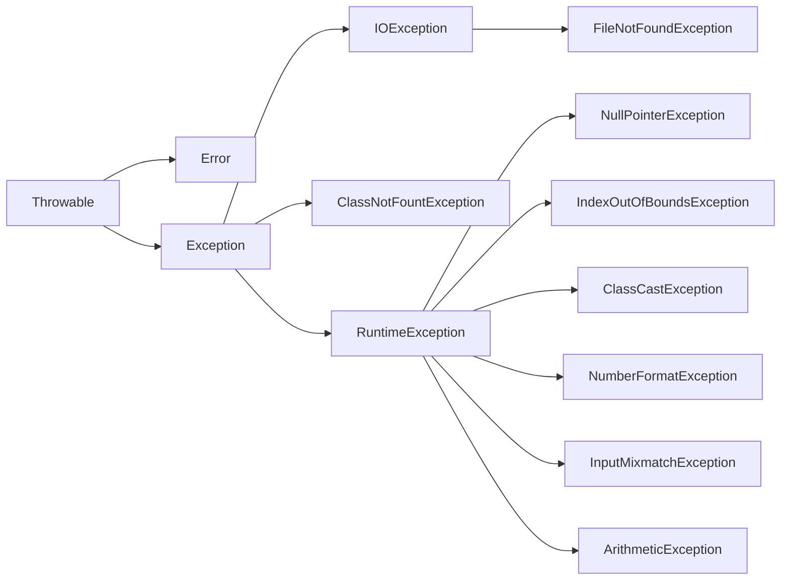
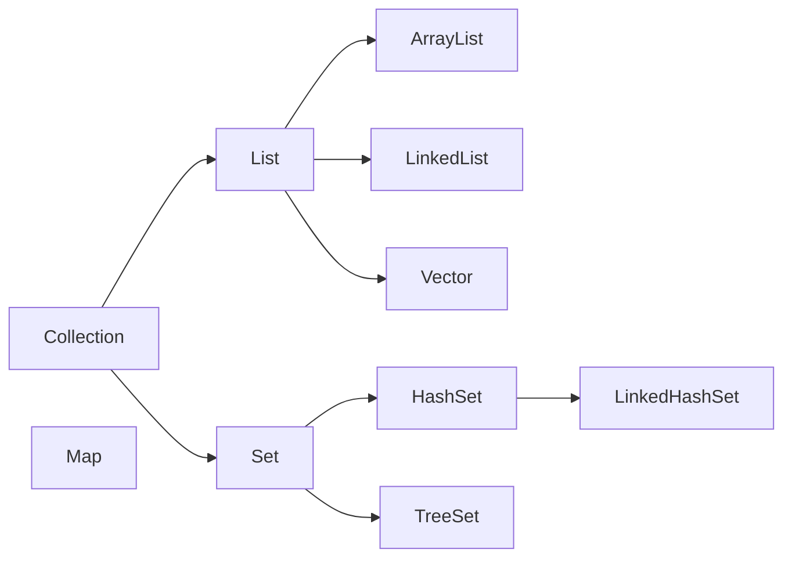
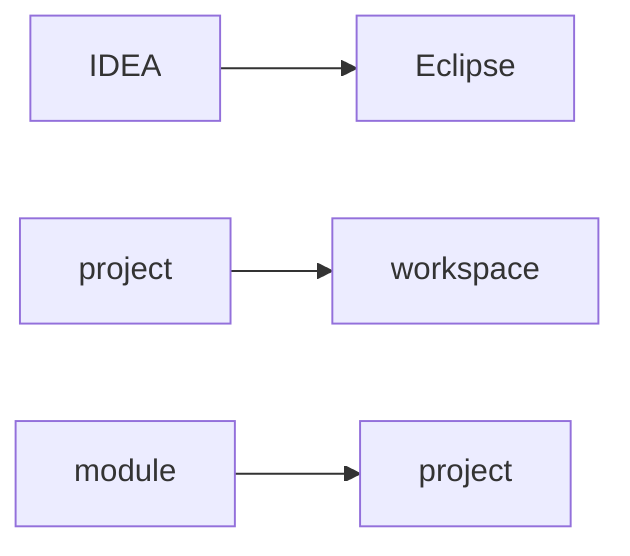

# Java

## 1. 简介

### 1.1 基础知识

冯诺依曼体系结构：输入，输出，存储，运算和控制 (Central Processing Unit)。

摩尔定律，安第-比尔定律，反摩尔定律。

TB PB EB ZB YB

URI： 统一资源标识符（Uniform Resource Identifier）

URL: URL是URI的一个子集，统一资源定位符，uniform resource locator。URL是URI概念的一种实现方式。只要能唯一表示资源的就是URI，在URI的基础上给出其资源的访问方式的就是URL。

http: 超文本传输协议（Hyper Text Transfer Protocol)。

软件：数据和指令的集合。

GUI: Graphical  User Interface
CLI: Command Line Interface

### 1.2 常见DOS命令


| 命令     |                        |
| ---------- | ------------------------ |
| md       | 创建目录               |
| rd       | 删除目录               |
| del      | 删除文件               |
| del 目录 | 提示是否删除目录下文件 |

### 1.3 历史

机器语言，汇编语言，高级语言。

SUN (Stanford University Network)

> <font color="#000000">1991年，Green项目, Oak。</font>
>
> <font color="#000000">1994年，Oak适合于互联网。</font>
>
> <font color="#000000">1995年，开发。</font>
>
> <font color="#000000">1996年，JDK1.0</font>
>
> <font color="#000000">2004年，JDK1.5，为突出版本的重要性，更名为JDK5.0。</font>
>
> <font color="#000000">2014年，JDK8.0。</font>

<font color="#cc9900">**舍弃了C的：指针，运算符重载，多重继承（接口代替）**</font>

"Write once, Run Anywhere"

JDK包括了JRE。

javadoc命令生成文档注释。

一个文件中多个类会生成多个字节码文件。

true, false, null不是关键字。保留字： goto, const.

标识符: 可以取名字的地方。

强类型语言。

## 2. 数据类型

Java方法的参数传递机制只有一种，就是值(地址值)传递。

### 2.1 基本数据类型


|         | 大小                                                                                                                                                                         |
| --------- | ------------------------------------------------------------------------------------------------------------------------------------------------------------------------------ |
| byte    | byte b = 128;// 编译不通过                                                                                                                                                   |
| short   | 2 byte                                                                                                                                                                       |
| int     | 4 byte                                                                                                                                                                       |
| long    | 8 byte                                                                                                                                                                       |
| float   | 4 byte 表示范围比long要大                                                                                                                                                    |
| double  | 8 byte 。10.0 == 10 ？true.                                                                                                                                                  |
| char    | 2 byte  '\u0043' Unicode值是一个字符，CodeChars.pdf所有字符集。有且一个字符。a:97， A:65。默认值是0或者‘\u0000’。 (A == 65)? 是 true.                                      |
| boolean | Java规范中，没有明确指出boolean的大小。在《Java虚拟机规范》给出了4个字节，和boolean数组1个字节的定义，具体还要看虚拟机实现是否按照规范来，所以1个字节、4个字节都是有可能的。 |

### 2.2 数组

`int [] arr = {1, 2, 3, 4, 5}`: 可以省略等号右边的 new int []

二维数组动态初始化：

new int \[2\]\[3\]，一维元素默认是地址值。

new int \[2\]\[\]，一维元素默认是null。

### 2.3 进制

二进制 （binary）, 0b或者0B开头。

十进制 （decimal）。

八进制 （octal）, 0开头。

十六进制 （hex）, 0x或者0X开头。

### 2.4 运算符

`>>>` : 无符号右移，没有 `<<<`

```java
num1 = num1 ^ num2; // 只适用于数值类型变量值交换
num2 = num1 ^ num2;
num1 = num1 ^ num2;
```

优先级：

switch 表达式类型：byte，short，char, int, 枚举(1.5)，String(1.7)

## 3. 面向对象

### 3.1 可变个数形参

JDK 5.0新增。参数可以是0至多个

```java
void method(String str){
  
} 
void method(String ... strs){
  
} 
void method(String [] strs){
  
} 
// 1和4优先调用1
// 4和7不能构成重载
```

### 3.2 访问权限修饰符


| 修饰符    | 类内部 | 同一个包 | 不同包的子类 | 同一个工程 |
| ----------- | -------- | ---------- | -------------- | ------------ |
| private   | √     |          |              |            |
| default   | √     | √       |              |            |
| protected | √     | √       | √           |            |
| public    | √     | √       | √           | √         |

### 3.3 JavaBean

满足的条件：

1. 类是公共的。
2. 有一个无参的公共构造器。
3. 有属性和对应的get, set方法。

### 3.4 继承与多态

1. 子类继承父类所有属性和方法，由于封装性不能调用父类private结构而已。
2. 直接父类和间接父类。子类能够获取到直接父类和间接父类所有属性和方法。
   1. this 和 super 调用属性和方法时，都会从指定类开始不断向父类寻找。
3. 子类权限修饰符要 >= 父类，返回值类型 <= 父类, 异常 <= 父类。
4. 创建子类对象时，只创建了一个对象但是调用了所有父类构造。
5. 编译看左边，运行看右边  (动态绑定)。多态性只适用于方法，属性都是看左边。

instanceof  操作数为null则返回false。

父类方法没有throws，子类方法也不能有throws。

<font color="#4169E1">**加载顺序：**</font> 由父及子，静态先行。静态代码块，随着类的加载而加载。非静态代码块，创建一个对象就执行一次。

父静态 --> 子静态 --> 父代码块 --> 父构造 --> 子代码块 --> 子构造。

默认初始化 --> 显示初始化/代码块中赋值 --> 构造器中初始化。

### 3.5 枚举

```java
class Season {
    private final String seasonName;
    private final String seasonDesc;
    
    private Season(String seasonName, String seasonDesc){
        this.seasonName = seasonName;
        this.seasonDesc = seasonDesc;
    }
    
    public static final Season SPRING = new Season("春", "");
}

enum Season { // JDK1.5 继承 java.lang.Enum
    private final String seasonName;
    private final String seasonDesc;
    
    SPRING("春", "");
}
Season.values();
valueof("名字"); 
// 可以实现接口让每个实例重写接口方法。
```

### 3.6 单元测试

main方法可以作为一个普通静态方法。

@Test 快速fix：Current project --> build path --> add libraries --> JUnit --> JUnit4 （org.junit.Test）

### 3.7 interface

JDK7: 只能

> 全局常量：public static final 的
>
> 抽象方法：public abstract 的

JDK8: 可以

> 静态方法：public static 只能通过接口调用。
>
> 默认方法：public default.
>
>> 如果父类和接口方法相同，默认优先调用父类。
>>
>> 实现了相同方法的多个接口，必须要显示重写。
>>
>> 接口方法调用，接口名.super.方法名。
>>

### 3.8 内部类

成员内部类：

> 创建：
>
> 静态：Outer.Inner i = new Outer.Inner();
>
> 非静态： Outer.Inner i = new Outer().Inner();
>
> 参数区分： this.name，Outer.this.name;

局部内部类：

局部内部类的方法中如果调用该方法的局部变量，此局部变量需要是final。

### 3.9 异常

Error: JVM都无法解决的问题，不编写代码进行处理。 OOM, StackOverflowError.

Exception: 需要进行异常处理 (运行时异常一般开发中也不作try catch处理)。e的两个方法，getMessage()，printStackTrace().

自定义exception需要serialVersionUID。



### 3.10 Annotation

编译时会检查。

**==自定义注解==**

```java
public @interface MyAnnotation {
    String value(); // 属性
    String value2() default "hello"; // 属性
}
@MyAnnotation(value = "hello")
```

**==元注解==**

`@Retention` : 指定生命周期。

`@Target` : 指定可以被修饰的元素。

`@Documented` : javadoc时保留注解。 

`@Inherited` : 具有继承性。

`@Repeatable` 可重复注解， JDK1.8。

类型注解： JDK1.8。

## 4. 多线程

**程序：** program。为完成特定任务，用某种语言编写的一组指令的集合。即指一段静态的代码，静态对象。

**进程：** process。是程序的一次执行过程，或是正在运行的一个程序。是一个动态过程：生命周期。

**线程：** thread。是一个程序内部的一条执行路径。

> 作为调度和执行的单位，每个线程拥有独立的运行栈和程序计数器(pc)。
>
> 一个进程中的多个线程共享相同的内存单元。

### 4.1 创建

```java
extends Thread{
    @Override
	run(){
        // 重写run方法，然后 start()调用
        // 一个线程只能start()一次。
        Thread.currentThread().getName();
    }  
}

implements Runnable{
    @Override
	run(){
        // 重写run方法，然后new Thread(this).start()调用   
    }  
}
```

### 4.2 方法


| 方法                         |                                                 |
| ------------------------------ | ------------------------------------------------- |
| getPriority();setPriority(); | MAX_PRIORITY: 10MIN_PRIORITY: 1NORM_PRIORITY: 5 |
|                              |                                                 |
|                              |                                                 |

## 4. 常见类

### 2.1 包装类

```java
Object o1 = true ? new Integer(1) : new Double(2.0);
System.out.println(o1);	// 1.0

Object o2;
if(true)
    o2 = new Integer(1); 
else
    o2 = new Double(2.0);
System.out.println(o2);	// 1

// 自动装箱
Integer a = 127;
Integer b = 127;
System.out.println(a == b);	// true
Integer a1 = 128;
Integer b1 = 128;
System.out.println(a1 == b1); // false
```

### 2.2 String

```java
String a = "abc"; // 字面量。内存中会用同一个(方法区中字符串常量池)。
String b = "a" + "bc"; // 字面量。
String c = a + "bc"; // 变量参与，堆中new对象。 a += "bc” 同理。
String d = a.intern() // 使用常量池中。
  
byte[] bytes = a.getBytes();
String e = Arrays.toString(bytes);

StringBuilder // 线程不安全 append(null), "null"
```

### 2.3 Date

```java
System.currentTimeMillis(); // 时间戳
Date date = new Date(); // JDK1.0
date.getTime(); // 等于System.currentTimeMillis();

SimpleDateFormat sdf = new SimpleDateFormat(); // 有参构造: yyyy-MM-dd hh:mm:ss
String str = sdf.format(date);
date = sdf.parse(str);

Calendar c = Calendar.getInstance(); // JDK1.1
c.get(Calendar.n); // 返回当前时间对应的想要的信息。 一月是0，周日是1。
c.getTime(); // 返回Date

LocalDate ld = LocalDate.now(); // 日期 JDK1.8
LocalTime ld = LocalTime.now(); // 时间
LocalDateTime ld = LocalDateTime.now(); 
LocalDateTime.of(2020,10,1); // 指定时间(没有偏移量)
ld.getDayOfMonth();

Instant i = Instant.now();
i.toEpochMilli();

DateTimeFormatter isoDate = DateTimeFormatter.ISO_DATE;
```

### 2.4 Compare

```java
implements Comparable {
    @Override
	compareTo(String anotherString){
        // 默认从小到大排序，大于返回正数。
    } 
}

new Comparator(){
	@Override
	public int compare(Object o1, Object o2) {
		// TODO
	}
}
```

### 2.5 Math

`System` 类 获取环境参数信息。

`Math` 类 数学计算。

`BigInteger`  与`BigDecimal`

### 2.6 Object

`==` 左右类型不一致，编译错误。

`x.equals(null)` : 永远false。

`x.equals(和x不同类型)` : 永远false。

## 5. 集合



### 5.1 Collection

for each： 本质是应用iterator。

ArrayList：线程不安全。底层存储Object[] elementData;

Vector：线程安全。底层存储Object[] elementData;

LinkedList：

HashSet: 可以存储null值。

TreeSet: 按照指定属性进行排序。

## NOTE:

### 1. Eclipse

1. 在workspace根目录 `.metadata` 中

### 2. IDEA



JetBrains


| 目录                                               | UItimate                               |
| ---------------------------------------------------- | ---------------------------------------- |
| \User\AppData\Roaming\JetBrains\IntelliJIdea2022.2 | 配置文件 (eclipse每个ws配置都是分开的) |
|                                                    |                                        |
|                                                    |                                        |

`break label 和 continue label 不太一样`

1.简单名称（Simple Name）没有类型和参数修饰的方法或字段名称例如inc方法和字段name

2.全类名全类名是某个文件在项目中的位置，格式为包名.类名

3.全限定名（Fully Qualified Name）一个类的全限定名是将类全名的.全部替换为/例如com/itheima/dao/IUserDao.xml

4.路径分为相对路径和绝对路径。绝对路径是指这个文件在操作系统中的位置，相对路径通过这个文件的上一级 ./ 或下一级/ 来指定文件内容

5.描述符（Descriptor）A descriptor is a string representing the type of a field or method.

6.签名（Signatures）Java代码层面的方法特征签名：方法名称 + 参数顺序 + 参数类型字节码层面的方法特征签名： + 返回值 + 受查异常表

7.符号引用符号引用包括域和方法的符号引用，符号引用由两部分组成：1）所属的类或接口2）字段和方法 名字+描述符————————————————

# THE END
