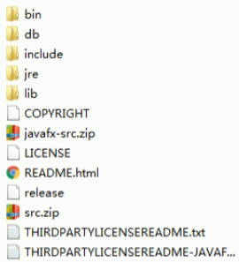
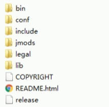
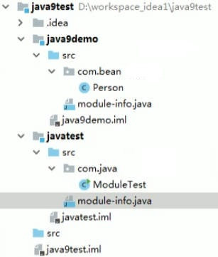
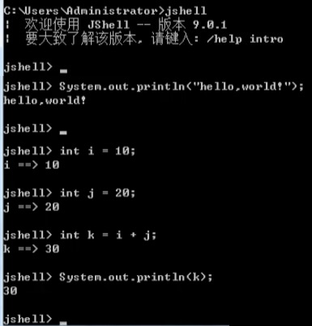

# Java Versions

## JEP和JSR

* JEP(JDK Enhancement Proposals): jdk 改进提案，每当需要有新的设想时候，JEP 可以在JCP(java community Process)之前或者同时提出非正式的规范(specification)，被正式认可的 JEP 正式写进 JDK 的发展路线图并分配版本号。
* JSR(Java Specification Requests): java 规范提案，新特性的规范出现在这一阶段，是指向JCP(Java Community Process)提出新增一个标准化技术规范的正式请求。请求可以来自于小组/项目、JEP、JCP成员或者 java 社区(community)成员的提案，每个 java 版本都由相应的JSR支持。

## Java 8

2014年3月18日。<font color=red>**LTS (Long-Term-Support)**</font>

### 1. Lambda

函数式接口：只有一个方法的接口。可以使用注解`@FunctionalInterface`标识.

本质：作为函数式接口的实例。

```java
Runnable runnable = new Runnable() {
	@Override
	public void run() {
		System.out.println();				
	}
};
// lambda1： 无参数无返回值
Runnable runnable = () -> System.out.println();
// lambda2： 有参数无返回值
Consumer<String> c = (String s) -> System.out.println(s);
// lambda3： 类型推断
Consumer<String> c = (s) -> System.out.println(s);
// lambda4： 只有一个入参省略括号
Consumer<String> c = s -> System.out.println(s);
// lambda5： 多个参数
Comparator<Integer> c = (o1, o2) -> {
    return o1.compareTo(o2)
};
// lambda6： 只有一条语句，return 和 {}都可以省略
Comparator<Integer> c = (o1,o2) -> o1.compareTo(o2);
```

| 内置函数式接口                                | 参数类型和返回类型                                           |
| --------------------------------------------- | ------------------------------------------------------------ |
| Consumer\<T\>                                 | **void** accept(T t);                                        |
| Supplier\<T\>                                 | T get();                                                     |
| Function<T, R>                                | R apply(T t);                                                |
| Predicate\<T\>                                | **boolean** test(T t);                                       |
| BiFunction<T, U, R>                           | R apply(T t, U u);                                           |
| UnaryOperator\<T\> **extends** Function<T, T> | 对类型为T的对象进行一元运算，并返回T类型的结果。包含方法为:T apply(T t); |
| BiFunction<T, U, R>                           | R apply(T t, U u);                                           |

### 2. 方法引用

当要传递给Lambda体的操作，已经有实现的方法了，可以使用方法引用！

方法引用使用的要求: 

> 要求接口中的抽象方法的形参列表和返回值类型与方法引用的方法的<font color=black>**形参列表**</font>和返回值类型相同!
>
> 要求接口中的抽象方法的形参列表和返回值类型与方法引用的方法的<font color=black>**变量顺序**</font>和返回值类型相同!

```java
// 对象 :: 非静态方法
Consumer<String> c = s -> System.out::println;
Employee emp = newEmployee("Tom");
Supplier<String> sup1 = emp::getName;
// 类 :: 静态方法
Comparator<Integer> com1 = Integer::compare;
// 类 :: 非静态方法
Comparator<String> com2 = String::compareTo;
// 构造方法引用
E::new;
// 数组引用
String[]::new;
```

### 3. Stream API

Stream API(java.util.stream) 把真正的函数式编程风格引入到Java中！

Stream是数据渠道，用于操作数据源(集合、数组等)所生成的元素序列。

>1. Stream 自己不会存储元素
>2. Stream 不会改变源对象。相反，他们会返回一个持有结果的新Stream.
>3. Stream 操作是延迟执行的。这意味着他们会等到需要结果的时候才执行.

Stream 和 Collection 集合的区别: Collection 是一种静态的内存数据结构，而 Stream 是有关计算的。前者是主要面向内存，存储在内存中，后者主要是面向 CPU，通过 CPU 实现计算。“集合讲的是数据，Stream讲的是计算!”

<font color=blue>**1. 创建 Stream**</font>

```java
// 通过集合
List<Employee> employees = EmployeeData.getEmployees();
Stream<Employee> stream = employees.stream(); // 返回一个顺序流
Stream<Employee> parallelStream = employees.parallelStream();// 返回一个井行流
// 通过数组
Arrays.stream(arr);
// Stream.of()
Stream<Integer> stream = Stream.of(1, 2, 3, 4, 5, 6);
//创建 stream方式四: 创建无限流
// public static<T> Stream<T> iterate(final T seed, final UnaryOperator<T> f)
//遍历前5个偶数
Stream.iterate(0, t -> t + 2).limit(5).forEach(System.out::println);//0 2 4 6 8
// 指定类型 IntStream.iterate(...)
```

<font color=blue>**2. Stream 中间操作**</font>

**筛选与切片**

```java
// filter(Predicate p)一接收 Lambda ， 从流中排除某些元素
List<Employee> list = EmployeeData.getEmployees();
Stream<Employee> stream = list.stream();
stream.filter(e -> e.getSalary() > 7000).forEach(System.out::println);
// 截断流，取前三个
stream.limit(3).forEach(System.out::println);
// 跳过前三个元素
stream.skip(3).forEach(System.out::println);
// 去除重复
stream.distinct().forEach(System.out::println);
```

**映射**

```java
// map(Function f)一接收一个函数作为参数，将元素转换成其他形式或提取信息，该函数会被应用到每个元素上，并将其映射成一个新的元素
List<String> list = Arrays.asList("aa", "bb", "dd");
list.stream().map(str -> str.toupperCase()).forEach(System.out::printIn);
// fLatMap(Function f)一接收一个函载作为参，流中的每个值都换成另一个流，然后把所有流连接成一个流。

// NOTE:
// mapToDouble(ToDoubleFunction f)
// mapTolnt(TolntFunction f)
// mapToLong(ToLongFunction f)
// 接收一个函数作为参数，该函数会被应用到每个元素上，产生一个新的 DoubleStream。
// 接收一个函数作为参数，该函数会被应用到每个元素上，产生一个新的 IntStream。
// 接收一个函数作为参数，该函数会被应用到每个元素上，产生一个新的 LongStream。
```

**排序**

```java
// sorted()一自然排序
List<Integer> list = Arrays.asList(12, 43, 65, 34, 87, 0,-98, 7);
list.stream().sorted().forEach(System.out::println);
// sorted(Comparator com)一-定制排序
```

<font color=blue>**3. Stream 终止操作**</font>

匹配与查找

```java
// alLMatch(Predicate p)一检查是否匹配所有元素。
// noneMatch(Predicate p)一检查是否没有匹配的元素。
// findFirst()一返回第一个元素
// findAny()一返回当前流中的任意元素
// count()一返回流中元素的总个数
// max(Comparator c)一返回流中最大值
// min(Comparator c)一返回流中最小值
```

归约

```java
// reduce(T identity, BinaryOperator b) 可以将流中元素反复结合起来，得到一个值。返回T
List<Integer> list = Arrays.asList(1,2,3,4,5,6,7,8,9,10);
list.stream().reduce(0, Integer::sum); // 初始值0
// reduce(BinaryOperator) -可以将流中元素反复结合起来，得到一个值。返回 Optional<T>
List<Employee> employees = EmployeeData.getEmployees();
Stream<Double> salaryStream = employees.stream().map(Employee::getSalary);
Optional<Double> sumMoney = salaryStream.reduce(Double::sum);
```

收集

```java
// collect(collector c)一将流转换为其他形式。接收一个 Collector接口的实现，用于给Stream中元素做汇总的方法
List<Employee> employees = EmployeeData.getEmployees();
employees.stream().filter(e -> e.getsalary() > 6000).collect(Collectors.toList()):

// javagosql
Stream.of("java", "go", "sql").collect(Collectors.joining());
// java, go, sql
Stream.of("java", "go", "sql").collect(Collectors.joining(", "));
// 【java, go, sql】 prefix and suffix
Stream.of("java", "go", "sql").collect(Collectors.joining(", ", "【", "】"));
```

| 方法           | 返回类型             | 作用                                   |
| -------------- | -------------------- | -------------------------------------- |
| toList         | List\<T\>            | 把流中元素收集到List                   |
| toSet          | Set\<T>              | 把流中元素收集到Set                    |
| toCollection   | Collection\<T>       | 把流中元素收集到创建的集合             |
| counting       | Long                 | 计算流中元素的个数                     |
| summingint     | Integer              | 对流中元素的整数属性求和               |
| averagingInt   | Double               | 计算流中元素Integer属性的平均值        |
| summarizinglnt | IntSummaryStatistics | 收集流中Integer属性的统计值。如:平均值 |

### 4. Optional

| method                                             |                     |
| -------------------------------------------------- | ------------------- |
| of(T t)                                            | t必须是非null       |
| empty()                                            | 生成空的optional    |
| ofNullable(T t)                                    |                     |
| orElse(T t)                                        | 原封装值为空则返回t |
| **boolean** isPresent()                            |                     |
| ifPresent(Consumer<? **super** T> action)          | 执行action          |
| ifPresentOrElse(Consumer<? **super** T>, Runnable) |                     |

### 5. 接口方法

JDK 7: 只能

> 全局常量：public static final 的
>
> 抽象方法：public abstract 的

JDK 8: 可以

> 静态方法：public static 只能通过接口调用。
>
> 默认方法：public default.
>
> > 如果父类和接口方法相同，默认优先调用父类。
>
> > 实现了相同方法的多个接口，必须要显示重写。
>
> > 接口方法调用，接口名.super.方法名。

### 6. try

```java
// 自动关闭流
try(InputStreamReader reader = new InputStreamReader(System.in)){

} catch (IOException e) {
    e.printStackTrace();
}
```

## Java 9

2017年9月21日。

java 9 提供了超过 150 项新功能特性，包括备受期待的模块化系统可交互的 REPL 工具: jshell，JDK 编译工具，Java 公共 API 和私有代码，以及安全增强、扩展提升、性能管理改善等。可以说 Java 9 是一个庞大的系统工程，完全做了个整体改变。

1. 目录改变

   

   

   > /jre : 被移除
   >
   > /jre/bin 移动到 /bin
   >
   > /src.zip --> /lib/src.zip

2. modularity

   1. Java 运行环境的膨胀和臃肿。每次JVM启动的时候，至少会有30~60MB的内存加载，主要原因是IVM需要加载rt.jar，不管其中的类是否被classloader加载，第一步整个jar都会被JVM加载到内存当中去(而模块化可以根据模块的需要加载程序运行需要的class) --> jlink工具, 订制运行时环境。
   2. 模块(module)的概念，就是在package外再裹一层。也就是说,用模块来管理各个package,通过声明某个package暴露，不声明默认就是隐藏。因此，模块化使得代码组织上更安全，因为它可以指定哪些部分可以暴露，哪些部分隐藏。


```java
// 创建 module-info.java
module name{
    // exports package path
    exports com.bean;
}
module name{
    // requires module name
    requires java9demo;
}
```

​	

3. jShell命令 (REPL工具 Read-Evaluate-Print Loop)

   

   可以重复定义方法名，会覆盖。

   可以tab补全。

   没有受检异常。

   > /help: 查看可用命令。
   >
   > /edit: 查看已经编辑所有代码并支持修改。
   >
   > /edit 方法名: 修改方法。
   >
   > /imports: 查看已经导入 (默认导入的包)
   >
   > /open 文件名: 类似脚本语言，执行这个文件。
   >
   > /list: 查看历史操作。
   >
   > /vars: 查看定义的变量
   >
   > /method: 查看定义的方法
   >
   > /exit: 退出

4. 接口中可以定义private方法。

5. 钻石操作符：匿名内部类可以省略指定泛型。

6. try 语句自动关闭流

```java
// 可以在try外面实例化, reader此时是final
InputStreamReader reader = new InputStreamReader(System.in);
try(reader){

} catch (IOException e) {
    e.printStackTrace();
}
```

7. String变更。`char[] value --> byte[] value`
8. 只读集合。

```java
// JDK 9之前
Collections.unmodifiablelist(list); // contains: 调用入参list的contains方法
Arrays.asList(); // contains入参可以为空
// JDK 9
List.of() // contains的入参 Objects.requireNonNull(o);
```

9. Input Stream加强。

```java
ClassLoader cl = this.getClass().getClassLoader();
try (InputStream is = cl.getResourceAsStream("hello.txt");
    OutputStream os = new FileOutputStream("src\\hello1.txt")) {
    is.transferTo(os); // 把输入流中的所有数据直接自动地复制到输出流中
} catch (IOException e) { 
    e.printStackTrace();
}
```

10. 增强Stream API

```java
// takeWhile(Predicate<? super T>) 一旦出现不满足就结束，后面数据丢弃。
List<Integer> list = Arrays.asList(45,43, 76，87，42，77，90， 73，67，88);
list.stream().takeWhile(x -> x < 50).forEach(System.out::println);// 45,43
// dropWhile(Predicate<? super T>) 一旦出现不满足就结束，后面数据全保留。
// of(T... t), 可以包含null值，可以多个null值，但不能单个null值。
Stream.of(1，2,3,null);
// ofNullable(T t), 可以单个null值。
Stream.of(null); // .count()是0，打印空“”
// 中间多了一个Predicate<? super T> hasNext参数的重载方法。
Stream.iterate(0, x -> x < 7, x -> x + 2).limit(5).forEach(System.out::println);//0 2 4 6
```

11. Optional类中stream()的使用

    ```java
    List<String> list = new ArrayList<>();
    list.add("Tom");list.add("Jerry");list.add("Tim");
    Optional<List<String>> optional = Optional.ofNullable(list);
    Stream<List<String>> stream = optional.stream();
    stream.flatMap(x -> x.stream()).forEach(System.out::printIn); // Tom Jerry Tim
    ```
    
12. Javascript 引擎升级：Nashorn

12. 禁止变量取名直接就是`_`, 编译报错。

## Java 10

2018年3月21日。

1. 局部变量类型推断。

```java
var num = 10;
for(var i : list){
    
}
```

2. `List.copyOf()` : 

```java
//示例1:
var list1 = List.of("Java", "python","c");
var copy1 = List.copyof(list1);
System.out.println(list1 == copy1); // true
//示例2:
var list2 = new ArrayLis<String>();
var copy2 = List.copyof(Iist2);
System.out.printn(list2 == copy2); // false
// 本身就是只读集合，没有必要再新创建集合。
```

## Java 11

2018年9月26日。<font color=red>**LTS (Long-Term-Support)**</font>

1. String 增强

```java
"   ".isBlank(); // true, \t \n 都是blank
"   ".strip(); // 去除blank, \t \n 都是blank
"".stripTrailing();
"".stripLeading();
"".repeat(n); // 复制次数。
"".ines.count();

readString();
writeString();
Path path = Files.writeString(Files.createTempFile("test", ".txt"), "This was posted on JD");
String s = Files.readString(path);
```

2. Optional增强

```java
isEmpty();
```

3. lambda参数可以加注解。
4. 全新的http客户端API。
5. 可以直接 `java Hello.java` 执行文件。
6. 废弃 Nashorn。
7. ZGC
7. 反射内部类。getNestHost()、getNestMembers() 和 isNestmateOf()。
7. 新的 Collection.toArray(IntFunction<T[]> generator) 方法

```java
// 在 Java 11 之前，Collection 接口提供了两个 toArray() 方法来将集合转换为数组。
// 返回一个 Object 数组
List<String> list = List.of("foo", "bar", "baz");
Object[] strings1 = list.toArray();

//  toArray() 方法需要一个请求类型的数组。如果此数组至少与集合一样大，则元素将存储在此数组中 (strings2a)。否则，将创建所需大小的新数组 (strings2b)。
String[] strings2a = list.toArray(new String[list.size()]);
String[] strings2b = list.toArray(new String[0]);

// Java 11 开始，我们还可以编写以下代码：
String[] strings = list.toArray(String[]::new);
```

10. Path.of()

```java
// Relative path foo/bar/baz
Path.of("foo/bar/baz");
Path.of("foo", "bar/baz");
Path.of("foo", "bar", "baz");

// Absolute path /foo/bar/baz
Path.of("/foo/bar/baz");
Path.of("/foo", "bar", "baz");
Path.of("/", "foo", "bar", "baz");
// 要定义绝对路径，在 Linux 和 macOS 上，第一部分必须以“/”开头，Windows 上以驱动器号开头，例如 “C:”。
```

## Java 12

2019年3月19日。

1. switch改动.

```java
int dayNumber = switch (day) {
 case MONDAY, FRIDAY, SUNDAY -> 6;
 case TUESDAY                -> 7;
 case THURSDAY, SATURDAY     -> 8;
 case WEDNESDAY              -> 9;
 default                      -> throw new IllegalStateException("Huh? " + day);
}
```
2. String

```java
String result = "foo\nbar\nbar2".indent(4);
// 调用 indent 方法会自动添加一个换行符号\n，
public <R> R transform(Function<? super String, ? extends R> f);
String.transform(StringUtils::toCamelCase)；
```
3. Files

```java
Files.mismatch(Path, Path);
// 返回一个 long 值，这个值表示第一处不匹配的字节位置。如果返回-1，说明两个文件相等
```
4. NumberFormat

```java
// 例子：3.6M比3,600,000容易读得多
// Java 12 引入了一个叫做 NumberFormat.getCompactNumberInstance(Locale, NumberFormat.Style)的静态方法。用于创建紧凑数字表示形式，
NumberFormat fmt = NumberFormat.getCompactNumberInstance(Locale.US, NumberFormat.Style.SHORT);
String result = fmt.format(1000); // 1k
```

## Java 13

2019年9月17日。

1. switch 

```java
// yield与return的区别在于，yield只会跳出switch块，return是跳出当前方法或循环。
final DayOfWeek day = DayOfWeek.SATURDAY;
final String typeOfDay = switch (day) {
    case MONDAY, TUESDAY, WEDNESDAY, THURSDAY, FRIDAY -> {
        System.out.println("Working Day: " + day);
        yield "Working Day";
    }
    case SATURDAY, SUNDAY -> {
        System.out.println("Day Off: " + day);
        yield "Day Off";
    }
};
// "Day Off"
```
```java
// Java13 预览版: Text Block
String json2 = """
        {
          "wechat": "hellokanshan",
          "wechatName": "看山",
          "mp": "kanshanshuo",
          "mpName": "看山的小屋"
        }
        """;
```

## Java 14

2020年3月17日。

1. instanceof

```java
if (!(obj instanceof String str)) {
    .. str.contains(..)..// 不必再声明str对象进行强制类型转换
} else {
    .. str....
}		
		
if (obj instanceof String str && str.length() > 5) {.. str.contains(..)..}
if (obj instanceof String str || str.length() > 5) {.. str.contains(..)..}
```
2. record

```java
public class Test {
    public static void main(String[] args) {
        test();
    }
    // record 是一种全新的类型，它本质上是一个 final 类，
    // 同时所有的属性都是 final 修饰，它会自动编译出 public get hashcode 、equals、toString 等方法，减少了代码编写量。
    private static void test() {
        Cat c1 = new Cat("tomcat", 1);
        Cat c3 = new Cat("tomcat", 1);
        Cat c2 = new Cat("jerry", 2);
        System.out.println(c1);
        System.out.println(c2);
        System.out.println(c1 == c3); // true
    }
}
record Cat(String name, Integer age) {
}

// 在 java.lang.Class 中引入了下面两个新方法：
RecordComponent[] getRecordComponents()
boolean isRecord()   
```
3. Text block

```java
// 其一，用\表示换行。其二，是用\s表示一个空格
// 不使用文本块
String literal = "two escape sequences first is for newlines " +
"and, second is to signify white space " +
"or single space.";
 
// 使用 \ 看起来像这样：实际内容是在同一行
String text = """
                two escape sequences first is for newlines \
                and, second is to signify white space \
                or single space.\
                """;
```

## Java 15

2020年9月15日。

1. 权限控制

```java
public abstract sealed class Person permits Employee, Manager {
    //...
}
final class Employee extends Person {
}

non-sealed class Manager extends Person {
}
// 任何继承密封类的类本身必须被声明为final、non-sealed的或sealed的。这可以确保类的层次结构保持在有限的范围内被编译器识别
if (person instanceof Employee) {
    return ((Employee) person).getEmployeeId();
} else if (person instanceof Manager) {
    return ((Manager) person).getSupervisorId();
}
// 如果没有一个密封的类，编译器就不能合理地确定所有可能的子类都被我们的 if-else 语句所覆盖。如果末尾没有 else 子句，编译器可能会发出警告，表明我们的逻辑没有涵盖所有的情况。
```

2. `TreeMap` 新引入了下面这些方法：
   - `putIfAbsent()`
   - `computeIfAbsent()`
   - `computeIfPresent()`
   - `compute()`
   - `merge()`

## Java 16

2021年3月16日。

1. 使用反射执行接口中的默认实现方法
2. DateTimeFormatter 的一个新成员是日周期符号 "B"，它提供了一个上午/下午格式的替代方案。

```java
LocalTime date = LocalTime.now();
DateTimeFormatter formatter = DateTimeFormatter.ofPattern("B h:m");
System.out.println(date.format(formatter)); // 下午 1:01
```

3. Stream.toList()

```java
List<String> lst = Arrays.asList("1", "2", "3");
// before jdk 16
List<Integer> ints = lst.stream().map(Integer::parseInt).collect(Collectors.toList());
// jdk 16+
List<Integer> ints = lst.stream().map(Integer::parseInt).toList();
```

## Java 17

2021年9月14日。<font color=red>**LTS (Long-Term-Support)**</font>

1. 随机生成器RandomGenerator
   1. `SplittableRandomGenerator`
   2. `JumpableRandomGenerator`
   3. `LeapableRandomGenerator`
   4. `ArbitrarilyJumpableRandomGenerator`

2. switch （预览）

```java
// Old code
static String formatter(Object o) {
    String formatted = "unknown";
    if (o instanceof Integer i) {
        formatted = String.format("int %d", i);
    } else if (o instanceof Long l) {
        formatted = String.format("long %d", l);
    } else if (o instanceof Double d) {
        formatted = String.format("double %f", d);
    } else if (o instanceof String s) {
        formatted = String.format("String %s", s);
    }
    return formatted;
}

// New code
static String formatterPatternSwitch(Object o) {
    return switch (o) {
        case Integer i -> String.format("int %d", i);
        case Long l    -> String.format("long %d", l);
        case Double d  -> String.format("double %f", d);
        case String s  -> String.format("String %s", s);
        default        -> o.toString();
    };
}
// 对于 null 值的判断也进行了优化。
// Old code
static void testFooBar(String s) {
    if (s == null) {
        System.out.println("oops!");
        return;
    }
    switch (s) {
        case "Foo", "Bar" -> System.out.println("Great");
        default           -> System.out.println("Ok");
    }
}

// New code
static void testFooBar(String s) {
    switch (s) {
        case null         -> System.out.println("Oops");
        case "Foo", "Bar" -> System.out.println("Great");
        default           -> System.out.println("Ok");
    }
}
```

# END