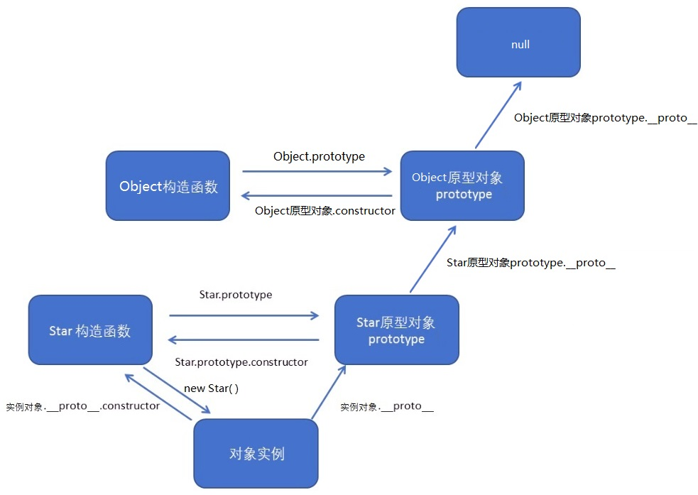
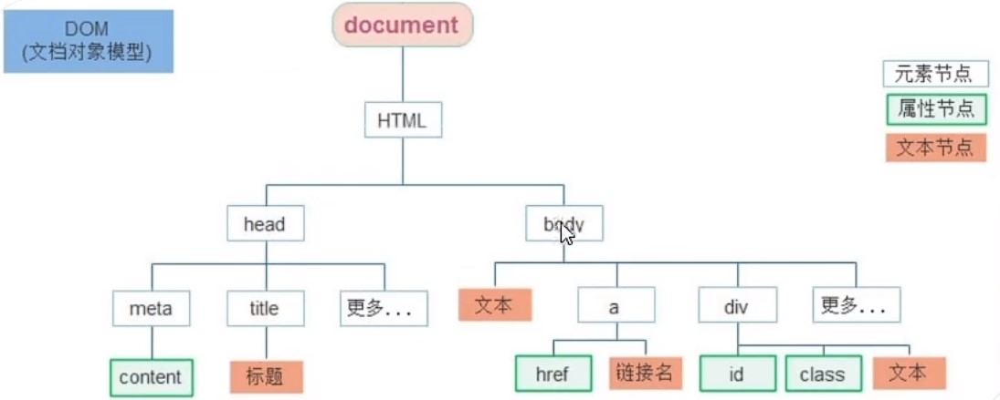
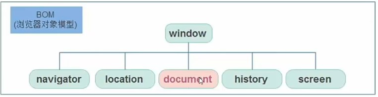

# Java Script

## 1. 序

是一门弱数据类型语言。

JavaScript权威网站: https://developer.mozilla.org/zh-CN/docs/Web/JavaScript (MDN)

VS code插件： 

Error Lens. 	One Dark Pro.	Live Server(浏览器自动刷新)

1. JavaScript (是什么?) 是一种运行在客户端 (浏览器) 的编程语言，实现人机交互效果。
2. 作用(做什么?)
   * 网页特效 (监听用户的一些行为让网页作出对应的反馈)
   * 表单验证 (针对表单数据的合法性进行判断)
   * 数据交互 (获取后台的数据染到前端）
   * 服务端编程 (node.js)

3. JavaScript的组成(有什么? )
   * ECMAScript (规定了js基础语法核心知识)
   * Web APIs
     * DOM (Document Object Model——文档对象模型) 操作文档，比如对页面元素进行移动、大小、添加删除等操作
     * BOM (Browser Object Model) 操作浏览器，比如页面弹窗，检测窗口宽度、存储数据到浏览器等等

<font color=green>**JS执行机制**</font>

JavaScript 语言的一大特点就是单线程。因为诞生的使命就是操作DOM，需要单线程。

HTML5 提出 Web Worker 标准，允许JavaScript 脚本创建多个线程，出现：

* 同步任务: 都在主线程上执行，形成一个执行栈。
* 异步任务: 相关添加到任务队列中.
  1. 普通事件，如 click、resize 等
  2. 资源加载，如 load、error 等
  3. 定时器，包括 setlnterval、setTimeout 等

执行顺序（重复执行 --> 时间循环）：

1. 先执行执行栈中的同步任务
2. 异步任务放入任务队列中
3. 一旦执行栈中的所有同步任务执行完毕，系统就会按次序读取任务队列中的异步任务，于是被读取的异步任务结束等待状态，进入执行栈，开始执行。

## 2. ECMAScript

### 2.1 书写

<font color=green>**书写位置**</font>

* 内部

* 外部
* 行内

```html
<!DOCTYPE html>
<html>
<head>
    <meta charset="utf-8">
    <title>Document</title>
</head>
<body>
    <!-- 内联js -->
    <button onclick="alert('逗你玩~~~')">点击我月薪过万</button>

    <!-- 内部js -->
    <!-- 放在body结束的位置，保证页面元素已经加载完了之后 -->
    <script>
        alert('你好，js~')
    </script>

    <!-- 外部js -->
    <!-- 标签中间不要写代码，写的内容会被忽略 -->
    <script src="my.js"></script>
</body>
</html>
```

<font color=green>**注释**</font>

单行注释： `/`

多行注释： `/* */`

<font color=green>**语法**</font>

结束符：`;` ，可以加也可以不加

<font color=green>**输出**</font>

```javascript
// 1. 文档输出内容
// 作用:向body内输出内容
// 注意:如果输出的内容写的是标签，也会被解析成网页元素
document.write("我是div标签')
document.write("<h1>我是标题</h1>')
// 2. 页面弹出警告对话框
alert('要出的内容')
// 3. 控制台输出语法
console.log('控制台打印')
console.log(a, b) // 打印多个
```

<font color=green>**输入**</font>

```js
// 3.输入语句
let name = prompt('请输入您的年龄:‘)
```

### 2.2 变量

命令规则：

* 不能是关键字
* 只能用数字、字母、下划线、$组成，数字不能开头
* 严格区分大小写，如 Age 和 age

命名规范：驼峰命名法。

```js
// 声明多个变量
let age = 18, name = 'zs'

// let 和 var
function example() {
  var x = 10;
  if (true) {
    var x = 20;
    console.log(x); // 输出20
  }
  console.log(x); // 输出20
}
example();

function example2() {
  let y = 10;
  if (true) {
    let y = 20;
    console.log(y); // 输出20
  }
  console.log(y); // 输出10
}
example2();

// 常量，不能被重新赋值。引用数据类型内容可以修改，地址不能修改
const PI = 3.14 // 声明的时候必须赋值

// 尽量使用const，const优先
```

var的局限性：

>可以先使用再声明(不合理)
>
>var声明过的变量可以重复声明(不合理)
>
>变量提升、全局变量、没有块级作用域等等

### 2.3 数据类型

`typeof 变量` , `typeof(变量)` ：数据类型

<font color="green">**基本数据类型**</font>

| 类型      |                                  |
| --------- | -------------------------------- |
| number    | NaN也是数字类型                  |
| string    | 单引号、双引号或反引号包裹的数据 |
| boolean   | true, false                      |
| undefined | 声明变量但不赋值的默认值         |
| null      | 赋值了，但内容为空。null是对象   |

```javascript
console.log(undefined + 1) // NaN
console.log(null + 1) // 1
NaN === NaN // 返回NaN

// 模版字符串, 反引号 + $
let age = 18
document.write(`我${age}岁了`) // ES6(2015年)
document.write(`我${age + age2}岁了`)
```

<font color="green">**引用数据类型：**</font> -> 2.4

<font color="green">**隐式数据类型转换**</font>

* `+`号两边只要有一个是字符串，都会把另外一个转成字符
* 串除了+以外的算术运算符 比如 `- ,*, /,==` 等都会把两个数据转成数字类型

```javascript
console.log(1 + 'a') // 字符串拼接 1a
console.log(undefined + 'abc') // undefinedabc
console.log(null + 'abc') // nullabc

console.log('abc' - 1) // NaN, NaN 是粘性的。任何对 NaN 的操作都会返回 NaN
console.log(+'123') // 转换为数字类型
```

转换为`false`：

- `false`（布尔类型的`false`）
- `0`（数字类型的零）
- `''`（空字符串）
- `null`
- `undefined`
- `NaN`

转化为0：

- `''`（空字符串）
- `null`
- `undefined` --> NaN， 但是 `null` == `undefined`

<font color="green">**显示数据类型转换**</font>

```javascript
Number(变量)
Boolean(变量)

parseInt(数据) // 只保留整数
console.log(parseInt('12px')) // 12
console.log(parseInt('12.34px')) // 12
console.log(parseInt('12.94px')) // 12

parseFloat(数据) // 可以保留小数
console.log(parseFloat('12px')) // 12
console.log(parseFloat('12.34px')) // 12.34
console.log(parseFloat('12.94px')) // 12.94
```

### 2.4 对象

字符串、数值、布尔、等基本类型都有专门的构造函数，这些我们称为包装类型。

JS中几乎所有的数据都可以基于构成函数创建。

* 引用类型
  * Object，Array，RegExp，Date 等
* 包装类型
  * String，Number，Boolean 等

#### 2.4.1 Object

<font color="green">**对象创建**</font>

```js
// 1. 字面量创建
let obj = {
    key1: value1, // 属性名尽量不要叫 'name'
    'key-2': value2,
    sayHi: function() { // 对象里面叫方法
        document.write('hi~~')
    }
}

// 2. new 创建
let obj = new Object()
let obj = new Object({uname:''})

// 3. 构造函数创建对象 (任何一个函数都可以被用作构造函数)
function Person(name, age) {
  this.name = name;
  this.age = age;
}
const john = new Person('John', 30);
```

<font color="green">***成员：***</font>

* 实例成员: 实例对象上的属性和方法属于实例成员 (相互独立)
* 静态成员: 构造函数的属性和方法被称为静态属性和静态方法 (互相影响)

```js
// 实例成员
console.log(对象名.属性)
console.log(对象名['属性']) // 如果属性名中有特殊字符，例如 'key-2'
对象名.属性 = 新值 // 新增或者修改
delete 对象名.属性 // 删除属性

obj.sayHi()
console.log(obj.sayHi()) // undefined, 无返回值情况

// 静态成员
Person.eyes = 2
Person.sayHi = function () {}

// 遍历对象
for(let k in obj){
    console.log(k) // 打印属性名
    console.log(obj[k]) // 打印属性值
}

for(let k in arr){
    console.log(k) // 数组下标，字符串类型
    console.log(arr[k]) // 打印数组元素
}

// Object
const obj = {uname:''}
const arr = Object.keys(obj); // 获取属性名
const arr = Object.values(obj); // 获取属性值
const obj2 = {}
Object.assign(obj2, obj); // 拷贝对象
Object.assign(obj, { age:18 }); // 追加新的属性age
```

#### 2.4.2 Array

```js
let arr = []
arr[0] = 1
arr[2] = 3 // 数据长度为3，arr[1]的值为undefined

let arr = [元素1, 元素2, 元素n] // 可以是不同的数据类型
let arr = new Array(1, 2, 3, 4)
arr[下标]
arr.lenght // 数组长度

arr.push(元素1, ..., 元素n) // 在数组末尾添加数据，返回该数组长度
arr.unshift(元素1, ..., 元素n) // 在数组开头添加数据，返回该数组长度
arr.pop() // 删除数组最后一个元素，返回删除元素，空数组返回undefined
arr.shift() // 删除数组第一个元素，返回删除元素，空数组返回undefined
arr.splice(startIndex, deleteCount) // 指定删除，批量删除
const str = arr.join('分隔符') 	// 把数组中的所有元素转换一个字符串
const arr = Array.from(伪数组);	// 伪数组转为真数组

// 遍历数组 (没有返回值，强行接收打印是undefined)
arr.forEach(function(ele, index) {
    console.log(ele) // 数组元素
    console.log(index) // 数组索引号
})

// 遍历数组并返回新的数组
const newArr = arr.map(function(ele, index) {
    console.log(ele) // 数组元素
    console.log(index) // 数组索引号
    return ele + '处理后的' // 返回添加到新的数组中
})

// 筛选出需要的
const newArr = arr.filter(function(ele, index) {
    return ele > 1
})

// 求和
arr.reduce(function(previousValue, currentVaule){
	return previousValue + currentVaule
}, 初始值)

// 返回数组中第一个匹配的元素
const item = arr.find(function(item){
	return true/false
})

// 返回boolean，是否数组中所有元素都是符合
arr.every(callback(element[, index[, array]])[, thisArg])
```

#### 2.4.3 String

```js
const str = 'abc'
// js 底层完成， 把简单数据类型包装为了引用数据类型
const str = new String('abc')
const arr = str.split(',') // 字符串转数组
const str = str.substring(start, end); // [start, end)
const bool = str.startsWith(searchString);
const bool = str.includes(searchString);
```

其他方法：`toUpperCase, toLowerCase, indexof, endswith, replace, match`

#### 2.4.3 其他

```js
// Number
const num = 10.923
const num2 = num.toFixed(n); // 保留n位小数，四舍五入. n = 2: 10 -> 10.00
String(num);
num.toString();

// Math
Math.PI // 圆周率
Math.ceil(1.1) // 向上取整: 2
Math.floor(1.1) // 向下取整: 1
Math.round(1.1) // 四舍五入: 1
Math.max(1, 2, 3) // 找最大数
Math.min(1, 2, 3) // 找最小数
Math.pow(2, 3) // 幂运算, 2的3次方
Math.sqrt(9) // 开平方
Math.abs() // 绝对值

Math.random() // 生成[0-1)之间的随机数 (包含0不包括1)
Math.floor(Math.random() * (max - min + 1)) + min; // [min, max] 之间的数
```

### 2.5 原型



<font color="green">***原型对象：prototype***</font>

能够利用原型对象实现方法共享

* 构造函数通过原型分配的函数是所有对象所共享的
* JavaScript 规定，每一个构造函数都有一个 prototype 属性，指向另一个对象，所以我们也称为原型对象
* 这个对象可以挂载函数，对象实例化不会多次创建原型上函数，节约内存
* 我们可以把那些不变的方法，直接定义在 prototype 对象上，这样所有对象的实例就可以共享这些方法
* 构造函数和原型对象中的this 都指 实例化的对象
* 每个原型对象中都有一个constructor, 该属性指向原构造函数。

```js
function Person() {
  this.name = "John";
}

Person.prototype.sayHello = function() {
  this // 这里this还是指向Person对象
  console.log("Hello, my name is " + this.name);
};
```

<font color="green">***对象原型：\_\_proto\_\_***</font>

每个实例对象都会有一个属性\_\_proto\_\_指向构造函数的 prototype 原型对象, 只读的。

* \_\_proto\_\_是JS非标准属性
* [[prototype]]和\_\_proto\_\_意义相同
* 用来表明当前实例对象指向哪个原型对象prototype
* \_\_proto\_\_对象原型里面也有一个 constructor属性，指向创建该实例对象的构造函数

```js
实例对象.__proto__ === Person.prototype
```

<font color="green">***原型继承***</font>

JavaScript 中大多是借助原型对象实现继承。

```js
// 父类
function Person() {
    this.eyes = 2;
    this.head = 1;
}

function Woman() {
    this.name = "John";
}
Woman.prototype = new Person(); // 继承
Woman.prototype.constructor = Woman; // 指回构造
// 给Woman类新加方法
Woman.prototype.newMethod = function() {

}

Man.prototype = new Person(); // 继承
Man.prototype.constructor = Man; // 指回构造
// 给Man类新加方法
Man.prototype.newMethod = function() {

}
```

<font color="green">***原型链***</font>

`instanceof` : 本质是prototype属性是否出现在某个实例对象的原型链上.

### 2.6 运算符

**赋值运算符：**`+=,-=,*=,/=,%=`

**一元运算符：**`++,--`， 后置++先使用再自加

```javascript
let i = 1
console.log(i++ + ++i + i) // 7
```

**比较运算符：**

`==` : 只判断值 (一般不用)

`===` : 全等，值和数据类型

`!==` : 判断值是否一样

```js
// 不同类型之间会有隐式转换
console.log(2 == '2') // true
console.log(undefined == null) // true

console.log(2 === '2') // false
console.log(NaN === NaN) // false

if (num = 2){
    // 永远为真
}

// 字符串比较，是比较的字符对应的ASCII码
```

**逻辑运算符：** `&&, ||, !` 返回逻辑中断的时候的值。

**运算符优先级：**


**展开运算符：** `...`

```js
const arr = [1, 5, 3, 8, 2]
console.log(...arr); // 1 5 3 8 2
Math.max(...arr) // 用来求最大值
const arr2 = [3, 4, 5]
const arr = [...arr1, ...arr2] // 合并数组
```

### 2.7 流程控制

语句：不一定有值。

表达式：有结果。

```js
// 1. if 语句
if (condition) {
    // 只有一个语句大括号可以省略
} else if () {

} else {

}
// 2. switch 语句
switch (任何类型值) { // 使用的是严格相等（===）的比较操作符来进行匹配
    case 'case1':
        console.log('This is case 1')
        break
    case 'case2':
        console.log('This is case 2')
        break
    case 'case3':
        console.log('This is case 3')
        break
    default:
        console.log('This is the default case')
}

// 3. while
while (循环条件) {
	continue
    break
}

// 4. do while
do {

} while (循环条件)

// 5. for 循环
for (let i = 0; i < 5; i++) {

}
```

`条件 ? 满足条件执行的代码 : 不满足条件执行的代码` ：三元运算符

### 2.8 函数

#### 2.8.1 概念

**function**

```javascript
// 1. 具名函数
function myFunction(para1 = 0, para2 = 1) { // 形参不需要let; 默认值
    // 在这里编写你的代码
    // 如果需要返回值，没有就是返回undefined
    return 20
}

// 2. 函数表达式
let fn = function () {
    //
}
fn()

// 3. 匿名函数 (可以用箭头函数)(箭头函数里面没有arguments)
const fn = function(){

}
const fn = () => {

}
const fn = (x) => {

}
// 只有一个参数的时候，小括号可以省略
const fn = x => {

}
// 只有一行代码的时候省略大括号，可以省略return。返回对象时加小括号
const fn = x => x + x
const fn = x => ({ uname:uname })

// 4. 立即执行函数，多个立即执行函数之间需要用分号隔开
(function () {
    console.log(11)
})();
(function () {
    console.log(11)
}());
!function(){}()

// 5. 函数参数
// 没有方法重载，函数名唯一，参数不匹配也能调用
myFunction(1);
myFunction(1, 2, 3);

function getSum() {
    //  动态参数, 伪数组
    arguments // [2, 3, 4]
}
getSum(2, 3, 4);

function getSum(arg, ...arr){
    // 剩余参数, 真数组
    // arr [3] or [2, 3]
}
getSum(2, 3);
getSum(1, 2, 3);
```

#### 2.8.2 内置函数

```html
<script>
    // 1. 间歇函数
    // 定时器: setInterval(函数，间隔时间)
	setInterval(function(){
       console.log('一秒执行一次')
    }, 1000)

    function fn() {
        console.log('一秒执行一次')
    }

    let n = setInterval(fn, 1000) // 返回定时器序号
    clearInterval(n) // 关闭定时器 (定时器回调函数里面不能调用这个清除定时器，里面推荐n = null)
    n = setInterval(fn, 1000) // 重开定时器

    // 2. 延迟函数
    setTimeout(回调函数，等待的毫秒数)
</script>
```

#### 2.8.3 作用域

**作用域：**

* 全局作用域：整个script 标签内部 或者 一个独立的js文件。
* 局部作用域：函数作用域。
  * 函数作用域。var声明的没有块作用域，但是有函数作用域。
  * 块作用域：let, const 声明的。


**Note: **

> 如果函数内部，变量没有声明，直接赋值，也当全局变量看，但是强烈不推荐。
>
> 函数内部的形参可以看做是局部变量。
>
> 变量访问：就近原则

<font color="green">**闭包 Closure**</font>

概念: 一个函数对周围状态的引用捆绑在一起，内层函数中访问到其外层函数的作用域

闭包 = 内层函数 + 外层函数的变量

闭包作用: 封闭数据，提供操作，外部也可以访问函数内部的变量。

```js
function outer() {
    let i = 1
    function fn() {
        console.log(i)
    }
    return fn
}
const fun = outer();
fun() // 调用fn
```

<font color="green">**提升**</font>

```js
// 1. 变量提升
console.log(num) // 会打印undefined
var num = 10
// js 执行时
// 1). 把所有var 声明的变量提升到 当前作用域的最前面
// 2). 只提升声明，不提升赋值

// 2. 函数提升
// 1). 会把所有函数声明提升到当前作用域的最前面
// 2). 只提升函数声明，不提升函数调用
```

### 2.9 正则表达式

正则表达式(Reqular Expression)是用于匹配字符串中字符组合的模式。在Javacript中，正则表达式也是对象。

```js
// 1. 定义规则
const regObj = /表达式/;
// 2. 检查
regObj.test(被检测的字符串); // true or false
regObj.exec(被检测的字符串); // null or 数组
```

<font color="green">**元字符 (特殊字符)**</font>

1. 边界符 (表示位置，开头和结尾，必须用什么开头，用什么结尾 )

   1. `^` : 以某某开始，`^a`
   2. `$` : 以某某结束，`a$` :
   3. `^a$` : `^$`一起表示精确匹配，只能匹配只有一个a的

2. 量词 (表示重复次数)

   | 符号  | 示例   | 解释                  |
   | ----- | ------ | --------------------- |
   | *     | (abc)* | 0次或多次             |
   | +     | [abc]+ | 1次或多次             |
   | ？    |        | 0次或1次              |
   | {n}   |        | n次。(字符不重复匹配) |
   | {n,}  |        | 大于等于3             |
   | {n,m} |        | n到m (贪婪匹配)       |

3. 字符类 (比如\d 表示0~9)

   1. `.` : 除了换行所有
   2. `[abc]` : 匹配一个字符
   3. `-` : 连字符，`[a-zA-Z]`   ，如果在最后则没有特殊含义，代表字符本身
   4. `|` : `abc | ABC`
	5. 预定义类

	| 符号 | 示例 | 解释                             |
	| ---- | ---- | -------------------------------- |
	| \\d  |      | 匹配单个数字字符，相当于[0-9]    |
	| \\D  |      | 单个非数字字符，相当于\[^0-9]    |
	| \\w  |      | 相当于[0-9a-zA-Z]                |
	| \\W  |      | 相当于\[^0-9a-zA-Z]              |
	| \\s  |      | 匹配空白字符, 相当于[\t\r\n\v\f] |
	| \\S  |      | 匹配非空白                       |

<font color="green">**修饰符**</font>

修饰符约束正则执行的某些细节行为，如是否区分大小写、是否支持多行匹配等

```js
/表达式/修饰符

// ignore 不区分大小写
/表达式/i
// global 全局匹配
/表达式/g

字符串.replace(/正则表达式/i, "替换的文本'); // 替换一个
字符串.replace(/正则表达式/ig, "替换的文本');// 替换所有
```

## 3. WebAPI

### 3.1 DOM

操作网页内容。

**DOM树：** 文档树直观的体现了标签与标签之间的关系。

**DOM对象:**  浏览器根据html标签生成的JS对象

* 所有的标签属性都可以在这个对象上面找到
* 修改这个对象的属性会自动映射到标签身上

#### 3.1.1 DOM节点



* 元素节点
  * 所有的标签 比如 body、 div
  * html是根节点
* 属性节点
  * 所有的属性比如href
* 文本节点
  * 所有的文本
* 其他

<font color="green">**节点操作**</font>

```html
<script>
    // 查找父节点，找不到返回null
    子元素.parentNode
    父元素.children
    // 查找下一个兄弟节点
    ele.nextElementSibling
    ele.previousElementSibling

    // 创造一个节点
    const ele = document.createElement(标签名)
    // 插入到这个父元素的最后
    父元素.appendChild(ele);
    父元素.insertBefore(要插入的元素，在哪个元素前面);

    // 克隆一个已有的元素节点, 默认false, ture: 复制所有子节点
    元素.cloneNode(布尔值)

    // 删除节点
    父元素.removeChild(要删除的元素)
</script>
```

#### 3.1.2 属性

<font color="green">**查找**</font>

```js
const ele = document.querySelector('css选择器') // 只获取第一个

// 获取所有，返回伪数组，没有pop(), push()方法
const eles = document.querySelectorAll('css选择器')

document.getElementById('nav')
document.getElementsByTagName('div')
document.getElementsByClassName('w')
```

<font color="green">**修改**</font>

```js
const box = document.querySelector('.box')
// 对象属性 对象.innerText
box.innerText = '我是一个盒子'
box.innerText = '<strong >我是一个盒子/strong>' // 不解析标签
// 对象属性 对象.innerText
box.innerHTML = '我是一个盒子'
box.innerHTML = '<strong >我是一个盒子/strong>' // 识别标签
```

<font color="green">**样式属性**</font>

```js
// 1. 获取图片元素
const img = document.querySelector('img')
// 2. 修改图片对象的属性
img.src = './images/img1'
img.title = '名字'

// 对象.style.样式属性 = 值，属于行类样式，权重很高
img.style.width = '300px'
img.style.backgroundColor = 'hotpink' // 多个单词使用驼峰命名法
img.style.border = '2px solid blue'

img.className = 'box nav' // 多个class名字

元素.classList.add('类名')
元素.classList.remove('类名')
元素.classList.toggle('类名') // 切换一个类
元素.classList.contains('类名')
```

<font color="green">**自定义属性**</font>

html5推出的，以 'data-' 开头，在DOM对象上一律以dataset对象方式获取。

```html
<div data-id="1" data-spm="2"> 1 </div>
<script>
    const one = document.querySelector('div')
    console.log(one.dataset.id) // 1
    console.log(one.dataset.spm) // 2
</script>
```

<font color="green">**其他属性**</font>

```js
ele.addEventListener('mousemove', function(e) {
    e.pageX // 鼠标在页面中的位置 (页面中)
    ele.getBoundingClientRect() // 元素在窗口中的位置 (可视窗口中)
});
```

#### 3.1.3 事件

```html
<script>
    // 禁止跳转
    <a href="javascript:;">关于我们</a>

    // 事件监听
    // DOM LO
	事件源.on事件 = function(){}
    btn.onclick = null // 解绑事件

	// DOM L2. 区别: on方式会被覆盖，addEventListener方式可绑定多次，拥有事件更多特性，推荐使用
	元素对象.addEventListener('事件类型', 要执行的函数);
    元素对象.removeEventListener('事件类型', 执行的函数名);

    // 代码调用点击事件
    事件源.click();

    // 事件对象
    const btn = document.querySelector('button')
    btn.addEventListener('click', function(e){
		// e就是事件对象
    })
</script>
```

<font color="green">**M端事件**</font>

| 触屏touch事件 | 说明                            |
| ------------- | ------------------------------- |
| touchstart    | 手指触摸到一个 DOM 元素时触发   |
| touchmove     | 手指在一个 DOM 元素上滑动时触发 |
| touchend      | 手指从一个 DOM 元素上移开时触发 |

| 事件类型               |                                      |
| ---------------------- | ------------------------------------ |
| 'click'                | 点击的时候出发                       |
| mouseover, mouseout    | 进入子元素认为离开，并且伴随事件冒泡 |
| mouseenter, mouseleave |                                      |
| mousemove              | 鼠标移动事件                         |
| focus, blur            |                                      |
| Keydown, Keyup         |                                      |
| input                  | 输入的时候                           |
| change                 | 元素值发生变化并且失去焦点后触发     |

| 事件对象属性 |                                    |
| ------------ | ---------------------------------- |
| type         | 类型，例如 click                   |
| key          | 代替keyCode，返回按键'a','Enter'等 |
| target       | 事件源自的对象                     |

<font color=green>**页面加载事件**</font>

```html
<script>
    window.addEventListener('load', function() {
        // 等待页面所有资源加载完毕，执行回调函数 (外联CSS, js, 图片)
    });

    document.addEventListener('DOMContentLoaded', function() {
        // HTML 文档被完全加载和解析完成之后事件被触发，无需等待样式表、图像等完全加载
    });
</script>
```

<font color=green>**页面滚动事件**</font>

```html
<script>
    window.addEventListener('scroll', function() {
        // 只要有滚动就会触发
        // document.documentElement 获取html元素
        document.documentElement.scrollTop // 页面已经被卷去的头部像素，可读写
    });

    div.addEventListener('scroll', function() {
        // 可以是overflow：scroll的div元素
        div.scrollTop // 已经被卷去的头部像素，可读写
        div.scrollLeft
    });

    元素.scrollTo(x,y) // 滚动到指定位置
    window.scrollTo(0, 0) // 返回顶部
    document.documentElement.scrollTop = 0 // 返回顶部
</script>
```

<font color=green>**页面尺寸事件**</font>

```html
<script>
    window.addEventListener('resize', function () {
        // 浏览器窗口大小发生变化的时候触发的事件
    });
    const div = document.querySelector('div')
    div.clientWidth // 宽度 (内容 + padding)(只读)
    div.offsetWidth // 宽度 (内容 + padding + border + margin + scroll) (只读)
    div.offsetLeft // 获取元素距离自己定位父级元素的 左距离(只读)
</script>
```

<font color=green>**其他事件**</font>

```js
video.ontimeupdate = function () {} // 视频播放时触发事件
video.onloaddata = function () {} // 打开页面时触发
```

<font color=green>**事件流**</font>

同名事件：事件捕获最大到小，事件冒泡从小到大

```js
DOM.addEventListener(事件类型，事件处理函数，是否使用捕获机制) // true就是捕获，默认false
事件对象.stopPropagation() // 阻止冒泡
事件对象.preventDefault() // 阻止默认行为，例如阻止表单提交
表单对象.addEventListener('submit', function (e) {
    // 阻止默认行为 不跳转
    e.preventDefault()
})
```

<font color=green>**事件委托**</font>

给父元素注册事件，当我们触发子元素的时候，会冒泡到父元素身上，从而触发父元素的事件。

```js
// 点击每个<li>变红
const ul = document.querySelector('ul')
ul.addEventListener('click', function(e) {
    // e.target.tagName 标签名字
    if (e.target.tagName == 'A') {
        e.target.style.color = 'red'
    }
}
```

#### 3.1.4 时间对象

```html
<script>
    const date = new Date(); 			// 当前时间
    const date = newDate('2022-5-1');	// 指定时间
    date.getFullYear();		// 2023
    date.getMonth();		// 0 ~ 11
    date.getDate();
	date.getDay();			// 0 ~ 6
	date.getHours();		// 0 ~ 23
	date.getMinutes();		// 0 ~ 59
	date.getSeconds();

    date.toLocaleString();		// 2023/9/24 03:56:48
    date.toLocaleDateString(); 	// 2023/9/24
    date.toLocaleTimeString(); 	// 03:56:48

    // 获得时间戳。是指1970年01月01日00时00分00秒起至现在的毫秒数
    date.getTime();
    +new Date();
    Date.now();
</script>
```

#### 3.1.5 插件

https://www.swiper.com.cn/  --> 下载zip --> package --> css, js --> 在线演示 --> 新窗口打开 --> CV

### 3.2 BOM



* window对象是一个全局对象。
* 像document、alert()、console.log() 这些都是window的属性，基本BOM的属性和方法都是window的。
* 所有通过var定义在全局作用域中的变量、函数都会变成window对象的属性和方法。
* window对象下的属性和方法调用的时候可以省略window。

#### 3.2.1 window中对象

```html
<script>
    // 1. location
    // 直接页面跳转
    location.href = 'http://www.baidu.com'
    // search 属性获取地址中携带的参数，符号?后面部分
    // hash 属性获取地址中的哈希值，符号#后面部分

    location.reload(); // 刷新当前页面，参数 true 时表示强制刷新 (不是本地，而是从服务器重新获取)

    // 2. navigator
    navigator.userAgent // 浏览器信息

    // 3. history
    history.back()
    history.forward()
    history.go(number) // 1前进1个页面, -1后退1个页面
</script>
```

#### 3.2.2 本地存储

Application --> Storage

sessionStorage和localStorage约 5M左右

localStorage: 持久化在本地计算机之中。

sessionStorage: 关闭浏览器消失。

```html
<script>
    // 键值都为字符串类型
    localStorage.setItem(key, value);
    localStorage.getItem(key);
    localStorage.removeItem(key);

    const obj = { uname :'name'};
    // 复杂类型要用json string存储，否则无法使用 [object Object]
    localStorage.setItem('obj', JSON.stringify(obj));
    JSON.parse(localStorage.getItem(key));

    // ID重复问题：新增加的ID应该是最后一条数据的ID + 1
</script>
```

