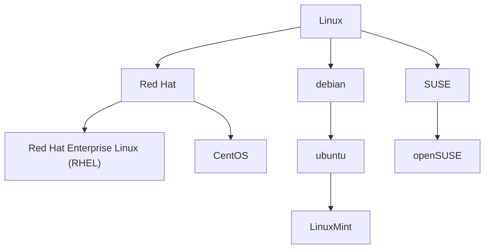

# Linux

## 1. 简介

1991年初，芬兰人 Linus Torvalds 基于Minix (Unix的变种) 进行开发，9月开发完成内核0.01版本，命名Linux.

GNU/Linux: Linux内核是GUN的一部分，GNU's Not Unix!的递归缩写。

只要用了Linux内核都叫Linux。


1972年，C语言发布，Unix1973年都用C重写了。

## 2. Linux 系统安装

### 2.1 VMware

VMware 是一个虚拟PC的软件。https://yinxiu.in/2021/vmware-download-and-install.html 从而实现若干个独立的操作系统。

### 2.2 创建新的虚拟机

VMware Workstation16 pro：新建虚拟机 --> 稍后安装操作系统 --> linux, CentOS 7 64 bit --> 虚拟机名称，保存位置 --> 处理器数量：1, 处理器核数：1 --> 虚拟机内存: 不能是电脑内存一半，最少128M. 推荐 628M --> NAT --> 创建新虚拟磁盘 --> 磁盘空间：20G, 虚拟机拆分多个文件 --> 完成

虚拟机快照：直接恢复至该设置状态点。
克隆：一个一模一样的虚拟机。完整克隆。（链接克隆：只占用实际大小，原始机删除克隆机不能用）

### 2.3 安装OS

**Centos 7 安装** : 

官网下载： www.centos.org

主机CPU必须开启虚拟化

Install CentOS7 --> 软件选择，GNOME桌面，互联网应用程序，开发工具。--> 安装位置，我要配置分区(对应windows盘符，AB盘是软盘) --> 标准分区，"+" --> /boot, 1G and swap(作为内存的候补)2g and /, 18g --> 网络和主机名，以太网开启。--> 开始安装 -->配置网络，添加用户。密码后面加了 mm

桌面打开的终端只是终端控制台仿真器。Shell: 命令解释器，command interpreter。

字体：cd /lib/kbd/consolefonts , setfont 当前目录下的字体。
## 3. 磁盘分区

### 3.1 分区

把大硬盘分成为小的逻辑分区，一个硬盘分成多个硬盘。

> <font color="#000000">主分区： 最多4个。</font> 
> <font color="#000000">扩展分区：</font>
>
> > <font color="#000000">最多1个。</font>
> > <font color="#000000">主分区 + 扩展分区最多有4个。</font>
> > <font color="#000000">不能写入数据，只能包含逻辑分区。</font>
>
> <font color="#000000">逻辑分区：从编号5开始。包含于扩展分区。</font>

| 命令       |                |
| ---------- | -------------- |
| fdisk -l   | 查看磁盘信息。 |
| fdisk 设备 | 分区。         |
|            |                |

### 3.2 格式化

写入文件系统：在磁盘特定区域写特定数据。（柜子打隔断，4KB）
ext2: 1993年。当个文件 < 2TB，分区＜16TB。
ext3: 增加日志功能。例如崩溃日志。
ext4: 16TB, 1EB.
xfs:

### 3.3 分配盘符

分区设备文件名: 给每个分区定义设备文件名。

### 3.4 挂载

给每个分区分配挂载点。
必须分区:

> / ：根分区
> swap分区：交换分区，内存两倍，不超过2GB

推荐分区：/boot 启动分区，200MB

## 4. 

## 5. 远程登录管理

### 5.1 网络配置

1. 桥接：利用真实网卡连接，可以与外部连接。占用一个真实网段IP
2. NAT: 利用虚拟网卡连接，与真实机通讯。
3. Host-Only: 只能与真实机通讯。

### 5.2 修改静态IP

vim /etc/sysconfig/network-scripts/ifcfg-ens33 

```bash
BOOTPROTO=“dhcp” --> "static"
ONBOOT="no" --> “yes”
# 添加静态IP配置：
IPADDR=“192.168.网络位.100”
GATEWAY=“192.168.网络位.2”
DNS1=“192.168.网络位.2”
```

ifconfig: interface config
​        本机：127.0.0.1
​    `ifconfig eth0 VMnet1的地址`：第一块卡 eth （重启之后IP丢失）
​    如果是桥接，`ifconfig eth0 真实机的IP同一网段的地址`  

## 6. 目录

硬盘文件：/dev/sd[a-p]
光盘文件：/dev/sr0
没有扩展名的概念，不是像Windows一样靠扩展名区别文件类型。（压缩包、rpm、脚本文件会有扩展名，但是非必须）

| /bin -> /usr/bin                           | binary，bin中是二进制文件，也就是可以执行的文件。所有用户可以执行 |
| ------------------------------------------ | ------------------------------------------------------------ |
| /sbin -> /usr/sbin                         | 只有超级用户可以使用                                         |
| /usr/bin                                   | 这些命令和系统启动无关                                       |
| /usr/sbin                                  | ...                                                          |
| /boot                                      | 系统启动目录                                                 |
| /dev                                       | 设备文件保存目录                                             |
| /etc                                       | 配置文件保存目录                                             |
| /home                                      | 普通用户家目录 （/root root的home目录）                      |
| /lib -> /usr/lib<br />/lib64 -> /usr/lib64 | 函数库                                                       |
| /lost+found                                | 系统奔溃的碎片文件                                           |
| /media                                     | 挂载目录。多媒体设备                                         |
| /mnt                                       | 挂载目录。U盘                                                |
| /misc                                      | 挂载目录。NFS                                                |
| /opt                                       | 第三方安装软件保存目录。或者 /usr/local                      |
| /proc, /run                                | 虚拟文件系统，**内存中**。系统信息                           |
| /sys                                       | 虚拟文件系统，**内存中**。内核相关信息                       |
| /srv                                       | 服务数据目录                                                 |
| /tmp                                       | 临时目录                                                     |
| /usr                                       | 系统软件资源目录，注意不是user。Unix Software Resource       |
| /var                                       | 动态数据保存位置。例如日志。                                 |

防火墙：通过IP过滤

## 7. 命令
命令格式: `命令 [-选项] [参数]`

<font color="#ee0000">命令太长可以用 "\" 换行。</font>

### 7.1 目录操作

|                                    |                                                              |
| ---------------------------------- | ------------------------------------------------------------ |
| pwd                                | print working directory，绝对路径                            |
| cd [~]                             | 进入用户主目录                                               |
| ls -a                              | list的意思, all的意思                                        |
| ls [ / ]                           | 可以指定任何目录, 例如 根目录 /。                            |
| ls -l                              | l: long的意思，详细信息<br/>信息解释：<br/>1：引用计数, 硬链接数。目录表示子目录数量。<br/>- ：表示文件<br/>d: directory<br/>l: 软链接<br/>u: user, g:group, o:other, r:读 w:写 x执行。有**目录的写权限**，才能删除文件。 |
| ls -d                              | d：directory 查看这个目录详细信息。                          |
| ls -i                              | 文件的ID，node                                               |
| ll -t                              | 按修改时间排序。                                             |
| mkdir -p                           | 递归创建。                                                   |
| rmdir                              | remove empty directories                                     |
| cp -rp [原文件或目录] [新文件目录] | copy，r: 递归地，p：保留复制文件的属性，例如文件修改时间。   |

### 7.2 文件操作

|                                                              |                                                              |
| ------------------------------------------------------------ | ------------------------------------------------------------ |
| touch 文件名                                                 | 创建文件。需要创建带空格的文件需要把文件名用引号框起来。     |
| \cp source dest                                              | 直接覆盖已有文件不提示。\\:  使用原生文件                    |
| rm 默认只删文件                                              | -f 强制操作，没有询问。                                      |
| cat [-n] [文件名]                                            | 查看文件。 n: 显示行号<br/>-A： 显示所有字符。Linux回车符是\$，windows回车符是^M\$<br/>转换字符命令：dos2unix 文件名 |
| tac                                                          | 反向显示。                                                   |
| more [文件名]                                                | 查看长文件。空格或者f翻页, b前翻页，enter 换行，q或者Q退出。=显示当前所在多少行。 |
| less                                                         | 额外: 可以向上翻页page up。箭头上一行。<br/>/名字搜索；n :下一个。N：上一个。 |
| head -n 数字 文件                                            | 指定查看几行。默认前十行。<br />tail: 看后几行，-f, 动态显示末尾几行，ctrl s 暂停滚动，ctrl q继续滚动。 |
| chmod [ugoa]\[+-=\][rwx] 文件名<br> or<br />chmod 数字 文件名 | 文件所有者或者root。<br/>ugoa: user,group, other and all. 可以用逗号隔开同时操作ugoa+-=rwx<br/>+-= : 增加或者减少或者指定这个权限。<br/>rwx: 读写执行。421.<br/>-R: 递归修改。 |
| chown 新用户名 文件名                                        |                                                              |
| chgrp 新组名 文件名                                          |                                                              |

### 7.3 链接

| ln -s [原文件] [目标文件]             | 软链接。类似于Windows的快捷方式。可以是目录。权限是777<br/>没有-s是硬链接。会跟原文件同步。不可以是目录。 |
| ------------------------------------- | ------------------------------------------------------------ |
| ls -i                                 | 可以通过节点判断是不是硬链接。node相同。                     |
| rm -rf 软链接名<br />rm -rf 软链接名/ | 只删除了目录链接<br />删除了目录下的原文件                   |
| pwd -P                                | 显示真正的物理路径，而不是软链接的文件夹路径。               |

### 7.4 日期

|                                                 |                                                              |
| ----------------------------------------------- | ------------------------------------------------------------ |
| date [+%Y]                                      | 显示当前日期.<br />%Y: 2022<br />%y: 22<br />%m: 月份<br />%d: 日期<br />%H%M%S: 时分秒<br />%s: 时间戳 |
| date -d ‘1 days ago’<br />date -d ‘-1 days ago’ | 显示前一天<br />显示后一天                                   |
| -s “时间”                                       | 设置时间                                                     |
| cal [-n] [-y]<br />cal 2022                     | 获取日历, 相邻n个月。当年的日历                              |

### 7.5 搜索

| 命令                                  |                                                              |
| ------------------------------------- | ------------------------------------------------------------ |
| find 目录<br />find 搜索范围 匹配条件 | 平铺所有层级目录<br />平铺所有层级文件<br />-name 文件名搜索？？？ 匹配三个字符<br/>-iname 不区分大小写搜索<br/>* ：匹配多个字符。？：匹配单个字符。<br/>-size +2048： 大于小于多少数据块。一个数据块512字节，0.5K. 数据块，linux存储文件最小单位。<br/>-size +10M: 10照以上。<br />-user: 找所有者。-group: 所属组查找。<br/>-amin -5: 访问时间access。<br/>-cmin：文件属性 change.<br/>-mmin: 文件内容 modify.<br/>-a：用于 and 两个条件。同理：-o：表示or<br/>-type: 文件类型。f 文件，d 目录，l 软链接<br/>-inum: 根据I节点删除。 |
|                                       |                                                              |
| find -maxdepth 1                      | 只查找当前目录。                                             |
| -exec 命令 {}\；<br/>-ok 命令 {}\；   | 找到之后再操作。<br/>需要确认的。                            |
| locate 搜索文件                       | 有自己的资料库。updatedb主动更新它，默认每天自动更新。不能找到/tmp下面的。 |
| -i                                    | ignore：不区分大小写。<br/>inquest：                         |
| which 命令                            | 搜索命令所在目录以及别名信息。**找不到Shell的内置命令**。    |
| whereis 命令                          | 命令或者配置文件位置和帮助文档所在位置。man1: 命令的帮助。man5: 配置的帮助。 |
| grep -iv ^指定字串[文件]         | 在文件中搜索字符串匹配的行并输出。<br/>-i: 不区分大小写。<br/>-v: 排除指定字串。<br/>^：以某某开头。<br/>-n：显示行号。 |
| wc 文件 | word count: 显示行数、单词数、大小 |

### 7.6 帮助

|                                              |                                                              |
| -------------------------------------------- | ------------------------------------------------------------ |
| type 命令                                    | 查看命令的类型                                               |
| man [数字] 命令或者配置文件<br />man -f 命令 | manual，配置文件不要加绝对路径信息。5：配置文件<br />查看内部命令 |
| whatis 命令                                  | 命令简短的信息。                                             |
| apropos 配置                                 | 配置文件简短信息。                                           |
| 外部命令 --help                              | 只看option的信息。                                           |
| info                                         | 后来出的命令。<br/>                                          |
| help 内置命令                                | Shell内置命令。例如 cd, exit, history                        |

### 7.7 压缩解压

| 命令                                                         |                                                              |
| ------------------------------------------------------------ | ------------------------------------------------------------ |
| gzip 文件名<br/>gunzip 文件名                                | .gz 格式。 压缩与解压缩。不能压缩目录。不保留原文件。多个文件多个压缩包。<br/>gzip -d: 也是解压缩。 |
| tar -cvf 压缩后文件名 目录名<br />-C 指定解压到的目录        | .tar 打包文件夹。<br/>-c: 打包。-v：显示详细信息。-f: 指定文件名。-z: 打包同时压缩。-x: 解压。 |
| zip [-r] 压缩后文件名 文件或者目录<br/>unzip -d 指定解压后的目录 | zip linux和win同时支持。-r: 压缩目录<br/>解压缩。            |
| bzip2 [-k] 文件名<br/>tar -cjvf 压缩包<br/>bunzip2 文件名<br/>tar -xjvf 压缩包 | .bz2 压缩比惊人。-k keep: 保留原文件。                       |

### 7.7 网络

| write 用户名        | 给在线用户发信息。Ctrl+D结束保存发送。                       |
| ------------------- | ------------------------------------------------------------ |
| wall 内容           | write all                                                    |
| ping [-c 次数] ip   |                                                              |
| ifconfig            | eth0: 真实网卡。HWaddr：mac地址。inet addr: 网址。<br/>lo: loopback网卡。127.0.0.1固定的 |
| mail 用户名         | Ctrl+D结束保存发送。<br/>mail： 看邮件。help: 帮助。         |
| last                | 所有用户登录信息。                                           |
| lastlog [-u uid]    | 所有用户最后一次登录时间。                                   |
| traceroute 网站地址 | 显示数据包到主机间的路径。                                   |
| netstat             | -a: 所有 -n: 拒绝别名显示 -l: 仅列出监听的服务状态 -p: 表示显示哪个进程在调用 |
| setup               | redhat 特有。                                                |
| mount               |                                                              |

### 7.8 关机重启

| shutdown [选项] 时间<br/>shutdown -h 1 : 一分钟后关机 | -h:halt 关机但不断电  指定时间，例如12：00, now<br/>-c： 取消前一个关机命令。-r : 重启。<br />poweroff 关机，断电 |
| ----------------------------------------------------- | ------------------------------------------------------------ |
| init 6                                                | = shutdown -r now = reboot<br/>/etc/inittab 系统默认运行级别。 |
| runlevel                                              | 查询系统运行级别。                                           |

## 8. vim

vim编辑器。命令 vi = vim。VIM 更多支持无限制的撤消, 语法加亮。 

aio: 由命令模式变插入模式。Esc：退出插入模式。右下角显示光标位置。左下角提示操作。

  ~/.vimrc  持久化的配置文件。

### 8.1 命令模式/一般模式(command mode)

| 移动光标 | shift + 4 行尾<br />shift + 6 行首 |
| --------- | -------------------------------------- |
| w        | 跳到下一个单词                     |
| b        | 跳到上一个单词                     |
| gg       | 全文开头                           |
| G        | 全文尾部                           |
| 3 + G    | 直接跳转到第三行                   |
| yy, nyy  | 复制选中的。复制当前行or n行 |
| y + $ | 复制从光标位置到结尾 |
| y + ^ | 复制从光标位置到开头 |
| p,P | 粘贴在上或者下行，从光标位置粘贴 |
| dd，ndd | 剪切 |
| D | 删除光标所在到行末尾 |
| u | 撤销 |
| y + w | 复制单词 |
| d + w | 删除单词 |
| dG | 删除光标所在行到末尾内容 |
| x , X | 删除(之前)字符 or nx 多个字符 |
| r | 替换一个字符                       |
| R | 持续替换字符，Esc结束 |
| ZZ       | 保存修改并退出                     |
| ZQ       | 不保存退出                         |
| map 按ctrl+v+快捷键 I#\<Esc\> | 定义了ctrl+快捷键的：ctrl+快捷键，立马做了行首插入#然后Esc |
| v | visual模式, 使用 j/k/h/l键可以选中一块。<br/>复制：y。粘贴：p。d：剪切。<br/>使用按键j/k/h/l进行选中多列， 按键Shift + i 进行 块模式下的插入 |

### 8.2 插入模式/编辑模式(input mode)

| a    | 在光标所在字符后插入 |
| ---- | -------------------- |
| A    | 在光标所在行尾插入   |
| i    | 在光标所在字符前插入 |
| I    | 在光标所在行行首插入 |
| o    | 在光标下插入新行     |
| O    | 在光标上插入新行     |

### 8.3 末行模式/指令命令模式(last line mode)

| :set nu                                                      | 设置行号                                                     |
| ------------------------------------------------------------ | ------------------------------------------------------------ |
| :set nonu                                                    | 不要行号                                                     |
| :n                                                           | 到第N行                                                      |
| :n1,n2d                                                      | 删除指定范围之间行。                                         |
| /                                                            | 搜索。n下一个。:set ic然后再搜就忽略了大小写。               |
| :noh                                                         | 取消高亮                                                     |
| :s/old/new<br />:s/old/new/g<br />:%s/old/new<br/>:%s/old/new/g<br/>:n1,n2s/old/new/g | 替换光标所在行第一个<br />替换光标所在行所有<br />全文替行第一个<br/>全文替换字符串<br/>范围内替换。 |
| :%s/old/new/c                                                | 每个都询问。                                                 |
| :n1,n2s/^/#/g<br/>:n1,n2s/^#//g                              | 快速注释。<br />快速取消。                                   |
| :w newFilename                                               | 另存为。                                                     |
| :r 文件名                                                    | 导入一个文件的内容到这个文件中。                             |
| :!which 命令                                                 | 不退出VI情况下也可以使用命令。                               |
| :r !date                                                     | 直接将date的结果导入了。                                     |
| :ab 变量名 字面量                                            |                                                              |

## 9. 软件包

分类：

> 源码包：
> 
>     优点：开源。可以自由选择所需功能。软件是编译安装，更加稳定效率高。卸载方便。
> 
>     缺点：安装过程步骤较多，需要很多软件集合。编译过程时间较长。因为是编译安装，安装出错很难解决。      
> 
> RPM包（二进制包）：
> 
>     安装卸载简单，安装速度快。
>     缺点：看不到源码。功能无法选择。有依赖性。

### 9.1 RPM包

#### 9.1.1 RPM命令管理

不需要指定安装位置。RedHat Package Manager

- 命令规则：
  
  .rpm 结尾。
  
  -rpm 命令管理。
  
  依赖: 模块依赖查询网站：www.rpmfind.net 
  
  -yum 在线管理，自主解决依赖。
  
- 安装：

  rpm -ivh 包全名。更新：rpm -Uvh 包全名。卸载：rpm -e 包名 。
  
  -i : install 安装。-v : verbose 显示详细信息。 -h: hash 显示进度。--nodeps: 不检测依赖性。
- 查询：
  
  rpm -q 包名 or rpm -qa （查出所有）（q:query, i:information详细信息)
  
  rpm -qip 包名（-p package  需要的但未安装的包信息）
  
  rpm -qlp 包名（-l list）
  
  rpm -qf 系统文件名 （查询系统文件属于那个RPM 包）
  
  rpm -qR 包名： 查询需要依赖的包。R: requires.
- 校验：
  
  rpm -V 已安装的包名 (verify)
  
  RPM 包中文件提取 ···
- 卸载:
  
  rpm -e RPM软件包
  
  rpm -e --nodeps RPM软件包 : 不检查依赖直接卸载

#### 9.1.2 YUM在线管理

Yellow dog Updater, Modified

IP地址配置。--> service network restart --> 配置网络yum源

yum命令：

yum list : 查看算有可装包。

yum search 关键字 ：查询。

yum -y install 包名： 安装。-y: 所有询问都是yes.

yum -y update 包名： 升级。（没有包名会升级所有，包括linux内核，谨慎操作）

yum -y check-update : 检查是否有可用更新 

yum -y remove 包名： 卸载。（会卸载所有依赖包，包括linux，谨慎操作）

yum grouplist: 列出软件组。

yum groupinstall: ----

yum groupremove: ----

光盘yum源。挂载光盘--> 让网络yum源失效 --> 让光盘yum源生效

### 9.2 源码包

需要指定安装位置。一般：/usr/local/软件名/ ，与代码位置/usr/local/src/ ，<font color="#0000ee"> 安装过程：实则源代码编译过程。</font>
安装C语言编译器 gcc--> 源码包解压 --> 进入解压缩目录 -->./configure自定义安装目录等--> make ，写入了Makefile 文件 --> make install.

### 9.3 脚本安装包

安装C语言编译器 gcc--> 源码包解压 --> 进入解压缩目录 -->./setup.sh

## 10. 用户与用户组管理

### 10.1 用户

/etc/passwd: 用户基本信息文件。（7个字段）。
UID： 0:管理员。
             1-499: 伪用户。
            500-65535：普通用户。
Shell： Linux的命令解释器。

/etc/shadow: 影子文件。默认权限为000.（密码）
9个字段：用户名，加密密码 (SHA512，!!或者*表示没有密码)，密码最后一次修改时间(从19700101开始，每过一天，时间戳+1)，两次密码修改时间间隔，密码有效时间，宽限时间，失效时间，保留。

### 10.2 用户组

/etc/group: 组名，组密码标志，组管理员用户名GID，组中附加用户。
/etc/gshadow:
/home/用户名: 所有者和所属组都是自己，700 （普通用户变为超级用户home目录不变）
/root/: 所有者和所属组都是自己，550 

邮件目录。

### 10.3 命令

| 用户命令                                                |                                                              |
| ------------------------------------------------------- | ------------------------------------------------------------ |
| useradd [-d 主目录] 用户名                              | 添加用户。<br/>/etc/default/useradd: 默认字段配置文件。<br/>/etc/login.defs |
| passwd 用户名<br/>passwd -l 用户名<br/>passwd -u 用户名 | 修改密码，改自己的直接passwd<br/>锁定用户。就是在配置文件密码字段加了两个感叹号。<br/>解锁用户。 |
| id 用户名                                               | 查看用户所属信息。                                           |
| /etc/passwd                                             | 所有用户。                                                   |
| who am i<br />whoami                                    | 当前会话最原始用户。<br />当前用户。                         |
| who                                                     | 多少人登录了当前设备。<br/>tty: 本地终端登录。pts: 远程终端登录。<br/>信息解释：<br/>PCPU: cpu时间。 |
| w                                                       | 更多详细登录信息。                                           |
| uptime                                                  | 连续运行的时间。                                             |
| echo "123" \| passwd --stdin lamp                       | 明文密码，需要自己修改。                                     |
| usermod 用户名                                          | 修改用户信息。                                               |
| charge 用户名                                           | 修改用户密码状态。<br/>-d 0. 上次修改时间归零，这样用户每次一登录，就要修改密码。 |
| userdel [-r] 用户名                                     | -r 同时删除用户的家目录                                      |
| su - 用户名                                             | 用户身份切换。-: 连带环境变量。<br/>su - root -c "命令"。借用身份执行一个命令。 |
| sudo 命令                                               | 临时执行超级管理员命令。必须被root 赋予到 sudoers中。/etc/sudoers |
| env                                                     | 查看用户环境变量                                             |

| 用户组命令                |                                                  |
| ------------------------- | ------------------------------------------------ |
| groupadd 组名             |                                                  |
| useradd -g 组名 用户名    |                                                  |
| usermod -g 组名 用户名    | 修改用户组。                                     |
| groupmod -n 新组名 原组名 | 修改组名。                                       |
| cat /etc/group            |                                                  |
| groupdel 组名             |                                                  |
| umask -S                  | 默认的创建后的文件的权限。文件的默认权限都去除x. |


## 11. ACL权限

一个用户只有一个所属组。ACL增加一个既不是所有者，也不是所属于组。
查看分区是否开启ACL, 一般都默认已经开启。
setfacl ----：-R 递归设置。
getfacl: 查看。
最大有效权限mask. 最多获得这些权限。
默认ACL权限：所有新建的文件也遵守这个权限。

### 11.1 文件特殊权限

SetUID: 
只有可以执行的二进制程序才能设定SUID。
命令执行者必须对该文件有x权限。
执行时成为该程序文件属主身份。
SetUID权限只有在执行过程中有效。
例如：
ll /usr/bin/passwd: -rw<font color="#ee0000">s</font>r-xr-x 

chmod 4755 文件名 or chmod u+s 文件名： 4代表SUID. 如果出现大S表明报错了。
chmod 755 文件名 or chmod u-s 文件名：取消SUID。

SetGID: 组身份升级为该程序文件所属组。
StickyBIT: 黏着位， 只对目录有效。前提有wx权限。普通用户只能删除自己新建的文件。

### 11.2 文件系统属性chattr权限

chattr +i 文件名: i: 不能其他人删除和修改，只能查看，对root用户同样生效。
chattr +i 目录: i: 只能修改目录下的文件。
lsattr -a 目录： 查看。
chattr +a 文件名: i: 不能其他人删除和修改，只能增加数据，对root用户同样生效

### 11.3 sudo 权限

sudo操作对象是系统命令，执行root用户的命令。
visudo：打开sudoers配置文件。修改文件从而更改对别人赋予权限。

## 12. 文件系统管理

### 12.1 文件系统常用命令

| 命令                      |                                                              |
| ------------------------- | ------------------------------------------------------------ |
| du <br />du --max-depth=1 | disk usage 磁盘占用情况。平铺显示当前所有层级子目录大小。只统计真实文件大小。<br />只显示一级子目录。 |
| du 目录名                 | -a : 子目录大小和子目录下文件大小。<br/>-c: 显示所有文件和子目录大小后，显示总和。<br />-s : 只显示总占用量。 |
| df                        | disk free 真正被占用的空间，例如被命令和程序占用的空间，未删除的文件。<br />temfs: 临时文件系统。 |
| free                      | 查看内存。                                                   |
| lsblk                     | 查看块设备。                                                 |
| mount                     | 查看挂载。/etc/fstab                                         |
| mount 指定设备 挂载点     |                                                              |
| mount -a                  | 依赖/etc/fstab 自动挂载。                                    |
| diff -u 文件1 文件2       | 比较两个文件，-u: 更加图形化。                               |
| tree 目录                 | 需要安装。                                                   |

## 13. Shell编程

命令解释器，介于内核和应用软件之间。

是一个强大的编程语言。解释执行的脚本语言，在Shell 中可以直接调用Linux系统命令。

**分类：**

B shell： Bourne 包括 sh, ksh, Bash, psh, zsh

C shell:    C语言 包括 csh, tsh

**Linux 支持的 Shell:**

sh，bash

### 13.1 新建脚本

| echo  | 输出命令。<br/>-e : 支持反斜杠转义。可以输出有颜色字体。 |
| ----- | -------------------------------------------------------- |
| reset | 重新初始化了bash                                         |

 编写： vi hello.sh

```第一个脚本
#!/bin/Bash
#用户名 （邮箱）
echo "内容"
```

调用: 

1. bash hello.sh **OR** sh hello.sh
2. 直接调用: chmod 755 hello.sh --> ./hello.sh
3. source hello.sh **OR** . hello.sh (不会启动子shell, `source 配置文件` or `. 配置文件`：配置文件直接生效。)

### 13.2 Bash

#### 13.2.1 Bash命令

| history<br/>-c<br/>-w                                        | 查看历史命令。 保存在 \~/.bash_history, 但是不会立即保存<br/>清空历史命令。！字符串：执行最后一条以该字符串开头的命令<br/>立即保存到历史文件中. /etc/profile 中 HISTORYSIZE=10000 |
| ------------------------------------------------------------ | ------------------------------------------------------------ |
| alias 别名 = '原来命令'<br/>unalias 别名                     | ls：所有命令都是绝对路径执行，这个命令是通过环境变量执行的。<br/>命令执行顺序：<font color="#4169E1">绝对路径 -> 别名 -> Bash内部命令 -> 环境变量</font><br/>\~ /.bashrc |
| ctrl a <br/>ctrl e<br/>ctrl C<br/>ctrl l<br/>ctrl u<br/>ctrl k<br/>ctrl y<br/>ctrl r<br/>ctrl d<br/>ctrl z | 命令开头。<br/>命令结尾。<br/>强制终止。<br/>=clear.<br/>剪切光标之前的内容。<br/>剪切光标之后的内容。<br/>粘贴。<br/>history 中搜索。<br/>退出当前终端。<br/>暂停并放入后台。 |
| >, >> , 错误命令 2>文件，>>, 命令 > 文件 2>&1 , 命令 &> 文件 | 输出重定向。                                                 |
| wc 文件，<br/>wc 然后开始敲，然后 ctrl d结束。               | 输入重定向。-c: 统计字节数。 -w: 单词数。 -l: 行数。         |
| ; , && , \|\|                                                |                                                              |
| grep                                                         | -i：忽略大小写。<br/>-n: 输出行号。<br/>-v: 取反。<br/>--color=auto 搜索出的关键字用颜色显示。 |
| w, chvt n                                                    | 看所有终端。切换终端。                                       |
| bash                                                         | 打开一个子Shell                                              |

#### 13.2.2 通配符

| ？             | 一个任意字符                            |
| ------------- | --------------------------------- |
| \*            | 0个或者多个。                           |
| [] （-：区间。^：非） | 一个括号中匹配的字符。                       |
| ''            | 括号中的所有字符没有特殊含义。                   |
| ""            | 括号中的有些字符有特殊含义，“\$” , "\`",  "\\"。 |
| ``            | 反引号=\$(),  引用系统命令。                |
| #             | 代表注释。                             |
| \$            | 调用变量。                             |

#### 13.2.3 自定义变量

``set 命令查看所有变量`` ``unset name：删除变量``

<font color="#4169E1">**用户自定义变量**：</font>

1. 默认是字符串类型。

2. 不能被子Shell访问。

3. 变量赋值时不能有空格。值有空格需要引号。值中可以使用转义符。

3. 变量可以叠加。 	
   > aa=123
   >
   > aa="\$aa"456
   >
   > aa=\${aa}789
   
5. 数字字母下划线，不能以数字开头。环境变量名建议大写。

6. readonly b=5 : 只读变量。不能unset。

<font color="#4169E1">**环境变量**：</font>

export 变量名=变量值：当前Shell和所有子Shell都可以访问。

env: 查看所有环境变量。

PATH: 系统查找命令的路径。

``PATH="$PATH":/root`` 例用命令叠加增加了一个path。

PS1: 自定义系统提示符（输入命令时前面的信息)。

/etc/issue: 本地终端欢迎信息。

hostname, hostnamectl  vi /etc/hostname, vi /etc/hosts 配置hostname和IP映射

<font color="#4169E1">**位置参数变量：**</font>

\$n : n表示数字，\$0是命令本身。两位数用 \${n}. `sum = $(($1+$2))`

\$\* : 所有参数。如果被引号引起来，for in循环时当做一个参数。

\$@ : 所有参数。

\$#: 所有参数个数。

<font color="#4169E1">**预定义变量：**</font>

\$? : 最后一次命令的返回状态。0正确，非0错误。0~255

\$\$: PID 当前进程ID。

\$ ! : 后台运行最后一个进程ID。命令后面加 &，代表后台执行。（jobs: 查看后台命令序号。Ctrl+z放到后台挂起，bg + %jobnumber）

read: 接受键盘输入。 -p “提示信息”。 -t 秒数。 -n 字符数。-s 隐藏输入的数据。

### 13.3 运算符

数值运算三种：

1. declare =+/- 选项 变量名

         -: 设定类型属性。+：取消变量的类型属性.

        -i：integer. -x：声明为环境变量。-p：显示指定变量的被声明的类型。
2. `expr 1 + 2` ： 计算出结果3。; `dd = $(expr $aa+$bb)`
3. `$[5 * 2]` or `$((6+8))` ;`$(($aa+$bb))`

变量测试和替换。

<font color="#cc9900">**此处省略一个复杂的表。**</font>

### 13.4 正则表达式

grep "正则" 文件名

| 匹配符                          |                                                     |
| ------------------------------- | --------------------------------------------------- |
| \*                              | 前一个字符0次或任意次。                             |
| .                               | 除换行符外任意一个字符。                            |
| ^                               | 以这个符号后面所有字符为开头的。                    |
| \$                              | 以这个符号前面所有字符为结尾的。                    |
| []                              | 某个范围内的一个字符。[0-9], [0,9], [ab], [0-9,a-z] |
| [^]                             | 非这个后面字符。                                    |
| \                               | 转义。                                              |
| \\{n, }, \\{n, \\}, \\{n, m \\} |                                                     |
| ^\$                             | 匹配空白行。^a.*b\$ : 以a开头并且以b结尾。          |
| {}                              | 需要使用-E,  grep -E [a]{9}                         |

### 13.5 字符提取

<font color="#4169E1">**==CUT==**</font>

`cut -d " " -f 1 文件名` :  -fn 取第几列，可以多列 `1,3`, `1-4`, `4-`, `-4`。-d: 分隔符，指定分列的符号，默认是制表符。如果是管道符后面就不用加文件名。

局限：不能通过tab符等分割。需要用awk命令。

<font color="#4169E1">**==AWK==**</font>

`awk [-FV] '/正则/{动作1}/正则/{动作2}...' 文件名`:   awk中，print自动换行。 awk很复杂，类似于一种新的编程语言。

>-F: 指定分隔符
>
>-v: 定义一个变量
>
>内置变量： FS, BEGIN, END, FILENAME, NR, NF 
>
>​	`ifconfig | awk '/^$/ {print "空行："NR}'` : 输出空行行号。
>
>`BEGIN{}` : 在所有数据读取行之前执行。

`printf '输出类型输出格式' 输出内容` ：

>$n : 第几列。 `{printf $1","$7} ` 
>
>

        %ns: n个字符串。

        %ni: n个数字。

`sed [选项] ‘动作’ 文件名`： 支持所有UNIX的轻量级流编辑器。可以操作打印出来的数据。

-n: 只输出经过sed命令处理的行。

'2, 4d'：删除2到4行。

'2a hello': 追加。

'2i hello': 行前插入。\ ：插入内容换行符号。

'2c hello': 替换一行。

<font color="#cc9900">**此处省略字符串替换。**</font>

-i: 修改原文件。

-e: 支持多条命令。

`sort 文件名`：排序显示。

`wc 文件名`：-l: 只统计行数。-w: 只统计单词数。-m: 只统计字符数。

### 13.6 流程控制

<font color="#4169E1">**==条件判断==**</font>

test condition or [ condition ]: 然后用\$?查看结果，0就为真。

>`test -e 文件 or [-e 文件]`: 判断是否存在, -f:文件，-d:目录。 
>
>[ \$a = hello ] ：echo $? （注意其中所有空格）
>
>[ \$a != hello ] 

-r 是否有读权限。-w: 	-x：.

`[文件1 -nt 文件2]`：文件1的修改时间是不是比文件2新。

`[整数1 -gt 整数2]`: =, -lt, -gt, -eq, -ne, -le, -ge

`[-z 字符串]` ： 判断字符串是否为空。 

`[ true ] && echo "" || echo "" `: 逻辑操作符。中括号中只要有返回值都是真。

`-a `：逻辑与。

<font color="#4169E1"> **==if语句==**</font>

```shell
if [ "$1"x = "abc"x ];then # 避免空值
    语句
fi

if [ 条件 ]
then
    语句
fi
```

```shell
if[ 条件 ]
then
	语句
    exit 1
elif [ 条件 ]
then
	语句
	exit 2
else
	语句
	exit 3
fi
```

<font color="#4169E1">**==case语句==**</font>

```shell
case $变量名 in 
    "1")
   		语句
    ;;
    "2")
    	语句
    ;;
    *)
        语句
    ;;
esac
```

<font color="#4169E1">**==for循环==**</font>

双括号才能数值计算。

```shell
for 变量 in v1 v2 v3  #{1..100}, 序列。 for i in {1..100}
    do
        语句
    done

for 变量 in $(cat ls.log)
    do
        语句
    done

for(( i=1;i<=100;i=i++ ))
    do
        sum=$[ $sum + $i ] #let sum+=i
    done
echo $sum
```

<font color="#4169E1">**==while 循环==**</font>

```shell
while []
    do
    done
until []
    do
    done
```

### 13.7 控制台

```shell
read (选项) (接收参数)
-p: 提示信息
-t: 等待时间 默认秒
```

### 13.8 函数

<font color="#4169E1">**==系统函数==**</font>

`$(系统命令)` ：调用系统函数。

| 常见函数               |                                    |
| ---------------------- | ---------------------------------- |
| basename 文件 [suffix] | 去除脚本前面的路径。去除后缀suffix |
| dirname 文件 [suffix]  | 返回路径。                         |
|                        |                                    |

<font color="#4169E1">**==自定义函数==**</font>

```shell
function funcname(){
	#用$n获取参数。
	s=$[$1+$2]
	# return 默认返回方法里最后一个命令执行后的返回码。
	echo $s 
}
sum=$(funcname 1 2) 
echo $? # 0 , $sum是3 
```


## 14. 服务管理

一直存在的进程叫服务。

Linux服务：

1. RPM服务
   
   1. 独立的服务
   
   2. xinetd服务

2. 源码服务

`chkconfig --list`: 查看所有RPM包安装的服务。

    源码包安装一般在 /usr/local，源码包所有文件在同一个包下面，没有垃圾文件。

    RPM包安装在默认位置。

/etc/: 配置文件位置。

/etc/init.d/: 服务位置。 start stop status restart (Redhat 可以直接用service 命令)

/var/log/: 日志。

路径：/usr/lib/systemd/

文件： 以.service结尾，守护进程以d.service结尾。

命令： systemctl 操作 服务名

## 15. 系统管理

### 15.1 进程

正在执行的程序或命令叫进程。

`ps aux` : 显示系统中所有进程。process status。a: 带有终端的所有用户进程。x:当前用户所有进程。u: 友好风格。

> <font color="#000000">USER: 产生进程的用户 </font>
>
> <font color="#000000">PID: 进程ID</font>
>
> <font color="#000000">VSZ: 虚拟内存，单位KB</font>
>
> <font color="#000000">RSS: 实际内存，单位KB</font>
>
> <font color="#000000">TTY: 哪个终端中运行。tty2-6 本地字符界面终端，tty1图形终端。pts/0-255 代表虚拟终端 (任何方式打开都是虚拟终端)</font>
>
> <font color="#000000">STAT: 进程状态。R: 运行，S: 睡眠。T：停止。Z：僵尸状态(空壳，一般父进程结束他会结束)。s: 包含子进程。1：多线程。+：前台显示， 位于后台。<: 优先级很高。N：优先级很低。 </font>
>
> <font color="#000000">START: 该进程启动时间</font>
>
> <font color="#000000">TIME: 进程占用CPU的运算时间。</font>

`ps -ef` : e:显示所有进程。f显示完整格式的进程列表。 <font color="#cc9900">**可以查看子父进程之间的关系。**</font>

`TOP -d 描述` : 每多少秒更新一次。

> <font color="#000000">第一行:  系统当前时间，运行时间（up 1 day，13:32），当前登录的用户，1分钟5分钟15分钟负载 (一般小于0.7)</font>
>
> <font color="#000000">第二行:  最后一个是僵尸进程。</font>
>
> <font color="#000000">第三行：CPU.</font>
>
> <font color="#000000">第四行：内存，用户，系统，空闲。</font>
>
> <font color="#000000">第五行： SWAP</font>
>
> 交互操作： M 按memory排序，P 按照CPU 排序, PgDown PgUp翻页，u 用户名 查看具体用户进程,k PID 终止进程。

`pstree` : 查看进程树。

<u>终止进程：</u>

`kill -l` : 查看所有信号名称。例如 9）SIGKILL

`kill [-9] pid` : -9 强制终止。

`killall -9 进程名称` ：。

`pkill -9 进程名称` ：。

`pkill -t -9 终端号` ：-t 终端号。

`jobs [-l]` : 查看后台进程。

`fg %工作号`：恢复前台执行。

`bg %工作号` ：放到后台执行（不能后台执行即后台执行没有意义的除外）。

### 15.2 系统资源查看

`vmstat 间隔时间 刷新次数 ` : 查看系统资源.

`dmesg` : 开机时内核检测信息。

`free ` : -b -m -k -g 查看内存使用状态。

`uptime` : top命令第一行。

`uname []` : -r 查看内核版本信息。-s: 查看内核名称。 -a: 系统所有相关信息。

`file /bin/ls` : 间接知道操作系统位数。

`lsb_release -a` : 发行版本。

`lsof ` ： -p 进程号：列出进程打开或者调用的文件。（反向查找）

### 15.3 系统定时任务

crond 服务是默认安装并启动的。

`crontab [选项]` : -e 编辑定时任务，-l 查询定时任务, -r 删除当前用户所有任务。

```bash
* * * * * 执行任务
#第一个* 第几分钟 0-59
#第二个* 第几小时 0-23
#第三个* 第几天   0-31
#第四个* 第几个月 1-12
#第五个* 星期几   0-7 （07都是星期天）
```

### 15.4 日志服务

rsyslogd

### 15.5 启动管理

`runlevel` ：显示两个数字，上次级别+这次级别

`init 运行级别 `

| 0    | 关机，不保存正在运行的服务不安全  |
| ---- | --------------------------------- |
| 1    | 单用户模式                        |
| 2    | 不完全的命令行模式，不含有NFS服务 |
| 3    | 完全命令行模式                    |
| 4    | 系统保留                          |
| 5    | 图形模式                          |
| 6    | 重启动                            |

`vim /etc/inittab` : 修改系统默认启动级别配置文件

systemctl get-default : 查看本机运行级别。

​	graphical.target or multi-user.target  （CentOS7简化成了这两种，分别对应 3 和 5）

启动流程。grub管理。

### 15.6 备份与恢复

`dump [选项] 备份之后的文件名 原文件名或者目录` :
`restore [模式选项] [选项]`：	

## NOTE: 

一切皆文件。

cache : 用来加速读取。

buffer：用来加速写入。 

ctrl + l : 清屏

命令参数加杠：标准UNIX风格。不加是BSD风格。


# THE END

