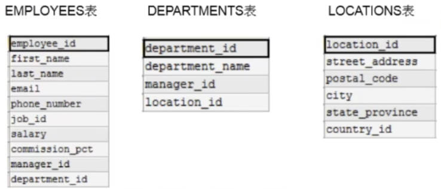
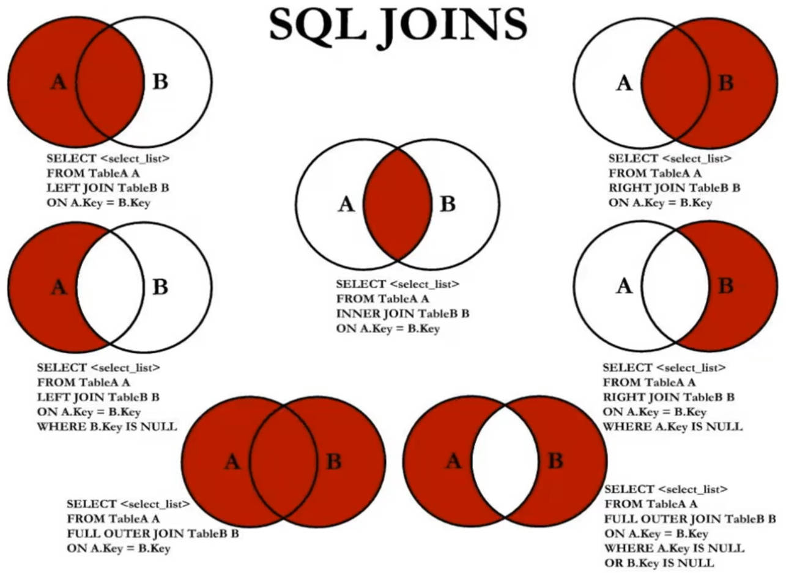
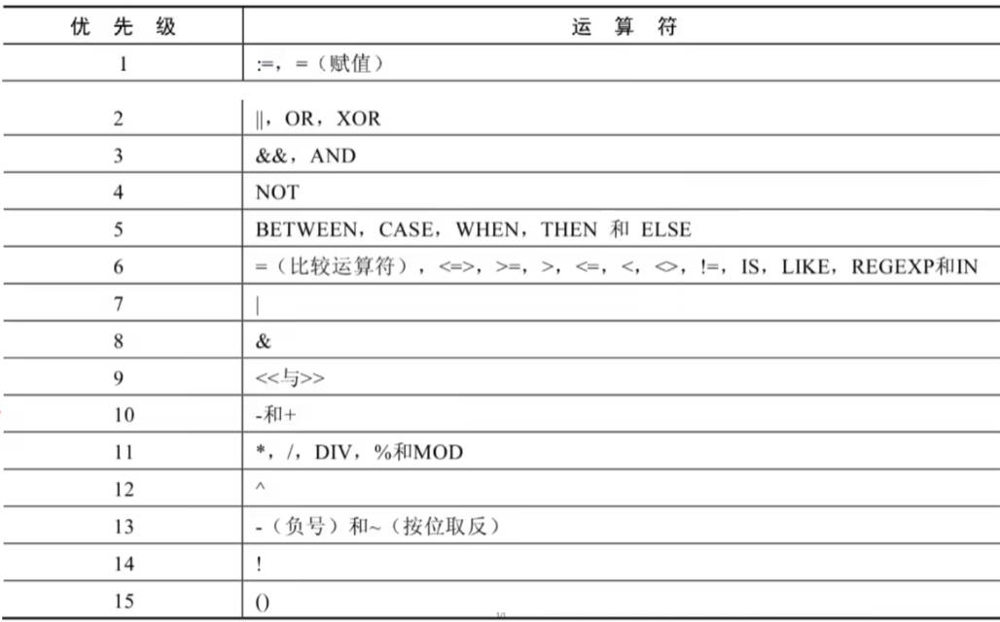

# MySQL

## 1. 简介

开放源代码的关系型数据库管理系统。

支持千万级别数据量的存储。

* 1995年瑞典MySQL AB (创始人Michael Widenius) 公司开发。
* 2008年，MySQL被SUN公司收购
* 2009年，0racle收购SUN公司，进而oracle就获取了MySQL
* 2016年，MySQL8.0.0版本推出

MySQL 的创造者担心MySQL有闭源的风险，因此创建了 MySQL的分支项目 MariaDB。

发布之后语法几乎没有变化。

* SQL-86、SQL-89、SQL:2003、SQL:2008、SQL:2011和SQL:2016
* SQL92 (SQL-2标准)、SQL99 (SQL-3标准)

<font color=green>**安装与配置**</font>

官网：www.mysql.com （社区版，企业版，集群版，高级集群版）

Downloads --> 企业版/社区版(MySQL Community(GPL) Downloads) --> MySQL Community Server --> MySQL Installer MSI, Go to Download Page --> 非web版本

Install --> custom --> select MySQL Server 8.0.34 - X64 to right --> select the right MySQL Server 8.0.34 - X64 to select "**advanced options**" to modify the path (server folder, data folder) --> execute --> config type: development computer --> (root password: abc123)--> 服务名“**MySQL80**”下面：取消开机自启动 --> finish

环境变量配置：bin目录直接加入到系统path中

检验：`mysql --version`

服务启动：

1. `services.msc`
2. `net start mysql服务名(80)`

<font color=green>**卸载：**</font>

1. 卸载软件
2. 手动删除数据库文件。...\MySQL Server 8.0\Data
3. MySQL的环境变量删除
4. MySQL的服务进入注册表删除。 (regedit)

**连接数据库：**

```bash
mysql -u用户名 [-P port号码] [-h 指定IP] -p密码 # windows
mysql -u用户名 -p密码 -h主机名 或 localhost # Linux
quit # 退出
SHOW DATABASES;
USE database_name;
```

查看字符集：登录mysql之后，
show variables like 'character\_%';
show variables like 'collation\_%'; 字符大小比较规则

修改字符集：安装的data路径/my.ini 中添加

```	bash
# 5.7默认是Latin, 8.0默认是utf8
default-character-set=utf8

character-set-server=utf8
collation-server=utf8_general_ci
```

使用Navicat 11连接lySql8.0错误`2059 chching_sha_2password`

1. 升级客户端
2. 或者修改用户登录加码规则`ALTER USER '用户名'@localhost IDENTIFIED WITH mysql_native_password BY '密码'`

## 2. 数据库

**DB-Engines Ranking:** https://db-engines.com/en/ranking

DB: 数据库 (Database)

* 即存储数据的“仓库”，其本质是一个文件系统。它保存了一系列有组织的数据

DBMS: 数据库管理系统 (Database Management System)

* 是一种操纵和管理数据库的大型软件，用于建立、使用和维护数据库，对数据库进行统一管理和控制。用户通过数据库管理系统访问数据库中表内的数据。
* RDBMS： 把复杂的数据结构归结为简单的 **二元关系**（即二维表格形式）
* 非RDBMS，基于键值对存储数据，不需要经过SQL层的解析性能非常高。同时，通过减少不常用的功能，进一步提高性能。

ORM(Object Relational Mapping)体现:

* E-R(entity-relationship，实体-联系)模型中有三个主要概念是:实体集、属性、联系集。
* 一个实体集(class)对应于数据库中的一个表(table)，一个实体(instance)则对应于数据库表中的一行(row)，也称为一条记录(record)。一个属性(attribute)对应于数据库表中的一列(column)，也称为一个字段(field)。

<font color=green>**其他DBMS**</font>

**0racle**

1979 年，0racle 2诞生，它是第一个商用的 RDBMS(关系型数据库管理系统)。随着 0racle 软件的名气越来越大，公司也改名叫oracle 公司。

2008年，SUN以10亿美金收购MySQL。

2009年，总计74亿美金收购SUN。

2016年，MySQL8.0推出。

**SQL Server**

SQL Server 是微软开发的大型商业数据库，诞生于 1989 年。

**DB2**

IBM公司的数据库产品,收费的。常应用在银行系统中。

**PostgreSQL**

PostgresQL 的稳定性极强，最符合SQL标准，开放源码，具备商业级DBMS质量。PG对数据量大的文本以及SQL处理较快。

**SQLite**

嵌入式的小型数据库，应用在手机端。零配置，SQlite3不用安装，不用配置，不用启动，关闭或者配置数据库实例。当系统崩溃后不用做任何恢复操作，再下次使用数据库的时候自动恢复。

**informix**
IBM公司出品，取自Information 和Unix的结合，它是第一个被移植到Linux上的商业数据库产品。仅运行于unix/linux平台，命令行操作。性能较高，支持集群，适应于安全性要求极高的系统，尤其是银行，证券系统的应用。

* 键值型数据库: Redis
* 文档型数据库: MongoDB
* 搜索引擎数据库: ES、Solr
* 列式数据库: HBase
* 图形数据库: InfoGrid

## 3. SQL

SQL: 结构化查询语言 (Structured Query Language)

* 专门用来与数据库通信的语言。


1974 年，IBM 研究员发布了一篇揭开数据库技术的论文《SEQUEL：一门结构化的英语查询语言》，直到今天这门结构化的查询语言并没有太大的变化。SQL92, SQL99两个标准。

**命令行执行已有sql：** source d:\mysqldb .sql

### 3.1 规则规范

https://www.w3school.com.cn/

**基本规则**

1. SQL可以写在一行或者多行。为了提高可读性，各子句分行写，必要时使用缩进。
2. 每条命令以 `;` 或 \\g 或 \\G结束
3. 关键字不能被缩写也不能分行

**规范**

MySQL 在 Windows 环境下是大小写不敏感的，MySQL 在 Linux 环境下是大小写敏感的

* 数据库名、表名、表别名、字段名、字段别名等都小写
* SQL 关键字、函数名、绑定变量等都大写
* 单引号用于表示字符串数据类型
* 双引号通常用于表示列名或表名

```sql
单行注释: # 注释文字(MySQL特有的方式)
单行注释:-- 注释文字(--后面必须包含一个空格。)
多行注释: /*注释文宁 */
```

### 3.2 SQL分类

* DDL (Data Definition Languages 数据定义语言)

这些语句定义了不同的数据库、表、视图、索引等数据库对象，还可以用来创建、删除、修改数据库和数据表的结构。主要的语句关键字包括 CREATE 、DROP、ALTER、RENAME 等

* DML (Data Manipulation Languages 数据操作语言)

用于添加、删除、更新和查询数据库记录，并检查数据完整性。主要的语句关键字包括 INSERT、DELETE、UPDATE、**SELECT** 等

* DCL (Data Control Languages 数据控制语言)

用于定义数据库、表、字段、用户的访问权限和安全级别。
主要的语句关键字包括GRANT、REVOKE、**COMMIT**、**ROLLBACK**、SAVEPOINT 等

( SELECT会单独拿出来叫DQL 数据查询语言 )

( COMMIT、ROLLBACK有可能会单独拿出来叫做TCL Transaction Control Language，事务控制语言)

### 3.3 DQL

#### 3.3.1 select

🟦 **SELECT** 🟦

```mysql
SELECT 1 + 1, 3*2 [FROM DUAL]; # DUAL 是伪表
-- 返回
+-----+
| 1+1 |
+-----+
|   2 |
+-----+

-- 别名, 使用双引号
SELECT 列名1 别名1,列名2 别名2
FROM 表名;
SELECT 列名1,列名2 AS 别名2 # AS: alias
FROM 表名;
SELECT 列名1 AS 别名1,列名2 "别名2"
FROM 表名;

-- 去除重复行
SELECT DISTINCT 列名1
FROM 表名;
SELECT DISTINCT 列名1,列名2 # 两个都不重复才会去重 (没有实际意义)
FROM 表名;
SELECT 列名1,DISTINCT 列名2 # 报错
FROM 表名;

-- 着重号 (反引号) 跟关键字重名的时候使用。(oracle不支持着重号)
SELECT * FROM `order`;

-- 查询常数，每一行数据都会添加
SELECT 列名1,列名2,'abc',123
FROM 表名;

-- 显示表结构
DESCRIBE 表名;
DESC 表名;
```

🟦 **WHERE** 🟦

```mysql
SELECT *
FROM 表名
WHERE last_name = 'King'; # 过滤.
-- 1. 内容区分大小写，但是MySQL不严谨，依旧可以查询出，oracle无法查询出。
-- 2. MySQL字段值可以双引号，但oracle报错
```

🟦 **排序** 🟦

```mysql
-- 默认按照插入顺序
SELECT salary * 12 abc
FROM DUAL
ORDER BY abc ASC; # 默认就是升序，DESC降序
# 🟥 WHERE 后面不可以使用SELECT中的别名，ORDER BY是可以的

-- 二级排序
ORDER BY a ASC, b DESC;
ORDER BY a, b DESC;
```
🟦 **分页** 🟦

```mysql
SELECT a
FROM DUAL
LIMIT 0, 20; # 偏移位置，偏移量。第一条开始，显示20条。

SELECT a
FROM DUAL
WHERE salary > 6000
ORDER BY salary DESC
LIMIT 0, 10; # LIMIT 10; 默认就是从偏移量0开始。
# LIMIT 10 OFFSET 0; 8.0新特性 偏移量, 偏移位置

-- 其他数据库
# SQL Server 和 Access : TOP
SELECT TOP 5 name, hp_max FROM heros ORDER BY hp_max DESC
# DB2 : FETCH FIRST 5 ROWS ONLY
SELECT name, hp_max FROM heros ORDER BY hp_max DESC FETCH FIRST 5 ROWS ONLY
# Oracle : ROWNUM
SELECT rownum, last_name, salary FROM employees WHERE rownum < 5 ORDER BY salary DESC;
```

#### 3.3.2 多表查询

笛卡尔积错误 —— 缺少了多表连接的条件，出现n*m 条数据。CROSS JOIN



**job_grades表**

| grade_level | lowest_sal | highest_sal |
| ----------- | ---------- | ----------- |
| A           | 1000       | 2999        |
| B           | 3000       | 5999        |
| C           | 6000       | 9999        |
| D           | 10000      | 14999       |

```mysql
--
SELECT employee_id, department_name
FROM employees, departments
# 两个表的连接条件
WHERE employees.`department_id` = departments.`department_id`;

-- 如果查询语句中出现了多个表中都存在的字段，则必须指明此字段所在的表。
-- 从SQL优化的角度，建议多表查询时，每个字段前都指明其所在的表

-- 可以给表起别名 一旦在SELECT或WHERE中使用表名的话，则必须使用表的别名，而不能再使用表的原名
SELECT emp.employee_id, dept.department_name
FROM employees emp, departments dept
WHERE emp.`department_id` = dept.`department_id`;
```

🟩 **等值连接 vs 非等值连接** 🟩

```mysql
-- 查询出所在等级 ABCD
SELECT last_name,salary,grade_level
FROM employees e,job_grades j
WHERE e.`salary` BETWEEN j.`lowest_sal` AND j.`highest_sal`; # 非等值连接
```

🟩 **自连接 vs 非自连接** 🟩

```mysql
-- 查询员工id,员工姓名及其管理者的id和姓名 (两者在同一个表中)
SELECT emp.employee_id, emp.last_name, mgr.employee_id,mgr.last_name
FROM employees emp, employees mgr
WHERE emp.`manager_id` = mgr.`employee_id`; # 自连接
```

🟩 **内连接 vs 外连接** 🟩



内连接: 合并具有同一列的两个以上的表的行，结果集中不包含一个表与另一个表不匹配的行。

外连接: 合并具有同一列的两个以上的表的行，结果集中除了包含一个表与另一个表匹配的行之外, 还查询到了左表 或 右表中不匹配的行。(查询所有肯定是一个外连接)

```mysql
SELECT employee_id, department_name
FROM employees e, departments d
WHERE e.`department_id` = d.`department_id`;

-- SQL92 实现外连接：使用 + 🟥MySQL 不支持这种写法🟥
SELECT employee_id, department_name
FROM employees e, departments d
WHERE e.`department_id` = d.`department_id`(+); # 左外连接 (注意不是右, 左边多，右边写加号)

-- SQL99 实现外连接：使用 JOIN ...ON
-- 内连接
SELECT employee_id, department_name
FROM employees e [INNER] JOIN departments d
ON e.`department_id` = d.`department_id`; # 继续加表继续加 JOIN ...ON (也可以一直JOIN然后 再 ON ... AND 连接)
-- 外连接
SELECT employee_id, department_name
FROM employees e LEFT [OUTER] JOIN departments d # 左外连接 (左表全)
ON e.`department_id` = d.`department_id`;
SELECT employee_id, department_name
FROM employees e RIGHT [OUTER] JOIN departments d # 右外连接 (右表全)
ON e.`department_id` = d.`department_id`;
SELECT employee_id, department_name
FROM employees e FULL [OUTER] JOIN departments d # 满外连接 🟥MySQL不支持🟥
ON e.`department_id` = d.`department_id`;

-- UNION 操作符返回两个查询的结果集的并集，去除重复记录。
-- UNION ALL 不去重，推荐使用，效率高
SELECT employee_id, department_name # 满外连接 🟥间接实现🟥
FROM employees e LEFT [OUTER] JOIN departments d # (左上 + 右中)
ON e.`department_id` = d.`department_id`;
UNION ALL
SELECT employee_id, department_name
FROM employees e LEFT [OUTER] JOIN departments d
ON e.`department_id` = d.`department_id`
WHERE e.`department_id` IS NULL;
```

#### 3.3.3 SQL99

🟩 **NATURAL JOIN** 🟩

```mysql
-- 自然连接 自动查询两张连接表中、所有"相同的字段"，然后进行"等值连接"
SELECT employee_id, department_name
FROM employees e NATURAL JOIN departments d;

-- JOIN...USING 可以简化 JOIN ON 的等值连接
SELECT employee_id,last_name,department_name
FROM employees e JOIN departments d
USING (department id);
```

> 阿里巴巴《Java开发手册》
>
> [强制]超过三个表禁止join。需要 join 的字段，数据类型保持绝对一致;多表关联查询时，保证被关联的字段需要有索引。
>
> 说明: 即使双表join 也要注意表索引、SQL性能

#### 3.3.4 函数

不同DBMS之间函数差异巨大。

* 单行函数:
  * 操作数据对象
  * 接受参数返回一个结果
  * 只对一行进行变换
  * 每行返回一个结果
  * 可以嵌套
  * 参数可以是一列或一个值
* 多行函数: 聚合函数

🟩 **内置函数** 🟩

| 数值函数              | 用法                                                         |
| --------------------- | ------------------------------------------------------------ |
| ABS(x)                | 返回x的绝对值                                                |
| SIGN(X)               | 返回X的符号。正数返回1，负数返回-1，0返回0                   |
| PI()                  | 返回圆周率的值                                               |
| CEIL(x), CEILING(x)   | 返回大于或等于某个值的最小整数                               |
| FLOOR(x)              | 返回小于或等于某个值的最大整数                               |
| LEAST(e1,e2,e3...)    | 返回列表中的最小值                                           |
| GREATEST(e1,e2,e3...) | 返回列表中的最大值                                           |
| MOD(x, y)             | 返回X除以Y后的余数，x % y                                    |
| RAND()                | 返回0~1的随机值                                              |
| RAND(x)               | 返回0~1的随机值，其中x的值用作种子值，相同的X值会产生相同的随机数 |
| ROUND(x)              | 返回一个对x的值进行四舍五入后，最接近于x的整数               |
| ROUND(x, y)           | 返回一个对x的值进行四舍五入后最接近X的值，并保留到小数点后面Y位 |
| TRUNCATE(x, y)        | 返回数字x截断为y位小数的结果                                 |
| SQRT(x)               | 返回x的平方根。当x的值为负数时，返回NULL                     |
| RADIANS(x)            | 将角度转化为弧度，其中，参数x为角度值                        |
| DEGREES(X)            | 将弧度转化为角度，其中，参数x为弧度值                        |
| 其他                  | 三角函数，                                                   |
| POW(x,y)，POWER(X,Y)  | 返回x的y次方                                                 |
| EXP(X)                | 返回e的X次方，其中e是一个常数，2.718281828459045             |
| LN(X)，LOG(X)         | 返回以e为底的X的对数，当X<=0 时，返回的结果为NULL            |
| LOG10(X)              | 返回以10为底的X的对数，当X<=0时，返回的结果为NULL            |
| LOG2(X)               | 返回以2为底的X的对数，当X<=0 时，返回NULL                    |

```mysql
SELECT ROUND(123.456, -1)  # 120
FROM DUAL;
-- 进制转化
SELECT BIN(10)  # 1010
FROM DUAL;
# HEX(10), A
# OTC(10), 12
# OTC(10), 12
# CONV(10, f1, f2), 返回f1进制数变成f2进制数
# CONV(11, 2, 8), 3
```

| 字符串函数                                                   | 用法                                                         |
| ------------------------------------------------------------ | ------------------------------------------------------------ |
| ASCII(S)                                                     | 返回字符串S中的第一个字符的ASCII码值                         |
| CHAR_LENGTH(s), CHARACTER_LENGTH(s)                          | 返回字符串s的字符数。                                        |
| LENGTH(s)                                                    | 返回字符串s的字节数，和字符集有关                            |
| CONCAT(s1,s2,.....,sn)                                       | 连接s1,s2,....,sn为一个字符串                                |
| CONCAT_WS(x, s1, s2, ....., sn)                              | 同CONCAT(s1, s2, ...)函数，但是每个字符串之间要加上x         |
| INSERT(str, idx, len, replacestr)                            | idx从1开始，len个被替换的字符长度                            |
| REPLACE(str, a, b)                                           | 用字符串b替换字符串str中所有出现的字符串a                    |
| UPPER(s) 或 UCASE(s)                                         | 将字符串s的所有字母转成大写字母                              |
| LOWER(s) 或 LCASE(s)                                         | 将字符串s的所有字母转成小写字母                              |
| LEFT(str,n)                                                  | 返回字符串str最左边的n个字符                                 |
| RIGHT(str,n)                                                 | 返回字符串str最右边的n个字符                                 |
| LPAD(str, len, pad)                                          | 用字符串pad对str最左边进行填充，直到str的长度为len个字符     |
| RPAD(str ,len, pad)                                          | 用字符串pad对str最右边进行填充，直到str的长度为len个字符     |
| LTRIM(s)                                                     | 去掉字符串s左侧的空格                                        |
| RTRIM(s)                                                     | 去掉字符串s右侧的空格                                        |
| TRIM(s)                                                      | 去掉字符串s开始与结尾的空格                                  |
| TRIM(S1 FROM s)                                              | 去掉字符串s开始与结尾的s1                                    |
| TRIM(LEADING s1 FROM s)                                      | 去掉字符串s开始处的s1                                        |
| TRIM(TRAILING S1FROM s)                                      | 去掉字符串s结尾处的s1                                        |
| REPEAT(str, n)                                               | 返回str重复n次的结果                                         |
| SPACE(n)                                                     | 返回n个空格                                                  |
| STRCMP(s1,s2)                                                | 比较字符串s1,s2的ASCII码值的大小，负数表示前面小             |
| SUBSTR(s,index,len), SUBSTRING(s,n,len), MID(s,n,len)        | 返回从字符串s的index位置其len个字符                          |
| LOCATE(substr, str), POSITION(substr IN str), INSTR(str, substr) | 反回字符串substr在字符串str中首次出现的位置。未找到，返回0   |
| ELT(m,s1,s2,...,sn)                                          | 返回指定位置的字符串，如果m=1，则返回s1，如果m=2，则返回s2，如果m=n，则返回sn |
| FIELD(s,s1,s2,...,sn)                                        | 返回字符串s在字符串列表中第一次出现的位置                    |
| FIND_IN_SET(s1,s2)                                           | 返回字符串s1在字符串s2中出现的位置。其中，字符串s2是一个以逗号分隔的字符串 |
| REVERSE(s)                                                   | 反转                                                         |
| NULLIF(value1, value2)                                       | 比较两个字符串，如果value1与value2相等，则返回NULL，否则返回value1 |

```mysql
SELECT CONCAT(emp.name,' worked for ',mgr.name) '别名' FROM XXX
```

| 时间函数                                                     | 用法                                                         |
| ------------------------------------------------------------ | ------------------------------------------------------------ |
| CURDATE()，CURRENT_DATE()                                    | 返回当前日期，只包含年、月、日。2023-11-29                   |
| CURTIME()， CURRENT_TIME()                                   | 返回当前时间，只包含时、分、秒。22:42:39                     |
| NOW() / SYSDATE() / CURRENT_TIMESTAMP() / LOCALTIME() / LOCALTIMESTAMP() | 返回当前系统日期和时间, 2023-11-29 22:42:39                  |
| UTC_DATE                                                     | 返回UTC (世界标准时间)日期                                   |
| UTC_TIME()                                                   | 返回UTC(世界标准时间)时间                                    |
| UNIX_TIMESTAMP()                                             | 以UNIX时间戳的形式返回当前时间。SELECT UNIX_TIMESTAMP()->1634348884 |
| UNIX_TIMESTAMP(date)                                         | 将时间date以UNIX时间戳的形式返回                             |
| FROM_UNIXTIME(timestamp)                                     | 将UNIX时间戳的时间转换为普通格式的时间                       |
| YEAR(date) / MONTH(date) / DAY(date)                         | 返回具体的日期值                                             |
| HOUR(time) / MINUTEtime) / SECOND(time)                      | 返回具体的时间值                                             |
| MONTHNAME(date)                                              | 返回月份: January ...                                        |
| DAYNAME(date)                                                | 返回星期几:MONDAY，TUESDAY.....SUNDAY                        |
| WEEKDAY(date)                                                | 返回周几，注意，周1是0，周2是1，。。。周日是6                |
| QUARTER(date)                                                | 返回日期对应的季度，范围为1~4                                |
| WEEK(date)，WEEKOFYEAR(date)                                 | 返回一年中的第几周                                           |
| DAYOFYEAR(date)                                              | 返回日期是一年中的第几天                                     |
| DAYOFMONTH(date)                                             | 返回日期位于所在月份的第几天                                 |
| DAYOFWEEK(date)                                              | 返回周几，注意: 周日是1，周一是2，。。。周六是7              |
| EXTRACT(type FROM date)                                      | 返回指定日期中特定的部分，type指定返回的值                   |
| TIME_TO_SEC(time)                                            | 将time转化为秒并返回结果值。转化的公式为: 小时\*3600 + 分钟\* 60 + 秒 |
| SEC_TO_TIME(seconds)                                         | 将seconds描述转化为包含小时、分钟和秒的时间                  |
| ----时间计算                                                 |                                                              |
| DATE_ADD(datetime, INTERVAL expr type), ADDDATE(date,INTERVAL expr type) | 返回与给定日期时间相差INTERVAL时间段的日期时间               |
| DATE_SUB(date,INTERVAL expr type)，SUBDATE(date,INTERVALexpr type) | 返回与date相差INTERVAL时间间隔的日期                         |
| ADDTIME(time1,time2)                                         | 返回time1加上time2的时间。当time2为一个数字时，代表的是秒，可以为负数 |
| SUBTIME(time1,time2)                                         | 返回time1减去time2后的时间。当time2为一个数字时，代表的是秒，可以为负数 |
| DATEDIFF(date1,date2)                                        | 返回date1-date2的日期间隔天数                                |
| TIMEDIFF(time1,time2)                                        | 返回time1-time2的时间间隔                                    |
| FROM_DAYS(N)                                                 | 返回从0000年1月1日起，N天以后的日期                          |
| TO_DAYS(date)                                                | 返回日期date距离0000年1月1日的天数                           |
| LAST_DAY(date)                                               | 返回date所在月份的最后一天的日期                             |
| MAKEDATE(year,n)                                             | 针对给定年份与所在年份中的天数返回一个日期                   |
| MAKETIME(hour,minute,second)                                 | 将给定的小时、分钟和秒组合成时间并返回                       |
| PERIOD_ADD(time,n)                                           | 返回time加上n后的时间 (n是秒)                                |
|                                                              |                                                              |

```mysql
SELECT CURDATE(),CURDATE() + 0,CURTIME(),CURTIME() + 0,NOW() + 0
FROM DUAL;  # 2023-12-03, 20231203, 1:39:56, 13956, 20231203013956

SELECT EXTRACT(SECOND FROM NOW())
-- type:
/*
MICROSECOND		返回毫秒数
SECOND			返回秒数
MINUTE			返回分钟数
HOUR			返回小时数
DAY				返回天数
WEEK			返回日期在一年中的第几个星期
MONTH			返回日期在一年中的第几个月
QUARTER			返回日期在一年中的第几个季度
YEAR			返回日期的年份
SECOND_MICROSECOND		返回秒和毫秒值
MINUTE_MICROSECOND		返回分钟和毫秒值
MINUTE_SECOND			返回分钟和秒值
HOUR_MICROSECOND		返回小时和毫秒值
HOUR_SECOND				返回小时和秒值
HOUR_MINUTE				返回小时和分钟值
DAY_MICROSECOND			返回天和毫秒值
DAY_SECOND				返回天和秒值
DAY_MINUTE				返回天和分钟值
DAY_HOUR				返回天和小时
YEAR_MONTH				返回年和月
*/

SELECT DATE_ADD(NOW(), INTERVAL 1 YEAR)
FROM DUAL;
SELECT DATE_ADD(NOW(), '1_1' MINUTE_SECOND)
FROM DUAL;
-- type:
/*
HOUR		小时
MINUTE		分钟
SECOND		秒
YEAR		年
MONTH		月
DAY			日
YEAR_MONTH	年和月
DAY_HOUR	日和小时
DAY_MINUTE	日和分钟
DAY_SECOND	日和秒
HOUR_MINUTE	小时和分钟
HOUR_SECOND	小时和秒
MINUTE_SECOND 分钟和秒
*/

SELECT ADDTIME(NOW(),20),SUBTIME(NOW(),30),SUBTIME(NOW(),'1:1 :3'),DATEDIFF(NOW(),'2021-10-01'),TIMEDIFF(NOW(),'2021-10-25 22:10:10'),FROM_DAYS(366),TO_DAYS('0000-12-25'),LAST_DAY(NOW()),MAKEDATE(YEAR(NOW()),12),MAKETIME(10,21,23),PERIOD_ADD(20200101010101,10)
FROM DUAL:
```

| 日期格式化和解析                   | 用法                                       |
| ---------------------------------- | ------------------------------------------ |
| DATE_FORMAT(date,fmt)              | 按照字符串fmt格式化日期date值。            |
| TIME_FORMAT(time, fmt)             | 按照字符串fmt格式化时间time值              |
| GET_FORMAT(date_type, format_type) | 返回日期字符串的显示格式                   |
| STR_TO_DATE(str, fmt)              | 按照字符串fmt对str进行解析，解析为一个日期 |

```mysql
SELECT DATE_FORMAT(CURDATE(), '%Y-%m-%d')
-- 格式
-- %Y 4位数字表示年份, %y 表示两位数字表示年份
-- %M 月名表示月份 (January,....), %m 两位数字表示月份 (01,02,03。。。)
-- %b 缩写的月名 (Jan.，Feb.， ....), %c 数字表示月份 (1,2,3,...)
-- %D 英文后缀表示月中的天数(1st,2nd,3rd,...), %d 两位数字表示月中的天数(01,02...)
-- %e 数字形式表示月中的天数(1,2,3,4,5.....)
FROM DUAL;
SELECT TIME_FORMAT(CURTIME(), '%H-%i-%S')
-- 格式
-- %H 两位数字表示小数，24小时制 (01,02..), %h和%l 两位数字表示小时，12小时制 (01,02..)
-- %k 数字形式的小时，24小时制(1,2,3), %l 数字形式表示小时，12小时制 (1,2,3,4....)
-- %i 两位数字表示分钟 (00,01,02)
-- %s和%S 两位数字表示秒(00,01,02...)
FROM DUAL;
SELECT GET_FORMAT(DATE, 'USA')
-- DATE,TIME,DATETIME
-- 'USA','EUR'
FROM DUAL;
```

| 流程控制函数                                                 |                                                 |
| ------------------------------------------------------------ | ----------------------------------------------- |
| IF(value, value1, value2)                                    | 如果value的值为TRUE，返回value1，否则返回value2 |
| IFNULL(value1, value2)                                       | 如果value1不为NULL，返回value1，否则返回value2  |
| CASE WHEN 条件1 THEN 结果1 WHEN 条件2 THEN 结果2 ....[ELSE result] END | 相当于Java的if...else if...else...              |
| CASE expr WHEN 常量值1 THEN 值1 WHEN 常量值2 THEN 值2 ... [ELSE 值n] END | 相当于Java的switch...case..                     |

```mysql
SELECT last_name,salary,IF(salary >= 6000,'高工资','低工资') "details"
FROM employees;
SELECT last_name,salary,CASE WHEN salary >= 15000 THEN '白骨精'
							 WHEN salary >= 10000 THEN '潜力股'
							 ELSE '草根' END "details"
FROM employees;
SELECT last_name,salary,CASE dep_id WHEN 15 THEN '白骨精'
									WHEN 10 THEN '潜力股'
									ELSE 5 END "details"
FROM employees;
```

| 加密                        |                                                              |
| --------------------------- | ------------------------------------------------------------ |
| PASSWORD(str)               | 返回字符串str的加密版本，41位长的字符串。加密结果不可逆，常用于用户的密码加密。（8.0弃用） |
| MD5(str)                    | 返回字符串str的md5加密后的值，也是一种加密方式。若参数为NULL，则会返回NULL。加密结果不可逆 |
| SHA(str)                    | 从原明文密码str计算并返回加密后的密码字符串，当参数为NULL时，返回NULL。SHA加密算法比MD5更加安全。加密结果不可逆 |
| ENCODE(value,password_seed) | 返回使用password_seed作为加密密码加密value后的值（8.0弃用）  |
| DECODE(value,password_seed) | 返回使用password_seed作为加密密码解密value后的值（8.0弃用）  |

| MySQL信息函数                                        |                                                          |
| ---------------------------------------------------- | -------------------------------------------------------- |
| VERSION()                                            | 返回当前MySQL的版本号                                    |
| CONNECTION_ID()                                      | 返回当前MySQL服务器的连接数                              |
| DATABASE()，SCHEMA()                                 | 返回MySQL命令行当前所在的数据库                          |
| USER()，CURRENT_USER()、SYSTEM USER(),SESSION_USER() | 返回当前连接MySQL的用户名，返回结果格式为"主机名@用户名” |
| CHARSET(value)                                       | 返回字符串value自变量的字符集                            |
| COLLATION(value)                                     | 返回字符串value的比较规则                                |

| 其他函数                       |                                                              |
| ------------------------------ | ------------------------------------------------------------ |
| FORMAT(value,n)                | 返回对数字value进行格式化后的结果数据。n表示四舍五入 后保留到小数点后n位 |
| CONV(value,from,to)            | 将value的值进行不同进制之间的转换                            |
| INET_ATON(ipvalue)             | 将以点分隔的IP地址转化为一个数字                             |
| INET_NTOA(value)               | 将数字形式的IP地址转化为以点分隔的IP地址                     |
| BENCHMARK(n,expr)              | 将表达式expr重复执行n次。用于测试MySQL处理expr表达式所耗费的时间 |
| CONVERT(value USING char_code) | 将value所使用的字符编码修改为char_code                       |

## 4. 运算符
🟦 **算术运算符** 🟦

```mysql
SELECT A + B FROM DUAL;
# 1.0 + 1 = 2.0,     结果是浮点数。
# 1 + '1' = 2,       MySQL中+没有字符串拼接这个功能
# 100 + 'a' = 100,   不会转化a
# 100 + NULL = NULL, NULL值参与运算结果为NULL
# 'a' || 'b' ,'ab'   字符串连接

SELECT A - B FROM DUAL;
SELECT A * B FROM DUAL; # 结果是整型或者浮点型
SELECT 列名1 * 12 '别名1' # 查出列1的数据的12倍
FROM 表名;

SELECT A/B # 或者 SELECT A DIV B
# 结果都是浮点型
# 100 DIV 0 = NULL
SELECT A % B # 或者 SELECT A MOD B

-- 逻辑运算符
# AND 优先级会高于 OR
```

🟦 **比较运算符** 🟦

返回0 (false)或者1 (true)，其他情况返回NULL。

```mysql
# =, !=
SELECT 1 = 2 FROM DUAL; 	# 0
SELECT 1 = '1' FROM DUAL;	# 1, 隐式类型转换
SELECT 1 = 'a' FROM DUAL;	# 0, 如果字符串转换成数值不成功，就是0
SELECT 0 = 'a' FROM DUAL;	# 1
SELECT 'a' = 'a' FROM DUAL;	# 1, 不需要进行隐式类型转换
SELECT 'a' = 'b' FROM DUAL;	# 0, 不需要进行隐式类型转换, 就是字符串比较 (ANSI码比较)
100 = NULL;  # NULL, NULL值参与运算结果为NULL
NULL = NULL; # NULL, NULL值参与运算结果为NULL

# <=>
# 安全等于，没有NULL参与时和 = 一样
100 = NULL;  # 0
NULL = NULL; # 1

<> # 不等于
!= # 不等于
>=, <=

-- 关键字
IS NULL, IS NOT NULL, ISNULL()
... WHERE 列名 IS NULL;	#
... WHERE ISNULL(列名);	#

LEAST('a','b','c');    # 最小的
GREATEST('a','b','c'); # 最大的

WHERE salary BETWEEN 6000 AND 8000; # 包括6000和8000, 必须前小后大
WHERE salary NOT BETWEEN 6000 AND 8000;
WHERE salary < 6000 OR salary > 8000;
WHERE salary [NOT] IN (6000, 7000, 8000);

-- LIKE: 模糊查询
WHERE last_name LIKE '%a%';	    # %: 不确定个数字符, 且忽略了大小写。
WHERE last_name LIKE 'a%';      # 查询以a开头的, 且忽略了大小写。
WHERE last_name LIKE '%a%b%';
WHERE last_name LIKE '_a%';	    # 查询第二个字符是a的。_代表一个不确定的字符。
WHERE last_name LIKE '\_$_a%';	# \表示转义。第一个字符是'_'
WHERE last_name LIKE '\_$_a%' ESCAPE '$'; # 告诉它$也是转义字符

SELECT
'shkstart' REGEXP '^shk', # 开头
'shkstart' REGEXP 't$',   # 结尾
'shkstart' REGEXP 'hk'    # 包含hk
'shkstart' REGEXP '[k]'   # 包含k。 [ABC]:或, '.': 一个字符，*: 0个或者多个
FROM DUAL;	# 1,1,1,1 或者使用RLIKE
```

🟦 **逻辑运算符** 🟦

| 运算符     | 用作     | 示例                              |
| ---------- | -------- | --------------------------------- |
| NOT 或 !   | 逻辑非   | SELECT NOT A                      |
| AND 或 &&  | 逻辑与   | SELECT A AND B<br />SELECT A && B |
| OR 或 \|\| | 逻辑或   | SELECT A OR B<br />SELECT A  B    |
| XOR        | 逻辑异或 | SELECT A XOR B                    |



```mysql
-- 位运算符
SELECT A & B;
SELECT A | B;
SELECT A ^ B;
SELECT ~ A; # 按位取反
SELECT A >> 2;
SELECT B << 2;
```
