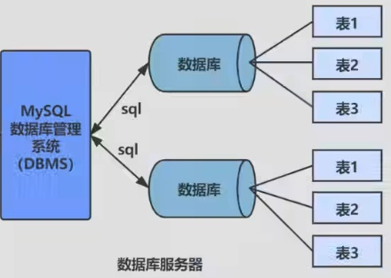

# MySQL

## 1. 简介

开放源代码的关系型数据库管理系统。支持千万级别数据量的存储。1995年瑞典MySQL AB (创始人Michael Widenius) 公司开发。MySQL 的创造者担心MySQL有闭源的风险，因此创建了 MySQL的分支项目 MariaDB。

<font color=green>**安装与配置**</font>

官网：www.mysql.com

Downloads --> 企业版/社区版(MySQL Community(GPL) Downloads) --> MySQL Community Server --> MySQL Installer MSI Go to Download Page --> 非web版本

Install --> custom --> select MySQL Server 8.0.34 - X64 to right --> select the right MySQL Server 8.0.34 - X64 to select advanced options to modify the path (server folder, data folder) --> execute --> config type: development computer --> 取消开机自启动

环境变量配置：bin目录加入到path

查看字符集：登录mysql之后，
show variables like 'character\_%';
show variables like 'collation\_%';

修改字符集：安装的data路径/my.ini 中添加

```	bash
# 5.7默认是Latin, 8.0默认是utf8
default-character-set=utf8

character-set-server=utf8
collation-server=utf8_general_ci
```

## 2. 数据库

`net start mysql服务名` ：启动MySQL服务。

DB: 数据库 (Database)

* 即存储数据的“仓库”，其本质是一个文件系统。它保存了一系列有组织的数据

DBMS: 数据库管理系统 (Database Management System)

* 是一种操纵和管理数据库的大型软件，用于建立、使用和维护数据库，对数据库进行统一管理和控制。用户通过数据库管理系统访问数据库中表内的数据。
* RDBMS： 把复杂的数据结构归结为简单的 二元关系
* 非RDBMS，基于键值对存储数据，不需要经过SQL层的解析性能非常高。同时，通过减少不常用的功能，进一步提高性能。

<font color=green>**其他DBMS**</font>

**0racle**

1979 年，0racle 2诞生，它是第一个商用的 RDBMS(关系型数据库管理系统)。随着 0racle 软件的名气越来越大，公司也改名叫oracle 公司。

2008年，SUN以10亿美金收购MySQL。

2009年，总计74亿美金收购SUN。

2016年，MySQL8.0推出。

**SQL Server**

SQL Server 是微软开发的大型商业数据库，诞生于 1989 年。

**DB2**

IBM公司的数据库产品,收费的。常应用在银行系统中。

**PostgreSQL**

PostgresQL 的稳定性极强，最符合SQL标准，开放源码，具备商业级DBMS质量。PG对数据量大的文本以及SQL处理较快。

**SQLite**

嵌入式的小型数据库，应用在手机端。零配置，SQlite3不用安装，不用配置，不用启动，关闭或者配置数据库实例。当系统崩溃后不用做任何恢复操作，再下次使用数据库的时候自动恢复。

**informix**
IBM公司出品，取自Information 和Unix的结合，它是第一个被移植到Linux上的商业数据库产品。仅运行于unix/linux平台，命令行操作。性能较高，支持集群，适应于安全性要求极高的系统，尤其是银行，证券系统的应用。

* 键值型数据库: Redis
* 文档型数据库: MongoDB
* 搜索引擎数据库: ES、Solr
* 列式数据库: HBase
* 图形数据库: InfoGrid

**DB-Engines Ranking:** https://db-engines.com/en/ranking

## 3. SQL

SQL: 结构化查询语言 (Structured Query Language)

* 专门用来与数据库通信的语言。




1974 年，IBM 研究员发布了一篇揭开数据库技术的论文《SEQUEL：一门结构化的英语查询语言》，直到今天这门结构化的查询语言并没有太大的变化。SQL92, SQL99两个标准。

**命令行执行已有sql：** source d:\mysqldb .sql

**连接数据库：**

```bash
mysql -u用户名 -p密码 # windows
mysql -u用户名 -p密码 -h主机名 或 localhost # Linux
```

### 3.1 规则规范

**基本规则**

1. SQL可以写在一行或者多行。为了提高可读性，各子句分行写，必要时使用缩进。
2. 每条命令以 `;` 或 \\g 或 \\G结束
3. 关键字不能被缩写也不能分行

**规范**

MySQL 在 Windows 环境下是大小写不敏感的，MySQL 在 Linux 环境下是大小写敏感的

* 数据库名、表名、表别名、字段名、字段别名等都小写
* SQL 关键字、函数名、绑定变量等都大写

```sql
单行注释: # 注释文字(MySQL特有的方式)
单行注释:-- 注释文字(--后面必须包含一个空格。)
多行注释: /*注释文宁 */
```

### 3.2 SQL分类

* DDL (Data Definition Languages 数据定义语言)

这些语句定义了不同的数据库、表、视图、索引等数据库对象，还可以用来创建、删除、修改数据库和数据表的结构。主要的语句关键字包括 CREATE 、DROP、ALTER、RENAME 等

* DML (Data Manipulation Languages 数据操作语言)

用于添加、删除、更新和查询数据库记录，并检查数据完整性。主要的语句关键字包括 INSERT、DELETE、UPDATE、SELECT 等

* DCL (Data Control Languages 数据控制语言)

用于定义数据库、表、字段、用户的访问权限和安全级别。
主要的语句关键字包括GRANT、REVOKE、COMMIT、ROLLBACK、SAVEPOINT 等

( SELECT会单独拿出来叫DQL 数据查询语言 )

( COMMIT、ROLLBACK有可能会单独拿出来叫做TCL Transaction Control Language，事务控制语言)

### 3.3 DQL

**SELECT**

```mysql
SELECT 1 + 1, 3*2 [DUAL]; # DUAL 是伪表
-- 返回
+-----+
| 1+1 |
+-----+
|   2 |
+-----+

-- 别名, 使用双引号
SELECT 列名1 别名1,列名2 别名2
FROM 表名;
SELECT 列名1,列名2 AS 别名2
FROM 表名;
SELECT 列名1 AS 别名1,列名2 "别名2"
FROM 表名;

-- 去除重复行
SELECT DISTINCT 列名1
FROM 表名;
SELECT DISTINCT 列名1,列名2 # 两个都不重复才会去重
FROM 表名;
SELECT 列名1,DISTINCT 列名2 # 报错
FROM 表名;

-- 着重号 (反引号) 跟关键字重名的时候使用。
SELECT * FROM `order`;

-- 查询常数，每一行数据都会添加
SELECT 列名1,列名2,'abc'
FROM 表名;

-- 显示表结构
DESCRIBE 表名;
DESC 表名;
```

**WHERE**

```mysql
SELECT *
FROM 表名
WHERE last_name = 'King'; # 过滤.
-- 1. 内容区分大小写，但是MySQL不严谨，依旧可以查询出，oracle无法查询出。
-- 2. MySQL字段值可以双引号，但oracle报错
```

**运算符**

```mysql
-- 算术运算符
SELECT A + B FROM DUAL;
# 1.0 + 1 = 2.0, 结果是浮点数。
# 1 + '1' = 2, MySQL中+没有字符串拼接这个功能
# 100 + 'a' = 100, 不会转化a
# 100 + NULL = NULL, NULL值参与运算结果为NULL

SELECT A - B FROM DUAL;
SELECT A * B FROM DUAL;
SELECT 列名1 * 12 '别名1' # 查出列1的数据的12倍
FROM 表名;

SELECT A/B # 或者 SELECT A DIV B
# 100 DIV 0 = NULL
SELECT A % B # 或者 SELECT A MOD B

-- 比较运算符
=
SELECT 1 = 2 FROM DUAL; 	# 返回0代表false
SELECT 1 = '1' FROM DUAL;	# 1, 隐式类型转换
SELECT 1 = 'a' FROM DUAL;	# 0, 如果字符串转换成数值不成功，就是0
SELECT 0 = 'a' FROM DUAL;	# 1
SELECT 'a' = 'a' FROM DUAL;	# 1, 不需要进行隐式类型转换
# 100 = NULL = NULL, NULL值参与运算结果为NULL
# NULL = NULL = NULL, NULL值参与运算结果为NULL

<=>
# 安全等于，没有NULL参与时和 = 一样
# 100 = NULL = 0
# NULL = NULL = 1

<> # 不等于
!= # 不等于

IS NULL, IS NOT NULL, ISNULL
... WHERE 列名 IS NULL;	#
... WHERE ISNULL(列名);	#

LEAST('a','b','c'); # 最小的
GREATEST('a','b','c'); # 最大的
```

