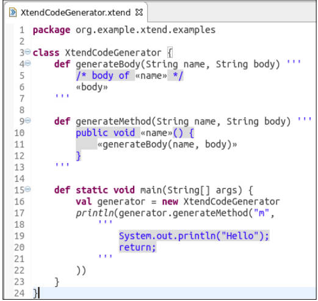

# Implementing Domain-Specific Languages with Xtext and Xtend

## 1. 缩写

DSLs (Domain Specific Languages)  are programming languages or specification languages that target a specific problem domain.

EMF (Eclipse Modeling Framework) : http://www.eclipse.org/modeling/emf

GPL (General Purpose Languages) for instance, Java or C

ANTLR (ANother Tool for Language Recognition) pronounced Antler, ANTLR, 是一个功能强大的解析器生成器。它可以根据输入的文法（grammar）生成解析器和词法分析器（lexer），用于将输入的文本或数据流解析为抽象语法树（AST）

AST (Abstract Syntax Tree)

MWE2 (Modeling Workflow Engine 2)

JDT (Java Development Tools)

## 2. DSL

The tags help a computer to process XML, but they surely distract people when they have to read and write XML files.

```xml
<people>
    <person>
        <name>James</name>
        <surname>Smith</surname>
        <age>50</age>
    </person>
    <person employed="true">
        <name>John</name>
        <surname>Anderson</surname>
        <age>40</age>
    </person>
</people>
```

```java
person {
    name=James
    surname=Smith
    age=50
}
person employed {
    name=John
    surname=Anderson
    age=40
}
```
```java
James Smith (50)
John Anderson (40) employed
```

实现DSL的步骤

1. 确定DSL语言样子
2. lexical analysis,词法分析是把程序分割成一个个 Token 的过程。
   1. two identifiers
   2. the separator (
   3. one integer literal
   4. the separator )
   5. the optional keyword employed
3. syntactic analysis， 语法分析是把程序的结构识别出来，并形成一棵便于由计算机处理的抽象AST语法树。
4. semantic analysis ， 语义分析是消除语义模糊，给这棵树生成一些属性信息.
5. IDE integration。
6. Syntax highlighting
7. Background validation
8. Error markers
9. Content assist
10. Quickfixes
11. Outline
12. Automatic build

## 3. xtext

Xtext is an open source Eclipse framework for implementing Domain Specific Languages together with their integration in the Eclipse IDE.

documentation: https://www.eclipse.org/Xtext/documentation/

Git repository: https://github.com/LorenzoBettini/packtpub-xtext-book-2nd-examples

创建一个名为 org.example.entities 的 xtext 项目

1. Start Eclipse and navigate to File | New | Project.... In the dialog, navigate to the Xtext category and select Xtext Project.
2. In the next dialog, you should specify the following names:
  1. Project name: `org.example.entities`
  2. Name: `org.example.entities.Entities`
  3. Extensions: entities
3. Press Finish.

```java
grammar org.example.entities.Entities with org.eclipse.xtext.common.Terminals

generate entities "http://www.example.org/entities/Entities"

Model:
	entities+=Entity*; // +=: 是一个集合。 *：0个或者多个 (+:至少一个)

Entity:
    // 用双引号或者单引号表示关键字。()?：optional part
	'entity' name=ID ('extends' superType=[Entity])? '{'
	attributes+=Attribute*
	'}';

Attribute:
	type=[Entity] array?=('[]')? name=ID ';';

// 可以对Attribute进行优化写法
Attribute:
	type=AttributeType name=ID ';';

AttributeType:
	elementType=[ElementType] (array?='[' (length=INT)? ']')?;

ElementType:
	BasicType | EntityType;

BasicType:
	typeName=('string' | 'int' | 'boolean');

EntityType:
	entity=[Entity];
```

Run As MWE2 Workflow --> run a new Eclipse instance -

During the MWE2 workflow execution, Xtext will generate artifacts related to the UI editor for your DSL, but most important of all, it will derive an ANTLR specification from the Xtext grammar with all the actions to create the AST while parsing.

```
Attribute: type=[Entity] (array?='[' ']')? name=ID ';';
```
Since we split the two square brackets into two separate tokens, spaces between the brackets are allowed in the editor. Indeed, spaces are automatically discarded, unless they are explicit in the token definition. In general, spaces in keywords should be avoided.

## 3. xtend

documentation: https://www.eclipse.org/xtend/documentation/

1. Methods are public by default
2. you can declare multiple  public top-level types per file, and they will be compiled into separate Java files
2. constructor

```java
class MyFirstXtendClass {
    new () { // public by default
        ...
    }
    new (String s) {
        ...
    }
}
```

4. method
   1. The type of method parameters must always be specified
   2. Method parameters are always implicitly final

```java
class MyFirstXtendClass {
    def m1() {
        ""
    }
    def String m2() {
        ""
    }
    def m3() {
        return ""
    }
    def String m4() {
        return ""
    }
}
```

5. Fields and Variables
   1. val (for final fields and variables) Fields are private by default
   2. var (for non-final fields and variables)

```java
val s = 'my variable' // final variable
var myList = new LinkedList<Integer> // non final variable, type inferred
val aList = newArrayList
aList += "" // now the type of aList is inferred as ArrayList<String>
```

6. Operators
   1. `==` : 调用equals方法
   2. `===` : 表示 `==`
   3. 扩展了针对list的运算符

```java
val l1 = newArrayList("a")
l1 += "b"
val l2 = newArrayList("c")
val l3 = l1 + l2
println(l3) // [a, b, c]
```

7. 其他

```java
o.name = ... // 调用get set方法

val s1 = "my 'string'"
val s2 = 'my "string"'

// immutable collections and arrays
val aList = #["a", "b"] // creates a list of strings
val String[] anArray = #["a", "b"] // creates an array of strings
val aMap = #{"a" -> 0, "b" -> 1} // creates a Map<String, Integer>
```

8. Extension methods

```java
e.m() // m(e)
o.foo().bar() // bar(foo(o))
"my string".toFirstUpper // StringExtensions.toFirstUpper("my string")

val list = newArrayList("a", "b", "c")
println(list.head) // prints a
println(list.last) // prints b

// 静态导入
import static extension java.util.Collections.*

class ExtensionMethods {
    def myListMethod(List<?> list) {
        // some implementation
    }
    def m() {
        val list = new ArrayList<String>
        list.myListMethod // 默认可以作为 Extension methods 使用
    }
}

// 使用其他类实例方法作为extension methods
class MyListExtensions {

 def aListMethod(List<?> list) {
 // some implementation
 }

 def anotherListMethod(List<?> list) {
 // some implementation
 }
}
// 1. a field
class C {
 extension MyListExtensions e = new MyListExtensions
 def m() {
     val list = new ArrayList<String>
     list.aListMethod // equivalent to e.aListMethod(list)
     list.anotherListMethod // equivalent to e.anotherListMethod(list)
 }
}
// 2. a local variable
def m() {
 val extension MyListExtensions e = new MyListExtensions
 val list = new ArrayList<String>
 list.aListMethod
 list.anotherListMethod
}
// 3. a parameter declaration
def m(extension MyListExtensions e) {
 val list = new ArrayList<String>
 list.aListMethod
 list.anotherListMethod
}
```

9. it

```java
class ItExamples {
 def trans1(String it) {
     toLowerCase // it.toLowerCase
 }

 def trans2(String s) {
     var it = s
     toLowerCase // it.toLowerCase
 }
}
```

10. Lambda expressions

```java
val l = [ String s, int i | s + i ]
println(l.apply("s", 10)) // "s10"
val (String, int)=>String l = [ String s, int i | s + i ] // 参数类型和返回值类型
val (String, int)=>String l = [ s, i | s + i ] // omit
def execute((String, int)=>String f) { // 作为入参
    f.apply("s", 10)
}
execute([s, i | s + i]) // 调用

class LambdaExamples {
 def static execute((String,int)=>String f) {
     f.apply("s", 10)
 }
 def static void main(String[] args) {
     val c = "aaa"
     println(execute([ s, i | s + i + c ])) // prints s10aaa
 }
}

val list = newArrayList("Second", "First", "Third")
Collections.sort(list, [arg0, arg1 | arg0.compareToIgnoreCase(arg1)]) // 应用在函数式接口
Collections.sort(list)[arg0, arg1 | arg0.compareToIgnoreCase(arg1)] // 可以放在括号外面
strings.findFirst[s | s.startsWith("F")] // 如果只有一个参数，省略方法括号
strings.findFirst[it.startsWith("F")] // 如果只有一个参数，省略定义，直接用it
strings.findFirst[startsWith("F")] // 省略使用 "."
Collections.sort(list)[$0.compareToIgnoreCase($1)] // 省略参数定义，用$数字表示

// sample
personList = newArrayList(
 new Person("James", "Smith", 50),
 new Person("John", "Smith", 40),
 new Person("James", "Anderson", 40),
 new Person("John", "Anderson", 30),
 new Person("Paul", "Anderson", 30))
val result = personList.filter[firstname.startsWith("J")].sortBy[age].take(3).map[surname + ", " + firstname].join("; ")
println(result) // Anderson, John; Smith, John; Anderson, James
```
11. Multi-line template expressions



 ```java
 // 打印出
public void m() {
    /* body of m */
    System.out.println("Hello");
    return;
}
 ```
12. Additional operators

 ```java
 o?.m // if (o != null) o.m
 ?: //  x ?: y returns x if it is not null and y otherwise
 // equivalent to: if (o != null) o.toString else 'default'
result = o?.toString ?: 'default'

return eINSTANCE.createEntity => [ name = "MyEntity"]
// It is equivalent to:
val entity = eINSTANCE.createEntity
entity.name = "MyEntity"
return entity
 ```
13. Xtend provides Dispatch Methods for polymorphic method invocation

 ```java
 def dispatch typeToString(BasicType type) {
     type.typeName
}
def dispatch typeToString(EntityType type) {
    type.entity.name
}
def toString(AttributeType attributeType) {
    attributeType.elementType.typeToString // 不需要使用 instanceof
}
 ```
14. Enhanced switch expressions

```java
def String switchExample(Entity e, Entity specialEntity) {
 switch e {
 case e.name.length > 0 : "has a name"
 case e.superType != null : "has a super type"
 case specialEntity : "special entity"
 default: ""
 }
 // 如果是Boolean就匹配true，其他的匹配equals。结果方法返回
}
def toString(AttributeType attributeType) {
 val elementType = attributeType.elementType
 switch elementType {
 BasicType: // elementType is a BasicType here
 elementType.typeName
 EntityType: // elementType is an EntityType here
 elementType.entity.name
 }
}
def toString(AttributeType attributeType) {
 val elementType = attributeType.elementType
 if (elementType instanceof BasicType)
 elementType.typeName // elementType is a BasicType here
 else if (elementType instanceof EntityType)
 elementType.entity.name // elementType is an EntityType here
}
```

```java
@Data class Person { // @ata 自动生成 constructor getter hashcode equals toString方法
 String firstname
 String surname
 int age
}
```
## 4. Code Generation

```java
class EntitiesGenerator extends AbstractGenerator {
 override void doGenerate(Resource res, IFileSystemAccess2 fsa, IGeneratorContext context) {
 // TODO implement me
 // accepts an EMF Resource,
 resource.allContents.toIterable.filter(Entity) // retrieve all the Entity objects
 "entities/" + entity.name + ".java" // generate all the Java classes
 }
}
```
